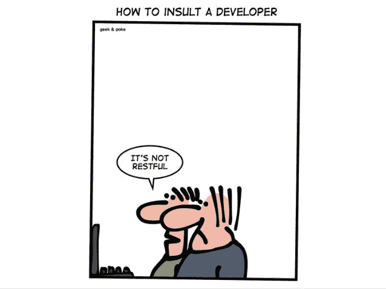

# 真正的 RESTful API

> 原文：<https://medium.com/geekculture/true-restful-api-b675aaf72c32?source=collection_archive---------4----------------------->

## REST 架构约束

在过去的几十年里，我们已经看到 SOAP 失宠了，因为酷孩子把他们的服务转移到了 REST 或 GraphQl 范式，或者表面上看起来是这样。2000 年，Roy Fielding 博士提出了表述性状态转移，或简称为 REST，作为设计 web 服务的架构方法。既然义务介绍(？)说完了，我们来潜进内容。这篇文章纯粹是为了解释 Fielding 博士为了让 API 成为 RESTful 而提出的六个基本原则；它必须遵守以下六个约束。

source: [Geek and Poke](https://geek-and-poke.com/)

# 无国籍的

无状态意味着服务器不记得任何关于使用 API 的用户的信息。将每个请求视为新的，没有会话，没有历史。从客户端发送到服务器的每个请求都将包含使服务器理解从客户端发送的请求所需的所有信息。这可以是 URL 的一部分、查询参数、正文，甚至是标题。一旦服务器处理了请求，就会通过主体、状态或头向客户机发送响应。

# 客户端-服务器

基本上，客户机和服务器各自独立工作。客户机-服务器体系结构支持统一的接口，并将服务器与客户机分开。优点是这提高了服务器组件的可伸缩性，并增强了跨多个平台的可移植性。

# 统一界面

在 REST 中，为了在整个应用程序中获得统一的接口，我们实现了四个关键的接口约束，

*   资源标识，其中对服务器的请求必须包括资源标识符。我们使用 URI 标准来识别资源。
*   使用表示的资源操作，其中我们使用 HTTP 标准来描述通信。
*   自描述性消息，其中对 API 的每个请求都包含服务器执行请求所需的所有信息。
*   作为应用程序状态引擎的超媒体。使用超链接和可能的 URI 模板将客户端从特定于应用程序的 URI 结构中分离出来。

这就是我们所说的一旦一个开发者熟悉了你的一个 API，这个开发者应该能够对其他 API 采用类似的方法。一致性。

# 可缓冲的

为了提供更好的性能，应用程序通常是可缓存的。这是信息在服务器外部的临时存储。如果响应被定义为可缓存的，那么客户机缓存可以在将来为等效的响应重用响应数据。缓存为客户端带来了性能提升，并降低了服务器的负载。但也有不利的一面，数据可能会过时，作为一种解决方案，我们所做的是刷新缓存，服务器决定何时刷新缓存数据，管理缓存的实体执行它。

# 分层系统

分层系统架构通过限制组件行为，使应用程序更加稳定。由于客户端和服务器之间可能存在缓存层、负载平衡层或其他功能，这些层不应该影响请求或响应。这种类型的架构有助于增强应用程序的安全性，因为每一层中的组件只知道下一层，而不会知道更多，这促进了关注点的分离。

# 按需编码

这是一个可选约束，使用最少。客户端可以向服务器请求代码，然后服务器的响应将包含一些要下载并在应用程序中使用的代码或小程序。本质上，它通过创建一个不依赖于自己的代码结构的应用程序来简化客户端。

# 结论

REST 是一种支持 API 设计的架构风格。虽然得到了广泛的应用，但也有一些缺点，比如缺少状态或有状态机制，以及大量无用数据在请求中穿梭的可能性。另一个 API 架构 GraphQL 解决了这个问题。这有助于以一种迎合您的查询的方式从 API 端点检索信息。

然而，REST 架构是目前使用最广泛的架构之一，它的简单性促进了快速开发、集成、测试和部署。