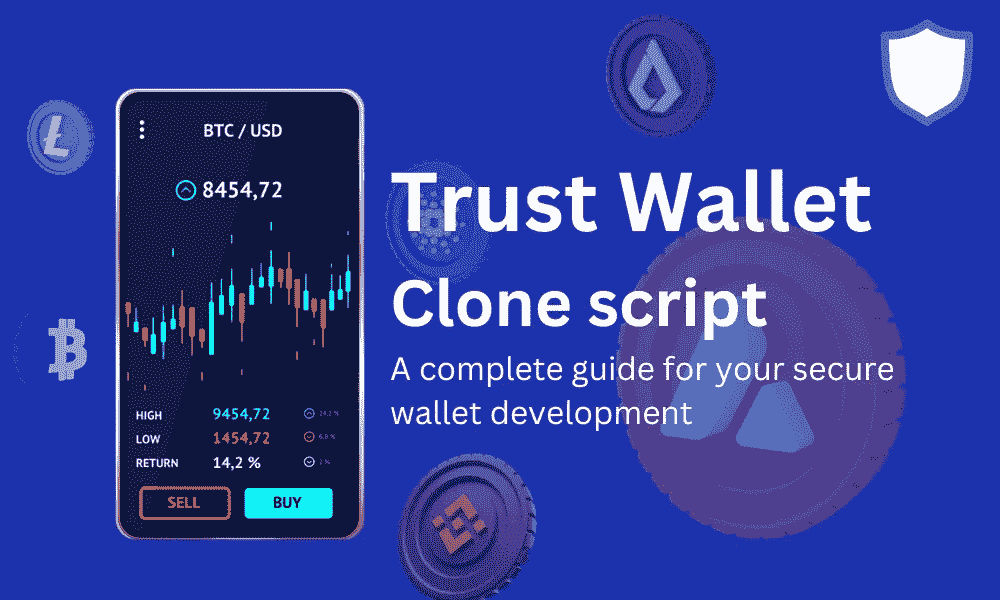

# 信任钱包克隆脚本—安全钱包开发的完整指南

> 原文：<https://medium.com/geekculture/trust-wallet-clone-script-a-complete-guide-for-your-secure-wallet-development-e7a0b9d9fe?source=collection_archive---------13----------------------->

在这个现代世界，人们转向加密货币和 NFT 和 Defi 等..因为 cryptos 打开了在短时间内赚取百万收入的大门。但关键因素是，你应该需要钱包来存储你的加密资产和加密货币。因此，许多人使用他们想要的密码钱包来存储他们的密码。

所有加密用户都根据他们的安全使用案例和功能使用加密钱包。这样，今天在加密行业中有许多加密钱包可用。然而，信任钱包是最熟悉和最安全的钱包之一。它支持多种加密货币，在全球拥有数百万用户。

许多加密爱好者和基于加密的商业头脑的人正表现出他们的兴趣来创建自己的加密钱包，如信任钱包，以抓住加密用户的注意力，同时获得更多的利润。

假设你是一个寻找创建自己的加密钱包像一个信任钱包，那么这是完整的指南给你。在这里，我可以解释如何以一种轻松的方式在可承受的价格范围内创建一个信任钱包。

**什么是信任钱包—您需要知道的一切:**

Trust wallet 是众所周知的加密货币钱包，可以存储多个

安全的加密货币。这款钱包更兼容 iOS 和 Android 设备。2017 年，这款钱包由 Victor Rathcenko 创建，用于存储以太坊令牌，是币安官方加密钱包。

这个密码钱包拥有超过 2500 万用户，任何人都可以购买、存储、收集和交换密码。你可以用你的卡简单地购买加密货币，并且你可以立即兑换它们。

信任钱包更安全更私密。因此，你只能访问你的钱包，他们不会收集任何个人数据。在这里，您可以交换任何类型的加密令牌和以太坊令牌，并使用众多的区块链。此外，这种钱包通过多种创收方式赚取了数百万的利润。

我认为这很令人印象深刻，对吗？

但现在我可以看到一个问题在你的脑海中运行，那就是如何创建一个像信任钱包一样的加密钱包。我怎样才能用它赚到数百万的钱呢？对！

我可以在这里解释你所有的问题，如果你想创建一个像信任钱包一样的加密钱包，你可以用两种方法来创建它

1.从零开始发展

2.使用现成的信任 wallet 克隆脚本

**从无到有:**

从头开始开发像信托钱包这样的加密货币钱包是最好的方式，但我认为它永远不会对所有人都可靠，因为这样你需要从初始阶段开始创建你的产品，这可能很昂贵，至少需要 6 个月才能获得一个完整的钱包。

**信任钱包克隆脚本:**

信任钱包克隆脚本将是所有解决方案中最受欢迎的，因为它是现成的软件，已经配备了所有的高级功能，其功能就像原始的信任钱包一样。此外，您可以根据自己的商业想法定制这个应用程序。同时，它消耗的时间和金钱非常少。

为什么要建立像 Trust wallet 这样的加密钱包？

**私人:**

如果你像信任钱包一样创建你的加密钱包，你的用户不需要提供任何个人数据。

**易贸:**

任何人都可以用信用卡以简单的方式买卖他们的加密货币。

**安全性:**

这个应用程序有强大的安全选项，如捕获饲料缓存，面部再生，触摸 ID 等..

**去中心化:**

它删除任何第三方拦截，并提供一个私钥来访问加密资产。

**什么是白标信任钱包克隆脚本？**

白标信任钱包克隆脚本是一个未来丰富的加密钱包脚本，也有像信任钱包尖端功能。这与克隆软件是一样的，在这种情况下，您只需购买已经完全开发好并准备好部署的脚本。您只需根据您的业务需求对其进行修改。有了白标，你可以节省大量的时间和金钱。Whitelabel trust wallet 克隆脚本对于所有愿意推出 trust wallet 这样的钱包平台的人来说都是一个可靠的解决方案。

**信托钱包克隆 App 有什么优势？**

*   对用户来说简单易用
*   用户可以在几秒钟内进行交换和交易
*   加密硬币被安全储存
*   轻松控制数字资产
*   您可以保护您的用户免受黑客攻击
*   允许 iOS 和 Android 设备、用户
*   你的用户可以用信用卡购买密码
*   最低的启动投资成本
*   您可以自定义您的克隆脚本

**信托钱包克隆开发的特点**

*   多种货币支持
*   私有和安全的备份数据
*   即时交换
*   双因素认证
*   跟踪图表和价格
*   查看交易历史
*   使用冷钱包
*   支持 Defi & NFT
*   二维码扫描仪
*   密码和 pin 安全
*   多重签名保险库
*   主屏幕定制
*   多平台兼容性
*   立桩标界
*   多语言支持
*   推送通知

**信任钱包克隆脚本有哪些安全特性？**

信任钱包克隆脚本具有广泛的安全功能，使您能够安全地维护您的加密货币。

*   生物认证
*   双因素认证
*   二维码可行性
*   CSRF 保护
*   SSRF 保护
*   加密数据库
*   DDoS 缓解
*   多重签名钱包设置

**Trust wallet 克隆脚本的收入流有哪些？**

如我所说，Trust wallet 应用程序每年产生数百万美元的收入。如果你发布一个这样的应用程序，你可以期待 love 的收入模式。

**提现费用:**

您可以赚取特定的金额，将加密货币从一个钱包转移到另一个钱包。

**互换:**

在这个信任钱包克隆中，您可以添加一个交换选项，并且可以从您的用户那里收取网络费用

**广告:**

你可以从 google AdWords 上收取他们钱包和任何其他广告的广告费。

**挂牌费用:**

您可以为在您的信托钱包克隆脚本中列出新的加密货币和区块链代币收取费用。

**信任钱包克隆脚本如何工作？**

Trust wallet 克隆脚本通过其遍布全球的单个节点在许多区块链之间架起了一座桥梁。每个区块链都有自己的公共地址来存储加密货币。信任钱包克隆脚本不控制任何加密货币，它只允许使用加密货币，如交易、交换、赌博等..

**总结:**

今天，加密世界正在快速转变，在加密行业拥有一个商业理念肯定会让任何人成为富人。但是在当前情况下，将你的服务或产品交给一个可靠的开发团队将是一项至关重要的任务。因此，只有找到最好的开发公司才能成功完成所有的工作。作为一个区块链技术作家，我分析了“谁是最好的信托钱包克隆脚本提供商”，我已经找到了最好的开发团队来协助你。

在此找到并获得您的健壮的 [**信任钱包克隆脚本**](https://www.alwin.io/blog/trust-wallet-clone-script) 。