# 在没有虚拟机的 Linux 迪斯特罗上尝试其他 Linux 操作系统，节省大量 RAM 内存。

> 原文：<https://medium.com/geekculture/try-another-linux-environment-on-one-using-docker-without-virtual-box-or-its-alternative-which-86049c6cd7ae?source=collection_archive---------17----------------------->

## 所有 Linux 操作系统都在一个 destro 中，没有 virtualbox

Linux 是一个开源的 Unix 类操作系统社区，基于 Linux 内核。它最初是由 Linus Torvalds 于 1991 年 9 月 17 日发行的。最初，Linux 是为个人计算机而创建的，后来逐渐被用于其他机器，如服务器、大型计算机、超级计算机，甚至是嵌入式系统，如路由器、自动化控制、电视、数字录像机、视频游戏机、智能手表等。Linux 发行版是一个包含 Linux 内核和支持库及软件的操作系统。大约**有 600 多个 Linux 发行版**可用。其中一些是基础操作系统，另一些是通过使用它们制作的。每个 Linux 爱好者都尝试使用不同的系统。因此，对于那些想在一台机器上使用不同 linux 操作系统的 linux 爱好者来说，这是一篇很好的文章。

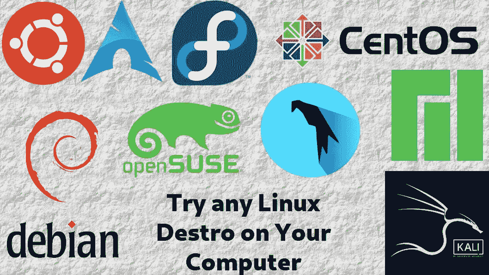

Try any Linux on Your Computer

## Docker 是什么？

Docker 是一组平台即服务产品，使用操作系统级虚拟化来交付称为容器的软件包中的软件。容器是相互隔离的，捆绑了它们自己的软件、库和配置文件；他们可以通过明确定义的渠道相互交流。【来源。—维基百科]

## 让我们开始吧……

我使用的是 Arch Linux 操作系统，我正在这个系统上安装 Ubuntu..

**第一步。**

正在安装 Docker…我正在使用奥曼软件包管理器安装 docker。

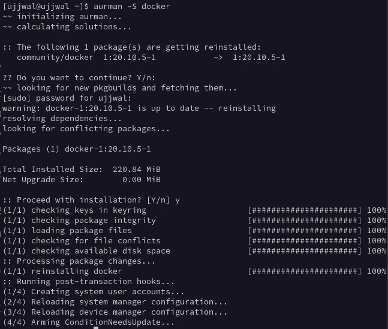

Installing Docker

**第二步。**

通过编写启动 docker

> sudo 系统启动 docker

## 第三步。

在 docker 上安装 ubuntu。

> sudo docker pull ubuntu

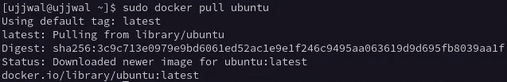

Install ubuntu on docker

**第四步。**

在 docker 里面运行 Ubuntu。写

> sudo docker run -it ubuntu

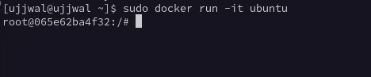

sudo docker run -it ubuntu

**第五步。**

更新升级 Ubuntu。

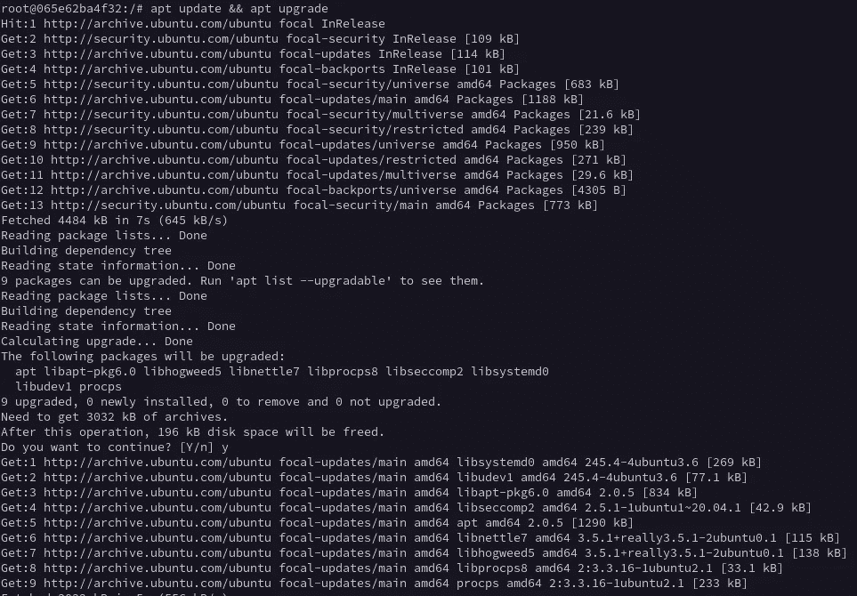

Update and Upgrade ubuntu.

退出提示…

# 现在如何再次启动 Ubuntu 提示符？

**第一步。**

查找该图像的容器 id..写

> sudo docker ps -a

sudo docker ps -a

这里最上面的是我的 Ubuntu 图片。

**第二步。**

首先通过编写启动容器

> sudo docker 开始<container id=""></container>

那么

> sudo docker exec -it <container id="">bash</container>

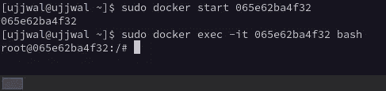

Restart the container..

# 如何从 VS 代码打开这个 Ubuntu 容器的文件？

首先安装下列软件包。

> apt 安装 sudo OpenSSH-客户端 OpenSSH-服务器 nmap net-工具 nano

**创建用户:**

> useradd -m<username></username>

**给出密码:**

> 密码<username></username>

**在 Sudoer 文件中输入该用户。**

> 纳米/etc/sudoers

并添加以下行。

**更改用户**

> 苏<username></username>

为该用户制作向下箭头键

> chsh -s /bin/bash

**非最小化(非修正)**

> sudo 非最小化

**第二步:**

通过编写启动 sshd..

> /etc/init.d/ssh 重新启动

**第三步:**

通过书写找到以太网 ip..

> ifconfig

在我进去后的第 0 小时，你发现了这个。

**第四步:**

通过书写找到端口..

> nmap 本地主机

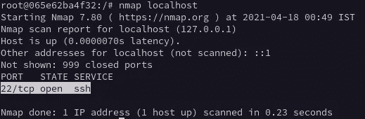

Find port

**第五步:**

开放 VS 代码。

[进入扩展并安装 SSH 客户端](https://marketplace.visualstudio.com/items?itemName=cweijan.vscode-ssh)

重启 VS 代码。

**第六步**。

点击这个关键符号

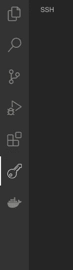

Click on this key symbol

**第七步。**

单击加号按钮。把这个装满..

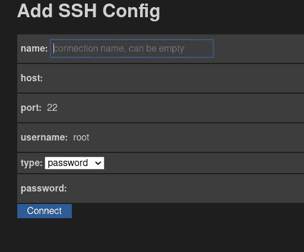

名称:任何名称

主机:你的 Ubuntu 容器的以太网主机的 ip

端口:你的 Ubuntu 容器的端口

用户名:<username></username>

类型:密码

密码:您设置的密码..

然后连接。

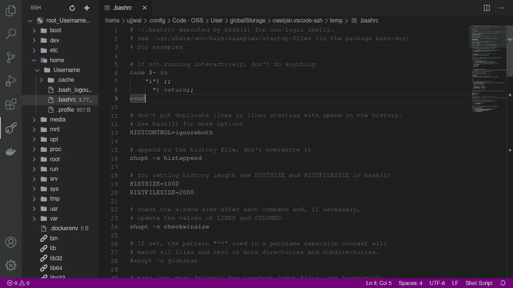

Finally Connected

# 如何连接到文件管理器？

按照之前的所有步骤进行，直到第 4 步。

**第五步:**

打开文件管理器。

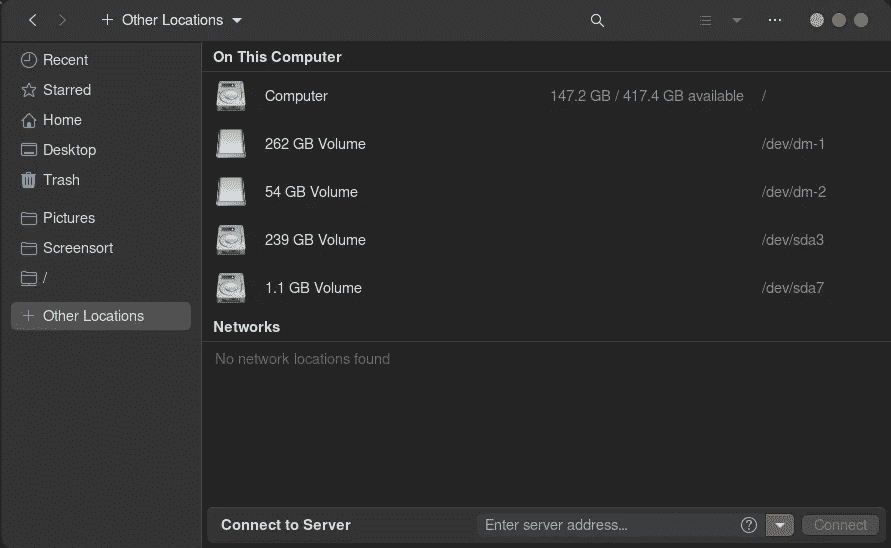

Open File Manager.

点击 ***连接到服务器*。**

服务器地址是 sftp://

写用户名和密码。结束了。

如果安装的文件管理器不支持这个，那么安装 ***nautilus。它会解决的。***

## 类似帖子:

 [## Linux 专家，提示和技巧| Ujjwal Kar

### 嗨，我是 Ujjwal Kar，在各种基于 linux 内核的操作系统上工作了很长时间，比如 Ubuntu，Ubuntu Linux Mint…

ujjwalkar.netlify.app](https://ujjwalkar.netlify.app/post/expert-on-linux-tips-and-tricks/)