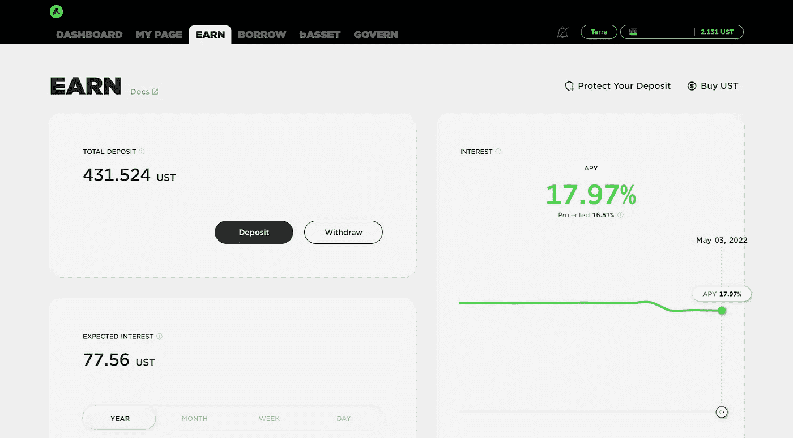

# 尝试锚协议——在稳定的硬币上有 18%的 APY

> 原文：<https://medium.com/geekculture/trying-anchor-protocol-18-apy-on-a-stablecoin-45069e918d2f?source=collection_archive---------13----------------------->

## DeFi 应用程序是如何工作的？它是如何获得高收益的？有什么风险？

The Anchor protocol dashboard. Screenshot by author.

***更新:我相信你已经看到了关于 UST 和卢娜崩溃的新闻，但如果你还没有，这里有一个快速更新:***[***【UST】已经跌出 1 美元挂钩***](https://pingpoli.medium.com/the-day-ust-collapsed-d8abdd0ce33f) ***整个项目至此可以认为失败了。用*** …