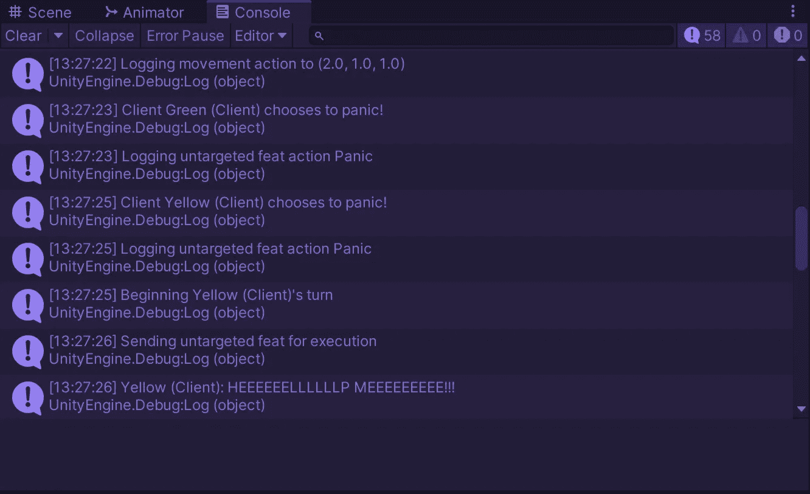
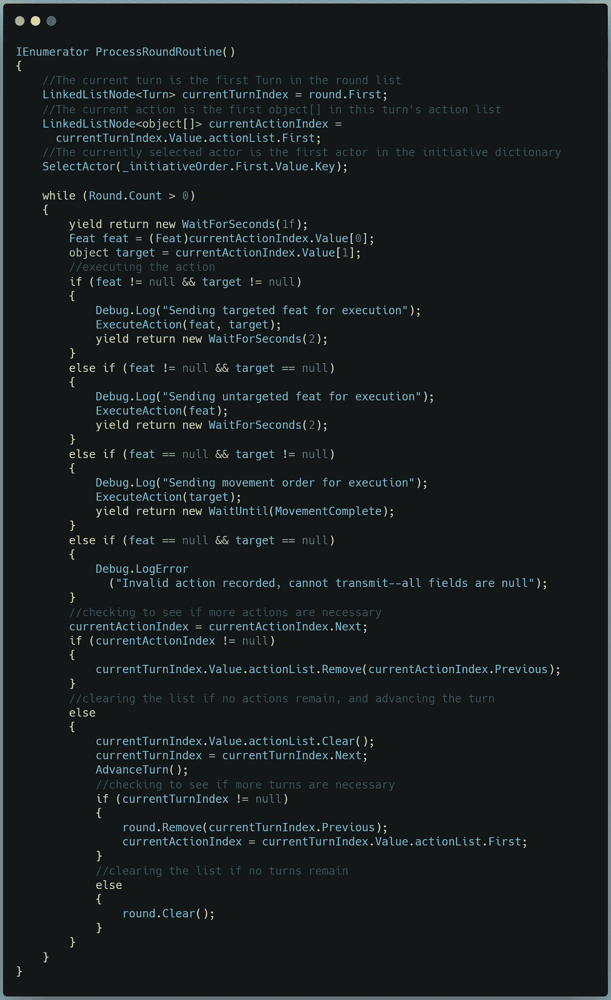
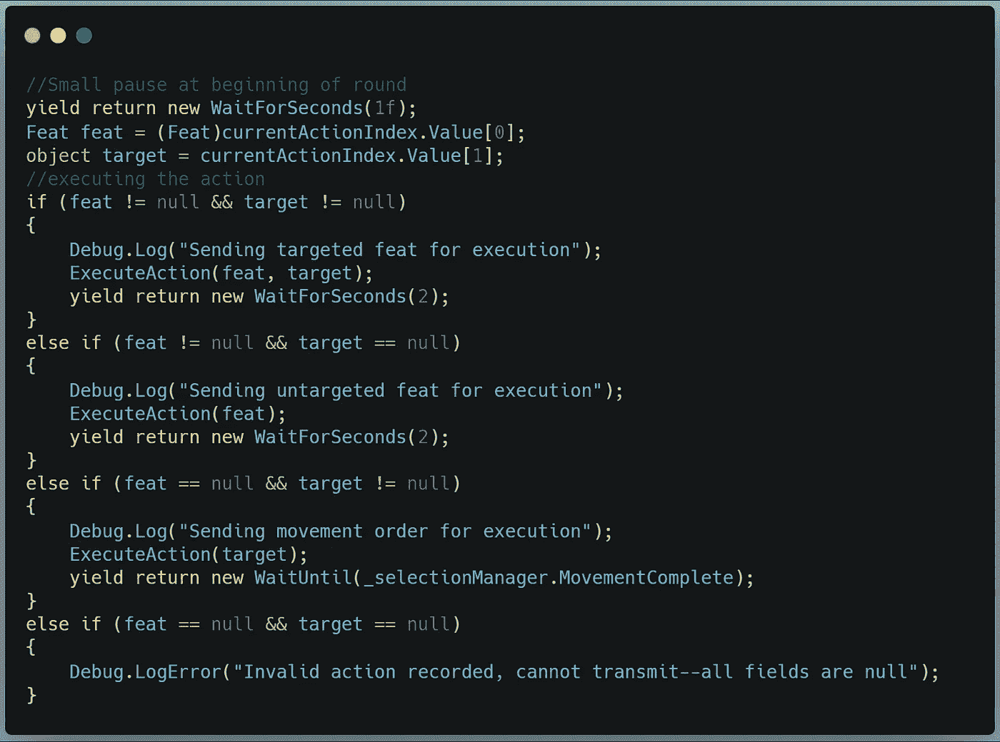
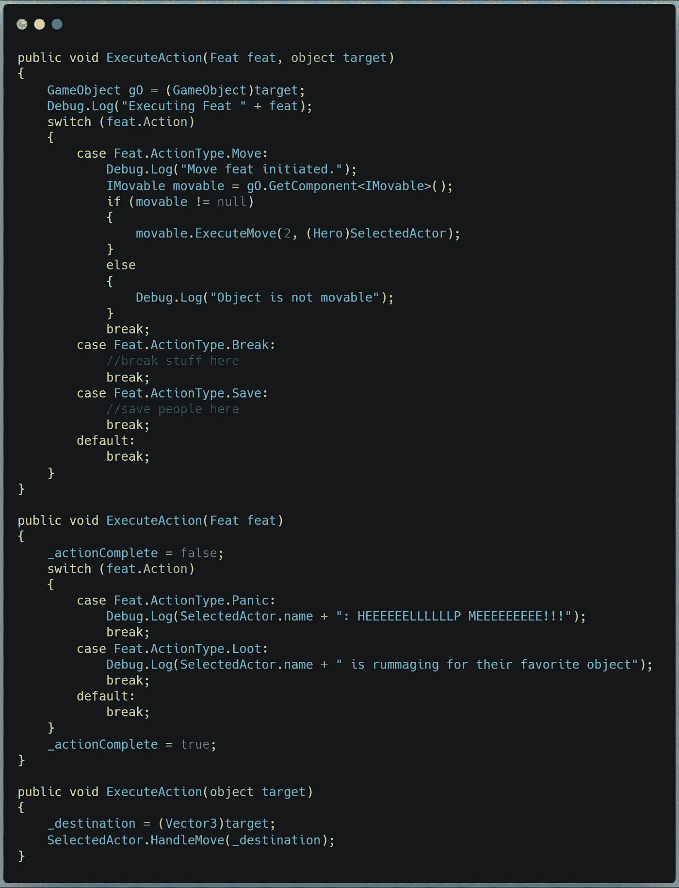
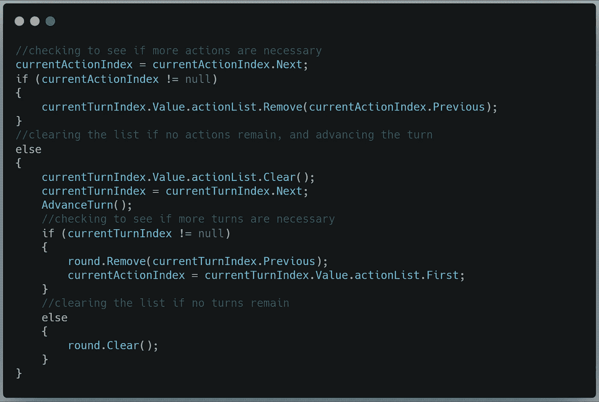
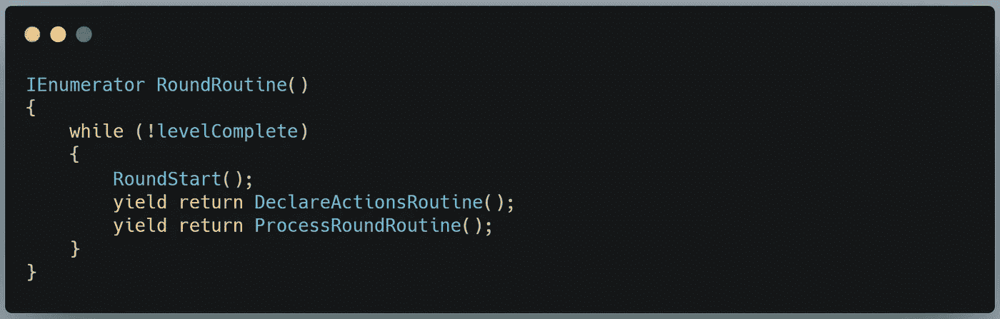
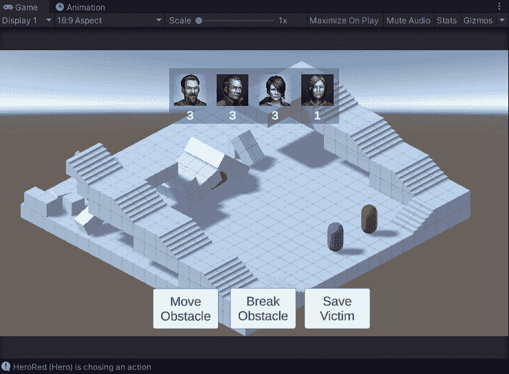

# 回合制战术指挥系统，第二部分

> 原文：<https://medium.com/geekculture/turn-based-tactical-command-system-part-2-f8c57abaec74?source=collection_archive---------14----------------------->

## 利用链表实现轻量级循环

Poor Yellow.

欢迎来到第二部分。摆在我们面前的目标:利用我们在[前四篇文章](/geekculture/roll-initiative-ec1343797da1)(主动列表、回合列表、行动列表)中收集的所有信息，并使用这些数据在地图上以正确的顺序移动正确的棋子。

这个过程的大部分发生在这里，在 ProcessRoundRoutine 协程中:

这可以很容易地分成三个阶段:

## 找到每个列表的前面

这是不言自明的。在这一轮开始时，我们需要被索引到每个列表的前面。

然后我们开始一个 *while* 循环，这将一直持续到循环列表为空。在里面，我们做两件事:

## 执行当前操作

在这里，我们检查传递给我们的是什么类型的信息，并向 ExecuteAction()方法发送适当的重载:

如果我们得到一个专长和一个目标，那么这就是三个目标专长之一:移动一个可移动的物体，打碎一个易碎的物体，拯救一个可拯救的物体。现在，我只定义了移动。

如果我们获得了一个没有目标的专长，那么这就是两个没有目标的专长之一:原地恐慌，或者不顾当前的危险花点时间去尝试掠夺一个物品。现在我们在调试日志中表达这些行为。

最后，如果我们只传递了一个目标，那必须是玩家请求移动一个演员。我们需要做的就是给被选中的演员发信号来完成这个动作。

## 遍历列表

最后，我们到了列表。这是我做出来的伪代码:

> 将当前动作索引设置为下一个动作节点
> 如果动作节点不为空，我们有另一个动作
> …从动作列表中删除上一个动作节点
> 如果动作节点为空，我们在动作列表的末尾
> …清除动作列表
> …将当前转弯索引设置为下一个转弯节点
> …advance turn()
> …如果当前转弯节点不为空， 我们还有另一个回合
> ……从回合列表中删除前一个回合节点
> ……将当前动作索引设置为新回合动作列表的第一个节点
> ……如果当前回合节点为空，我们就都出局了
> ……清除回合列表

如果在调用下一个节点时位于 LinkedList 的末尾，则会得到一个空值。因此，我们只需推动列表索引，直到它出现空值，当它出现时，我们清除列表。当两个列表都清空时，这一轮结束。

## 把所有的放在一起

为了让它运行起来，我们将整个过程封装在一个协程中。

让我们来看看这一切是如何运作的:

你可以在底部看到一些调试信息。我还没有做很多工作来显示界面上发生了什么，但这将会改变。重要的是，我们可以将来自多个参与者的多个动作排队，并让它们按顺序播放。正是我们想要的。

目前就这些。下一篇文章将重点介绍如何将这个实现变得更加优雅和简化。

感谢阅读！