# 将您的 Raspberry Pi 变成一个服务器来运行您的 Java Spring MVC 应用程序

> 原文：<https://medium.com/geekculture/turn-your-raspberry-pi-into-a-server-to-run-your-java-spring-mvc-app-862214279587?source=collection_archive---------2----------------------->

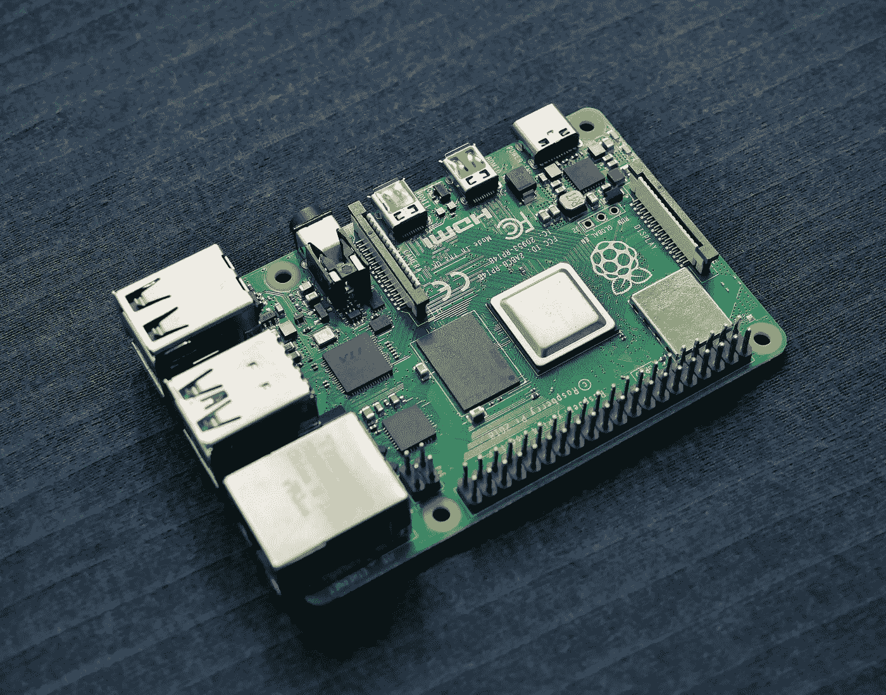

Photo by [Vishnu Mohanan](https://unsplash.com/@vishnumaiea?utm_source=medium&utm_medium=referral) on [Unsplash](https://unsplash.com?utm_source=medium&utm_medium=referral)

无论您是物联网爱好者还是专业的全栈 Java 开发人员，您可能偶尔会希望以较低的成本在自己的服务器上部署应用程序。进入树莓派！

这当然不是唯一的方法，但是因为没有找到一个全面的开始来完成 how-to，我决定自己写。

**材料:**
-Raspberry Pi(我用的是 8GB 的 Raspberry Pi 4)
-Raspberry Pi 的 USB 电源线
-MicroSD 卡(推荐高质量 32GB)
-连接到互联网的路由器
-带有 JDK 的开发工作站、Spring Tools Suite 4、Raspberry Pi Imager 和 Git Bash
-Raspberry Pi 的键盘和显示器

**可选但推荐:**
-Raspberry Pi 的外壳和风扇
-以太网电缆

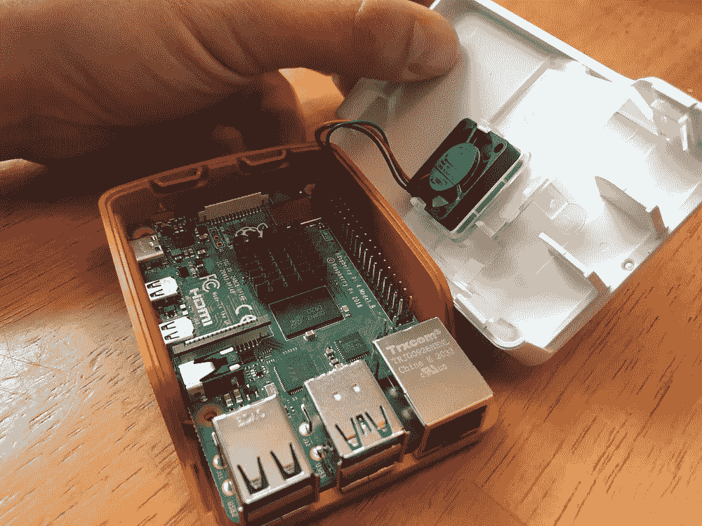

I bought the official Raspberry Pi case and fan kit.

# 创建硬盘映像并安装 Ubuntu

将 MicroSD 插入我的装有 Raspberry Pi Imager 的工作站，我决定安装 Ubuntu 服务器。我对 Ubuntu 的偏爱纯粹是出于熟悉。

在 Raspberry Pi 成像仪中:
**选择操作系统> >其他通用操作系统> > Ubuntu Server(版本)适用于 arm64 架构的 64 位服务器操作系统**

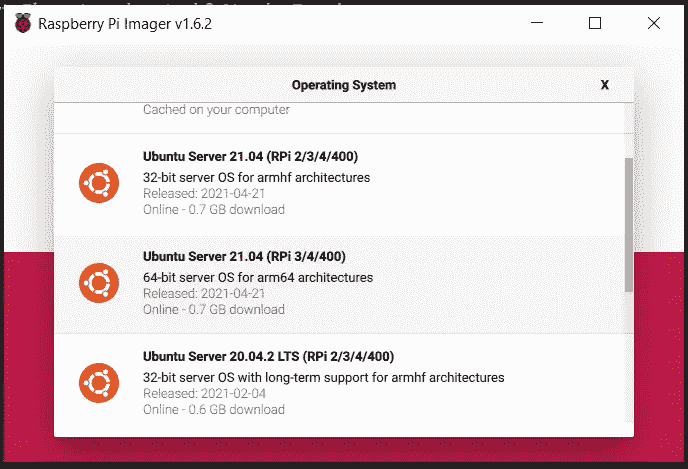

I went with Ubuntu Server 21.04

接下来，您将选择您的存储磁盘(您刚刚插入的 MicroSD ),然后单击“写入”。这应该只需要大约 10 分钟。比这长得多可能是一个危险信号，表明您需要更高质量的 MicroSD 卡。

我完全是偶然了解到，超过 32GB 的 MicroSD 卡通常用于相机和其他媒体设备，最初可能不会作为一个选项出现在成像仪软件中。工作原理是更高容量的卡被预格式化为 exFAT 而不是 FAT32。我不知道为什么会有所不同，因为成像仪无论如何都会重新格式化磁盘。

愚蠢的我选择了 64GB 的硬盘(要么做大，要么回家！)而这件事就发生在我身上。我奇怪的解决办法是插入一个 32GB 的磁盘，成像仪检测到了，然后我取出它，插入 64GB 的磁盘，它检测到了！我的建议是坚持使用 32GB 的硬盘。

一旦成像，将 MicroSD 插入您的树莓 Pi。插上显示器和键盘，然后插上电源。鼠标呢？我们要像 1989 年一样狂欢！

在启动时，你会看到一个命令行提示登录，首先输入用户名，然后输入密码。不明显的是用户名和密码都是“ubuntu”。

```
username: ubuntu
password: ubuntu //this input is hidden
```

然后，您将得到输入新密码并确认该密码的提示。瞧啊。Ubuntu 服务器已安装。

此时，您会注意到您仍然处于命令提示符状态，并且 GUI 操作系统没有启动。这就是为什么我们不需要鼠标；Ubuntu Server 纯粹是命令行界面。

# 连接到局域网

连接到局域网的最简单和推荐的方法是使用以太网电缆。

如果像我一样，你的工作站离你的路由器太远，这不是一个实用的方法，你仍然可以通过你的 Ubuntu 终端无线连接。

首先你需要识别网络接口。会是 wlan0 或者 wlp3s0 之类的。

```
ls /sys/class/net
```

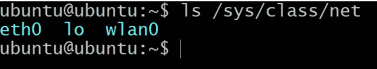

Mine was wlan0

然后找到网络配置文件:

```
ls /etc/netplan
```

找到文件名后，您会想要编辑它:

```
sudoedit /etc/netplan/[filename]
```

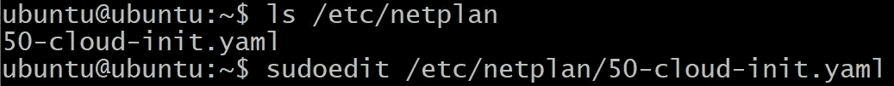

Mine was named “50-cloud-init.yaml”

这将在名为 Nano 的命令行文本编辑器程序中打开该文件。如果你不熟悉像这样的老式文本编辑器，你会想要花一些时间来查找 Nano 和它的界面如何工作。

该文件应该已经为您的以太网连接列出了一些参数，您只需在“版本:2”一行后添加您的 wifi 配置信息，如下所示:

```
 wifis:
     wlan0: #your interface type
         optional: true
         access-points:
             “[YOUR SSID GOES HERE]”:
                 password: “[YOUR PASSWORD GOES HERE]”
         dhcp4: true 
```

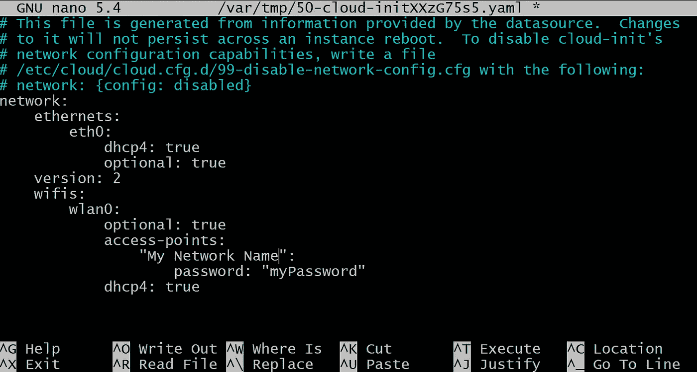

Your file should look something like this

虽然看起来有制表符缩进，但不要使用制表符！我输入了四个空格来表示缩进。

然后，您将输入命令:

```
sudo netplan apply
```

如果您遇到任何问题，可以重试:

```
sudo netplan –debug apply
```

我没有遇到任何问题，所以很遗憾，我没有任何故障排除技巧。

现在您已经连接上了，您可以找到路由器分配给您的 Raspberry Pi 的本地 IP 地址:

```
hostname -I
```

这将是第一组数字，通常是 192.168.1.x。

如果您的设备同时通过以太网和 wifi 连接，第一个地址通常是与通过以太网连接相对应的地址(推荐)。

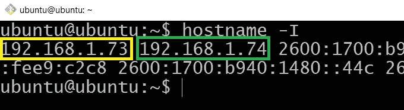

Since my Raspberry Pi is connected via both wifi AND ethernet, two IP addresses are listed (wifi boxed in yellow, ethernet boxed in green)

当我第一次这样做时，我首先通过 wifi 连接，但后来我把我的 Pi 从键盘和显示器上断开，并用以太网电缆将其插入路由器。

# 通过 SSH 连接

将您的工作站连接到与您的 Raspberry Pi 相同的路由器上，在您的开发工作站上打开 Git Bash anywhere 并启动您的 SSH 连接:

```
ssh ubuntu@[your IP address]
```

它应该会要求您输入密码。同样，当您输入密码时，光标会闪烁，但不会移动。

# 安装软件

首先更新您的软件包索引，以确保您获得最新版本的软件:

```
sudo apt-get update
```

在接下来的几个步骤中，您将最终使用“sudo apt-get install…”。

**阿帕奇**

```
sudo apt-get install apache2
```

这将安装 Apache2，它是您的 Raspberry Pi 的服务器软件。一旦完成，它将自动开始运行。

您可以通过在工作站上打开浏览器并在 URL 字段中输入您的 Raspberry Pi 的 IP 地址来进行测试。如果你看到一个标题为“Apache2 Ubuntu 默认页面”的网页，你的服务器正在工作！

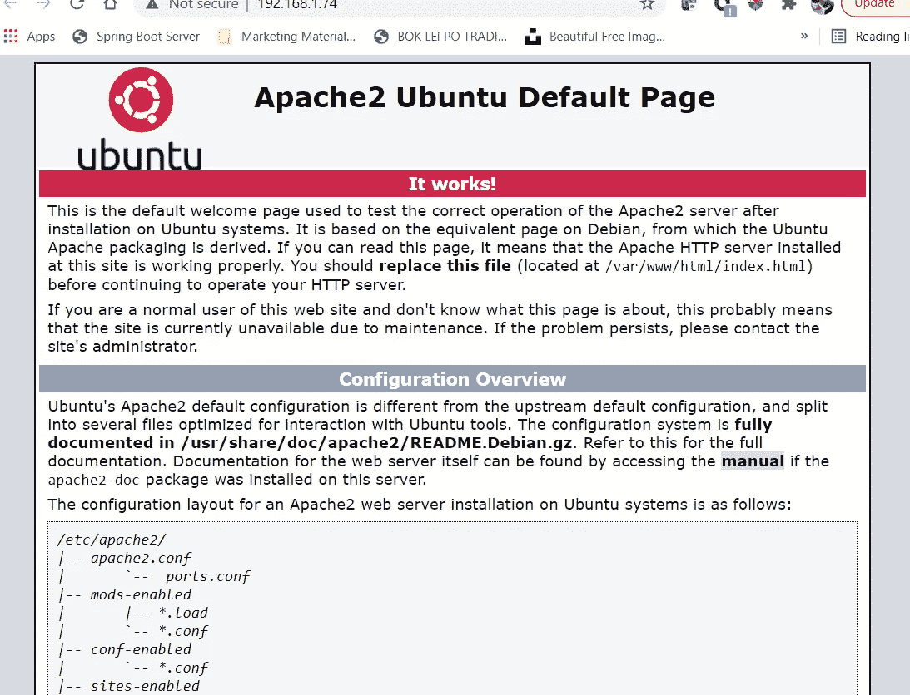

Your server is working!

**Java**

您将把您的 Java 程序编译成一个. war(web 版本的. jar)。为了在服务器上运行它，你需要安装 JDK。

```
sudo apt-get install default-jdk
```

安装后，您可以通过输入以下内容检查 Java 的版本来验证安装是否成功:

```
java -version
```

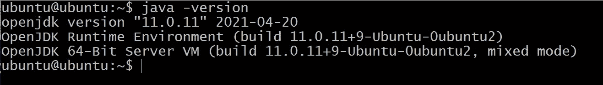

Version “11.0.11” installed otherwise known as Java 11

如果安装正确，它会显示您想要记录的已安装版本。为了运行您的应用程序，它必须与您正在编译的 Java 版本兼容。战争为(通常相等或更大)。

**MySQL**

如果您的应用程序使用数据库(根据定义，全栈应用程序会使用数据库)，您需要安装 MySQL Server。我这样做过几次，每次都有点棘手。

```
sudo apt-get install mysql-server
```

这将把 MySQL 安装到您的 Raspberry Pi 服务器上。它应该会自动弹出一个屏幕，提示您为 root 用户设置密码。您需要该密码与您在工作站上用于应用程序的密码相同(在 Spring Boot 项目的 application.properties 中设置)。

否则，您需要运行安全安装:

```
sudo mysql_secure_installation
```

然后按照提示设置密码。

为了确保设置正确，您可以在不使用 sudo 命令的情况下登录 MySQL 进行检查:

```
mysql -u root -p
```

该命令使用-u 参数和' root '来指定您作为 root 用户登录，使用-p 来表示您正在使用密码。

下一个提示将要求您输入密码。

如果您通过 SSH 远程登录，您的访问被拒绝，并出现以下错误:

```
 ERROR 1698 (28000): Access denied for user ‘root’@’localhost’
```

这可能是因为根用户被设置为“auth_socket”作为它的插件，这可能是你被拒绝远程访问的一个原因。

这可以通过以下步骤将插件更改为“mysql_native_password”来解决:

```
sudo mysql -u root 
```

这将使您无需输入密码即可登录。

我们将检查根用户插件。对于 MySQL 提示，输入以下查询命令:

```
USE mysql;
 SELECT User, Host, plugin FROM mysql.user;
```

如果是“auth_socket”:

```
USE mysql;
 UPDATE user SET plugin=”mysql_native_password” WHERE User=”root”;
 FLUSH PRIVILEGES;
```

然后通过重复第一个查询来验证是否发生了更改。

```
quit
```

回到您的终端，您将重置 MySQL:

```
sudo service mysql restart
```

执行此操作时，您最初设置的密码可能已被删除。因此，如果您仍然无法使用密码登录，请通过不使用密码登录来测试这一点(您将尝试不使用“sudo”命令):

```
mysql -u root
```

退出 MySQL 并使用以下命令设置您的密码:

```
mysqladmin -u root password [your password]
```

现在，您应该能够以标准方式毫无问题地登录 MySQL 了

```
mysql -u root -p
```

# 复制您的 MySQL 模式

在应用程序运行之前，您需要在服务器上复制方案。

您可以在服务器上手动设置模式和表。或者您可以从 MySQL 工作台的模式中复制它们。

打开您的 MySQL 工作台并转到:

**管理> >数据导出**

您将检查/选择以下内容:

-您想要复制的模式
-导出到自包含文件
-在单个事务中创建转储(仅自包含文件)
-包括创建模式

您也可以更新“导出到自包含文件”选项旁边的文件路径。

单击“开始导出”

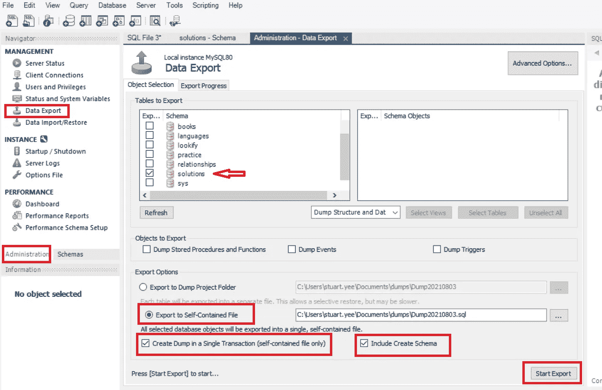

I’ve selected the Solutions Schema

然后，您将找到该文件，并在您最喜欢的文本编辑器中打开。复制文件的全部内容。然后在登录到 MySQL 的 SSH 会话中，粘贴转储(记住，您必须右键单击并选择“粘贴”,因为 CTRL-V 和其他常见热键将不再在终端中工作！)

仍然在 MySQL 中，使用以下命令确保您的数据库已经迁移:

```
SHOW databases;
```

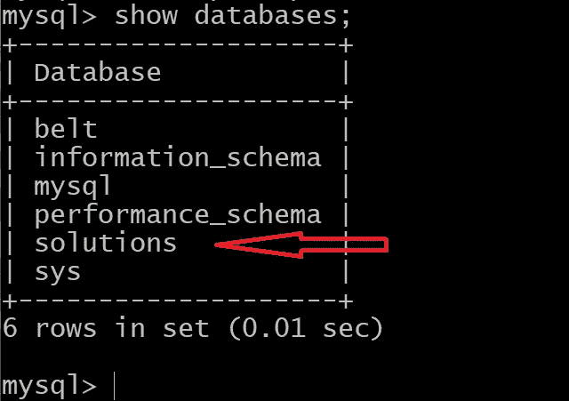

Success!

如果您看不到您的数据库，可能是因为数据流中隐藏了一个错误，可能是这样的:

```
Unknown collation: ‘utf8mb4_unicode_ci’ 
```

你要做的就是回到转储文件，找到“utf8mb4_0900_ai_ci”，替换成“utf8mb4_general_ci”。

重复将编辑过的文本复制到 MySQL 会话中的过程，现在应该可以工作了。

# 编译 Java 应用程序

在 Spring Tool Suite 中开发 Java 应用程序时，您可能已经多次测试过您的应用程序，方法是进入**作为> > Spring Boot 应用程序**，然后在浏览器中打开[**http://localhost:8080**](http://localhost:8080)**。向朋友和家人展示你的应用当然很有趣，但是如果你必须在你的工作站上打开 Spring Tool Suite 来运行它，那就没什么用了。**

**在做一些修改之前，您将最后一次运行它，以确保它可以工作并准备好部署。**

**当你准备好了，你将找到你的应用程序类，它包含了你的应用程序的主入口点方法。**

**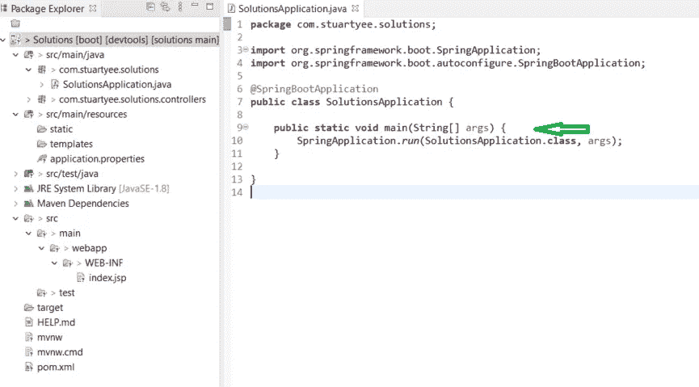**

**Main entry point method in my SolutionsApplication.java file**

**我们将在 **main 方法**之后添加以下代码，以将应用指向端口 9090:**

```
[@Bean](http://twitter.com/Bean)
    public TomcatServletWebServerFactory servletContainer() {
        TomcatServletWebServerFactory tomcat = new TomcatServletWebServerFactory();
        Connector ajpConnector = new Connector("AJP/1.3");
        ajpConnector.setPort(9090);
        ajpConnector.setSecure(false);
        ajpConnector.setAllowTrace(false);
        ajpConnector.setScheme("http");
       ((AbstractAjpProtocol<?>)ajpConnector.getProtocolHandler()).setSecretRequired(false);
    tomcat.addAdditionalTomcatConnectors(ajpConnector);
    return tomcat;
    }
```

**该代码将需要以下导入语句:**

```
import org.apache.catalina.connector.Connector;
import org.springframework.boot.web.embedded.tomcat.TomcatServletWebServerFactory;
import org.springframework.context.annotation.Bean;
import org.apache.coyote.ajp.AbstractAjpProtocol;
```

**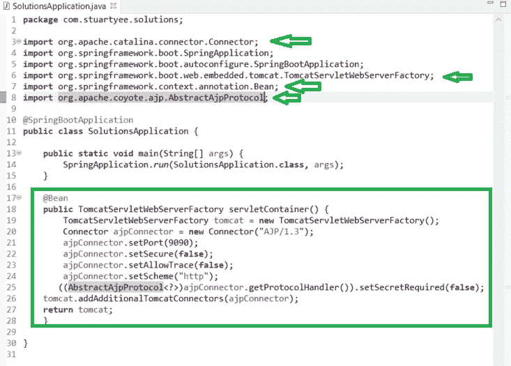**

**I’ve added this code OUTSIDE my main method in SolutionsApplication.java**

**保存该类文件后，我们将通过打开 **pom.xml** 文件并转到 **overview** 选项卡来仔细检查该应用程序是否会编译为. war。如果设置为。jar，我们需要将它改为. war。我们还需要确保编写应用程序的 Java 版本与您的服务器上安装的版本兼容。**

****

**This will compile as a .war as Java 1.8 (also known as Java 8). Since we installed Java 11.0.11 (Java 11) on our server, this will run.**

**如果您进行了任何更新或只是为了确认，我们将右键单击项目名称并转到 **Maven > >更新项目…****

**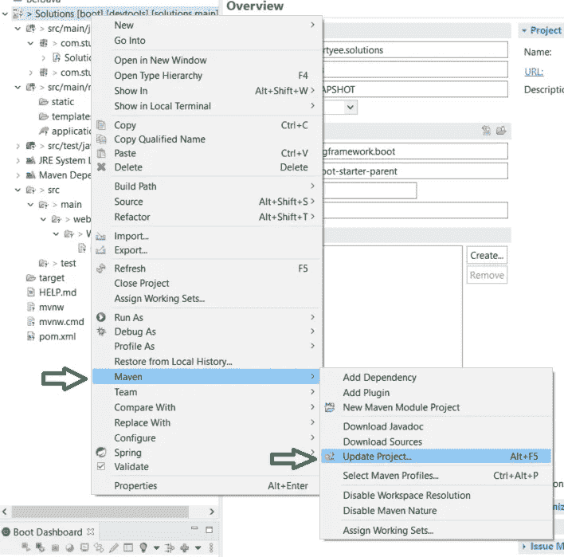**

**This will ensure any updates I’ve made will be taken into effect**

**出现提示时，只需单击“确定”。**

**最后，我们将编译我们的。右键单击项目并选择**Run As>9 Maven install**来 war 包。**

**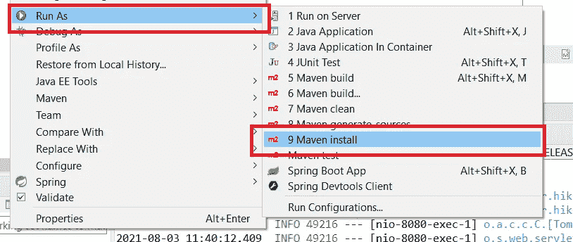**

**This will package your project as a .war file**

**控制台输出将显示文件打包到的位置，可能是:**

****C:/Users/[您的用户名]/. m2/repository/[您的包目录路径]/[您的项目名]/0 . 0 . 1-快照****

# **在 Apache 中设置代理**

**我不打算撒谎，这部分有点挑剔，有时会让我焦虑。因为我们已经设置了我们的代码，所以 AJP 连接器被设置为端口 9090，我们需要让我们的 Apache 服务器也指向那里。**

**我们将首先在 Apache 中启用代理模式，如下所示:**

```
sudo a2enmod proxy
sudo a2enmod proxy_ajp
```

**您将得到一条关于重启 Apache 的消息，但是现在让我们先确定一下。我们必须修改。conf 文件，告诉它在端口 9090 找到我们的应用程序。我们将在**/etc/Apache 2/sites-available**中找到名为 **000-default.conf** 的文件:**

```
cd /etc/apache2/sites-available
sudo vim 000-default.conf
```

**我知道你在想什么。“你之前用的是 Nano，现在用的是 VIM！？我认识你吗！？!"**

**我最初是用 VIM 学会这样做的，所以我觉得这样做很舒服。不要让我告诉你如何生活；喜欢就用 Nano。最重要的是你需要在文件末尾的<virtualhost>标签中添加这个:</virtualhost>**

```
ProxyPass / ajp://localhost:9090/
ProxyPassReverse / ajp://localhost:9090/
```

**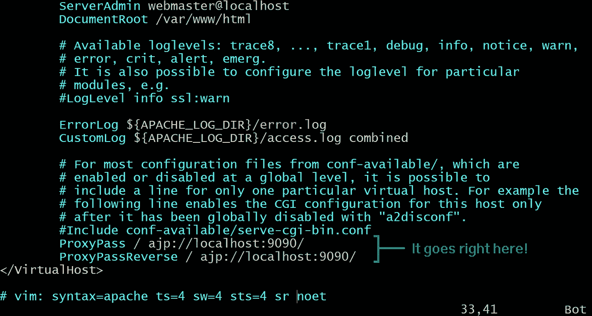**

**Editing the file in VIM**

**旁注:如果您决定使用 VIM，您会希望对 VIM 有一点熟悉，因为它的界面非常独特。您需要键入“I”以进入界面模式，然后才能真正正确地更改文本。然后按 ESC 键退出界面模式，然后输入“:”(或者技术上是 CTRL+；)来输入命令。“w”是写(或保存)的命令,“q”退出应用程序。所以在点击 ESC 之后，下面的代码将保存您的更改并退出 VIM:**

```
:wq
```

**下一步是通过不归路(除非你卸载 Apache 并重新安装它，这本身就是一个比你想象的更费力的过程)。**

**我们将使用以下命令重新启动 Apache，同时交叉手指或利用您可能与您选择的信仰系统的任何精神关系:**

```
sudo service apache2 restart
```

**现在您的服务器指向端口 9090。能够在浏览器中打开 Apache 的默认页面的舒适环境已经不复存在了。**

**但是，在我们上传并运行 Java 应用程序之前，我们不会知道一切是否如预期的那样工作。**

# **将您的应用上传到服务器**

**导航到您的。war 文件位置并打开一个 Git Bash 会话(或者导航到您。与 Git Bash 的战争)。**

**我们想复制我们的新。使用以下命令将 war 文件发送到我们的服务器:**

```
scp [your filename] ubuntu@[your server's IP]:~/
```

**这会将您的新。服务器根目录下的 war 文件。发疯的一个非常好的方法是忘记在你的服务器 IP 后面加上“:~/”，然后反复失败，直到你发现你做错了什么:~/**

**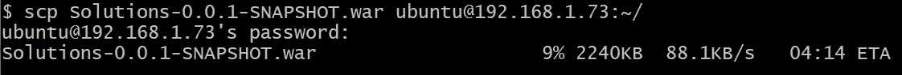**

**Copying the files gives you a nice little ETA**

**我们可以在 SSH 会话中仔细检查文件是否确实到达了服务器的根目录:**

```
cd ~/
ls
```

****

**Here’s my file (in red for some reason)**

**我们将创建一个新目录并移动我们的。那里的战争:**

```
sudo mkdir /var/springApp
sudo mv ~/[your filename] /var/springApp/
```

**我们的应用程序现在在我们的服务器上！**

**导航到我们的应用程序位置 **/var/springApp** ，我们可以使用以下命令运行我们的应用程序:**

```
java -jar [your .war filename]
```

**当您运行应用程序时，您的终端将开始一个类似于 Spring Tool Suite 中控制台的数据流。**

**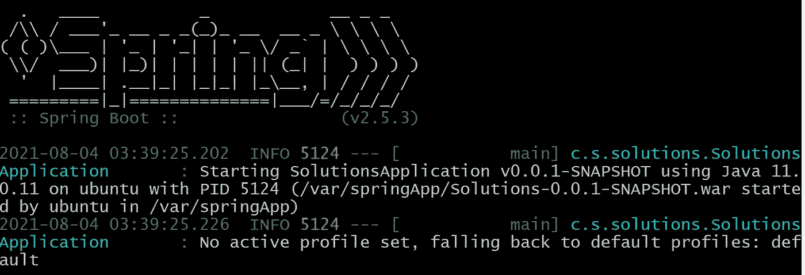**

**It’s a good sign if you see this!**

**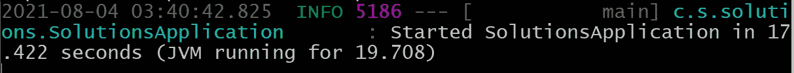**

**“JVM running for…” means your app finished loading successfully!**

**这里看起来不错，现在在浏览器中导航到您的服务器的 IP，您应该会看到您的应用程序正在运行。**

**根据您的连接(尤其是如果您的服务器是通过 wifi 而不是以太网连接的)，加载您的 web 应用程序可能需要一段时间。如果您的终端显示“x 毫秒内完成初始化”，这意味着您的浏览器成功连接到您的应用程序。**

****

**This message will appear the first time your browser sends a request to your app**

****

**SUCCESS!**

# **保持您的应用程序运行**

**这很好，但是一旦我们在工作站上关闭 SSH，应用程序就会开始运行。我的意思是，我们不需要打开工作站就能运行我们的应用程序，这难道不是重点吗？**

**为了让应用程序持久，我们必须创建一个 systemd 脚本来保持我们的应用程序运行。我们可以关闭 SSH 会话或按 CTRL+C 来关闭 Java 应用程序，并返回到服务器上的命令行提示符。**

**然后我们将创建我们的脚本文件:**

```
cd /etc/systemd/system
sudo touch [App name].service // creates an empty text file 
sudo vim [or nano] [App name].service
```

**我们的新服务文件需要编写如下:**

```
[Unit]Description=Whatever you want to put hereAfter=syslog.target[Service]User=ubuntuExecStart=/usr/bin/java -jar /var/springApp/[your .war filename]SuccessExitStatus=143[Install]WantedBy=multi-user.target
```

**保存脚本后，我们必须启用服务:**

```
sudo systemctl enable [name of your .service you just created]
```

**现在你可以开始了:**

```
sudo systemctl start [name of service WITHOUT .service suffix]
```

**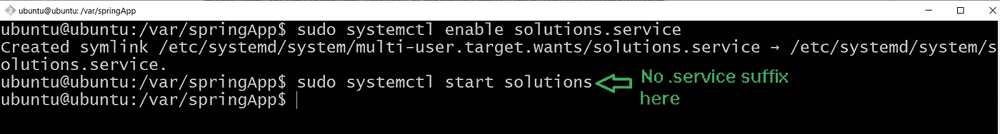**

**This is what it should look like to enable and start your .service to run your Java app**

**作为一个严格的测试，关闭您的 SSH 会话，并在浏览器上导航到您的本地服务器。如果你能够加载你的应用程序，你就已经越过了终点线！**

**根据我们编写脚本的方式，在关闭服务器并再次打开后，您的应用程序应该会自动启动。**

**我们现在也可以使用以下命令:**

```
sudo systemctl stop [your service name without .service]
sudo systemctl restart [your service name without .service]
systemctl status [your service name without .service]
```

# **本地还是全球？**

**目前，您的服务器只能由本地网络上的终端访问，包括连接到您的 wifi 的任何人。**

**启用从互联网访问您的服务器超出了本文的范围，主要是针对您的 ISP 和网关路由器。**

**目前，我选择不探索这条途径，主要是因为我会增加我必须注意的安全问题。打开从互联网到本地服务器 IP 的网关可能会给网络带来新的漏洞，需要加以管理。**

# **进一步的步骤**

**现在，您的服务器已经正常运行，您可以继续编写和编译应用程序的更新版本或全新应用程序，并将它们上传到您的新服务器。您可以更改。服务文件指向您的新应用程序文件或禁用当前。创建和启用新服务的服务:**

```
sudo systemctl stop [current service]
sudo systemctl disable [current service]//repeat above steps for writing, enabling and starting a new .service
```

**当更新或加载新的应用程序时，您还需要确保它使用相同的 MySQL 密码，并且您已经按照前面的步骤创建或上传了匹配的 MySQL 模式。**

**除了启用 Apache 代理的应用程序之外，您不必重复安装任何软件的步骤。**

**拍拍自己的背，这是一个漫长的旅程，但你做到了！**