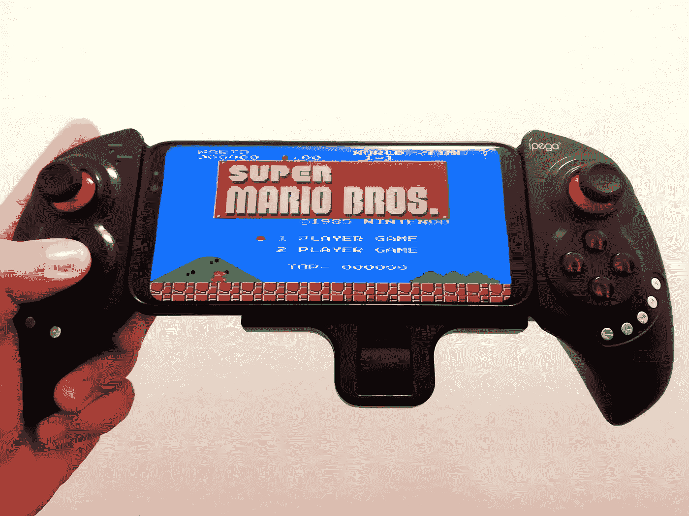

# 将您的智能手机变成经典的游戏主机

> 原文：<https://medium.com/geekculture/turn-your-smartphone-into-a-classic-gaming-console-aec13760a787?source=collection_archive---------12----------------------->

## 这很简单，我就是这样做的

My iPega gamepad and Super Mario on Samsung S8 Plus

童年时代的经典游戏机对我们每个人来说肯定是不同的。我有幸尝试了[雅达利 2600](https://en.wikipedia.org/wiki/Atari_2600) 游戏机和任天堂的克隆版本，一些超级任天堂游戏后来也在上面进行了改编。克隆控制台是[终结者](https://en.wikipedia.org/wiki/Ending-Man_Terminator)，NES 的本地化版本，在东欧和亚洲一些国家甚至比原版更受欢迎。

我在朋友家试过雅达利。在我十几岁的时候，他的母亲刚刚给他买了一台雅达利 2600，我对此印象深刻，于是我开始求妈妈给我买一台游戏机。在我生日那天，她送了我一个终结者。我太激动了！

一些后来出现在超级任天堂游戏机(SNES)上的游戏被制作成适用于终结者，这非常酷，因为 SNES 的游戏要好得多。

# 游戏机对 90 年代的儿童意味着什么

雅达利和终结者在当时对孩子们来说都像是魔法，而且不仅仅是对孩子们。那时没有互联网，大多数人已经有了彩电。终结者游戏机非常便宜。它不超过 60 美元。

我和父母住在一个公寓楼里，附近的许多孩子也有游戏机，主要是终结者。这些控制台与墨盒一起工作，其中一些与控制台一起提供，其他的必须单独购买。我们交换了弹夹，所以我们可以一直玩新游戏。借一个全新的游戏，用你已经厌倦的游戏作为交换，这真的很有趣。

没有太多的时间使用电视，因为一家人习惯整天看电视。我经常不得不在早上 5 点起床，只是为了在父母醒来之前玩。

# 如何使用智能手机玩主机游戏

如果你很怀旧，想再次体验游戏机时代的情感，你可以在手机上安装 Gamebase 这样的应用程序。Gamebase 允许你免费玩各代游戏机上的一些游戏，但是为了能玩到所有的游戏，你可以购买高级版。

对于你所得到的，你付出的代价是微不足道的。你想想看:这就像你的手机上有所有的主机，而那个时候的游戏制作精良！我会在任何时候玩这些游戏中的一个，而不是玩你今天可以在智能手机上找到的游戏。

## 获得最佳体验的游戏手柄！

为了获得最佳体验，你还可以获得一个 [iPega 游戏手柄](http://ipega.hk/gamehandle.html)。我买了一个，体验很神奇。设置很简单，使用 Gambase 应用程序或其他应用程序，包括新游戏，效果非常好。如果你的手机有 AMOLED 屏幕，即使玩超级马里奥也变得很酷。它让你想起在 CRT 电视上玩。我买的是 [iPega 9023s](http://ipega.hk/gamehandle/53-196.html) 游戏手柄，价格不贵，性能很好。30 美元左右就能找到。

为了给你一个你能做什么的例子，我玩了 Playstation 1 的“合金装备”, Playstation 2 的“铁拳 3 ”, SNES 的“忍者外传”系列，以及任天堂 64 的“塞尔达传说:时间之笛”。

祝你好运！