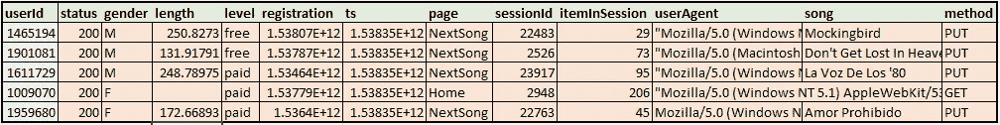
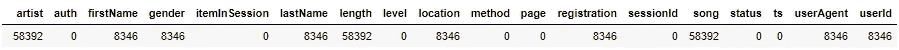
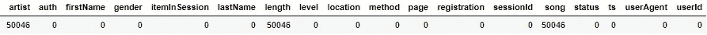
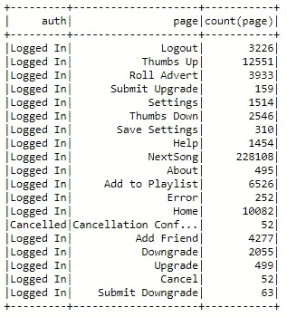
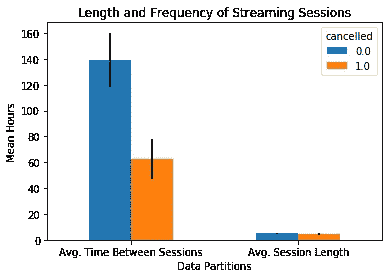
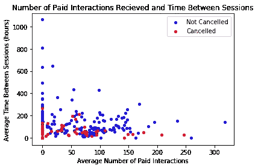
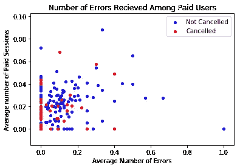
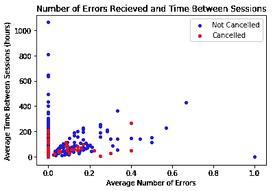
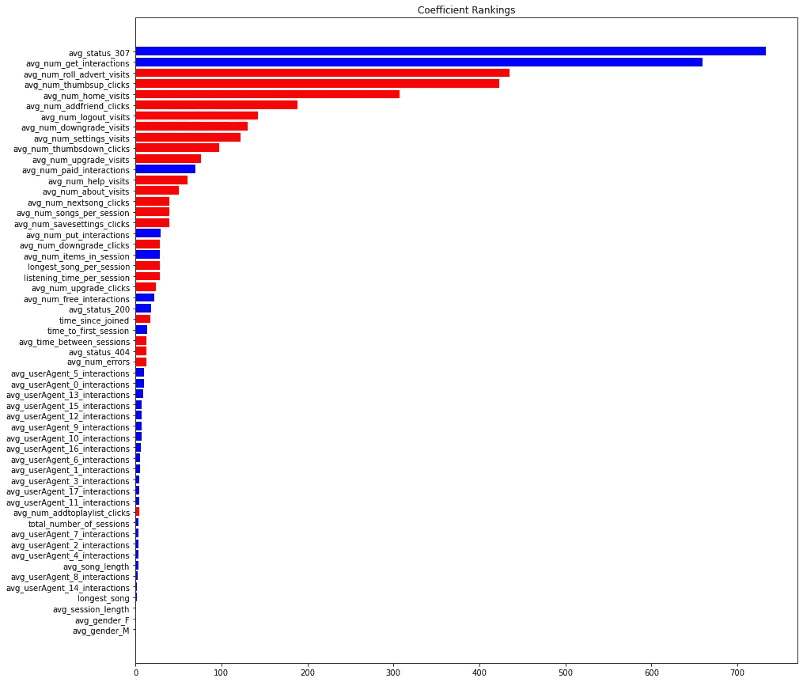

# Spark ML 的拒绝营业额:Sparkify 的故事

> 原文：<https://medium.com/geekculture/turndown-turnover-with-spark-ml-a-sparkify-story-76d3419a265e?source=collection_archive---------78----------------------->


Image Credit: [Irish Street Musician — Richard Waldron](https://www.artpal.com/richardwaldron?i=212438-6)

# 介绍

**概述**

每个人都喜欢好的流媒体服务。能够随时随地毫不费力地享受几乎任何你想要的东西是一种诱人的感觉。Spotify、Pandora 或网飞等流媒体企业经常按月向客户提供服务，这对用户和企业都很方便。对于企业来说，这让他们有一个可靠的，稳定的收入来源。对于用户来说，它提供了较低的前期成本和安全性，因为他们知道如果他们对服务不满意，可以随时取消。

然而，这种自由是有代价的。流媒体业务通常会经历用户的高流动率(称为流失)。能够预测哪些客户可能会流失，以及那些取消的客户有哪些共同的特征，这对企业来说是非常有价值的。

**问题陈述**

虚构的音乐流媒体服务“Sparkify”想知道他们的哪些用户可能会流失。这个项目试图预测哪些客户会流失，并了解原因。来自 Sparkify 的用户数据将用于查看是否可以使用分类模型来预测用户流失(针对他们虚构的业务)。将通过检查缺失值并将数据聚合为每行一个用户的格式来清理数据。然后，将使用两种不同类型的分类模型对数据进行建模:

1.  逻辑回归
2.  梯度增强树

数据将被分成训练和验证集(或测试集)。训练集将通过分层 k-fold 交叉验证进行交叉验证，并网格搜索最佳超参数，然后对测试集进行最终评估。

数据访问由 Udacity 公开，可以在[这个 S3 桶](https://udacity-dsnd.s3.amazonaws.com/sparkify/sparkify_event_data.json)中找到。由于数据量很大(~12GB)，PySpark(以及 Spark)将用于数据的最终分析。为了在探索阶段使事情变得更容易，将只使用数据的一个样本(如果你在笔记本中跟随，它是' mini_sparkify_event_data.json '，可以在这里找到)。

**指标**

在评估这些模型时将使用两个指标，即 F1 指标和准确度得分。F1 指标将用于在超参数网格搜索中对模型性能进行排名，因为它提供了一个比准确性更平衡的性能视图。有关分类指标的复习，请参见此处的。

# 第一部分:早期分析和方法

**数据探索和预处理**

加载数据后，我们发现有 18 列(如表 2 所示)。在迷你数据集中，有大约 100，000 行，而完整数据集有大约 26，000，000 百万行。表 1 提供了一个数据示例。



Table 1: Sample of the raw Sparkify data

加载数据后，采取的第一步是检查任何空值。由于每个用户的行为稍有不同，我们预计对于给定的用户会缺少一些字段。我们最感兴趣的是是否缺少 sessionId 或 userId 值。如果 userId 为空，那么我们无法将该数据与用户匹配，因此我们无法使用它来预测用户流失。如果用户缺少 sessionId 值，那么如果我们做一些假设，我们可能仍然能够使用该数据，但否则我们可能也应该删除它。



Table 2: Missing Values in the Mini Sparkify Dataset

根据表 2，看起来有几列缺少值。这似乎也有一点规律。例如，userId、userAgent、gender 和 location 都有相同数量的缺失值，这可能意味着这些缺失值都与缺失的 userId 相关联。

在删除缺少 userId 的行之后，剩余的缺少值如表 3 所示:



Table 3: Missing Values After Removing Blank `userId`

基于剩余的缺失值，看起来艺术家、长度和歌曲字段可能仅在用户听音乐时被填充，而不是在播放器空闲或用户浏览网站的其他部分时被填充。由于该信息可能是有用的数据，因此此时不会估算或删除缺失值。

除了纠正丢失的值之外，还删除了艺术家、歌曲和位置列，因为它们有很多差异(即，由于歌曲和艺术家的数量很大，几乎每一行都有唯一的值)。我们可以使用 NLP 来解决艺术家/歌曲/位置问题，但正如我们稍后将看到的，我们可以在不执行任何 NLP 的情况下获得一个相当好的分类器。下面，我试图通过使用一些正则表达式来减少歌曲中的可变性，但最终，仍然有太多的唯一值，所以我放弃了它。然而，使用下面的方法，userAgent 的值被压缩了很多。

```
*# artist and userAgent have a lot of unique values. The following lines*
*# try to reduce the number of characters for each.*

*# Filter rows with regex (find rows that match expression)*
user_log = user_log.withColumn('artist', regexp_replace('artist', r'[^0-9a-zA-Z]', ' '))
user_log = user_log.withColumn('userAgent', regexp_replace('userAgent', r'[^a-zA-Z]', ' '))
user_log = user_log.withColumn('userAgent', trim(lower(regexp_replace('userAgent', r'\s+', ' '))))
user_log = user_log.withColumn('userAgent', regexp_replace('userAgent', r'\s[a-z]\s', ' '))
```

接下来，对分类变量进行了一次性编码，我认为这有助于探索数据(也有助于建模)。这也是一个定义真相标签的好时机，这样我们就可以探索那些没有取消的人和那些取消的人之间的差异。在本分析中，客户流失被定义为完全取消其服务的客户，并在`page==”Cancellation Confirmation"`时出现。

一键编码的变量列在下面代码片段的开头(其中“user_log”是主要的 Spark 数据帧)。

```
*## One hot encode column variables*

*# Create string index for each column to be encoded*
onehot_cols = ['gender', 'level', 'method', 'userAgent', 'page', 'status']
indexers = [
    StringIndexer(inputCol=column, outputCol=column+"_indexed")
    **for** column **in** onehot_cols
]

*# Use the indexed columns to prepare the one-hot encoder*
encoders = [
    OneHotEncoder(
        inputCol=indexer.getOutputCol(),
        outputCol=indexer.getOutputCol()+"_encoded",
        dropLast=**False**
    ) 
    **for** indexer **in** indexers
]

*# Generate a vector of encoded values using VectorAssembler for*
*# each row*
assembler = [VectorAssembler(
    inputCols=[encoder.getOutputCol() **for** encoder **in** encoders],
    outputCol="onehot_features"
)]

*# Run the string index, encoder, and assembler as a Pipeline,*
*# save the output back to the spark dataframe*
onehot_pipeline = Pipeline(stages=indexers + encoders + assembler)
onehot_pipeline = onehot_pipeline.fit(user_log)
user_log = onehot_pipeline.transform(user_log)
```

让一次性编码在 Spark 中工作有点棘手，需要大量的谷歌搜索。Spark 首先必须为被编码的分类变量中的每个唯一值创建一个字符串索引。然后，它将这些字符串索引传递给一键编码器，由它来完成繁重的工作。vector assembler 帮助从 one-hot 编码器中提取转换后的值，并将这些值放入 Spark 数据帧中的一列(在我的例子中称为“onehot_features”)。在该列中，每一行都是已编码的每一列的编码值列表。虽然这对于建模来说很方便(我们将在后面看到)，但是我仍然有一些处理和探索要做，所以为了提取列值(和列名)并将它们恢复到原来的位置，我必须执行下面的代码。

```
*# Generate the list of column names for convenience later (using*
*# VectorAssembler, the column names are not saved to the dataframe*
*# and need to be recovered)*
*#*
*# userAgent is renamed here because each value is a really long string*
*# and this makes the column name more convenient*
expanded_oh_names = []
**for** i, column **in** enumerate(onehot_cols):
    **for** j, label **in** enumerate(onehot_pipeline.stages[i].labels):
        **if** column == 'userAgent':
            expanded_oh_names.append(column + '_' + str(j))
        **else**:
            expanded_oh_names.append(column + '_' + label)

*# Generate list of columns to keep in the dataframe. For most purposes,*
*# this would be a list of the columns that were not encoded.*
*# If any of the columns in the list are one-hot encoded, this list*
*# will keep the original, non-encoded column in the dataframe*
no_hot_cols = [c **for** c **in** original_col_list **if** c **not** **in** onehot_cols]
*#no_hot_cols = ["artist", "gender", "itemInSession", "length",*
*#    "level", "location", "method", "page", "registration", "sessionId",*
*#    "song", "ts", "userAgent", "userId"]*

*# create a new, expanded column list.*
all_cols = no_hot_cols + expanded_oh_names

**def** extract(row, column_list):
    *'''*
 *For each row, extract the one-hot values in the row vector (from*
 *VectorAssembler), along with any columns listed in column_list.*

 *Returns a tuple of values.*
 *'''*
    col_tup = tuple(row[column] **for** column **in** column_list)
    **return** col_tup + tuple(row.onehot_features.toArray().tolist())

user_log = user_log.rdd.map(partial(extract, column_list=no_hot_cols)).toDF(all_cols)
```



Table 3: Distribution of `auth` Variable with `page`

`auth`变量也被考虑用于编码，但是它只有两个值，并且与我们的目标响应完全相关(如表 3 所示)，所以它被一起删除了。

**数据可视化**

本节中的误差线是使用 t 分布生成的，数据是为使用下面的便捷函数绘图而准备的。

```
**def** group_differences(data, target_val, group_vals):
    *'''*
 *Groups the target variable by a grouping variable, and returns the mean values*
 *and error for each group.* 

 *data: dataframe*
 *The dataframe of data*
 *target_val : str*
 *The target column of the dataset*
 *group_val : str or list*
 *The column to create the groups for comparison*
 *'''*
    **from** **scipy.stats** **import** t
    ci_stand_error = **lambda** x: (x.std(ddof=1)/(np.sqrt(x.shape[0])))*t.ppf(0.975, df=x.shape[0])

    **if** isinstance(target_val, str):
        target_val = [target_val]

    concats = []
    **for** tv **in** target_val:
        new_group = data.groupby(group_vals, as_index=**True**).agg(
                          {tv: ['mean', ci_stand_error]})
        new_group.columns.set_levels([[tv], ['Mean', 'Error']],
                                  level=**None**, inplace=**True**)
        concats.append(new_group)

    grouped_df = pd.concat(concats, axis=1)
    **return** grouped_df
```



Figure 1: Streaming Habits between User Groups

可以预测用户即将取消的一件事是会话之间的平均时间。例如，我们可能预期用户会取消，因为他们没有像他们想象的那样经常或长时间使用服务。根据图 1 的结果，很明显，取消会话的用户和没有取消会话的用户之间的会话平均时间有显著差异。然而，这与最初的假设相反，因为取消的用户实际上似乎在会话之间有更少的时间。这可能有其他原因，例如不取消服务的用户可能不会经常使用该服务，因为他们有免费服务，并且没有使用它的义务感，而那些付费用户可能会在他们的使用速度减慢时取消服务。



Figure 2: Paid interactions compared to time between sessions

图 2 调查了会话间隔时间和付费用户之间是否存在负相关关系。从图中可以看出，这两者之间可能有轻微的负相关，但如果有，也是微弱的指数关系。此外，根据用户是否是将取消的用户，似乎没有不同的趋势。

在任何情况下，会话之间的平均时间可能是一个很好的预测。用户的平均会话长度之间似乎没有太大的差异。

用户可能取消的另一个可能的原因是，他们在使用该服务时收到了很多错误，因此对它不感兴趣。图 3 和图 4 显示，即使取消的人出现了更多的错误，这种差异看起来并不明显。还可能有其他因素影响用户是否由于错误而取消，例如，付费用户可能不再是付费用户，但如果他们经历大量错误，则仍然是免费用户。其中一些可能的相互作用在这里没有探讨，但是可能对模型有影响。



Figure 3: How errors affect paid users



Figure 4: How errors affect time between sessions

**特色工程**

为了准备用于建模的数据，使用两个连续的 groupby 函数将数据合并为每个用户一行的格式。下面的代码片段显示了用于生成该查询的 Spark SQL 函数。该查询封装在一个自定义类中，该类遵循 PySpark 和 sklearn 的 fit/transform 风格。

我选择将查询包装在这样的转换对象中，因为 userAgent(即用户正在监听的设备)的一次性编码可能是无限的，并且很难有意义地聚合所有可能的值(因为它们也有很长的名称)。以这种方式构建查询使查询更加模块化，并且我不必担心丢失其中一个 userAgent 值。

* *下一个片段只是一瞥，而不是整个课程。不要这样跑。**

```
**class** **SqlFeatureEngineer**(Transformer):
    *"""*
 *Custom Transform to feature engineer using a SQL query*
 *"""*

    **def** __init__(self, table_name: str, agents: Iterable[str]):
        super(SqlFeatureEngineer, self).__init__()
        self.table_name = table_name

        sum_UA = "".join("**\n**        ,SUM(**%s**) as num_**%s**_interactions" % (agent, agent) **for** agent **in** agents)
        avg_UA = "".join("**\n**    ,AVG(sess.num_**%s**_interactions) as avg_**%s**_interactions" % (agent, agent) **for** agent **in** agents)

        session_query_select = """SELECT 
            sess.userId
            ,AVG(sess.num_items_in_session) as avg_num_items_in_session
            ,MAX(sess.longest_song_in_session) as longest_song
            ,AVG(sess.longest_song_in_session) as longest_song_per_session
            ,COUNT(sess.sessionId) as total_number_of_sessions
            ,SUM(sess.session_listening_time)/COUNT(sess.sessionId) as listening_time_per_session
            ,SUM(sess.number_of_songs)/COUNT(sess.sessionId) as avg_number_of_songs_per_session
            ,SUM(sess.session_listening_time)/SUM(sess.number_of_songs) as avg_song_length
            ,AVG(sess.session_length) as avg_session_length
            ,MAX(sess.session_end)-MIN(sess.registration) as time_since_joined
            ,MIN(sess.session_begin)-MIN(sess.registration) as time_to_first_session 
            ,CASE
                WHEN COUNT(sess.sessionId) <= 1 THEN 0
                ELSE ((MAX(sess.session_end)-MIN(sess.session_begin)) - SUM(sess.session_length))/(COUNT(sess.sessionId)-1)
            END as avg_time_between_sessions
            ,AVG(sess.gender_F) as avg_gender_F

               ...                    ... ,AVG(sess.num_downgrades) as avg_num_downgrades
            --,AVG(sess.num_cancel_visits) as avg_num_cancel_visits
            ,MAX(sess.cancelled) as cancelled"""

        session_query_from = """
        FROM (
            SELECT 
                userId
                ,sessionId
                ,MAX(itemInSession) as num_items_in_session
                ,MAX(length) as longest_song_in_session
                ,SUM(length) as session_listening_time
                ,COUNT(song) as number_of_songs
                ,min(ts) as session_begin
                ,max(ts) as session_end
                ,max(ts) - min(ts) as session_length
                ,MIN(registration) as registration
                ,MAX(cancelled) as cancelled

              ...                    ... ,SUM(`page_Submit Downgrade`) as num_downgrades
                """ 

        session_query = session_query_select + avg_UA + session_query_from + sum_UA + """
            FROM """ + self.table_name + """
            GROUP BY
                userId,
                sessionId
        ) as sess
        GROUP BY
            userId
        """

        self.query = session_query

    **def** _transform(self, df: DataFrame) -> DataFrame:
        df.createOrReplaceTempView(self.table_name)
        summary = spark.sql(self.query)
        **return** summary
```

该对象用两个值实例化，临时表名(spark 用来识别/构建查询)和用户代理列表(填充到查询中)。第一个 groupby 压缩了每个用户的会话数据，因此每个用户都记录了每个会话的汇总统计信息。然后，将每个会话分组在一起，以便每个用户都有关于其总会话历史的汇总统计信息。总的来说，小数据集中大约有 120 个分组用户，完整数据集中有 22277 个用户，总共有 61 列。

后来，我发现有一种更 python/sparkish 的方法可以做到这一点(我用于初始聚合以生成图)，下面我分享一个例子:

```
*# Aggregate using spark, and convert to pandas for easy plotting/exploring*
id_group = user_log.groupBy(["userId", "sessionId"]) \
                    .agg(
                        Fmax('itemInSession').alias('num_items_in_session'),
                        Fmax('length').alias('longest_song_in_session'),
                        Fsum('length').alias('session_listening_time'),
                        count('song').alias('number_of_songs'),
                        Fmin('ts').alias('session_begin'),
                        Fmax('ts').alias('session_end'),
                        (Fmax('ts')-Fmin('ts')).alias('session_length'),
                        Fmax('gender_F').alias('gender_F'),
                        Fsum('page_Error').alias('num_errors'),
                        Fsum('level_paid').alias('num_paid_interactions'),
                        Fmax('cancelled').alias('cancelled')
                    ) \
                    .groupBy('userId') \
                    .agg(
                        when(count('sessionId') <= 1, 0)
                        .otherwise(((Fmax('session_end')-Fmin('session_begin'))
                                    -Fsum('session_length'))/(count('sessionId')-1))
                        .alias('avg_time_between_sessions'),
                        avg('session_length').alias('avg_session_length'),
                        avg('gender_F').alias('avg_gender_F'),
                        (Fsum('session_listening_time')/count('sessionId')).alias('listening_time_per_session'),
                        count('sessionId').alias('total_number_of_sessions'),
                        avg('num_errors').alias('avg_num_errors'),
                        avg('num_paid_interactions').alias('avg_num_paid_interactions'),
                        Fmax('cancelled').alias('cancelled')
                    ).toPandas()
```

压缩数据后，使用最小-最大缩放器进行归一化。下面的代码片段在 Spark 中执行最小-最大缩放。

```
*# create a list of columns to min-max scale. Make sure to exclude*
*# the userId column and the target variable*
columns_to_scale = [column **for** column **in** user_summary.columns **if** column != 'userId' **and** column != 'cancelled']

*# min-max scaler*
assembler = VectorAssembler(inputCols=columns_to_scale, outputCol="features")
transformed = assembler.transform(user_summary)
scaler = MinMaxScaler(inputCol="features", outputCol="scaledFeatures")
scalerModel =  scaler.fit(transformed.select("features"))
user_scaled = scalerModel.transform(transformed)
```

# 第二部分:建模和实现

幸运的是，让建模在 Spark 中工作并不太困难，因为这部分的 API 与 sklearn 非常相似。唯一有点陌生的部分是创建用于评估分类指标的对象。可能有一种更简单的方法，但是我可以通过将 multiclassclarticationevaluator 对象传递给 cross validator 来实现，如下例所示。

```
*# Split into training and test data* (trainingData, testData) = user_scaled.randomSplit([0.8, 0.2], seed=42)logreg = LogisticRegression(labelCol="cancelled", featuresCol="scaledFeatures",
                            maxIter=100, regParam=0.01, elasticNetParam=0.5)
evaluator = MulticlassClassificationEvaluator(
    labelCol="cancelled", predictionCol="prediction",
    metricName="f1")

pipeline_lr = Pipeline(stages=[logreg])

paramGrid_lr = ParamGridBuilder() \
                .addGrid(logreg.elasticNetParam, [0]) \
                .addGrid(logreg.regParam, [0.01, 0.1]) \
                .build()

crossval_lr = CrossValidator(estimator=logreg,
                             estimatorParamMaps=paramGrid_lr,
                             evaluator=evaluator,
                             numFolds=2)
```

建模分三个阶段进行。在第一阶段，我使用 Spark 创建了一个端到端的模型管道，但只针对小样本数据，我执行了一个不太详尽的模型搜索。在第二步中，我处理了一个大得多的数据集，并执行了一个稍微大一点的模型搜索，但是由于 AWS 成本的快速上升，我离线完成了建模。第三步(离线)是下载数据，分块处理，并在我的本地机器上执行快速、更彻底的搜索。

**第一步:在小数据集上用 Spark 建模**

通过首先将数据分成训练集和测试集(80/20%分割)来执行建模。然后，在逻辑回归模型上使用 2 重交叉验证网格搜索对训练集建模(具有弹性净惩罚)。该模型考虑的两个参数(以及搜索到的相关值)是:

1.  elasticNetParam: [0]
2.  regParam: [0.01，0.1]

建模前从数据中删除`userId`变量。模型中使用最小-最大化要素，而不是原始比例的变量。假设这是一个分类问题，基于最高 F1 分数选择最佳模型。总的取消率约为 20%，所以这种不平衡不足以担心过采样或欠采样，但鉴于这种轻微的不平衡，像 F1 这样的指标可能是比准确性更好的衡量标准。

一旦选择了最佳拟合模型，就在整个训练集上训练该模型，并在测试集上执行最终评估。基于使用小数据集的初步运行，测试集上的模型性能具有 **F1 分数**为 **0.65** 和**准确度分数**为 **0.74** 。

**Spark 大数据集建模(云部署)**

在 AWS 上运行模型涉及的过程与步骤 1 中概述的过程相同，只是实际的建模工作更加详尽。数据被分成 75/25%的训练/测试集，交叉验证是 3 倍而不是 2 倍。在弹性网逻辑回归中搜索的参数是:

1.  elasticNetParam: [0，0.33，0.66，1]
2.  regParam: [0.001，0.01，0.1]

为了在更大的数据集上有效地运行模型，我使用了一个 AWS EMR/EC2 实例。我按照这里[列出的说明](https://towardsdatascience.com/how-to-set-up-a-cost-effective-aws-emr-cluster-and-jupyter-notebooks-for-sparksql-552360ffd4bc)启动并运行它。

一旦我运行了实例并加载了数据，剩下的分析就相当顺利了，我不需要对之前的分析做任何大的修改(除了本节中概述的内容)。

然而，由于较大的(以前未探索的)数据集，出现了一些小错误。例如，以前没有缺失值的一些列现在被填充了`null`，这干扰了模型的构建。为了解决这些问题，我在 Spark SQL 查询中添加了 case 语句，用 0 替换了`null`值。还有一个糟糕的用户 Id，其中一个用户可能听了 0 首歌，但每天也有大约 2500 个唯一的会话 Id(除非你是机器人，这似乎不太可能)。但是，删除这个坏用户并没有提高模型的性能。

端到端的过程花费了大约 2.5 小时，使用了大约 96 个核心(3 个主节点、1 个核心节点和 3 个不同大小、功率等的任务节点)。).关于云实现的更多细节可以在 [github 库](https://github.com/tomwerner5/sparkify)中找到。对流程进行调试和质量检查大约需要 20 个小时的计算时间。总的来说，运行 EMR/EC2 实例的成本约为 30 美元。

该步骤中模型的性能等同于步骤 3 中评估的模型(在相同的超参数条件下，将在下一步中呈现)。

**第三步:在 sklearn 中离线建模**

因为 30 美元对我来说开始变得有点贵，我下载了完整的数据集，并离线进行了一些最终的建模工作。离线代码以及相关数据在 [github 库](https://github.com/tomwerner5/sparkify)上提供。通过使用 Python 中的 urllib 从一个 [S3 桶](https://udacity-dsnd.s3.amazonaws.com/sparkify/sparkify_event_data.json)中下载大型数据集。我不会在这里详细说明下载和提取数据的具体步骤，但是可以在 run_sparkify_offline.py 文件中找到并复制它们。

一旦数据被下载并以. json 文件的形式保存在我的硬盘上，下一步就是尝试加载数据。正如所料，我的 32 GB 内存无法处理 12GB 的。json 数据(很明显，Pandas 增加的内存是未压缩文件大小的 5-10 倍)。为了解决这个问题，我知道我必须把数据分成块。然而，我不能盲目地分离数据，因为我需要将单个用户的完整数据放在单个文件中，这样当我将它加载到 Pandas 时，我可以更容易地聚合该用户的数据。因此，在加载任何数据之前，我搜索了整个文本，提取了每个唯一的 userId，并将它们放入一个 python 列表中(这相当快)。接下来，我将唯一用户列表分成 10 个部分，并扫描了。又是 json 文件。在第二遍中，我检查当前数据行属于哪个组(基于 userId ),并将该行数据写出到一个较小的文件中。这种情况一直重复到文件的末尾，我只剩下 10 个文件~ 1GB 大，每个文件都有完整的用户配置文件。

之后，脚本循环遍历 10 个文件，并对每组数据执行聚合步骤(使用 spark 概述的所有相同方法，但使用 Pandas/sklearn)。

最后，对模型进行拟合、网格搜索和评估。首先，我想尽可能地模仿第 2 步中的 AWS Spark 模型，因此这一步中的配置是 75/25%的训练/测试分割、双重验证和以下参数:

1.  l1_ratio: [0，0.33，0.66，1] #与 Spark 中的 elasticNetParam 相同
2.  C: [1/0.01，1/0.1，1] *#与 Spark* 中值为[0.001，0.01，0.1]的 regParam 相同

由于 Spark 和 sklearn 对于逻辑回归具有不同的成本函数，正则化的罚值计算如下:

```
sklearn_reg_param = 1/(spark_reg_param * 10)
```

测试集上的模型性能的 **F1 分数**为 **0.86** ，而**准确度分数**为 **0.94。根据这些结果，我扩大了网格搜索，看看是否可以做出更多改进。下一节将介绍最终结果。**

# 第三部分:最终结果

**模型评估**

因为我现在有能力扩展建模工作，所以我对逻辑回归模型进行了更大的网格搜索。在 75/25%分割的训练集上使用 5 重交叉验证，最佳模型在维持集上产生了 **0.86** 的 **F1 分数**和**0.94**的准确度分数。相对于较小的数据集，这是一个很大的改进。搜索的参数如下:

1.  l1_ratio: [0，0.25，0.4，0.5，0.6，0.75，1]
2.  C: [0.000001，0.00001，0.0001，0.001，0.01，0.1，1，10，100]

图 5 描述了模型的系数排名。



Figure 5: Coefficient Rankings (LogReg Model)

虽然这不是一个完美的排名(因为最小-最大缩放器没有标准化为等于均值/方差)，但图 5 确实呈现了哪些特征对于用户取消可能是重要的一般概念，其中蓝色表示(数学上)与取消的正关联，红色表示负关联。根据排名，似乎最重要的预测因素是 http 状态代码 307，这是一个临时重定向。据我所知，这是一个错误的排序，所以它是有意义的，这将与取消有积极的联系。加好友和喜欢的歌(竖起大拇指)也是以负面联想高居榜首，这也是符合逻辑的。

我发现令人惊讶的一件事是，广告与取消有负面联系。我本以为看到更多的添加会让一些人想要取消(除非添加是如此之好，他们会让人们注册)。然而，也可能有其他影响因素，例如付费用户可能看不到那么多的添加，因此添加仅与特定类型的用户群相关联。

为流式传输选择的设备(用户代理)似乎没有影响，大多数系数的值都很低。这似乎合乎逻辑，因为许多人有多台设备，一台设备的问题可能不足以让某人取消。

为了查看不同的模型是否可能产生更好的结果，我还测试了梯度增强树(GBT)模型，该模型使用以下参数在维持集上实现了 **F1 得分**为 **0.75** ，以及**准确度得分**为 **0.90** :

1.  最大深度:[2，5，10，50]
2.  min_samples_split: [2，12，32]

在这种情况下，GBT 模型的表现不如逻辑回归模型。通常情况下，GBT 模型的总体性能更好，但它们也有几个更高的超参数，可能很难调整，因此可能没有进行足够的搜索。未来的研究应该更多地探索这一模式。

需要注意的是，GBT 模型只在离线脚本中的完整数据集上进行了测试(使用 sklearn)。

# 结论

**反思与改进**

预测用户流失是当今机器学习问题中的一个相关主题，能够建立一个提供可靠预测的模型是一项有价值的技能。由于大多数流媒体网站都有非常庞大的用户群，建模中使用的数据量对于一台简单的笔记本电脑来说可能会迅速增长。在这些情况下，像 Spark 这样的工具可以克服处理障碍，帮助人们分析大型数据集。该项目试图在虚构的 Sparkify 数据集上预测用户流失，并利用 Spark 进行分布式数据处理。

我发现 Spark 比用熊猫更有挑战性。我觉得有很多繁琐的方法需要大量的试错(或互联网的帮助)才能正常工作。然而，尽管有这些挑战，我了解到使用 Spark 确实使处理更大的数据集变得容易得多。说到数据清理和预处理，Spark 非常高效。所有的数据清理步骤都很快。Spark 让我失望的地方是造型。一旦我有了聚集的数据，有 22，277 行和 60 列，这是一个相对较小的数据集，但 Spark 花了一个小时来交叉验证和网格搜索一些参数。相比之下，在相同的数据集上，我的本地机器只花了几分钟。我怀疑这种差异与 Spark 需要更多开销有关，当数据集很小时(聚合后)，Spark 不会带来好处。

虽然这可以被认为是一种端到端的分析，但是有几种方法可以改进这种分析。例如，没有使用 NLP，但是可以改善结果。有可能听某种流派音乐的用户比其他人更容易取消，或者可能听某些艺术家的音乐反映了某些性格特征。在任一情况下，从艺术家、歌曲和位置信息中提取 NLP 特征可以产生更高的模型性能。此外，由于我不是 Sparkify 平台或所有网络流量细微差别的专家，有可能对数据进行进一步改进，以便提取更多有用的特征。例如，更谨慎的做法可能是按时间向后聚合变量(用户 A 在过去 3、6、12 个月中是否发生过事件 B？等等。).

[1]:[https://uda city-dsnd . S3 . Amazon AWS . com/spark ify/spark ify _ event _ data . JSON](https://udacity-dsnd.s3.amazonaws.com/sparkify/sparkify_event_data.json)

[2]:我在文章中提供了一些代码示例，但是请参考我的 github 以获得完整的工作示例(【https://github.com/tomwerner5/sparkify/】T2)。

[3]: [如何为 SparkSQL 建立经济高效的 AWS EMR 集群和 Jupyter 笔记本电脑(2020 年 11 月更新)|作者安德鲁·杨|走向数据科学](https://towardsdatascience.com/how-to-set-up-a-cost-effective-aws-emr-cluster-and-jupyter-notebooks-for-sparksql-552360ffd4bc)