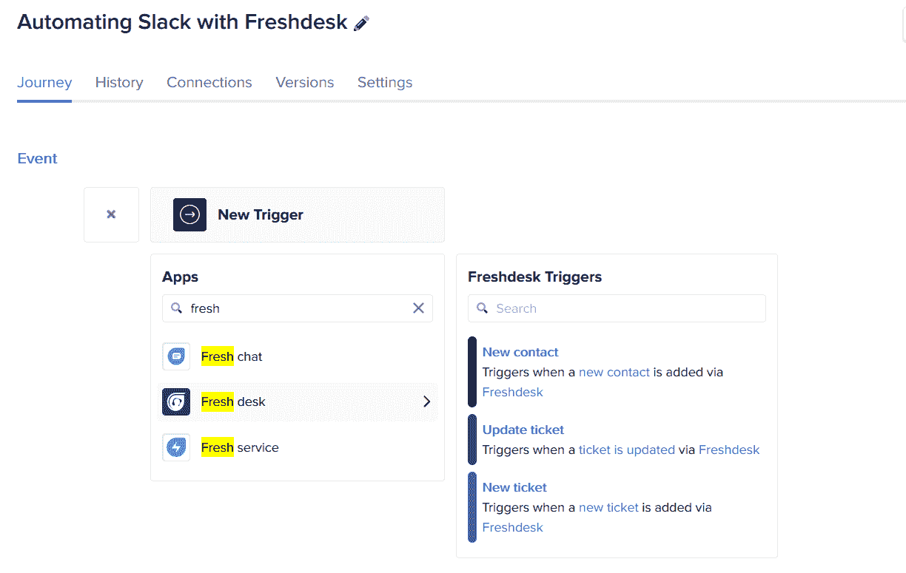
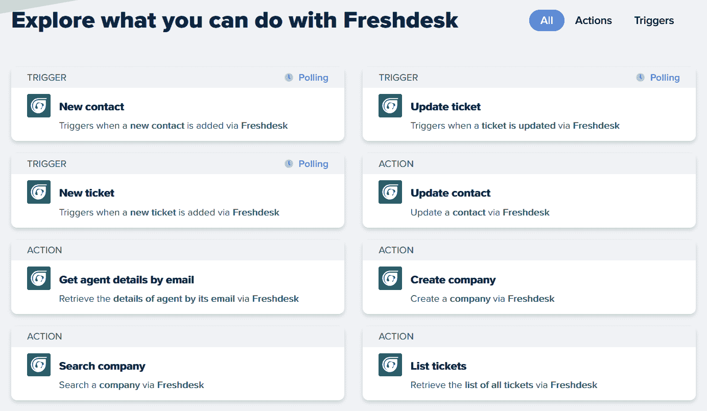
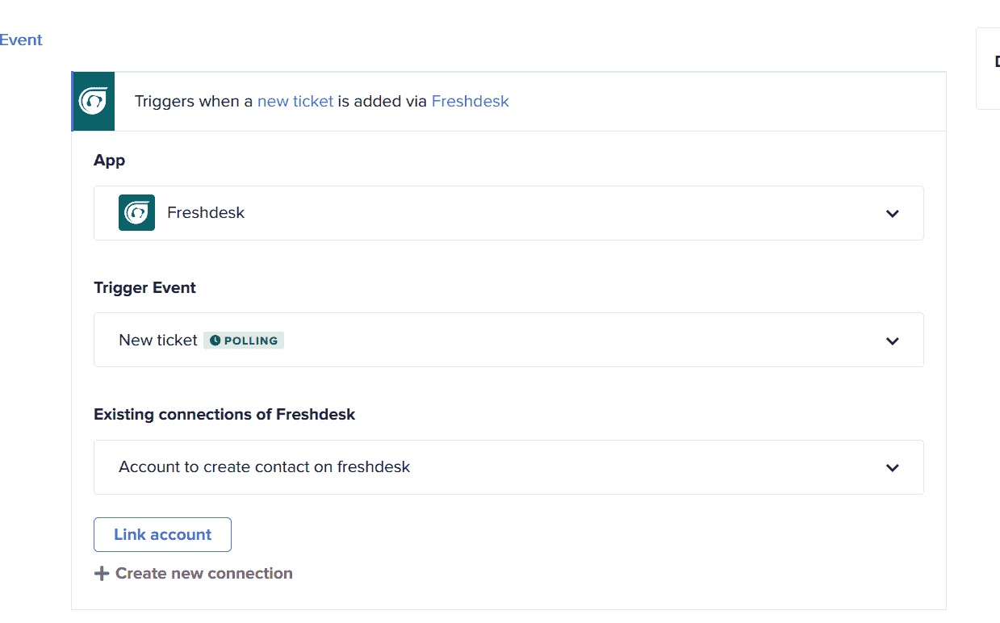
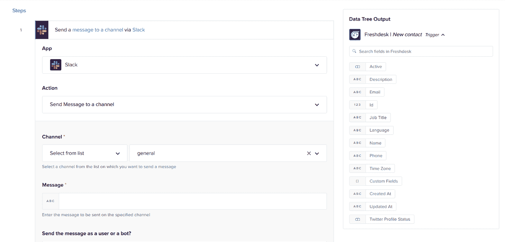
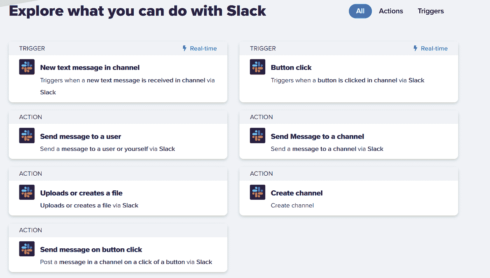
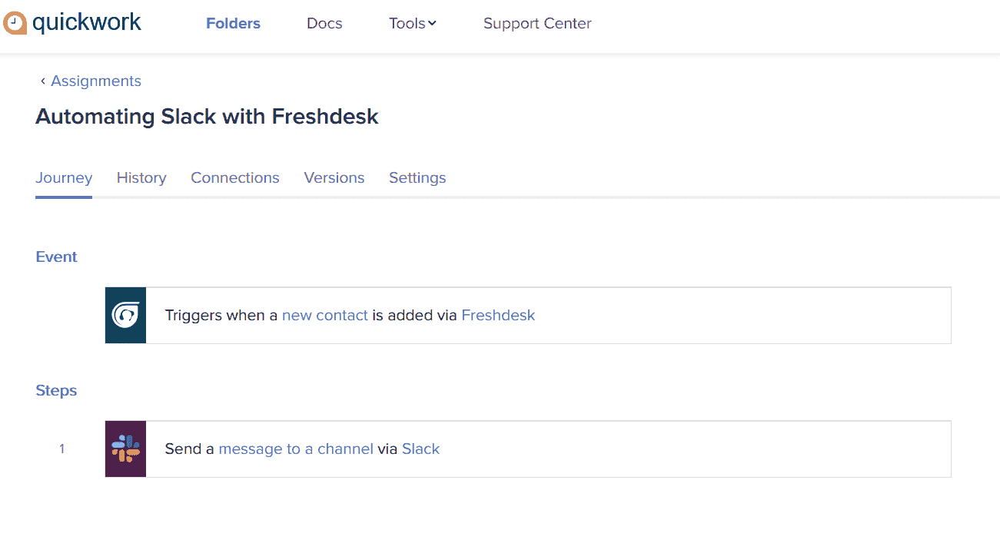

# 教程:使用 Freshdesk 和 Slack 在 10 分钟内轻松实现客户服务自动化！

> 原文：<https://medium.com/geekculture/tutorial-automating-customer-service-easily-using-freshdesk-and-slack-in-10-mins-e6604cb55839?source=collection_archive---------14----------------------->

**什么是客户服务自动化？**

客户服务自动化是一种客户服务程序，无需人工回答客户问题。自助服务工具、主动消息传递和模拟聊天会话都是自动化客户协助的例子。

**什么是 Freshdesk？**

Freshdesk 是一个在线服务台软件，提供多渠道客户服务，通过电子邮件、电话、聊天、web、Twitter 等方式为客户提供支持。

**使用 Freshdesk 的好处:**

*   电子邮件到票据转换的知识库
*   针对自助服务门户的多种服务级别协议规定
*   票证路由和场景自动化就是自动化的例子。
*   通过多种渠道提供支持，包括一个社区门户网站，在脸书和 Twitter 上提供创意管理和投票。
*   多产品/多品牌集成支持:Freshbooks、Google Apps、Harvest 和 CapsuleCRM 只是一些可用的工具。
*   支持多种语言和时区
*   顾客满意度调查
*   游戏化和排行榜

**什么是懈怠？**

Slack 是一种信息服务，在这里你可以与同事交流、参加在线会议、共享文件等等。web 应用程序的集成使 Slack 变得更加智能，因为它将所有通知(从销售到技术支持、社交媒体等)集中到一个可搜索的地方，您的团队可以在那里讨论并采取行动。

**使用 Slack 的好处:**

*   Slack chat 允许您以多种方式与您的团队互动，Slack 的屏幕共享功能使您可以轻松地与同事共享您的屏幕。
*   当你可以将文件拖放到 Slack 的文件集成中时，就不需要电子邮件附件了。
*   Droplr、谷歌文档、吉拉和 Salesforce 只是 Slack 与之互动的几个应用程序。

**借助 Slack 和 Freshdesk 的 Quickwork，您可以创建不同类型的工作流程。以下是一些工作流程:**

1.  接收新 Freshdesk 通知的堆栈通知。
2.  接收新 Freshdesk 票证的宽限通知
3.  还有更多…

**让我们看看使用 Quickwork 的 Freshdesk 自动松弛的步骤**

让我们看看 Quickwork 如何利用 Slack 和 Freshdesk 实现客户服务自动化。

**先决条件**

创建 Quickwork 帐户—[https://zurl.co/CzUs](https://zurl.co/CzUs)

创建呆滞账户—[https://zurl.co/E6Zu](https://zurl.co/E6Zu)

创建一个 Freskdesk 账户—[https://zurl.co/HvYf](https://zurl.co/HvYf)

假设您已经建立了所有帐户，我们现在可以开始创建旅程。

第一步:登录 Quickwork 账户，创建一个“新旅程”，你可以给这个旅程起任何你喜欢的名字。

步骤 2:将 Freshdesk 帐户与 Quickwork 连接

您可以参考给定的链接来连接 Freshdesk 和 Quickwork—[https://zurl.co/JZL2](https://zurl.co/JZL2)

步骤 3:选择触发器，然后选择您选择的事件。您可以在此探索 Freshdesk 集成—【https://zurl.co/nTNZ 

第四步:现在，连接 Freshdesk 应用程序和 Slack 应用程序，并选择您选择的操作。

步骤 5:选择触发器，然后选择您选择的事件。

你可以在这里探索松散的整合——https://zurl.co/sZ59

第六步:现在保存并开始旅程。

恭喜你使用 Quickwork 成功地自动化了 Zendesk 和 Slack。

你想要一个更适合你的旅程吗？请[联系我们](https://zurl.co/ta3W)或者发邮件给[marketing@quickwork.co](mailto:marketing@quickwork.co)。