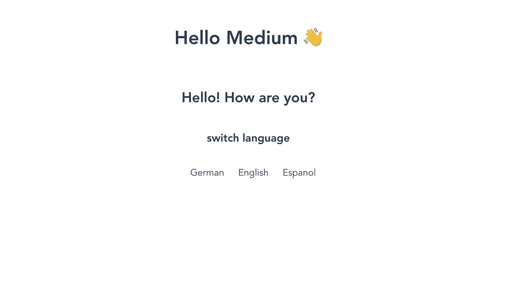
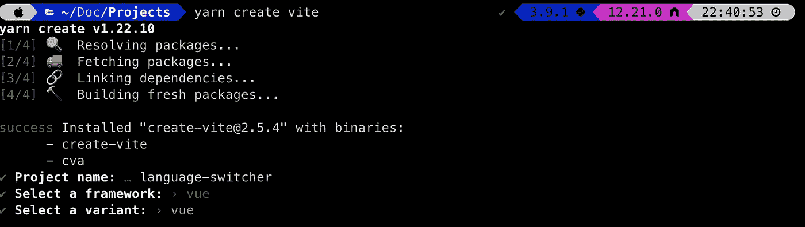
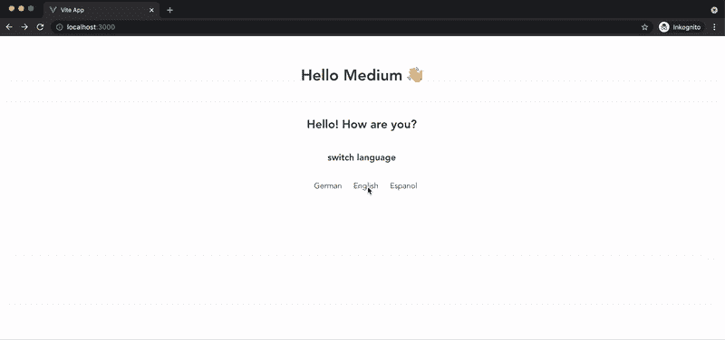

# 教程:用 Vue3、Vuex4 和组合 API 构建一个 i18n 应用程序

> 原文：<https://medium.com/geekculture/tutorial-build-a-i18n-app-with-vue3-vuex4-and-the-composition-api-42edc8afa320?source=collection_archive---------16----------------------->

the finished app

当你为国际人群构建一个 web 应用程序时，你必须处理好应用程序的国际化问题。如果你的圈子里只有懂英语的人，那你就没问题。

但是也许你想用你的用户的母语来称呼他们。如果是这样的话，你需要在你的网络应用中安装语言检测和语言切换器。

今天我将向你展示如何用 Vue3、Vuex 和新的组合 API 从 URL 和语言切换器组件构建语言检测。

# 这个计划

我想创建一个应用程序，有这样的鼻涕虫[https://www.website.com/de](https://www.website.com/de)，[https://www.website.com/](https://www.website.com/de)恩，[https://www.website.com/](https://www.website.com/de)es。

现在，我想根据用户正在访问的 slug 向用户显示一条问候消息。访问/de 的用户将看到德语消息，/en 英语消息，/es 西班牙语消息。

**我知道使用**[https://kazupon.github.io/vue-i18n/](https://kazupon.github.io/vue-i18n/)可以更简单地实现语言检测和国际化。但是在本教程中，我们将只研究蛞蝓。

# 先决条件

对于这个项目，我们将使用 Vite。如果你不熟悉 Vite，你可以在这里查看。

## 创建您的项目

只需运行`yarn create vite`或`npm init vite@latest`并选择 **vue** 。

## 编码

首先我们要把`App.vue`所有我们不需要的东西都搬走。到现在为止，您的`App.vue`文件应该是这样的:

## 添加 Vuex

现在我们要将 Vuex 添加到我们的项目中。Vuex 是 Vue.js 应用程序的状态管理模式+库。我们希望全局设置活动语言，以便在每个页面和组件上都可用。如果你对 Vuex，尤其是 Vuex4 一无所知，你可以在这里阅读全部内容:[https://next.vuex.vuejs.org/](https://next.vuex.vuejs.org/)。

要将 Vuex 添加到你的 Vue3 项目中，只需运行`yarn add --dev vuex@next`。

接下来，创建一个`store`文件夹，并在该文件夹中使用以下代码创建`index.js`:

如你所见，我们现在将英语设置为默认语言。

在我们的`main.js`中，我们需要告诉我们的应用程序，我们想要使用我们刚刚创建的商店。

Inside `App.vue`我们想利用我们的商店。**提醒:我们正在使用组合 API。所以我们在<脚本>标签中创建的每个变量在<模板>中都自动可用。**

这给了我们商店的`activeLanguage`。如你所见，我将它声明为一个计算属性。这意味着`activeLanguage`在存储更新时会改变它的值。

这就是我们接下来要做的。我们需要一些方法来更新商店中的`activeLanguage`值(` index.js `)。

如您所见，我们有一个调用突变的操作，然后它更新了`activeLanguage`的值。当这种情况发生时，`App.vue`中`activeLanguage`的值也会更新。

## 带来翻译

接下来，我们将创建一个`translations.json`文件，在这里我们可以放入我们的翻译字符串。我想现在我们只是给用户打个招呼。所以现在应该这样做:

当用户访问我们的网站时，我们希望向他们显示这个字符串。

我们需要在`App.vue`中导入我们的翻译，然后创建一个方法来返回正确的翻译。我们是这样做的:

我们从`translations.json`中导入了`TRANSLATIONS`，这只是我们的翻译对象。这个对象有 3 种语言:de、en 和 es 作为键，每种语言都有一个问候语翻译字符串作为值。

如您所见，`translateString()`将我们想要翻译的字符串作为参数。那么我们只是返回我们想要翻译的字符串。

## 语言切换器组件

最后但同样重要的是，我们将创建一个组件来切换语言，而无需在地址栏中手动更改 slugs。

所以让我们在`components`目录中创建一个名为`LanguageSwitcher.vue`的组件。这个组件看起来是这样的:

在我们的组件中，我们只有一个包含我们想要显示的 3 种语言的数组和一个改变`activeLanguage`的方法。此方法将操作分派到 activeLanguage 发生更改的存储区。

最后，我们只需要在`App.vue`中导入新创建的组件，并将其放入模板中。

这是我们完成的`App.vue`的样子:

# 完成的应用程序

Here is our finished project

我希望你跟得开心。如果你对我们在这里做的任何事情有疑问，或者你只是想说声嗨，请在评论中提出来。

此外，你可以在推特上向我问好！

你可以在这里找到这个项目[的所有代码](https://github.com/Ic3m4n34/language-switcher-vite-vue3)。