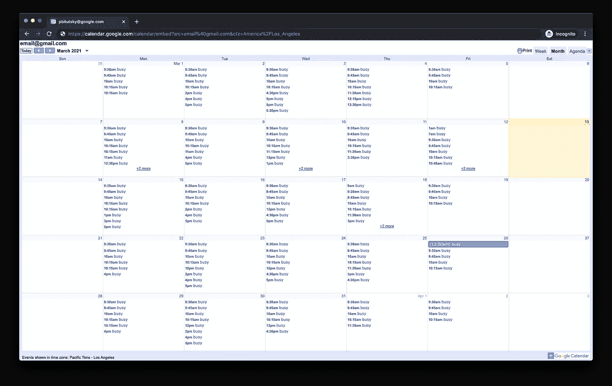
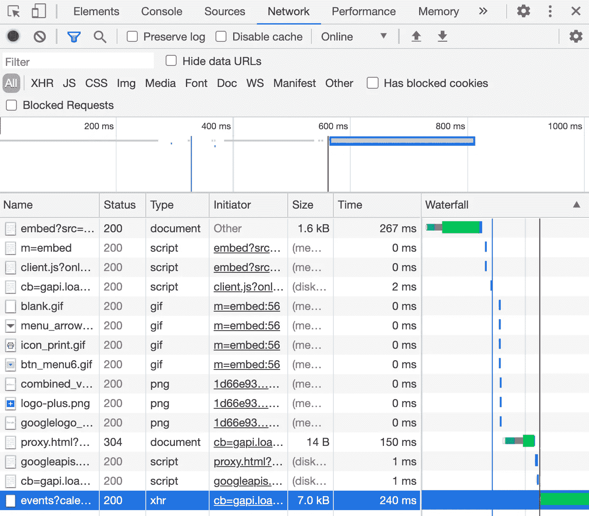

# 教程:创建开会时亮起的指示灯

> 原文：<https://medium.com/geekculture/tutorial-creating-an-indicator-light-that-turns-on-when-youre-in-a-meeting-bdc98bc4dc77?source=collection_archive---------11----------------------->

## 一个 Python 脚本，一个 Raspberry Pi，一个秘密的 Google 日历 API。我的天啊。


© [Curtis Kennington](https://www.flickr.com/photos/33613762@N07/3642074604) / [Flickr](https://www.flickr.com/photos/33613762@N07/3642074604) / [CC BY-SA 2.0](https://creativecommons.org/licenses/by/2.0/), altered with calendar added.

# 介绍

在 2020 年 Covid 疫情期间的某个时候，我搬到佛罗里达州和家人住在一起。但是由于我仍然是远程工作，我一整天都有很多会议，有时甚至是在晚上！我爱我的家人，但是他们经常在我开会的时候不敲门就进我的房间。其他时候，当我和我的经理一对一谈话时，他们会决定用吸尘器打扫或者放大声的音乐。当我开始锁门时，我的家人很不高兴(会议结束后我会忘记开门，这也没什么帮助)。最终，我认为现代问题需要现代解决方案。

我买了一个[泛光灯](https://www.amazon.com/gp/product/B015XW8128/)、一个[智能插头](https://www.amazon.com/gp/product/B07TXM4MT3/)和一个树莓派，并编写了一个脚本来检查谷歌日历，看看我是否正在开会。根据我的日历，如果我很忙，它就会打开灯。如果我不在，它就会关灯。我把这盏五彩缤纷、美丽明亮的灯放在门外，现在我的家人知道灯亮着的时候不要打扰我。他们尊重这个“忙碌的灯塔”吗？这是另一个很好的问题…

# 这个教程是给谁看的？

本教程非常适合你，如果你…

*   有孩子，父母，祖父母，兄弟姐妹，室友，女朋友，男朋友，配偶，宠物黑猩猩，或者任何其他和你一起生活/工作的人需要被告知你不被打扰
*   使用谷歌日历来跟踪你所有的会议(或者当你忙闲的时候)
*   熟悉 python 基础和面向对象编程
*   正在寻找一个很酷的项目来做树莓派

**此处描述了该指示灯旨在防止什么:**

# 你需要什么

1.  一个可以连接到你的无线网络的[树莓派](https://www.amazon.com/Raspberry-Model-2019-Quad-Bluetooth/dp/B07TC2BK1X/)。我认识的这个帅呆了的男人[写了一个教程](https://pbitutsky.medium.com/headless-raspberry-pi-setup-on-mac-54422b45217c?source=friends_link&sk=6e609196509e9ae439eb4fbb6da9b117)教我如何建立一个。
2.  任何一种灯或者任何插在墙上就能发光的东西。我买的这个[真的很酷的泛光灯](https://www.amazon.com/gp/product/B015XW8128/)，会变色，还带遥控器！
3.  一个 Kasa 智能插头，像[这个](https://www.amazon.com/gp/product/B07TXM4MT3/)。品牌是 Kasa (TP-link)非常重要，因为与大多数智能插头不同，这些插头不必使用亚马逊 Echo 或谷歌 Home 来控制。你可以使用 Kasa 的开放 API 通过网络发送请求来打开或关闭它。

# 它将如何工作

为了避免使用官方的[谷歌日历 API](https://developers.google.com/calendar) ，我将带你了解如何公开你的日历(只在忙/闲时)，并找到一个秘密的网址。当任何人访问这个 URL 时，他们都会收到一个 JSON 数据转储，其中包含您的日历在给定时间段(比如当天)的所有事件。这将在本教程的第 1 部分中讨论。

第 2 部分将介绍如何编写 Python 脚本来检查这个秘密 URL，获取 JSON 数据，确定您当前是忙还是闲，并发送打开或关闭智能插件的请求。

然后在第 3 部分，我将介绍如何将脚本转移到您的 Raspberry Pi，并设置一个 cron 作业，以便脚本每分钟都运行。

我用的是 Python 3.7.3，但是任何 Python 版本 3。*应该为这个项目工作。

# 第 1 部分:查找秘密 URL 端点

在这一节中，我将带您了解如何访问一个秘密的 URL 端点，它将以漂亮的 JSON 格式在您的日历中为您提供一个有组织的事件列表。声明:我在谷歌工作，但这个秘密的 API 不是内部信息。如果知道如何查看他们的网络活动，任何人都可以找到它。这个非官方 API 相对于官方 Google Calendar API 的优势在于，对于我们的目的来说，这个 API 使用起来要简单得多。有了这个秘密的 URL，您将永远不必登录或与 OAuth 打交道。

我们开始吧。首先，公开你的日历。您需要转到日历的设置页面，然后选择“公开”您还应该选择“仅查看忙/闲信息(隐藏详细信息)”[这里有更深入的说明。](https://support.google.com/calendar/answer/37083?hl=en#zippy=%2Cmark-your-calendar-as-public)

将日历公开后，向下滚动到“整合日历”部分，找到“此日历的公开 URL”。在匿名窗口中打开该 URL(以确保您可以在未登录 Google 的情况下访问它)。它应该是这样的:



现在打开 Chrome 的开发者工具(查看>开发者>开发者工具)。转到“网络”选项卡。此工具将显示此网页发出的所有网络请求。如果网页决定加载图像、提交表格或下载某种文件，网络请求的详细信息应在此列出。刷新页面以查看加载此页面时发生的网络请求。您应该会看到类似这样的内容:



查找以“事件？”开头的列表项(在上图中突出显示)。您可以双击它来打开页面。内容应该是一个 JSON 字典，包含这个日历的所有相关信息，包括事件列表。该 URL 应该类似于:

> https://clients 6 . Google . com/calendar/v3/calendars/email @ Gmail . com/events？calendar id = email % 40 Gmail . com & single events = true & time zone = America % 2 Flos _ Angeles & max attendees = 1 & max results = 250 & sanitiehtml = true & time min = 2021-02-28t 00% 3a 00% 3a 00-08% 3a 00 & time max = 2021-04-04t 00% 3a 00% 3a 00-08% 3a 00 & key = aizasybnlyh 01 _ 9hc 5s 1j 8 vufmu 2

拆分一下，这个 url 由域+路径:
*clients 6 . Google . com/calendar/v3/calendars/email @ Gmail . com/events*
组成，后面跟着很多参数，包括 *timeMin* 和 *timeMax* ，控制事件的时间范围。将这些日期时间更改为当天的开始和结束时间将会显示出您日历上今天的所有事件。

通过正确设置这个 URL 中的参数，我们将在下一节中编写的 Python 脚本可以很容易地获得当天日历上所有事件的列表。

# 第 2 部分:编写 Python 脚本

这一部分将逐步指导您如何编写 python 脚本，该脚本将从 Google 日历中检索您的忙碌时间，在您的本地网络上找到 Kasa 智能插头，告诉它打开/关闭，以及更多内容，包括如何实现一些缓存，以便您不会每分钟都发送网络请求。如果你想跳过这一部分，只是马上看到代码，你可以[在 Github 这里](https://github.com/pbitutsky/busybeacon/blob/master/busybeacon.py)找到。

## 从谷歌日历中获取繁忙时间

让我们从编写一个函数开始，这个函数获取你一天中忙碌的所有时间(开始和结束)。这个函数应该生成一个 URL，当被请求时，它将返回今天 00:00 到明天 00:00 之间所有事件的 JSON 转储。然后它应该处理 JSON 数据并返回元组列表`(start time, end time)`。

一个棘手的部分是确保 URL 被正确编码，这意味着`/`应该被转换成`%2F`，而`:`需要被转换成`%3A`。

此外，如果您的日历中有全天事件，您是否希望灯全天亮着？我认为，任何持续一整天或更长时间的活动都不应该算作忙碌时间。

## 检查你现在是否忙

该脚本将每分钟运行一次，并需要知道您目前是否忙碌。让我们写一个函数，如果你忙的话返回`true`，如果你闲的话返回`false`。一个好的软件工程师会努力使他/她的功能尽可能通用，以便在需要时可以重用。为了努力成为一名优秀的开发人员，我让这个函数检查我在任何给定的时间是否忙。

这个函数以元组`(start time, end time)`的形式接受一个繁忙时间列表，并遍历所有这些繁忙时间，以查看`time_to_check`是否落在它们之间。

## 连接到 Kasa 智能插头

在继续编写如何连接 Kasa 智能插头的代码之前，请确保它已准备就绪。一旦你使用 Kasa 应用程序设置好它，它就应该连接到你的 wifi 网络。

运行`pip install python-kasa`下载 *python-kasa* 库。

完成后，您应该能够运行命令`kasa`并看到关于您的设备的信息，包括其 IP 地址:

```
$ kasa
No host name given, trying discovery..
Discovering devices on 255.255.255.255 for 3 seconds
== Busybeacon - HS105(US) ==
 Host: 192.168.86.165
 Device state: OFF== Generic information ==
 Time:         2021-03-14 14:34:13
 Hardware:     4.0
 Software:     1.0.2 Build 200804 Rel.091847
 MAC (rssi):   60:32:B1:73:14:05 (-27)
 Location:     {'latitude': 0, 'longitude': 0}== Device specific information ==
 LED state: True
 On since: None
```

您也可以通过命令行打开和关闭它，如下所示:

```
kasa --host [YOUR DEVICE IP] onkasa --host [YOUR DEVICE IP] off
```

使用这个 kasa 库在 python 中完成这些相同的操作非常简单。

*   `SmartPlug(<ip address>)`可以创建一个给定特定 IP 地址的智能插件对象。`SmartPlug`是`SmartDevice`的子类。`SmartDevice`对象的属性包括`host` (IP 地址)和`name`(您设置设备时对设备的命名)。
*   `discover()`列出网络上的设备
*   `smart_device.update()`获取智能设备的信息，包括其状态(是关闭还是打开)
*   `smart_device.turn_on()`打开设备，`smart_device.turn_off()`关闭设备。

python-kasa 库中的许多方法需要在异步上下文中运行，这是有意义的，因为您通常不希望代码在设备执行某些操作时停止。所以要运行这些方法，你需要使用`asyncio`库。用`pip install asyncio`安装。

您的智能插头的 IP 地址可能会偶尔改变，但不会经常改变，所以最好将其缓存起来。让我们编写一个函数，尝试连接到一个给定 IP 的智能设备，如果它不能连接，那么它将扫描网络，寻找一个给定名称的设备。

这个函数将尽力返回一个`SmartDevice`对象。一旦我们有了对一个`SmartDevice`对象的引用，我们将需要一个函数来设置它的状态(打开和关闭):

## 将这一切结合在一起

为了正常工作，python 脚本需要执行以下操作:

1.  从谷歌日历中获取繁忙时间。
2.  扫描网络并找到智能插头。
3.  看看你现在是否忙。
4.  相应地设置设备状态:忙时打开，闲时关闭。

一个需要考虑的边缘情况是:如果(可能是错误的)一个事件在深夜被放到你的日程表上，该怎么办？我买的泛光灯足够亮，可以叫醒我，所以我确保排除了白天/工作时间以外的事件。我肯定不会从早上 9 点到晚上 10 点工作，但那是我决定允许我的*忙碌信标*可能被打开的时间范围。

## 缓存

您可能不希望脚本每分钟都检查 Google 日历。没有人应该提前一分钟安排会议，对吗？你也不想每分钟都扫描你的网络来寻找你的智能插头。为了避免这种情况，您应该在本地文件中缓存繁忙时间和智能插件的 IP。我决定我只想每 5 分钟刷新一次缓存(查看 Google 日历)。下面是新算法在缓存后的样子:

1.  从缓存中获取繁忙时间和智能插件 IP。(除非缓存不存在，或者今天没有更新，或者是时候刷新缓存了)
2.  看看你现在是否忙。
3.  相应地设置设备状态:忙时打开，闲时关闭。
4.  将繁忙时间和智能插头 IP 写入缓存。

要对智能插头的繁忙时间和 IP 地址进行编码，可以使用一个叫做`pickle`的方便的 python 库。

搞定了。剧本准备好了。你可以在这里看到完整的代码。在您更新了顶部的常量(包括日历 URL 模板)之后，您应该能够运行它了:`python3 busybeacon.py`。

# 第 3 部分:在您的 Raspberry Pi 上每分钟运行脚本

在开始此部分之前，请确定您的 Raspberry Pi 已正确设置、打开并连接到您的 wifi 网络。您不需要将 Pi 连接到监视器，但是您需要通过 SSH 连接到监视器。如果你还没有设置树莓派，[这里有一个教程](https://pbitutsky.medium.com/headless-raspberry-pi-setup-on-mac-54422b45217c?source=friends_link&sk=6e609196509e9ae439eb4fbb6da9b117)教你如何设置。

好的，第一步是将 python 脚本复制到 Raspberry Pi。你可以用`scp`命令来完成。这应该会将它复制到您在 Pi:

```
scp path/to/busybeacon.py pi@raspberrypi.lan:busybeacon.py
```

通过`ssh`进入 Raspberry Pi 并运行脚本来确保它正常工作:

```
python3 busybeacon.py
```

你可能需要使用 pip/pip3 安装像 *python-kasa* 这样的依赖项。

现在让我们安排这个脚本每分钟运行一次。有一个很棒的工具叫做 *cron* ，它可以让你安排任务在指定的时间间隔运行。这些任务及其时间表都写在 cron 表中。您可以使用以下命令编辑 cron 表:

```
crontab -e
```

这将打开一个编辑器(通常是 nano 或 vim ),让您编辑这个文件。将下面一行添加到文件中:

```
* * * * *  python3 busybeacon.py
```

五个星号表示该命令应该在(1)每分钟(2)每小时(3)每天(4)每月(5)每天运行。

你可以在这里找到更多关于用 cron [调度任务的信息。](https://www.raspberrypi.org/documentation/linux/usage/cron.md)

就是这样！现在你有了自己的*忙碌灯塔*！希望这能帮助你减少被打扰的频率，防止任何尴尬的情况。如果您对改进本教程有任何问题、意见或建议，请随时留下评论或联系我们。