# 分子从头设计应用中的变压器-VAE 教程

> 原文：<https://medium.com/geekculture/tutorial-for-transformer-vae-in-the-molecular-de-novo-design-application-38ed18afabfe?source=collection_archive---------12----------------------->

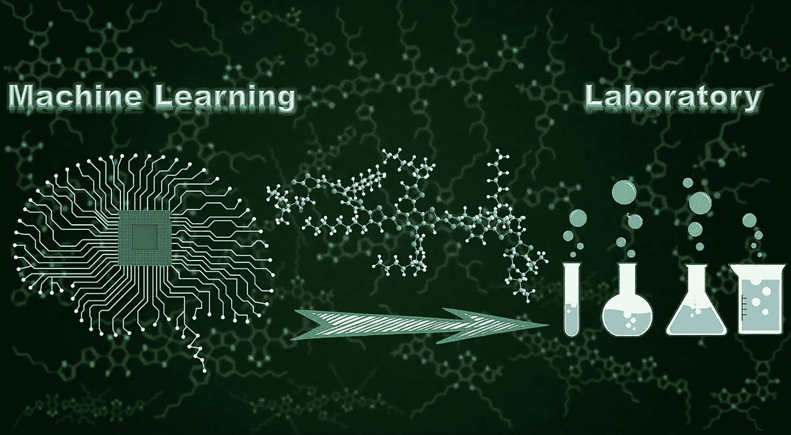

[https://phys.org/news/2019-11-machine-learning-assisted-molecular-high-performance-photovoltaic.html](https://phys.org/news/2019-11-machine-learning-assisted-molecular-high-performance-photovoltaic.html)

# 分子的从头设计

让我们从一个数字开始，清楚地了解我们的问题有多难。

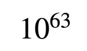

这是潜在药理活性分子的化学空间的估计大小，或者简单地说，看起来像药物的分子。相比之下，太阳中估计的原子数量只有 10 的 57 次方。

我们是如何得出这个估计的？辉瑞公司的药物化学家克里斯托弗·a·利平斯基设计了一种叫做“利平斯基五法则”的算法来评估特定分子的药物相似性。它的细节对于机器学习从业者来说太专业了，但我们可以将其理解为一种基于启发式的分类器，有助于排除大量潜在的非活性分子。此外，这些规则比 precision 具有更好的 w.r.t 召回性能，这意味着许多被过滤的分子仍然被认为是好的。

我们的目标是建立一个先导物库，里面装满了关于有效性或我们关心的其他特性的有前途的分子。知道了化学空间的大小，你就知道存储所有的化合物，而没有能力筛选和测试它们，是无用和浪费的。因此，我们必须训练一个生成模型来捕获所需的属性，并基于下游任务生成一小批属性。研究人员称之为从头设计，这意味着我们从零开始形成新的分子。

# 简化的分子输入行输入系统——SMILES 表示法

正如我在另一篇文章“[中介绍的，表示在机器学习中是如何工作的？](/@chengjing/how-does-representation-works-in-machine-learning-f01cb7213c2c)“机器学习由三部分组成:表示、评估、优化。在本文中，我们采用最流行的分子线符号:微笑表示法。

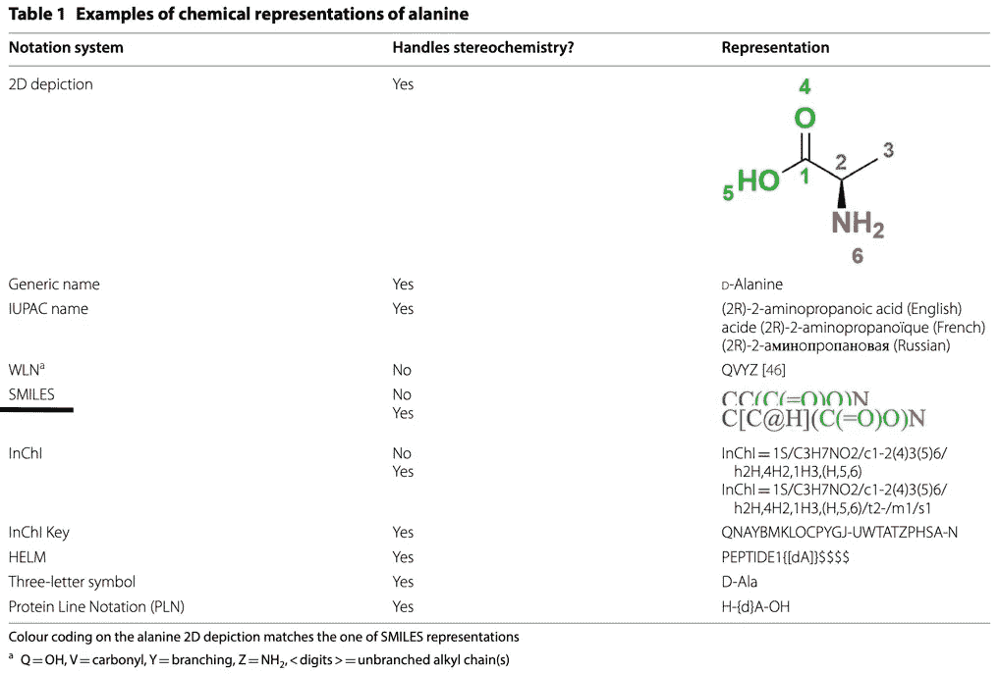

[https://jcheminf.biomedcentral.com/track/pdf/10.1186/s13321-020-00460-5.pdf](https://jcheminf.biomedcentral.com/track/pdf/10.1186/s13321-020-00460-5.pdf)

如上图所示，用颜色表示的微笑序列与右上角的图形表示成对出现。SMILES 表示法是不唯一且明确的，通过给分子中的每个原子分配一个数字，然后使用该顺序遍历分子图(通常是深度优先搜索)来获得。

SMILES 表示对于 ML 从业者来说是一个很好门槛，因为 NLP 工具和模型自然适用于他们。

# 实施变压器-VAE

该实现由三部分组成:数据准备、模型的主要架构和使模型出色的训练技巧。

**—数据集**

出于基准测试的原因，我们采用了论文“[分子集(MOSES):分子生成模型的基准测试平台](https://arxiv.org/pdf/1811.12823.pdf)”中使用的相同数据集。该数据集包含 1，936，963 个分子量在 250 至 350 道尔顿范围内的分子，可旋转键的数量不大于 7，XlogP 不大于 3.5。它包含 448854 个独特的[贝米斯-穆尔科](https://pubs.acs.org/doi/10.1021/jm9602928)支架和 58315 个独特的[金砖](https://www.researchgate.net/publication/23259096_On_the_Art_of_Compiling_and_Using_'Drug-Like'_Chemical_Fragment_Spaces)片段。正如 MOSES 论文作者所建议的，数据集被分成三个不相交的部分:训练(1，584，664 个分子)、测试(176，075 个分子)和支架测试(176，226 个分子)。支架测试集具有来自支架的随机子集的包含贝米斯-穆尔科支架的所有分子。因此，来自支架测试集的支架不同于训练集和测试集中的支架。我们使用支架测试分割来评估一个模型是否可以产生训练集中没有的新支架。测试集是数据集中剩余分子的随机子集。

**— VAE 及其原因**

该架构是基于注意力的变分自动编码器(VAE)模型。

让我们先从 VAE 开始，它来自于普通的自动编码器。自动编码器用于数据压缩或去噪。它让原始数据通过一个信息瓶颈，一个更低维度的层，然后尽可能地重构它。

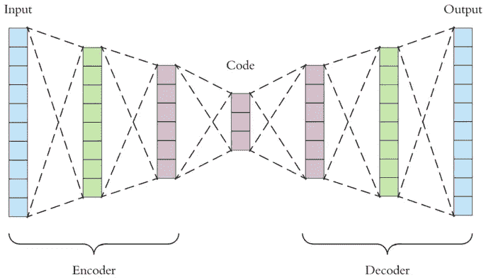

[https://towardsdatascience.com/applied-deep-learning-part-3-autoencoders-1c083af4d798](https://towardsdatascience.com/applied-deep-learning-part-3-autoencoders-1c083af4d798)

自动编码器由两部分组成:编码器和解码器。正如我们在上面的图片中看到的，当数据通过编码器时，随着信道的收缩，它们被迫以较少的特征来表示。直观上，通道越小，功能级别越高。这种技术是有损耗的，意味着数据丢失是不可避免的，目标之一是在瓶颈层包含更多有用的信息。另一方面，解码器将潜在空间中的特征映射回原始维度。在这种情况下，这是一对一的映射。

可变自动编码器以概率方式压缩数据。它不是将数据编码到一个点上，而是在潜在空间上进行分布。我们将编码器升级为识别模型，这允许它在潜在空间中组织数据，并将它认为相似的数据分组。

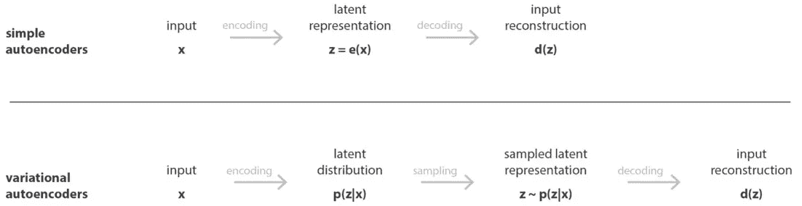

[https://towardsdatascience.com/understanding-variational-autoencoders-vaes-f70510919f73](https://towardsdatascience.com/understanding-variational-autoencoders-vaes-f70510919f73)

更专业的说，识别模型是 q_φ(z|x)，其中 x 和 z 指的是原始数据的空间和潜在空间数据。用φ表示这个推理模型的参数，也称为变分参数。我们优化变分参数φ，使得:

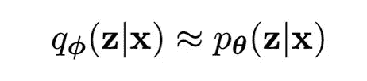

[https://arxiv.org/pdf/1906.02691.pdf](https://arxiv.org/pdf/1906.02691.pdf)

从论文“[变分自动编码器简介](https://arxiv.org/pdf/1906.02691.pdf)”中，我引用了如下图表:

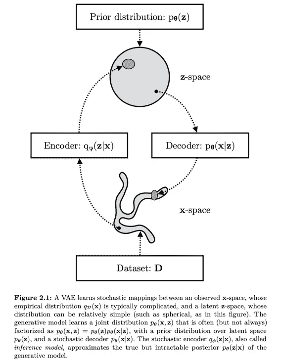

[https://arxiv.org/pdf/1906.02691.pdf](https://arxiv.org/pdf/1906.02691.pdf)

在损失函数方面，基于两个项来优化 VAE:重建损失和 KL 散度。前者衡量解码器如何将潜在特征映射回原始数据，而后者则限制您的编码器(识别模型)使用特定的分布。通常我们使用正态分布，因为我们的数据分布和标准正态分布之间的 KL 散度是一个分析答案。

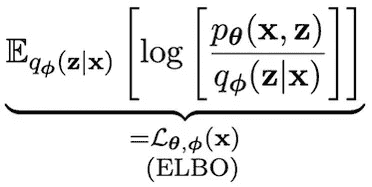

The objective for variational autoencoder

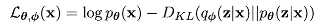

Construction loss on the left and KL divergence on the right

让我们回到分子设计的应用上来。VAE 模型将分子结构的表示(微笑序列)投射到一个密集的、连续的潜在空间。据来自华盛顿大学的[研究人员](https://pubs.rsc.org/en/content/articlepdf/2021/sc/d1sc01050f)描述，它具有以下特征:

*   它可以嵌入一种性质，从而作为分子结构和化学性质的联合概率分布的近似。
*   在训练期间，它会有意义地组织自己，以便相似的分子在相空间中彼此靠近。
*   由于其从离散数据到连续数据的映射，它可以用基于梯度的优化方法来导航。

**—变压器及原因**

如前所述，这个任务与 NLP 任务没有什么不同。因此，我们希望利用 NLP 领域目前最先进的模型:transformer。我们保留了 Google 在文章[中描述的 transformer 的原始架构，用于基准测试。Transformer NLP 模型的主要优点是它们不是顺序的，这意味着与 rnn 不同，它们可以更容易地并行化，并且可以通过并行化训练来训练越来越大的模型。此外，注意力机制更容易解释，这对于激励药物发现领域的科学进步是至关重要的。](https://arxiv.org/pdf/1706.03762.pdf)

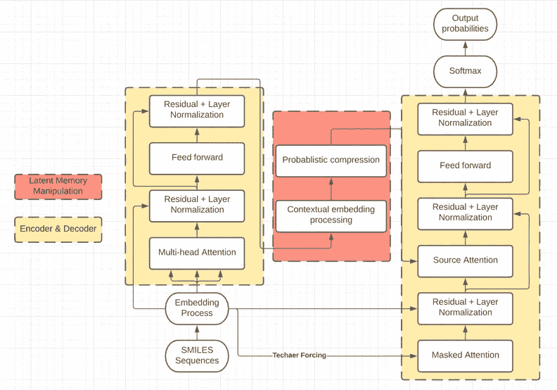

The workflow of our architecture

**—结果**

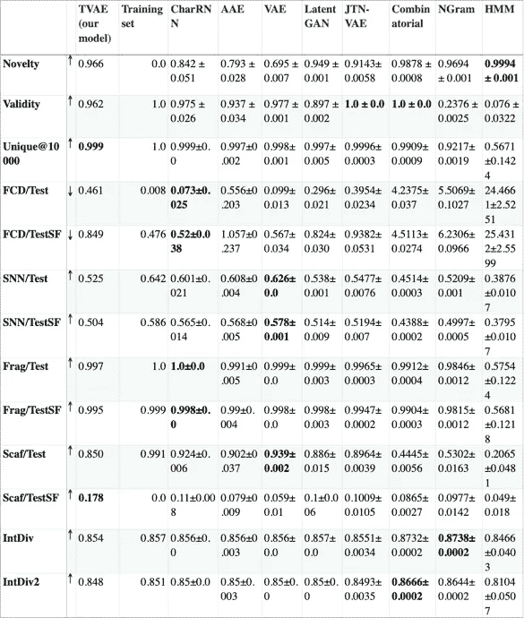

Our model flatting the SOTA performances

需要强调的是，**新颖性**、**有效性**和**唯一性**是工程方面最重要的指标。新颖性是生成的分子中不存在于训练集中的部分。新鲜感低说明过度拟合。有效性衡量模型捕捉显式化学约束(如适当的化合价)的能力。唯一性检查模型不会崩溃到只产生几个典型的分子。

因此，尽管在这三个指标中，我们只在独特性上领先，但我们的模型实际上是最全面的模型。特别是与传统的 VAE 模型相比，TVAE 在新颖性度量上表现出色 27%，这表明在过拟合问题上是一个更好的模型。

有什么不同？

注意机制和潜在记忆操作模块值得进一步研究。

注意机制被证明具有解析输入序列之间的相互关系的显著能力。NLP 任务中的词汇和生成长度通常比我们的任务大得多。

在潜在记忆操作模块中，我们采用了一种新的技术来处理基于注意的编码器产生的丰富的上下文嵌入，在潜在空间中保存了更多有用的信息。传统上，研究人员实施线性层来形成均值和对数方差向量。结果是，卷积层在这种情况下表现得更好。如[论文](https://pubs.rsc.org/en/content/articlepdf/2021/sc/d1sc01050f)所述，上下文嵌入更像是一张具有有意义的局部先验的图片，但没有进一步的实验。

(CNN 瓶颈工作流程的占位符)

此外，我实施了循环退火计划，以解决 KL 消失的问题。详细内容可以在我的另一篇文章中找到:“[VAE(变型自动编码器)](/@chengjing/a-must-have-training-trick-for-vae-variational-autoencoder-d28ff53b0023)的必备训练绝招”。

— — — — — — — — — — — — — — — — — — — — —

参考资料:

分子生成数据集:[https://tdcommons.ai/generation_tasks/molgen/](https://tdcommons.ai/generation_tasks/molgen/)

[https://blog . data iku . com/decoding-NLP-attention-mechanisms-to-understand-transformer-models](https://blog.dataiku.com/decoding-nlp-attention-mechanisms-to-understand-transformer-models)

 [## 分子集(MOSES):分子生成模型的基准平台

### 生成模型正在成为探索分子空间的首选工具。这些模型在一个大的…

arxiv.org](https://arxiv.org/abs/1811.12823)  [## 药物开发过程的阶段，药物发现过程|东北生物实验室

### 从美国联邦药品管理局(FDA)药物发现和药物时间表的逐步指南中学习…

www.nebiolab.com](https://www.nebiolab.com/drug-discovery-and-development-process/)  [## 化学空间-维基百科

### 化学空间是化学信息学中的一个概念，指的是所有可能的分子和物质所跨越的属性空间

en.wikipedia.org](https://en.wikipedia.org/wiki/Chemical_space)