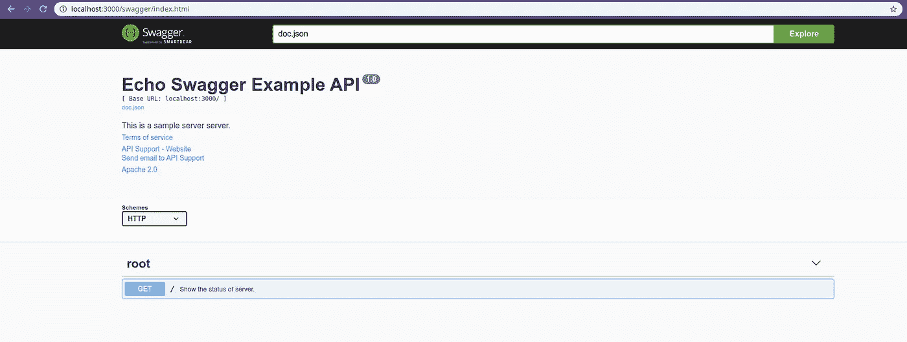

# 教程:为 Echo Go Web 框架生成 Swagger 规范和 SwaggerUI

> 原文：<https://medium.com/geekculture/tutorial-generate-swagger-specification-and-swaggerui-for-echo-go-web-framework-3ac33afc77e2?source=collection_archive---------0----------------------->

# 为什么选择 Echo Web Framework？

Echo 是最流行的围棋框架之一。 *Echo* 将自己定位为高性能和极简的 web 框架。用起来很简单。

# 为什么要 Swagger 规范？

编写规格说明书是软件工程中一个细致的过程。不管怎样，如果我们想让其他人使用我们的 API，这是必要的。它帮助其他人更轻松地集成没有 API 的组件。文档越好，其他人就越容易将它集成到他们的系统中。为了解决这个问题，我们应该遵循行业内创建 API 文档的标准化方式，即*OpenAPI 规范或*原名 Swagger 规范。

> OpenAPI 规范，以前被称为 Swagger 规范，是定义 RESTful 接口的世界标准。OAS 使开发人员能够设计一个技术不可知的 API 接口，该接口构成了他们的 API 开发和消费的基础。

# 先决条件

你需要在你的机器上安装 Go 版本≥1.12。

# 步伐

1.  为开发创建文件夹，我们将调用应用程序 *echosimple* 。

```
$ mkdir echosimple
$ mkdir docs
$ mkdir docs/echosimple
```

2.为 go 供应商系统初始化 go 模式。

```
$ go mod init
```

3.拉动*回显*库。

```
$ go get -v github.com/labstack/echo/v4
```

4.在 *echosimple* 文件夹中，创建一个新文件 *main.go* 并复制*下面的代码。*

```
**package** main

**import** (
   "net/http"

   "github.com/labstack/echo/v4"
   "github.com/labstack/echo/v4/middleware"
)

**func** main() {
   // Echo instance
   *e* := echo.New()

   // Middleware
   *e*.Use(middleware.Logger())
   *e*.Use(middleware.Recover())
   *e*.Use(middleware.CORS())

   // Routes
   *e*.GET("/", HealthCheck)

   // Start server
   *e*.**Logger**.Fatal(*e*.Start(":3000"))
}

**func** HealthCheck(*c* echo.Context) error {
   **return** *c*.JSON(http.*StatusOK*, **map**[string]**interface**{}{
      "data": "Server is up and running",
   })
}
```

5.运行应用程序。

```
$ go run echosimple/main.go
```

您应该会看到如下所示的输出。

```
 ____    __ 
  / __/___/ /  ___ 
 / _// __/ _ \/ _ \ 
/___/\__/_//_/\___/ v4.1.16 
High performance, minimalist Go web framework 
https://echo.labstack.com 
____________________________________O/_______ 
                                    O\ 
⇨ http server started on [::]:3000
```

这意味着我们的服务器在端口 3000 上启动并运行。

6.通过添加*声明性注释格式*来更新我们的 *main.go* 。这些注释将在以后自动生成 *Swagger 规格*。您可以使用参考资料中的链接了解更多关于*声明性注释格式*的信息。

```
**package** main

**import** (
   "net/http"

   "github.com/labstack/echo/v4"
   "github.com/labstack/echo/v4/middleware"
)

// @title Echo Swagger Example API
// @version 1.0
// @description This is a sample server server.
// @termsOfService http://swagger.io/terms/

// @contact.name API Support
// @contact.url http://www.swagger.io/support
// @contact.email support@swagger.io

// @license.name Apache 2.0
// @license.url http://www.apache.org/licenses/LICENSE-2.0.html

// @host localhost:3000
// @BasePath /
// @schemes http
**func** main() {
   // Echo instance
   *e* := echo.New()

   // Middleware
   *e*.Use(middleware.Logger())
   *e*.Use(middleware.Recover())
   *e*.Use(middleware.CORS())

   // Routes
   *e*.GET("/", HealthCheck)

   // Start server
   *e*.**Logger**.Fatal(*e*.Start(":3000"))
}

// HealthCheck godoc
// @Summary Show the status of server.
// @Description get the status of server.
// @Tags root
// @Accept */*
// @Produce json
// @Success 200 {object} map[string]interface{}
// @Router / [get]
**func** HealthCheck(*c* echo.Context) error {
   **return** *c*.JSON(http.*StatusOK*, **map**[string]**interface**{}{
      "data": "Server is up and running",
   })
}
```

7.拉招摇图书馆。

```
$ go get -v github.com/swaggo/swag/cmd/swag
$ go get -v github.com/swaggo/echo-swagger
```

8.生成*摆动规格*。

```
$ swag init -g echosimple/main.go --output docs/echosimple
```

如果操作成功，您应该在文件夹 *docs/echosimple 中看到 3 个新文件。这些文件是:*

*   *docs.go* = >需要生成*swaggeri*。
*   *Swagger . JSON*=>*Swagger 规范*中的 *json* 文件格式。
*   *Swagger . YAML*=>*中的*Swagger 规范 *yaml* 文件格式。

如果您使用[*Confluence*](https://www.atlassian.com/software/confluence)*来分发您的文档，您可以在[*Confluence*](https://www.atlassian.com/software/confluence)*中创建一个新文件，并选择添加 OpenAPI 规范。然后复制粘贴 *swagger.yaml* 内容在里面。**

**9.更新 *main.go 到*添加*swaggeri。***

```
****package** main

**import** (
   "net/http"

   "github.com/labstack/echo/v4"
   "github.com/labstack/echo/v4/middleware"
   _ "github.com/rizalgowandy/go-swag-sample/docs/echosimple" // ***you need to update github.com/rizalgowandy/go-swag-sample with your own project path***
   echoSwagger "github.com/swaggo/echo-swagger"
)

// @title Echo Swagger Example API
// @version 1.0
// @description This is a sample server server.
// @termsOfService http://swagger.io/terms/

// @contact.name API Support
// @contact.url http://www.swagger.io/support
// @contact.email support@swagger.io

// @license.name Apache 2.0
// @license.url http://www.apache.org/licenses/LICENSE-2.0.html

// @host localhost:3000
// @BasePath /
// @schemes http
**func** main() {
   // Echo instance
   *e* := echo.New()

   // Middleware
   *e*.Use(middleware.Logger())
   *e*.Use(middleware.Recover())
   *e*.Use(middleware.CORS())

   // Routes
   *e*.GET("/", HealthCheck)
   *e*.GET("/swagger/*", echoSwagger.**WrapHandler**)

   // Start server
   *e*.**Logger**.Fatal(*e*.Start(":3000"))
}

// HealthCheck godoc
// @Summary Show the status of server.
// @Description get the status of server.
// @Tags root
// @Accept */*
// @Produce json
// @Success 200 {object} map[string]interface{}
// @Router / [get]
**func** HealthCheck(*c* echo.Context) error {
   **return** *c*.JSON(http.*StatusOK*, **map**[string]**interface**{}{
      "data": "Server is up and running",
   })
}**
```

**如你所见，我们在*主页上添加了两个重要的东西***

*   ***swaggeri*的新路线。**

```
***e*.GET("/swagger/*", echoSwagger.**WrapHandler**)**
```

*   **新导入生成的 *docs.go* 和 *swag* 库。不要忘记用你的项目路径替换 github.com/rizalgowandy/go-swag-sample 路径。**

```
**import (
   ...
   _ "github.com/rizalgowandy/go-swag-sample/docs/echosimple" // ***you need to update github.com/rizalgowandy/go-swag-sample with your own project path***
   echoSwagger "github.com/swaggo/echo-swagger"
   ...
)**
```

**10.最后，再次运行应用程序。**

```
**$ go run echosimple/main.go**
```

**11.现在尝试，调用新添加的路由。**

```
**$ curl localhost:3000/swagger/doc.json**
```

**您应该会看到如下输出。**

```
**{ 
    "schemes": ["http"], 
    "swagger": "2.0", 
    "info": { 
        "description": "This is a sample server server.", 
        "title": "Echo Swagger Example API", 
        "termsOfService": "http://swagger.io/terms/", 
        "contact": { 
            "name": "API Support", 
            "url": "http://www.swagger.io/support", 
            "email": "support@swagger.io" 
        }, 
        "license": { 
            "name": "Apache 2.0", 
            "url": "http://www.apache.org/licenses/LICENSE-2.0.html" 
        }, 
        "version": "1.0" 
    }, 
    "host": "localhost:3000", 
    "basePath": "/", 
    "paths": { 
        "/": { 
            "get": { 
                "description": "get the status of server.", 
                "consumes": [ 
                    "*/*" 
                ], 
                "produces": [ 
                    "application/json" 
                ], 
                "tags": [ 
                    "root" 
                ], 
                "summary": "Show the status of server.", 
                "responses": { 
                    "200": { 
                        "description": "OK", 
                        "schema": { 
                            "type": "object", 
                            "additionalProperties": true 
                        } 
                    } 
                } 
            } 
        } 
    } 
}**
```

**12.使用此 URL 在浏览器中打开 SwaggerUI。**

```
**[http://localhost:3000/swagger/index.html](http://localhost:3000/swagger/index.html)**
```

**您应该会看到如下输出。**

****

**瞧，我们完成了。我们使用 *Echo* 框架成功创建了一个简单的 Go web 服务器，并生成了**Swagger 规范*和 *SwaggerUI* 。***

# **参考**

*   ****来源:**[https://github.com/rizalgowandy/go-swag-sample](https://github.com/rizalgowandy/go-swag-sample)**
*   ****声明式评论格式:**[https://github.com/swaggo/swag#declarative-comments-format](https://github.com/swaggo/swag#declarative-comments-format)**