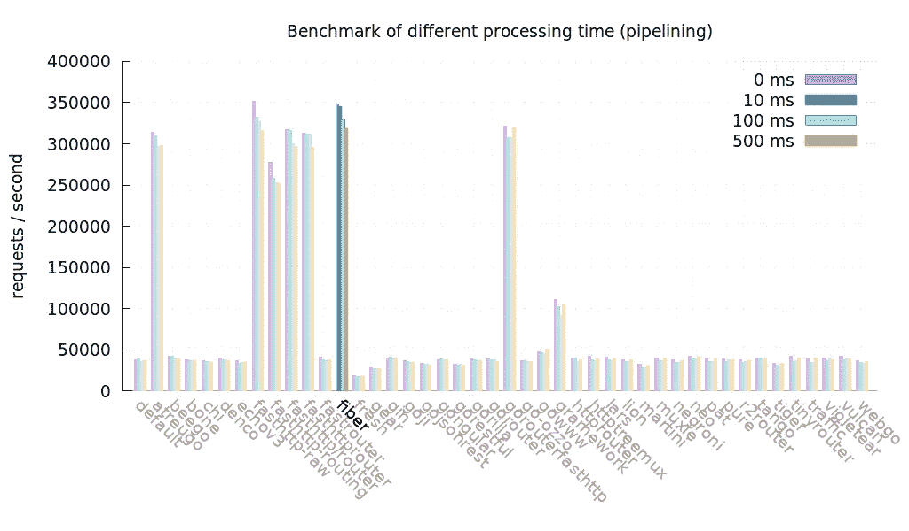
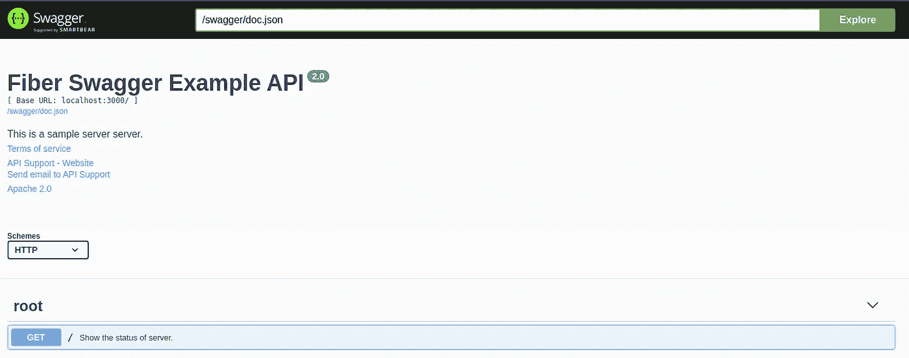

# 教程:为 Go Fiber Web 框架生成 Swagger 规范和 SwaggerUI

> 原文：<https://medium.com/geekculture/tutorial-generate-swagger-specification-and-swaggerui-for-go-fiber-web-framework-6c787d1672de?source=collection_archive---------1----------------------->

# 为什么选择 Fiber Web 框架？

*纤维*人气排名呈上升趋势。根据最新的基准测试，它比 *Echo 要快得多。*与 *Echo、*最大的不同在于它使用了 *fasthttp* 路由器而不是 *net/http* 。



Go Framework Benchmark

上面的基准图意味着值越高越好。这意味着我们的 HTTP 路由器每秒可以处理更多的请求。*光纤*基本上比*回声*快得多。

# 为什么要 Swagger 规范？

编写规格说明书是软件工程中一个细致的过程。不管怎样，如果我们想让其他人使用我们的 API，这是必要的。它帮助其他人更轻松地集成没有 API 的组件。文档越好，其他人就越容易将它集成到他们的系统中。为了解决这个问题，我们应该遵循行业内创建 API 文档的标准化方式，即*OpenAPI 规范或*原名 Swagger 规范。

> OpenAPI 规范，以前被称为 Swagger 规范，是定义 RESTful 接口的世界标准。OAS 使开发人员能够设计一个技术不可知的 API 接口，该接口构成了他们的 API 开发和消费的基础。

# 先决条件

你需要在你的机器上安装 Go 版本≥1.14。

# 步伐

1.  为开发创建文件夹，我们将调用应用程序 *fibersimple* 。

```
$ mkdir fibersimple
$ mkdir docs
$ mkdir docs/fibersimple
```

2.为 go 供应商系统初始化 go 模式。

```
$ go mod init
```

3.拉动*光纤*库。

```
$ go get -u github.com/gofiber/fiber/v2
```

4.在 *fibersimple* 文件夹中，创建一个新文件 *main.go* 并复制*下面的代码。*

```
**package** main

**import** (
   "github.com/gofiber/fiber/v2/middleware/recover"
   "github.com/gofiber/fiber/v2/middleware/cors"
   "github.com/gofiber/fiber/v2"
   "log"
)

**func** main() {
   // Fiber instance
   *app* := fiber.New()

   // Middleware
   *app*.Use(recover.New())
   *app*.Use(cors.New())

   // Routes
   *app*.Get("/", HealthCheck)

   // Start Server
   **if** *err* := *app*.Listen(":3000"); *err* != **nil** {
      log.Fatal(*err*)
   }
}

**func** HealthCheck(*c* *fiber.Ctx) error {
   *res* := **map**[string]**interface**{}{
      "data": "Server is up and running",
   }

   **if** *err* := *c*.JSON(*res*); *err* != **nil** {
      **return** *err* }

   **return nil** }
```

5.运行应用程序。

```
$ go run fibersimple/main.go
```

您应该会看到如下所示的输出。

```
 ┌───────────────────────────────────────────────────┐  
 │                    Fiber v2.7.1                   │                                                                                 
 │               http://127.0.0.1:3000               │                                                                                 
 │       (bound on host 0.0.0.0 and port 3000)       │                                                                                 
 │                                                   │                                                                                 
 │ Handlers ............. 3  Processes ........... 1 │                                                                                 
 │ Prefork ....... Disabled  PID ............. 36364 │                                                                                 
 └───────────────────────────────────────────────────┘
```

这意味着我们的服务器在端口 3000 上启动并运行。

6.通过添加*声明性注释格式*来更新我们的 *main.go* 。这些注释将在以后自动生成 *Swagger 规范*。您可以使用参考资料中的链接了解更多关于*声明性注释格式*的信息。

```
**package** main

**import** (
   "github.com/gofiber/fiber/v2/middleware/recover"
   "github.com/gofiber/fiber/v2/middleware/cors"
   "github.com/gofiber/fiber/v2"
   "log"
)

// @title Fiber Swagger Example API
// @version 2.0
// @description This is a sample server server.
// @termsOfService http://swagger.io/terms/

// @contact.name API Support
// @contact.url http://www.swagger.io/support
// @contact.email support@swagger.io

// @license.name Apache 2.0
// @license.url http://www.apache.org/licenses/LICENSE-2.0.html

// @host localhost:3000
// @BasePath /
// @schemes http
**func** main() {
   // Fiber instance
   *app* := fiber.New()

   // Middleware
   *app*.Use(recover.New())
   *app*.Use(cors.New())

   // Routes
   *app*.Get("/", HealthCheck)

   // Start Server
   **if** *err* := *app*.Listen(":3000"); *err* != **nil** {
      log.Fatal(*err*)
   }
}

// HealthCheck godoc
// @Summary Show the status of server.
// @Description get the status of server.
// @Tags root
// @Accept */*
// @Produce json
// @Success 200 {object} map[string]interface{}
// @Router / [get]
**func** HealthCheck(*c* *fiber.Ctx) error {
   *res* := **map**[string]**interface**{}{
      "data": "Server is up and running",
   }

   **if** *err* := *c*.JSON(*res*); *err* != **nil** {
      **return** *err* }

   **return nil** }
```

7.拉招摇图书馆。

```
$ go get -v github.com/swaggo/swag/cmd/swag
$ go get -u github.com/arsmn/fiber-swagger/v2
$ go mod vendor -v
```

8.生成*摆动规格*。

```
$ swag init -g fibersimple/main.go --output docs/fibersimple
```

如果操作成功，您应该在文件夹 *docs/fibersimple 中看到 3 个新文件。*这些文件是:

*   *docs.go* = >需要生成*swaggeri*。
*   *Swagger . JSON*=>*Swagger 规范*中的 *json* 文件格式。
*   *Swagger . YAML*=>*Swagger 规范*中的 *yaml* 文件格式。

如果您使用[*Confluence*](https://www.atlassian.com/software/confluence)*来分发您的文档，您可以在[*Confluence*](https://www.atlassian.com/software/confluence)*中创建一个新文件，并选择添加 OpenAPI 规范。然后复制粘贴 *swagger.yaml* 内容在里面。**

**9.更新*main . go to*add*swaggeri。***

```
****package** main**import** (
   "github.com/gofiber/fiber/v2/middleware/recover"
   "github.com/gofiber/fiber/v2/middleware/cors"
   "github.com/gofiber/fiber/v2"
   "log"
   _ "github.com/rizalgowandy/go-swag-sample/docs/fibersimple" **// you need to update github.com/rizalgowandy/go-swag-sample with your own project path**
   swagger "github.com/arsmn/fiber-swagger/v2"
)

// @title Fiber Swagger Example API
// @version 2.0
// @description This is a sample server server.
// @termsOfService http://swagger.io/terms/

// @contact.name API Support
// @contact.url http://www.swagger.io/support
// @contact.email support@swagger.io

// @license.name Apache 2.0
// @license.url http://www.apache.org/licenses/LICENSE-2.0.html

// @host localhost:3000
// @BasePath /
// @schemes http
**func** main() {
   // Fiber instance
   *app* := fiber.New()

   // Middleware
   *app*.Use(recover.New())
   *app*.Use(cors.New())

   // Routes
   *app*.Get("/", HealthCheck)
   *app*.Get("/swagger/*", swagger.Handler) // default

   // Start Server
   **if** *err* := *app*.Listen(":3000"); *err* != **nil** {
      log.Fatal(*err*)
   }
}

// HealthCheck godoc
// @Summary Show the status of server.
// @Description get the status of server.
// @Tags root
// @Accept */*
// @Produce json
// @Success 200 {object} map[string]interface{}
// @Router / [get]
**func** HealthCheck(*c* *fiber.Ctx) error {
   *res* := **map**[string]**interface**{}{
      "data": "Server is up and running",
   }

   **if** *err* := *c*.JSON(*res*); *err* != **nil** {
      **return** *err* }

   **return nil** }**
```

**如你所见，我们在 *main.go.* 中添加了两个重要的东西**

*   **斯瓦格瑞的新路线。**

```
**app.Get("/swagger/*", swagger.Handler) // default**
```

*   **新导入生成的 *docs.go* 和 *swag* 库。不要忘记用你的项目路径替换 github.com/rizalgowandy/go-swag-sample 路径。**

```
**import (
   ...
   _ "github.com/rizalgowandy/go-swag-sample/docs/fibersimple" **// you need to update github.com/rizalgowandy/go-swag-sample with your own project path**
   swagger "github.com/arsmn/fiber-swagger/v2"
)**
```

**10.最后，再次运行 app。**

```
**$ go mod vendor -v
$ go run fibersimple/main.go**
```

**11.现在尝试，调用新添加的路由。**

```
**$ curl localhost:3000/swagger/doc.json**
```

**您应该会看到如下输出。**

```
**{
  "schemes": [
    "http"
  ],
  "swagger": "2.0",
  "info": {
    "description": "This is a sample server server.",
    "title": "Fiber Swagger Example API",
    "termsOfService": "[http://swagger.io/terms/](http://swagger.io/terms/)",
    "contact": {
      "name": "API Support",
      "url": "[http://www.swagger.io/support](http://www.swagger.io/support)",
      "email": "[support@swagger.io](mailto:support@swagger.io)"
    },
    "license": {
      "name": "Apache 2.0",
      "url": "[http://www.apache.org/licenses/LICENSE-2.0.html](http://www.apache.org/licenses/LICENSE-2.0.html)"
    },
    "version": "2.0"
  },
  "host": "localhost:3000",
  "basePath": "/",
  "paths": {
    "/": {
      "get": {
        "description": "get the status of server.",
        "consumes": [
          "*/*"
        ],
        "produces": [
          "application/json"
        ],
        "tags": [
          "root"
        ],
        "summary": "Show the status of server.",
        "responses": {
          "200": {
            "description": "OK",
            "schema": {
              "type": "object",
              "additionalProperties": true
            }
          }
        }
      }
    }
  }
}**
```

**12.使用此 URL 在浏览器中打开 SwaggerUI。**

```
**[http://localhost:3000/swagger/index.html](http://localhost:3000/swagger/index.html)**
```

**您应该会看到如下输出。**

****

**瞧，我们完成了。我们使用*纤程*框架成功创建了一个简单的 Go web 服务器，并生成了**Swagger 规范*和 *SwaggerUI* 。***

# **参考**

*   ****来源:**[https://github.com/rizalgowandy/go-swag-sample](https://github.com/rizalgowandy/go-swag-sample)**
*   **【https://github.com/swaggo/swag#declarative-comments-format】声明式评论格式: [声明式评论](https://github.com/swaggo/swag#declarative-comments-format)**