# 教程——如何从 R 中的矢量开始创建数据帧？

> 原文：<https://medium.com/geekculture/tutorial-how-to-create-a-dataframe-from-vectors-in-r-from-scratch-680d69731ff8?source=collection_archive---------29----------------------->

## 了解如何在 R 中创建数据框并将其导出为 CSV 格式！

Photo by [Fotis Fotopoulos](https://unsplash.com/@ffstop?utm_source=unsplash&utm_medium=referral&utm_content=creditCopyText) on [Unsplash](https://unsplash.com/s/photos/programming?utm_source=unsplash&utm_medium=referral&utm_content=creditCopyText)

当涉及到统计计算和数据挖掘时，r 是许多统计学家和数据科学家的首选。r 是一种专门用于统计计算和可视化的编程语言。它是由新西兰奥克兰大学的 Ross Ihaka 和 Robert Gentleman 于 1995 年发明的，其中“R”这个名字来源于他们名字的第一个字母。r 是免费的开源软件，可以在所有主要平台上运行。

r 是一种面向对象的编程语言，它有各种运算符和函数，允许用户收集、探索、分析和可视化数据。r 主要关注它的统计和图形能力。当您学习数据科学的 R 时，您将学习如何使用该语言来执行统计分析和开发令人惊叹的数据可视化。r 的统计功能也让用户可以轻松地清理、导入和分析数据。

[Image Source](https://blog.rstudio.com/2019/12/17/r-vs-python-what-s-the-best-for-language-for-data-science/)

在本教程中，我们将使用 R 编程语言从头开始创建一个数据帧。我将使用与上一篇文章相同的数据集。你可以在这里阅读那篇文章。这是我们数据的样子—

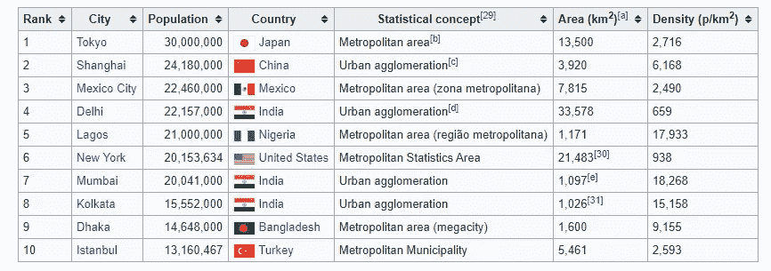

Source — [Wikipedia](https://en.wikipedia.org/wiki/Demographics_of_the_world)

# 什么是 Dataframe？

*Dataframe* 是一个保存字母数字值的二维表格。在数据帧中，每一列包含一个变量的值，每一行包含每一列的值。数据帧可以存储数字数据、字符数据或因子类型数据。

# R 中的向量是什么？

向量是 r 中最基本和最简单的数据结构。一个*向量*被定义为具有相同数据类型的数据序列。在 R 中，可以使用 ***c()*** 函数创建一个向量。 *c()* 函数代表*连接*。它不会创建向量，只是将它们组合起来。r 向量用于保存相同数据类型的多个数据值，类似于 C 语言中的数组。有几种类型的载体—

1.  数字向量
2.  整型向量
3.  字符向量
4.  逻辑向量
5.  因素向量
6.  日期时间向量

数据帧中的每一列必须包含相同数据类型的相同数量的数据元素。数据帧可以从 R 中的向量转换而来。要使用向量创建 R 中的数据帧，我们首先将创建一系列包含数据的多个向量。 ***data.frame()*** 函数用于从 r 中的矢量创建一个数据帧

首先，我们将创建多个名为等级、城市、人口、国家、统计概念、平方公里面积和平方公里人口密度的向量，如下所示

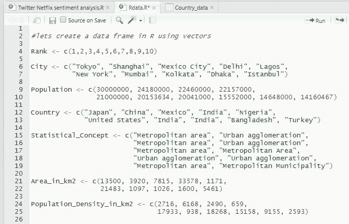

Image by Author

现在，我们将使用以下命令组合所有向量并创建一个数据帧。默认情况下，R 编程语言在直接使用 data.frame()创建 dataframe 时会将字符(字符串)转换为因子。因此，为了避免这种情况并更有效地存储数据，我们使用了***stringsAsFactors()***参数，将其保持为 **FALSE** 。

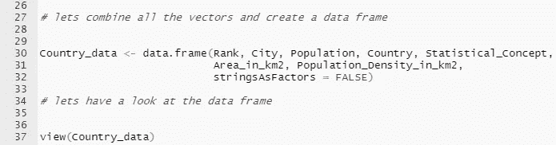

Image by Author

**您将获得如下输出—**

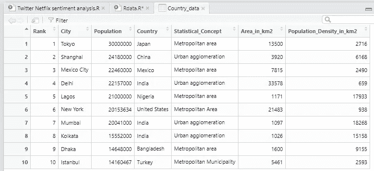

Image by Author

## 获取数据帧的结构—

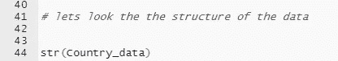

Image by Author

**您将获得如下输出。在这里，我们可以看到所有的对象和变量都根据它们的数据类型被正确标记。**

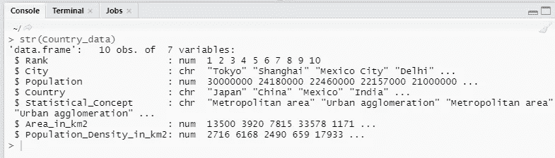

Image by Author

## 让我们检查一下数据框架的概要—

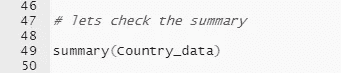

Image by Author

**您将获得如下输出—**

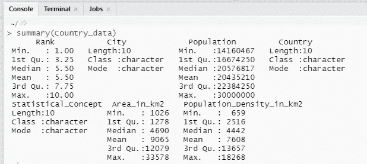

Image by Author

## 现在，我们将使用以下命令添加一个名为 Continent 的新列来扩展我们的数据框架—

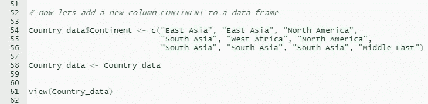

Image by Author

**您将获得如下输出—**

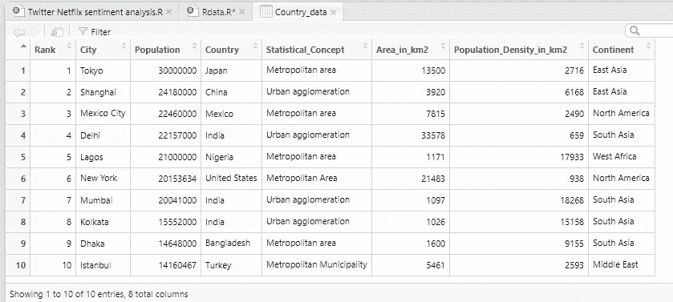

Image by Author

## 让我们检查新创建的列的类—

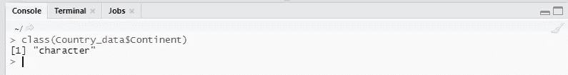

Image by Author

## 让我们将数据帧导出为 CSV 格式—

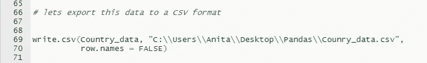

Image by Author

# 结论—

在这篇文章中，我们学习了如何从 r 中的向量创建数据帧。如果你喜欢我的文章或者对我有任何建议，请在下面评论让我知道。

*谢谢！*