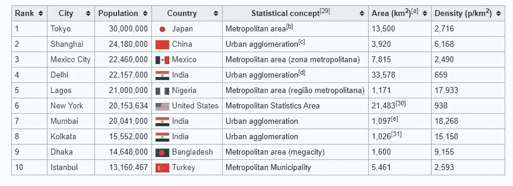
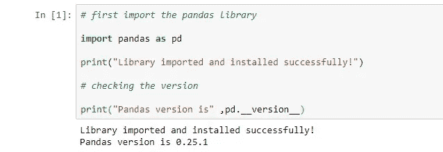
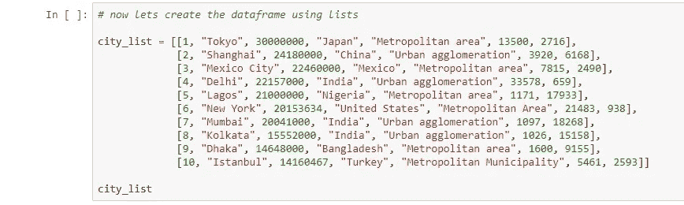
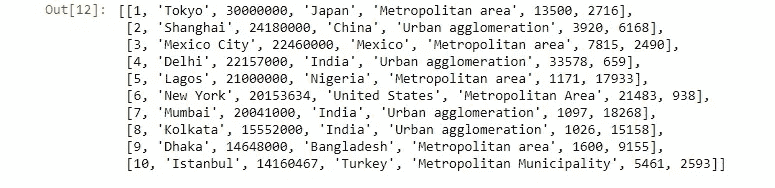
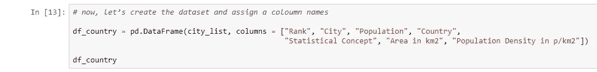
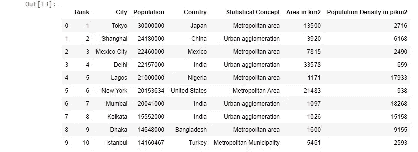
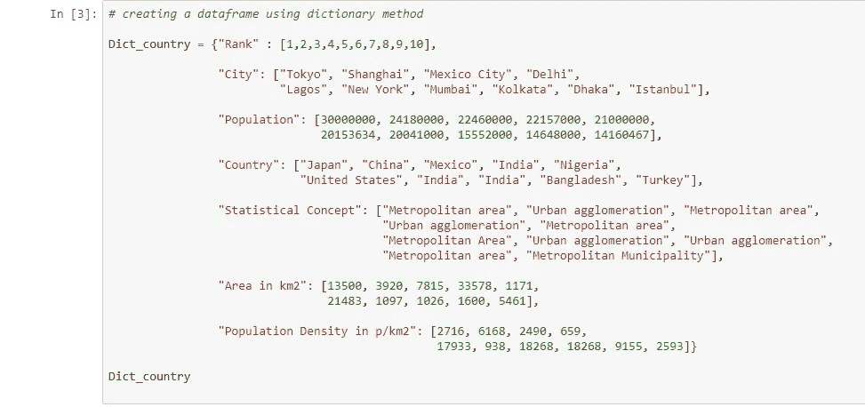
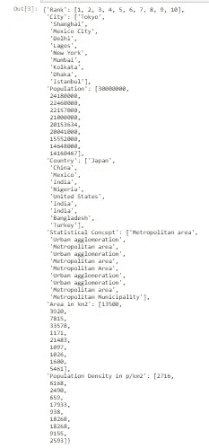
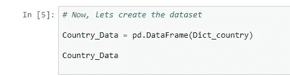
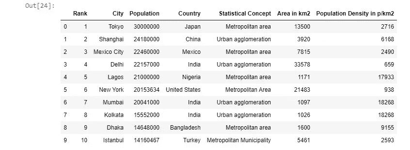

# 教程——如何在 Pandas 中从头开始创建数据帧？

> 原文：<https://medium.com/geekculture/tutorial-how-to-create-a-dataframe-in-pandas-from-scratch-196ef858bcad?source=collection_archive---------17----------------------->

## 了解如何创建数据帧并将其导出为 CSV 格式！

Photo by [Dmitry Ratushny](https://unsplash.com/@ratushny?utm_source=unsplash&utm_medium=referral&utm_content=creditCopyText) on [Unsplash](https://unsplash.com/s/photos/learning?utm_source=unsplash&utm_medium=referral&utm_content=creditCopyText)

谈到数据科学和机器学习，Python 是许多数据科学家的首选。它是一种高级通用编程语言，具有广泛的功能，包括*自动化*、*数据分析*、*数据库*、*机器学习*、*科学计算*、*网页抓取*、*图像处理*等等。它是一种开源的免费使用的语言，可以在所有主流操作系统上轻松运行。

Photo by [Christina Morillo](https://www.pexels.com/@divinetechygirl?utm_content=attributionCopyText&utm_medium=referral&utm_source=pexels) from [Pexels](https://www.pexels.com/photo/python-book-1181671/?utm_content=attributionCopyText&utm_medium=referral&utm_source=pexels)

Python 有数百个内置的库和框架来执行数据科学、机器学习和大数据的复杂任务。这些库包括*熊猫*、 *Numpy* 、 *Matplotlib* 、 *SciPy* 、 *Seaborn* 等等。今天我们就来讨论一个最受欢迎的库， ***熊猫*** 。Pandas 是一个非常受欢迎的库，用于数据操作和分析。

Photo by [Stone Wang](https://unsplash.com/@stonewyq?utm_source=unsplash&utm_medium=referral&utm_content=creditCopyText) on [Unsplash](https://unsplash.com/s/photos/giant-panda?utm_source=unsplash&utm_medium=referral&utm_content=creditCopyText)

在本教程中，我们将使用*熊猫*从头开始创建一个数据帧。Pandas 是一个为 Python 编程语言编写的开源免费软件库，用于执行有效、快速和可靠的数据科学任务。它有几个在数据结构和不同格式之间读写数据的工具。熊猫处理数据中缺失的值，并以有序的形式操纵混乱的数据。你可以在这里阅读更多关于熊猫的信息。

Photo by [Eva Elijas](https://www.pexels.com/@eva-elijas?utm_content=attributionCopyText&utm_medium=referral&utm_source=pexels) from [Pexels](https://www.pexels.com/photo/light-people-art-dark-6068493/?utm_content=attributionCopyText&utm_medium=referral&utm_source=pexels)

我们将在 **Jupyter 笔记本**中学习如何创建熊猫数据框。我们今天使用的数据显示了各大洲排名前 10 位的大都市及其人口、国家、面积和其他详细信息。这是我们数据的样子—

Source — [Wikipedia](https://en.wikipedia.org/wiki/Demographics_of_the_world)

有两种创建熊猫数据框的方法

1.  *使用列表和 pd 列表。DataFrame()*
2.  *使用字典和 pd。DataFrame()*

为了开始使用 Pandas，我们将简单地使用别名 ***pd*** 导入 Pandas 库，并使用以下命令检查版本

Image by Author

**首先，我们将使用列表列表和 pd 创建一个数据帧。DataFrame()。**

Image by Author

**您将得到如下输出:——**

Image by Author

**现在，让我们使用 pd 创建数据帧。数据帧:——**

Image by Author

**您将得到如下输出—**

Image by Author

**现在，让我们使用字典方法创建一个数据帧—**

Image by Author

**您将得到如下输出—**

Image by Author

**现在，让我们创建数据集—**

Image by Author

**您将得到如下输出—**

Image By Author

**现在让我们将这个数据帧导入到 CSV 格式—**

Image By Author

# 结论—

在本文中，我们学习了如何使用 Pandas 库创建数据帧。如果你喜欢我的文章或者对我有什么建议，请在下面评论让我知道。

*谢谢！*