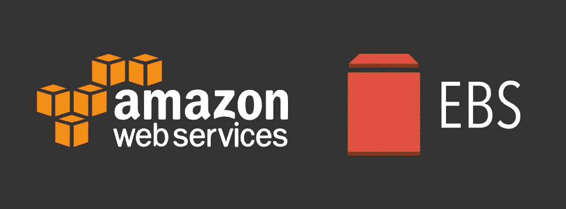

# 教程:如何不停机扩展 AWS EBS 卷

> 原文：<https://medium.com/geekculture/tutorial-how-to-extend-aws-ebs-volumes-with-no-downtime-ec7d9e82426e?source=collection_archive---------0----------------------->

这可以在您需要扩展 EBS 卷大小时应用，以避免停止实例和分离卷。

如果你需要在 prod 上做的话很酷，对吗？:)

要扩展卷大小，请执行以下简单步骤:

1.  登录您的 AWS 控制台
2.  从服务列表中选择“EC2”