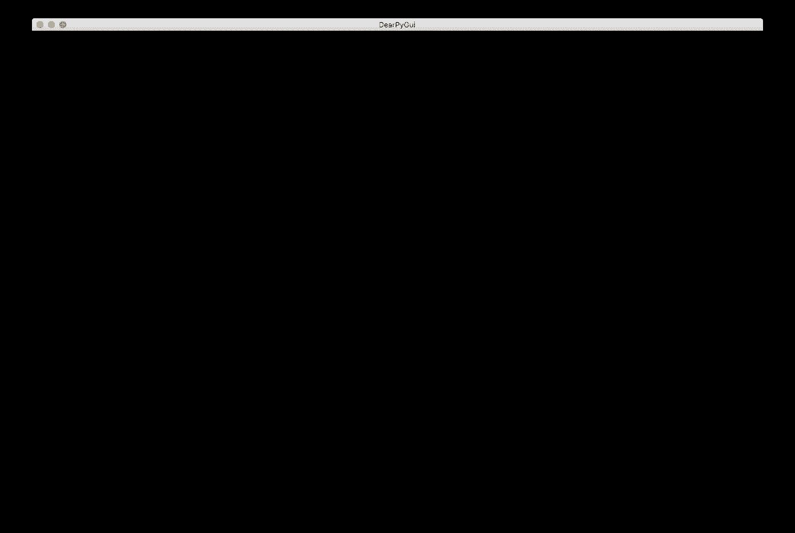
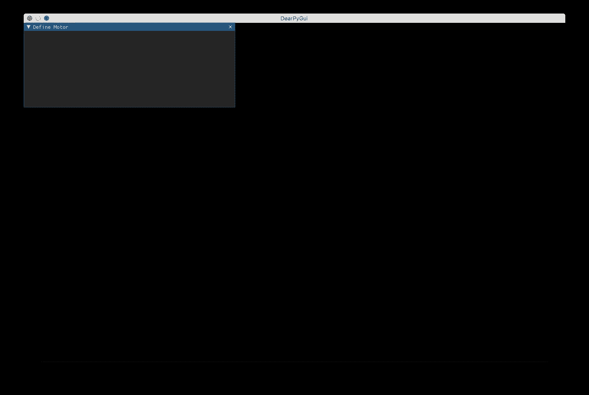
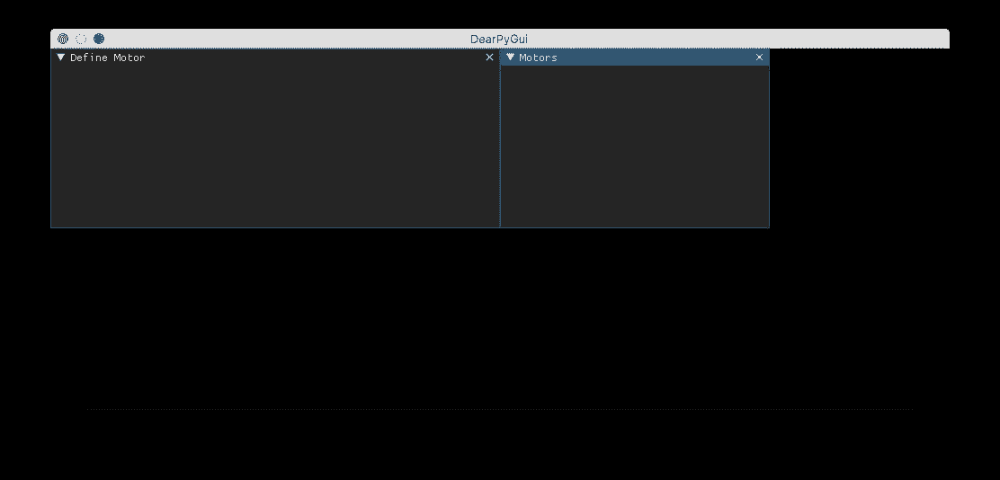
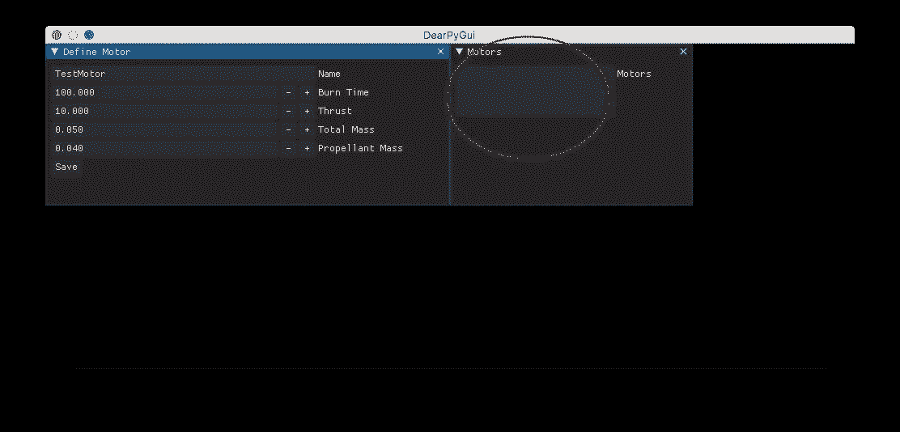
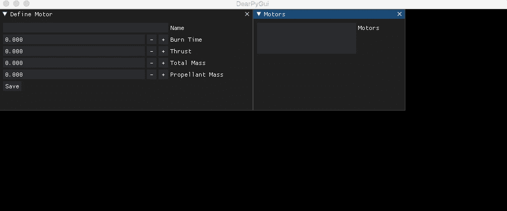
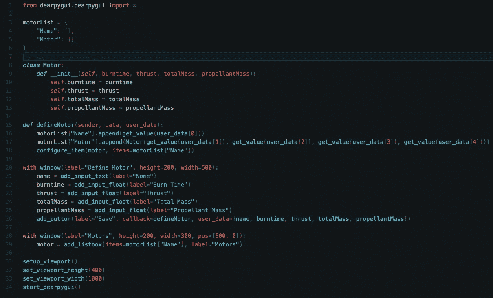

# 使用 DearPyGUI(0.8)的 Python GUI 教程—第 1 部分

> 原文：<https://medium.com/geekculture/tutorial-on-gui-with-python-using-dearpygui-0-8-41c25bae3fc9?source=collection_archive---------2----------------------->


[source](https://github.com/hoffstadt/DearPyGui/wiki)

大家好！今天我要讲的是 python 中的一个库，你可以用它来轻松制作看起来很酷的 GUI。我要讲的这个库叫做 DearPyGui。这是一个简单而强大的库，具有多种特性。所以让我们开始吧。

# 装置

```
pip install dearpygui
```

就这么简单。如果您使用 Mac，默认情况下会安装 python 2，因此您可能希望键入“pip3 install dearpygui”。或者，如果您有多个版本的 python 3，那么您可以通过键入“pip3.x install dearpygui”来指定您想要安装的版本。

# 介绍

如果你读过我以前的博客，那么你可能知道我是一个火箭爱好者。我将给出一个定义火箭发动机的应用示例。一旦掌握了基础知识，就可以很容易地修改代码。我要做一个简单的程序，你可以用它来定义一个火箭发动机。然后你可以用列表的方式展示它们。这将使您获得 dearpygui 的基础知识，之后文档将变得更有意义。我使用的版本号是 0.8.41。所以让我们开始吧。

# 使用

让我们从运行以下代码开始:

```
from dearpygui.dearpygui import *setup_viewport()
start_dearpygui()
```

这将产生如下窗口:



该窗口称为视口。在这上面你会有你所有的部件。可以使用 set_viewport_height()和 set_viewport_width()来更改视口的大小。它们都将接受一个整数作为输入。

首先，让我们创建一个非常简单的类来定义电机:

```
*class* Motor:
    *def* __init__(*self*, burntime, thrust, totalMass, propellantMass):
        *self*.burntime = burntime
        *self*.thrust = thrust
        *self*.totalMass = totalMass
        *self*.propellantMass = propellantMass
```

我将定义一个保存电机数据的字典:

```
motorList = {
    "Name": [],
    "Motor": []
}
```

肯定有更简洁的方法来做到这一点。例如，定义的名称可以是键，值可以是马达对象。或者我也可以简单地包含一个自我命名的属性。但这也很好。

让我们定义输入窗口:

```
with window(label="Define Motor", height=200, width=500):
    pass
```

让我们运行这个:



如您所见，小部件标题是标签参数，高度和宽度是相应设置的。让我们改变视窗的高度和宽度，并在原来的视窗旁边再增加一个视窗。

```
with window(label="Motors", height=200, width=300, pos=[500, 0]):
    passsetup_viewport()
set_viewport_height(400)
set_viewport_width(1000)
start_dearpygui()
```

输出:



让我们在第一个窗口中添加输入字段:

```
with window(label="Define Motor", height=200, width=500):
    name = add_input_text(label="Name")
    burntime = add_input_float(label="Burn Time")
    thrust = add_input_float(label="Thrust")
    totalMass = add_input_float(label="Total Mass")
    propellantMass = add_input_float(label="Propellant Mass")
    add_button(label="Save", callback=defineMotor, user_data=[name,
               burntime, thrust, totalMass, propellantMass])
```

“name = add _ input _ text(label = " Name ")”会将该小部件的惟一 id 存储在变量“Name”中，这样我们就可以从代码中的任何地方访问该小部件。其他人也是如此。add_button 中的 callback 参数采用一个函数的名称，这个函数将在您每次按下按钮时执行。“user_data”是每次按钮被按下时你要给它的输入。我们还没有定义函数，所以让我们这样做:

```
*def* defineMotor(sender, data, user_data):
    motorList["Name"].append(get_value(user_data[0]))
    motorList["Motor"].append(Motor(get_value(user_data[1]),
              get_value(user_data[2]), get_value(user_data[3]),
              get_value(user_data[4])))
```

太好了。现在我们已经用新数据更新了 motorList 字典。因此，让我们显示我们在第二个窗口中定义的电动机的名称。代替 with 块下的 pass 语句，我们将输入:

```
motor = add_listbox(items=motorList["Name"], label="Motors")
```

“motor”存储这个小部件的唯一 id，以便可以从任何地方访问它。然而，这还不够。如果您现在运行该程序，一切都会正常显示，但是即使您单击了保存按钮，列表中也不会显示任何内容。



为此，您需要在 defineMotor 函数中配置小部件来更新新数据。因此，让我们在函数中再添加一行代码:

```
configure_item(motor, items=motorList["Name"])
```

这将允许列表更新。以下是最终结果:



正如你所看到的，它是可滚动的！两个窗口都可以调整大小，并且可以折叠和关闭。如果您不喜欢这样，那么只需在窗口命令的参数中添加 no_close=True、no_collapse=True 和 no_resize=True。此外，您还可以执行一些检查，以便不会再次使用相同的电动机名称。您可以在保存按钮上方添加一个文本小部件，并将其设置为“”，当您检测到一个错误时(您可以在 defineMotor 函数本身中实现错误检查代码)，您可以将文本小部件的值配置为“Alert:不能对不同的电机使用相同的名称”或类似的内容。要改变这一点，您需要存储小部件的 id，这可以通过将小部件分配给一个变量来实现。

以下是完整的代码:



# 结论

今天就到这里吧！我希望你喜欢这个，并从中学到一些东西。Dearpygui 仍在开发中，因此会不断添加新功能。你可以查看 sub reddit 和[文档](https://github.com/hoffstadt/DearPyGui/wiki)了解更多信息。我还将发布一篇[第二部分](https://tanmaychoudhary.medium.com/tutorial-on-gui-with-python-using-dearpygui-0-8-77bf63d2463d)，讨论 dearpygui 提供的更多特性。

如果你喜欢这篇文章，请跟我来。我写关于编程和空间的博客。所以如果那是你感兴趣的，你就来对地方了。

感谢阅读！