# 使用 DearPyGui (0.8)的 Python GUI 教程—第 2 部分

> 原文：<https://medium.com/geekculture/tutorial-on-gui-with-python-using-dearpygui-0-8-77bf63d2463d?source=collection_archive---------4----------------------->

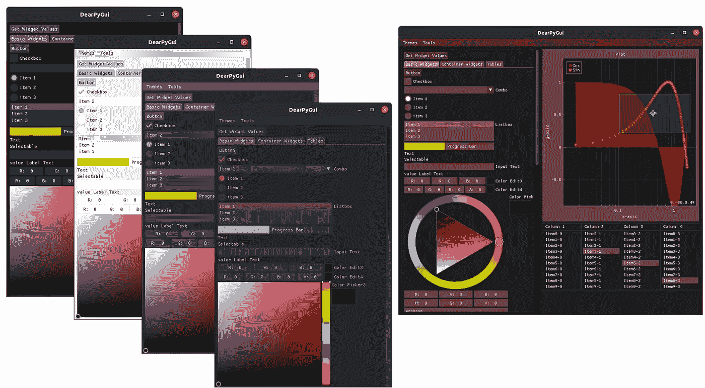

[source](https://github.com/hoffstadt/DearPyGui/wiki)

大家好！今天我将继续 dearpygui 教程的第二部分。上次我们制作了一个使用输入字段和列表的程序。这一次，我将展示更多的小部件，如简单的情节，情节，工具提示和弹出窗口。我不会谈论我在上一篇博客中谈到的那些小事，所以如果你还没有读过，那么一定要去看看。所以让我们开始吧。

# 简单的情节

Dearpygui 为我们提供了一个小部件，允许我们制作一个简单的绘图。为什么叫“简单”情节？因为我们可以使用这个小部件来制作不需要太多修改的快速图表。让我们看一个例子。像上次一样，我将快速制作一个窗口，并将其高度设置为 600，宽度设置为 800。如果你不记得了，我们首先制作一个视窗，然后指定宽度和高度。

这是它的代码:

```
from dearpygui.dearpygui import *setup_viewport()
set_viewport_height(600)
set_viewport_width(800)
start_dearpygui()
```

这是结果:

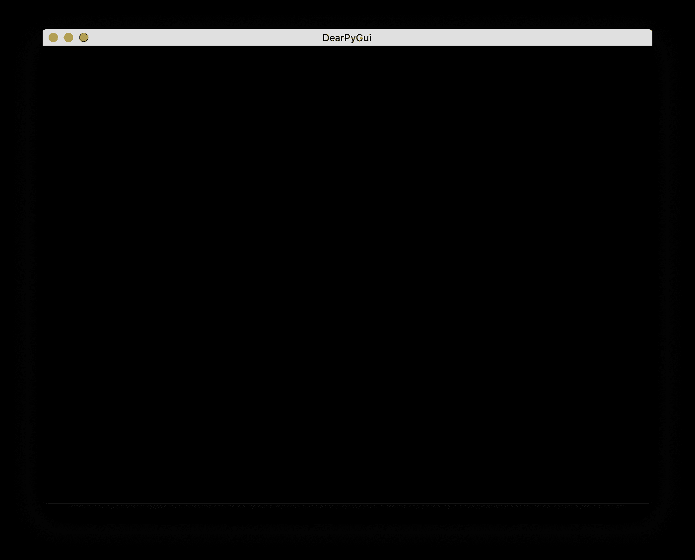

现在我要画一条正弦曲线。为此我将使用 numpy。对于那些不知道的人来说，numpy 是另一个允许复杂计算的模块。这是代码:

```
import numpy as npx = np.linspace(0,2 * np.pi, 50) # np.sin deals in radians which is
                                 # why I used an array from 0 to
                                 # 2*np.pi
y = np.sin(x)
```

现在我们有了数据，让我们制作一个窗口来放入我们的图表:

```
with window(label="simple plot", height=300, width=400):
    pass
```

结果:


现在让我们了解一下简单的 plot 小部件是如何工作的。在简单绘图小部件中，首先指定一个标签(可选)。然后使用“default_value”参数来指定我们计算的 y 值。仅此而已。有史以来最简单的情节。你可能会想，“x 值怎么了？”。简单的 plot 小部件使用 y 数组中元素的索引值作为 x 值。此外，您将无法调整轴的大小以及“plots”小部件必须提供的一些其他功能。据我所知，一个使用简单图表的例子是显示一个趋势而不需要太多细节。

现在让我们应用简单的绘图小部件:

```
with window(label="simple plot", height=300, width=400):
    add_simple_plot(label="Sine wave", default_value=list(y),
                    height=180, width=180)
```

结果:


简单的 plot 小部件也允许您制作直方图。只需将参数直方图设置为 True:

这在正弦曲线上看起来很奇怪，但希望你能明白:

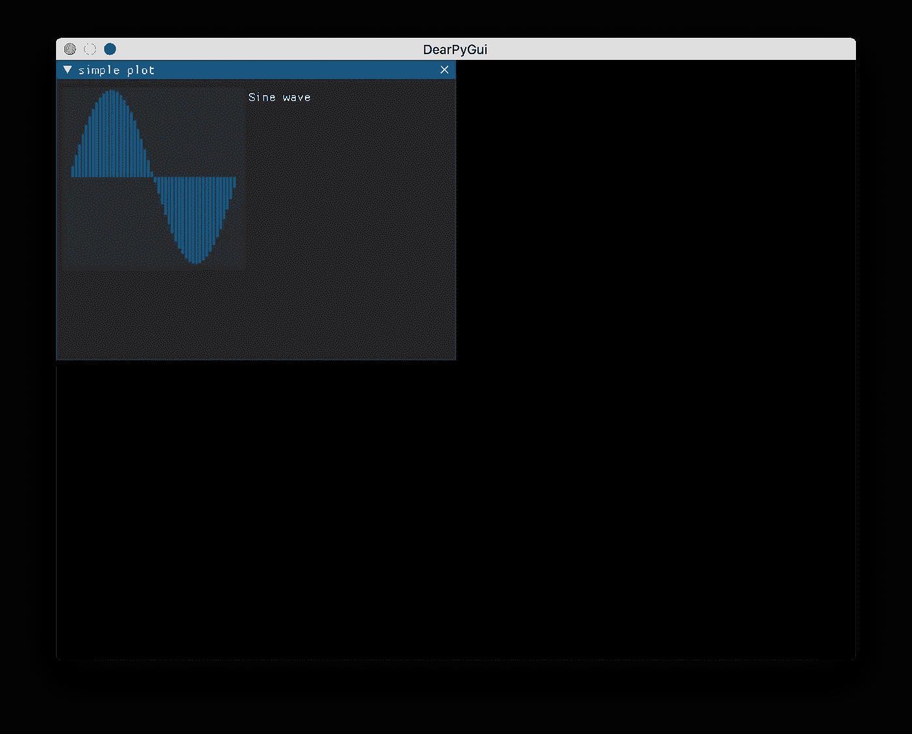

# 情节

plot 小部件是简单 plot 小部件的更高级版本，因为它由许多组件组成。然而，实现起来比简单的情节稍微复杂一些。对于绘图小部件，我们需要:

1.  定义情节
2.  定义绘图的轴
3.  定义每个“y 轴”的系列

用一个例子就能很好地理解这一点。让我们从一个空窗口开始:

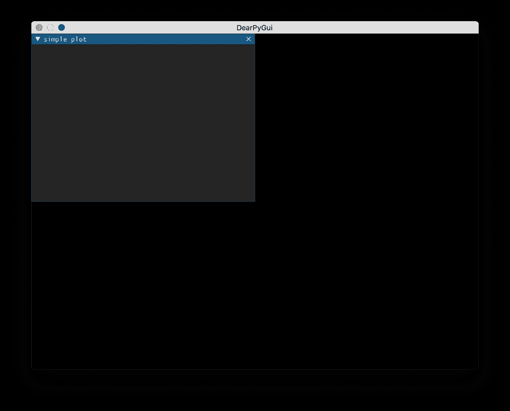

我将绘制相同的正弦曲线。我们已经为 x 轴和 y 轴制作了 numpy 数组。让我们实现一个情节:

```
with window(label="simple plot", height=400, width=500):
    with plot(label="Sine curve", height=300, width=400):
        pass
```

输出:

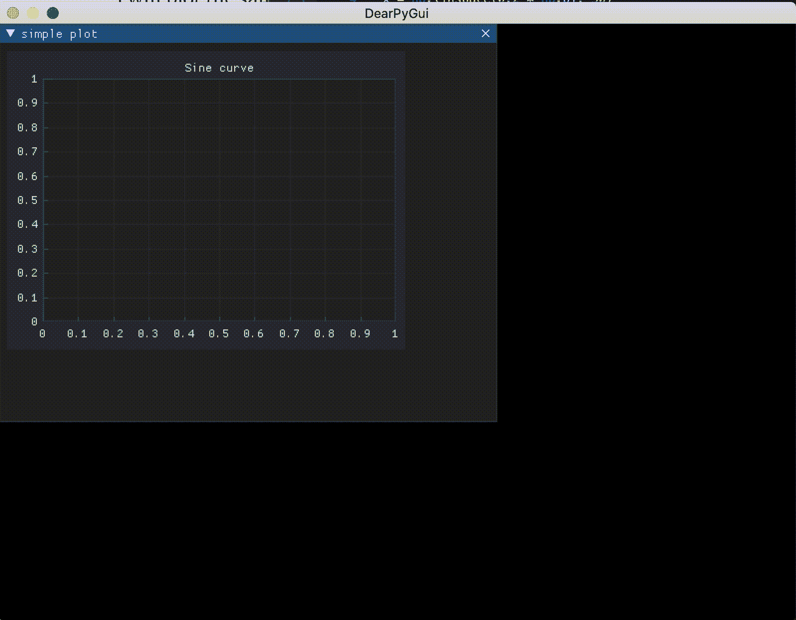

如您所见，通过一行代码，我们可以缩放轴(使用滚动条)，移动到图形的任何部分(鼠标左键单击)，以及缩放图形的任何部分(鼠标右键单击并拖动)。添加数据稍微复杂一些。

记住，在简单的图中，我们只关心 y 轴。这里我们也必须定义 x 轴:

```
add_plot_axis(mvXAxis, label="x")
add_plot_axis(mvYAxis, label="y", id="y_axis")
```

我们需要为 y 轴定义一个 id，因为可以为绘图中的每个 y 轴定义任何系列。系列可以被认为是图形的类型。因此，当您定义系列时，您需要输入 x 和 y 值，但是您需要指出它是什么 y 轴。现在让我们添加数据。我将使用简单的线条系列。然而，dearpygui 也提供了许多其他系列。这里有一个例子:

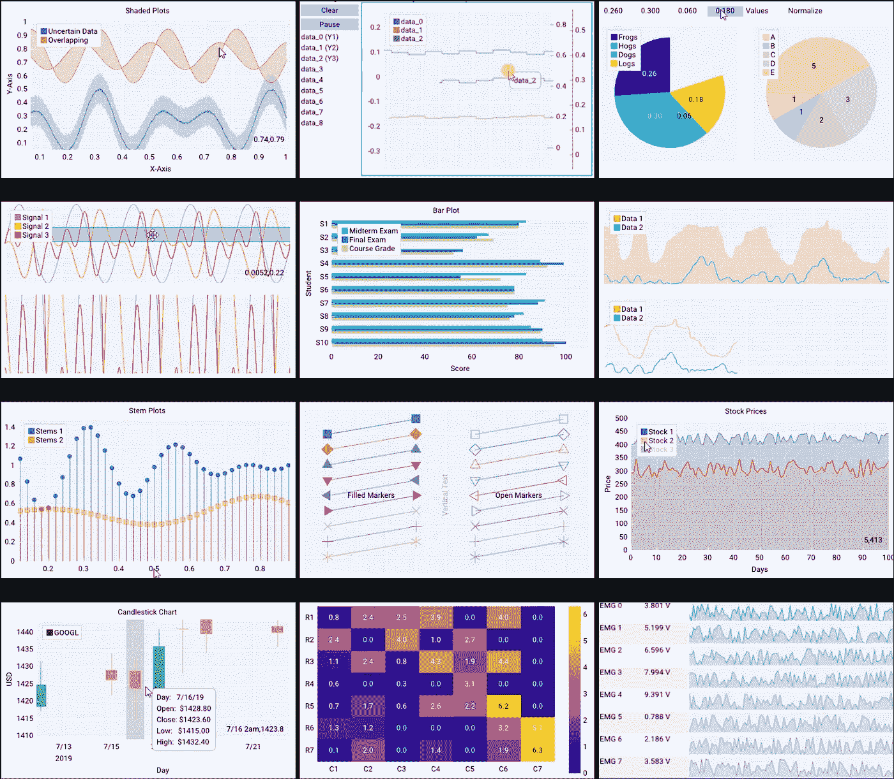

[source](https://github.com/hoffstadt/DearPyGui/wiki/Plots)

```
add_line_series(x, y, label="Sine", parent="y_axis")
```

输出:

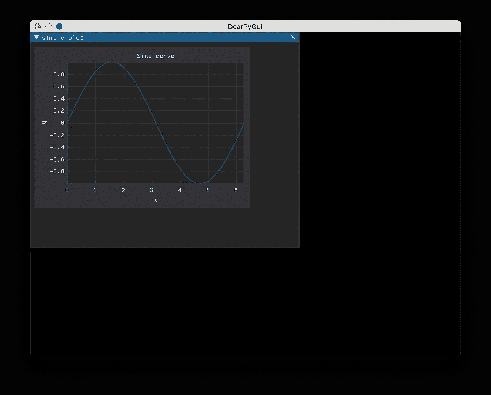

当然，你可以像我在上面的 gif 中一样摆弄图形。这是正弦图旁边的余弦图:

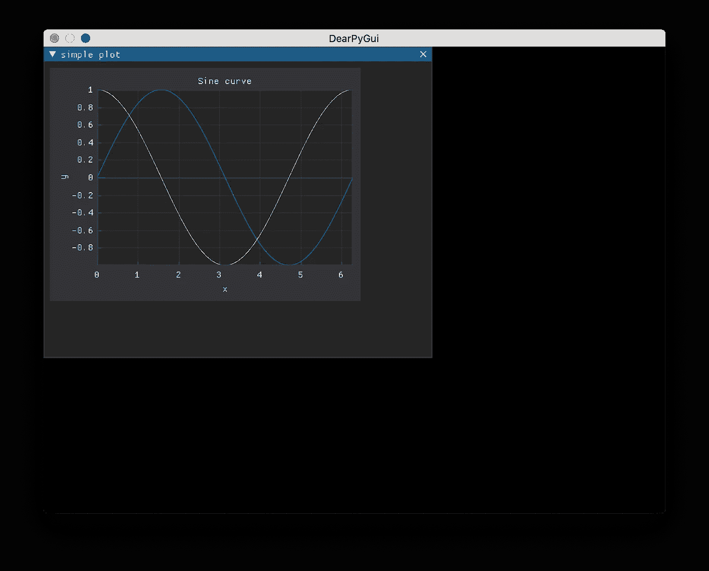

这是另一个 y 轴的 cos 图:

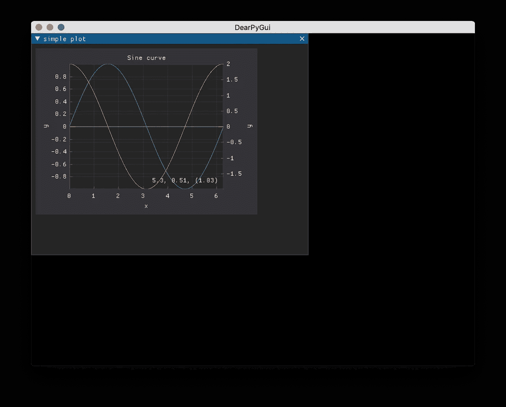

The formula for the cos graph is y = 2 * np.cos(x)

正如你所看到的，绘图非常灵活，你甚至可以让小部件实时绘制数据！有许多其他系列可用，习惯它们的最好方法是自己尝试一下。plot 小部件也是完全可定制的，它允许你改变表格的外观和添加额外的功能。

# 工具提示

让我们回到正弦曲线使用简单的图。假设我不希望标签在那里。相反，每当我的鼠标悬停在图形上时，我希望暂时出现一个显示正弦曲线的窗口。为此，让我们回到之前的代码:

```
from dearpygui.dearpygui import *
import numpy as npx = np.linspace(0,2 * np.pi, 50)
y = np.sin(x)with window(label="simple plot", height=300, width=400):
    add_simple_plot(label="Sine wave", default_value=list(y),
                    height=180, width=180, histogram=True)setup_viewport()
set_viewport_height(600)
set_viewport_width(800)
start_dearpygui()
```

让我们设置直方图为假，并删除标签参数。现在输出是这样的:


为了让工具提示出现，我们需要一个我们希望它出现在上面的小部件的 id。有两种方法可以获得小部件的 id。

1.  变量名称=小部件
2.  widget(id = "widget_id ")

对于第一种方法，每当您想要引用该小部件时，您可以使用您为其赋值的变量。对于第二种方法，您可以使用设置为 id 的字符串来引用变量。对于工具提示，您需要告诉它所指的是什么小部件。使用方法 1:

```
with tooltip(variable_name):
    pass
```

使用方法 2:

```
with tooltip("widget_id"):
    pass
```

代替 pass 语句，您可以添加您希望工具提示显示的任何内容。它可以是任何东西！我是这样做的:

```
with window(label="simple plot", height=300, width=400):
    graph = add_simple_plot(default_value=list(y), height=180,
                            width=180)with tooltip(graph):
    add_text("Sine curve")
```

结果:

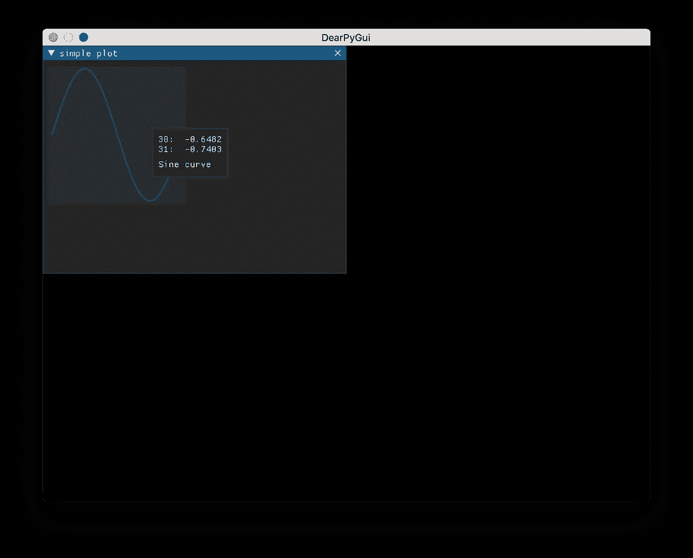

# 弹出窗口

我们来谈谈弹出窗口。我们都知道弹出式菜单是什么。动作后出现的临时窗口。Dearpygui 也提供了一个弹出窗口。为此，让我们从这段代码开始:

```
from dearpygui.dearpygui import *
import numpy as npx = np.linspace(0,2 * np.pi, 50)
y = np.sin(x)
with window(label="simple plot", height=300, width=400):
    add_simple_plot(default_value=list(y), height=180, width=180)setup_viewport()
set_viewport_height(600)
set_viewport_width(800)
start_dearpygui()
```

输出:

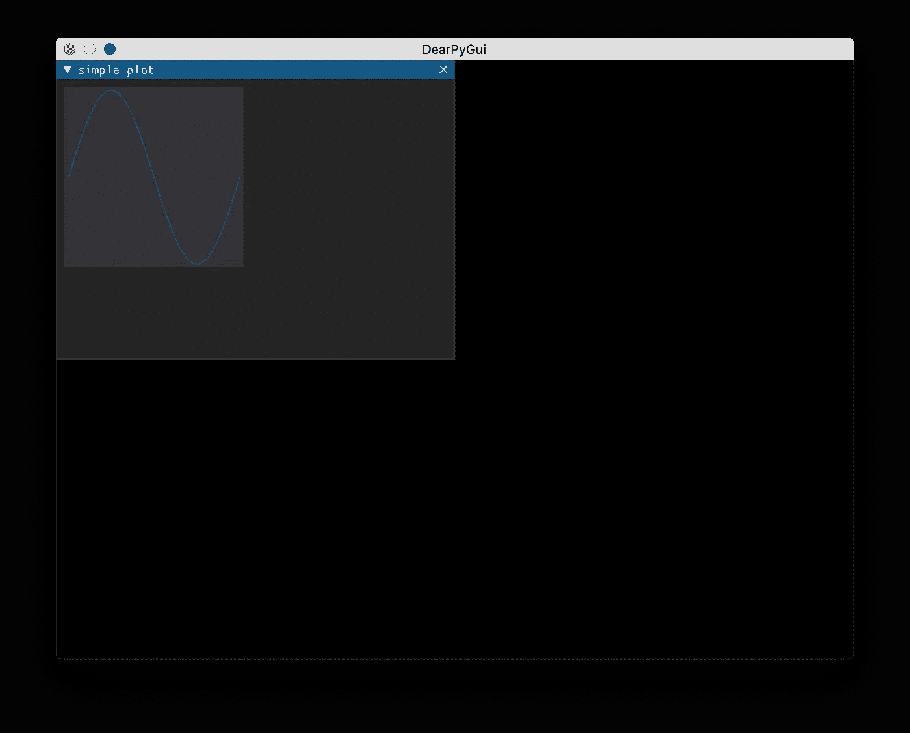

现在，假设我希望用户能够右键单击图表，并得到一个弹出窗口，显示类似这样的内容，这是一个图表。和往常一样，这对于 dearpygui 来说非常简单。我们只需添加一个弹出窗口小部件:

```
with popup(last_item()):
    add_text("This is a graph")
```

popup 小部件中的“last_item()”告诉 dearpygui 什么小部件在被点击时应该激活一个弹出窗口。因为我把 last_item()放在那里了，它字面上指的是我定义的最后一项，我这个例子中的简单情节。以下是我右键单击图表时的输出:

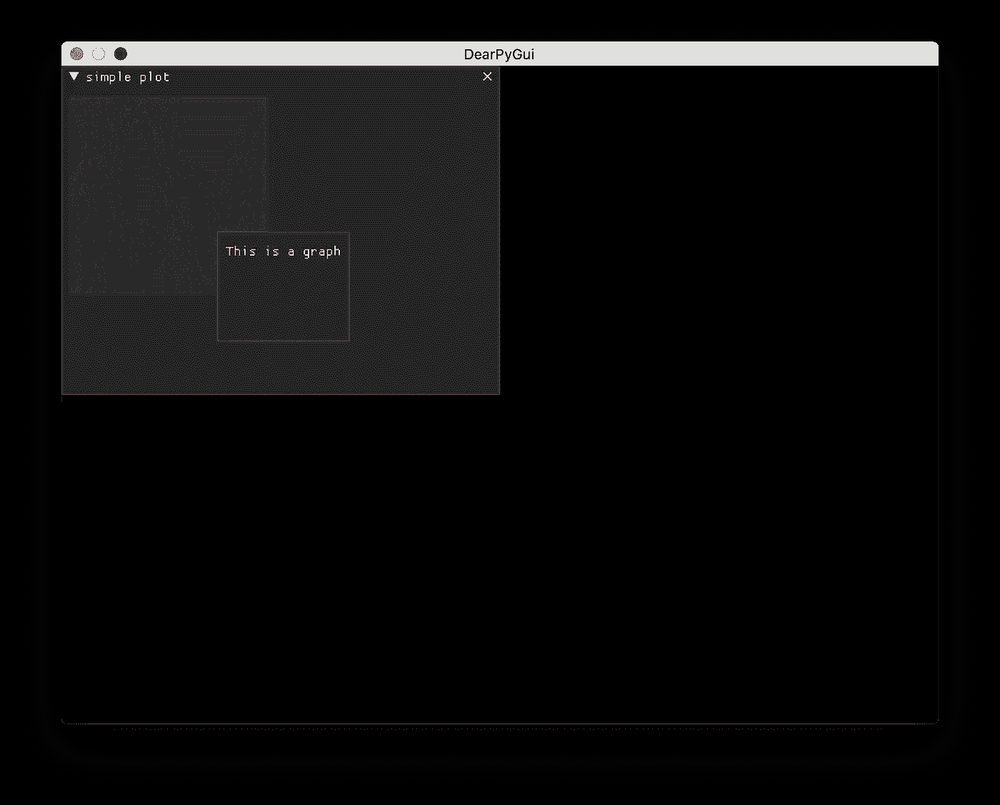

Dearpygui 还为我们提供了改变鼠标点击的功能，让我们定义我们是否希望弹出窗口是模态的。如果 modal 设置为 true，那么除了弹出窗口之外，没有其他窗口是可点击的。为了关闭弹出窗口，我们必须隐藏它。这里有一个例子:

```
with popup(last_item(), mousebutton=mvMouseButton_Left, modal=True)
              #this is on the same line as above       as modal_id:
    add_text("This is a popup")
    add_button(label="Close", callback=lambda:
               configure_item(modal_id, show=False))
```

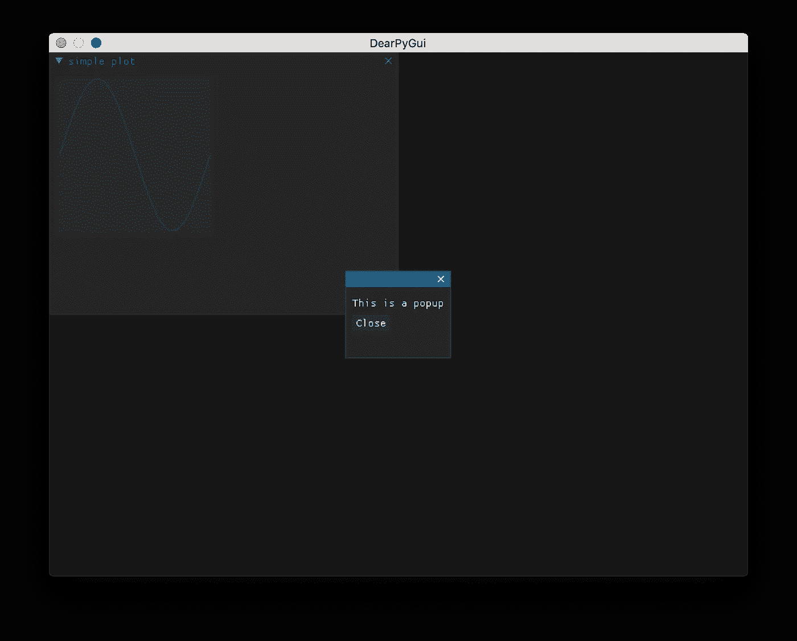

仅此而已！弹出窗口很棒，在我看来，它是很好的警告窗口。

# 最后一个部件

让我们考虑一下使用 GUI 的主要原因:看到事物的移动和变化，对吗？Dearpygui 有一个重要的小部件叫做`configure_item`小部件。语法是这样的:`configure_item("widget_id", property_you_want_to_change = what_you_want_to_set_it_to)`。widget_id 可以是变量或字符串(如果在定义小部件时已经设置了 id)。使用这个小部件，您可以做一些事情，比如让 plot 小部件实时绘制数据。在第一部分中，当我定义一个马达时，我使用这个小部件来更新列表框。

# 结论

Dearpygui 是一个令人惊叹的图书馆。它已经有了许多功能，并且仍在开发中！这意味着你可以期待在未来的一些其他可怕的功能。开发人员有一个分 reddit 和一个不和谐，所以我鼓励你加入进来！要了解更多信息，你也可以看看 github。

不管怎样，今天到此为止。我写关于编程和空间新闻的博客，所以如果你感兴趣，你来对地方了。如果你喜欢这篇文章，请跟我来，留下你的掌声。

感谢阅读！