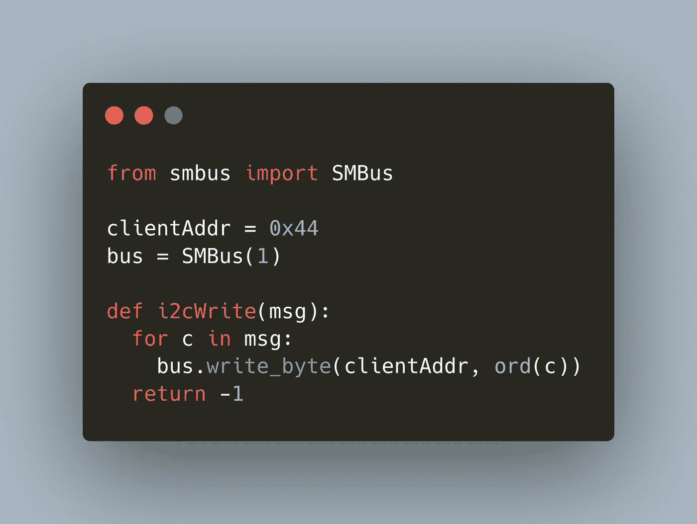

# 教程:Raspberry Pi 和 Arduino 之间的串行连接

> 原文：<https://medium.com/geekculture/tutorial-serial-connection-between-raspberry-pi-and-arduino-253a52099b2a?source=collection_archive---------9----------------------->



当您想要构建复杂的微控制器项目，需要在不同器件之间交换数据时，您需要一种快速可靠的方式来交换数据。在上一篇文章中，我们研究了串行 UART 连接，一种直接的一对一接口。本文是 I2C 协议系列的继续，这是一个具有多对多服务器和客户机的半双工双向通信系统。我们将看到如何连接一个 Raspberry Pi 和一个 Arduino Uno 来形成一个 I2C 连接，并在两个系统之间交换数据。

*本文原载于我的博客*[*admantium.com*](https://admantium.com/blog/micro12_tutorial_i2c_connection/)。

# 设置

在下面的设置中，Raspberry Pi 将是控制器，Arduino Uno 将是客户端。

# 接线

我们首先按如下方式连接两个器件:

*   连接 Raspberry GPIO2 => Arduino D18 SDA
*   连接树莓 GPIO3 => Arduino D19 SCL
*   连接覆盆子接地引脚=> Arduino 接地

如果您不确定引脚编号和配置，请参见 [Raspberry Pi 引脚布局](https://pinout.xyz/)和 [Arduino 引脚布局](https://content.arduino.cc/assets/Pinout-UNOrev3_latest.pdf)，或者阅读我之前的文章。

# 软件库

在 Raspberry Pi 上，我们需要安装一个 I2C Raspian 包和一个 Python 库。选择的库是 SMBus，一种基于 I2C 的协议。要安装所有必需的软件，请执行以下命令来安装必需的库。

```
apt-install i2c-tools
sudo pip3 install smbus
```

对于 Arduino，不需要额外的设置。选择的库是 Wire.h，它与 Arduino IDE 或 plattform.io 等第三方 IDE 捆绑在一起。

# Arduino: I2C 客户端配置

Arduino 程序将导入`<Wire.h>`库，一个基本 I2C 通信的包装器。通过简单的调用`Wire.begin()`，它将启动一个可以对消息做出反应的 IC2 客户端。

以下程序实现了一个基本的 I2C 客户端:

```
#include <Arduino.h>
#include <Wire.h>#define I2C_DEVICE_ADDRESS 0x44void setup() {
  Wire.begin(I2C_DEVICE_ADDRESS);
  Wire.onReceive(receiveMsg);
  Serial.begin(9600);
  Serial.println("Listening for Input");
}void loop() {
  Serial.print(".");
  delay(500);
}
```

该程序的工作原理如下:

*   第 2 行:导入`<Wire.h>`库
*   第 4 行:定义 Arduino 可以到达的 I2C 客户端地址，这里是它的十六进制`0x44`(十进制 68)——注意选择一个合适的 7 位地址，该地址不被同一总线上的任何其他设备使用
*   第 7 行:要创建 I2C 客户端，使用选择的地址执行`Wire.begin`
*   第 8 行:当服务器向该客户端发送消息时，回调函数`receiveMsg`将被执行

回调函数定义如下:

```
void receiveMsg() {
  if (Wire.available()) {
    char c = Wire.read();
    Serial.print(c);
  }
}
```

该函数工作原理如下:

*   第 2 行:检查在 I2C 总线上对于这个特定的客户端是否有一个活动的、未使用的消息
*   第 3 行:读取消息的第一个字节，并存储为一个`char`
*   第 4 行:打印字符

让我们继续树莓派的设置。

# 树莓派

Raspberry Pi 将以服务器角色启动 I2C 节点。在这个角色中，它可以主动向总线写入消息，并从客户端读取数据。

下面的程序将打开一个小终端，等待用户输入，然后将这些数据发送给客户端。

```
from smbus import SMBusclientAddr = 0x44
bus = SMBus(1)def i2cWrite(msg):
  for c in msg:
    bus.write_byte(clientAddr, ord(c))
  return -1def main():
  print("Send msg to Arduino")
  while True:
    msg = input("$> ")
    print("...")
    i2cWrite(msg)if __name__ == "__main__":
  main()
```

让我们解释一下细节:

*   第 1 行:导入 SMBus 库
*   第 3 行:定义将接收消息的 I2C 客户端的地址，我们指定十六进制`0x44`，十进制 144
*   第 4 行:创建 SMBus 类的一个实例
*   第 6 行:自定义方法`ic2Write`接收一个`msg`字符串，在第 8 行，它将把这个字符串的每个字符发送给客户端
*   第 10 行:`main`方法将开始一个无限循环(第 12 行)，向用户打开提示`$>`并读取答案(第 14 行)，然后调用`ic2Write`并给出完整的消息。

好的，我们准备好了。

# 交换 I2C 消息

首先，检查两个设备的接线。然后，通过 Arduino IDE 或 Plattform IO 等第三方 IDE 上传 Arduino 程序。

在树莓 Pi 上，启动 Python 程序。在另一台终端上，检查是否注册了新的 I2C 硬件设备。

```
$> ls /dev/*i2c*
/dev/i2c-1
```

如果没有看到设备，请检查程序源代码。然后，如果一切正常，最后，使用 I2C 助手程序检查 Arduino 是否正确连接:

```
$> i2cdetect -y 1 0  1  2  3  4  5  6  7  8  9  a  b  c  d  e  f
00:          -- -- -- -- -- -- -- -- -- -- -- -- --
10: -- -- -- -- -- -- -- -- -- -- -- -- -- -- -- --
20: -- -- -- -- -- -- -- -- -- -- -- -- -- -- -- --
30: -- -- -- -- -- -- -- -- -- -- -- -- -- -- -- --
40: -- -- -- -- 44 -- -- -- -- -- -- -- -- -- -- --
50: -- -- -- -- -- -- -- -- -- -- -- -- -- -- -- --
60: -- -- -- -- -- -- -- -- -- -- -- -- -- -- -- --
70: -- -- -- -- -- -- -- --
```

此命令打印所有 7 位(即最大 144 位)连接的 IC2 设备的表格。您还可以使用以下命令显示设备的所有 I2C 功能。

```
$> sudo i2cdetect -F 1Functionalities implemented by /dev/i2c-1:
I2C                              yes
SMBus Quick Command              yes
SMBus Send Byte                  yes
SMBus Receive Byte               yes
SMBus Write Byte                 yes
SMBus Read Byte                  yes
SMBus Write Word                 yes
SMBus Read Word                  yes
SMBus Process Call               yes
SMBus Block Write                yes
SMBus Block Read                 no
SMBus Block Process Call         no
SMBus PEC                        yes
I2C Block Write                  yes
```

在启动 Python 程序的终端上，键入任意输入。然后，在 Arduinos 串行控制台中，您应该会看到收到的消息

```
Listening for Input
.......................Hello from Raspberry Pi!................
```

太棒了。我们可以在树莓 Pi 和 Arduino 之间交换 I2C 消息。

但是从客户机向服务器发送数据呢？在 I2C 中，服务器控制所有的通信，它主动向客户机请求数据，只有在被请求时，客户机才会应答。不可能主动将数据从客户端发送到服务器。引用 [StackExchange](https://electronics.stackexchange.com/questions/467938/how-to-end-sending-data-over-i2c-by-slave-or-master?answertab=votes#tab-top) :

*所有通信都由服务器控制。客户端什么都不做，服务器不想让它做。服务器控制时钟的速度(时钟拉伸不承受)和读取多少字节。在任何时候，当服务器没有告诉它的时候，客户端都不应该试图强迫数据线。应该预先知道数据结构。*

因此，如果您想使用 I2C 总线在设备之间传递状态信息，那么您需要设计一个主动轮询系统。首先，每个客户端都需要缓冲其状态消息。其次，服务器需要定期调用客户机，收集状态信息，并根据这些信息采取行动。

# 结论

本文展示了从充当服务器的 Raspberry Pi 到充当客户端的 Arduino Uno 建立 I2C 连接的基本步骤。对于 Arduino，我们使用内置的库 Wire.h，它处理具体的 I2C 消息细节，并公开从服务器启动、监听和处理 I2C 通信的方法。在 Raspberry Pi 上，我们使用 Python SMBus 库，使用它可以很容易地启动 IC2 服务器总线，并主动向其连接的客户端发送消息。