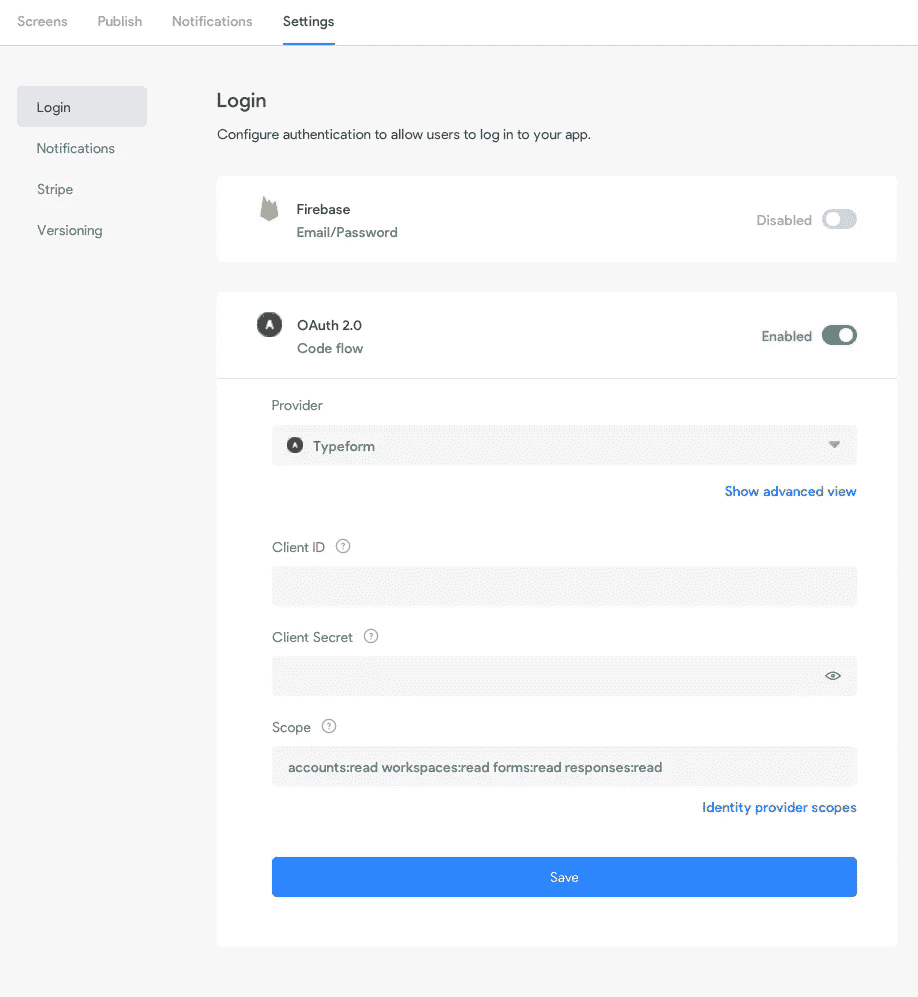
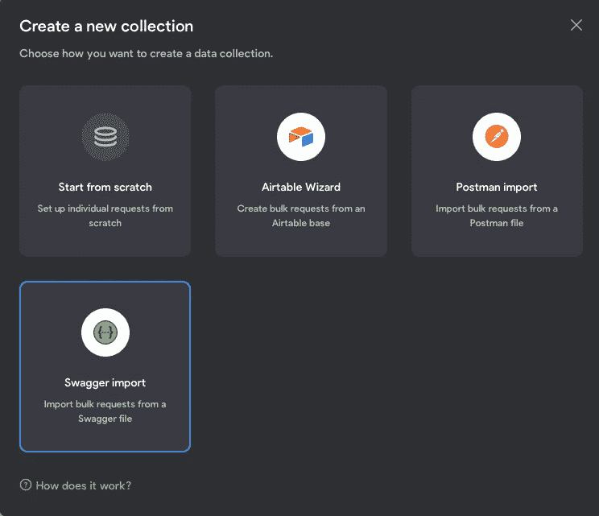
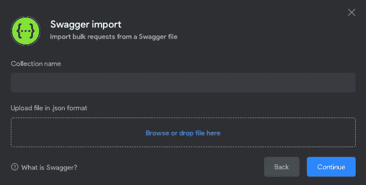
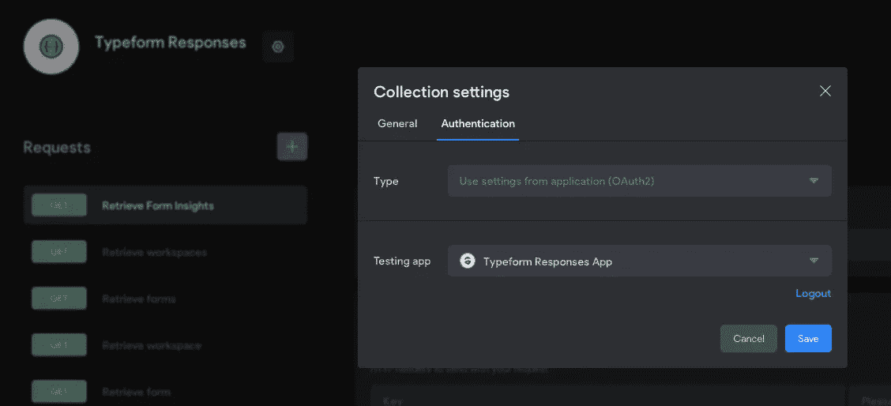

# 使用 Bravo Studio 在 15 分钟内构建本机 Typeform 响应应用程序的教程#nocode #yesdesign

> 原文：<https://medium.com/geekculture/tutorial-to-build-a-native-typeform-responses-app-using-bravo-studio-in-15-minutes-nocode-1b6ab62517b3?source=collection_archive---------18----------------------->

字体非常棒(披露我曾经在那里工作)。但是当我离开电脑的时候，我经常想看看结果是什么样的。尽管在过去有人关注过，但 Typeform 从未有过原生应用，而是依赖于渐进式网络应用——这相当巧妙——但有很多我不需要的东西，这会减慢获得结果的速度。

现在，作为 Bravo Studio 3.0 的一部分，我们刚刚添加了 OAUTH2 身份验证，这最终使我们能够制作一个 Typeform responses 应用程序(你可以在这里阅读所有新功能【https://www.producthunt.com/posts/bravo-studio-3-0)。所以我想我会创建一个教程来展示它是如何做到的。

## **1。在 Typeform 中注册 OAUTH 应用程序**

在本教程中，我们需要在 Typeform 中注册一个 OAuth 应用程序，因为我们将使用 Oauth 对 Typeform 进行身份验证。Typeform 的 API 文档真的很好所以我就不赘述了，不过你可以按照这里的步骤:[https://developer . typeform . com/get-started/applications/# 1-create-an-application-in-the-type form-admin-panel](https://developer.typeform.com/get-started/applications/#1-create-an-application-in-the-typeform-admin-panel)。由此，我们需要记录客户端 ID 和客户端秘密。

你需要确保重定向 _ https://projects.bravostudio.app/callbacks/oauth-token 设置为包括:
[https://bravostudioapp . page . link](https://bravostudiodev.page.link)

## 2.在 Bravo Studio 中创建应用程序

接下来我们需要将设计导入 Bravo Studio，因此登录 Bravo Studio(您可以在此处创建一个账户[，转到左侧菜单的`Projects`，然后点击`New Project`。然后导入这个 Figma 文件:](https://projects.bravostudio.app/signup?utm_campaign=bravo30&utm_medium=referral&utm_source=medium&utm_content=toby&utm_term=medium)

[https://www . fig ma . com/file/4 ZT 9 MC 4 o 5 wtm ZL v2 gam 0 ao/Typeform-Responses-App-Test-Free？node-id=0%3A1](https://www.figma.com/file/4ZT9mC4o5wtMZlv2gam0AO/Typeform-Responses-App-Test-Free?node-id=0%3A1)

## 3.在 Bravo Studio 中设置类型表单 OAUTH

下一步是添加 OAUTH 配置。进入你新创建的应用程序，转到`settings`然后登录，选择`Typeform`作为提供者，填写步骤 1 中的 CLIENT_ID 和 CLIENT_SECRET，并将范围设置为`accounts:read workspaces:read forms:read responses:read`。

此配置允许您的应用程序连接到 Typeform，因此每个用户都可以验证自己以访问他们自己的数据。

## 4.向 Bravo Studio 添加 Typeform APIs

在 Bravo Studio 中，转到左侧菜单上的`Data Collections`，然后转到`Create a new collection`。然后点击`Swagger import`。

在 swagger 导入屏幕上，将集合名称设置为`Typeform Responses`，然后上传该文件:`[TypeformResponsesSwagger.json](https://raw.githubusercontent.com/codelesslabs/API-definitions/main/Typeform/TypeformResponsesSwagger.json)`

当 API 列表出现时，点击`Select All`，然后点击`Continue`，加载我们需要的 API。

接下来点击`Edit Collection`，因为我们需要做一些改变。

单击`LIST WORKSPACES`请求，并将 URL 的结尾从`?page_size=${page_size}`更改为`?page_size=200`，以确保我们列出了您拥有的所有工作区。同样根据该请求，点击`Selected Data`选项卡，并将`items[] id`的名称更改为`workspace_id.`

然后点击`LIST FORMS`请求，将 URL 从`page_size=${page_size}`更改为`?page_size=200`。同样在这个请求中，点击`Selected Data`选项卡，将`items[] id`的名称改为`form_id`。

最后，我们必须设置这些 API 来使用 OAuth 类型进行身份验证。单击该集合名称旁边的螺母图标，调出集合设置。转到`Authentication`，然后将`Type`设置为`Use settings from application (OAuth2)`，将`Testing App`设置为`Typeform Responses App`。然后点击`Save`，你 App 里的 OAuth2 认证就准备好了。

## 5.将 API 绑定到设计

一旦添加了 API，转到`Typeform Responses App Test Free`项目，这样我们就可以将 API 绑定到设计中。

5.1。工作空间

点击`Workspaces`屏幕编辑该屏幕的绑定。

*   在`Select Visual Elements`列表中点击`WORKSPACE LIST`元素，并将其连接到右侧绑定面板中的`Typeform Responses`集合。接下来选择`LIST WORKSPACES`请求和`items []`元素，将列表绑定到这个设计元素。这将为列表中的所有项目重复这个容器元素，因此我们可以为每个项目绑定内容。
*   点击数据绑定中的`WORKSPACE TITLE`元素，并将其连接到右侧元素绑定中的`items[] name`
*   点击数据绑定中的`NUMBER of FORMS`元素，并将其连接到元素绑定中的`items[] forms count`。

5.2。表格

返回项目页面，点击`Forms`屏幕，编辑该屏幕的绑定。

*   在`Select Visual Elements`列表中点击`FORM LIST`元素，并将其连接到右侧绑定面板中的`Typeform Responses`集合。接下来选择`LIST FORMS`请求和`items []`元素，将列表绑定到这个设计元素。这将为列表中的所有项目重复这个容器元素，因此我们可以为每个项目绑定内容。
*   点击数据绑定中的`LAST UPDATE TIME`元素，并将其连接到右侧元素绑定中的`items[] last_updated_at`
*   点击数据绑定中的`FORM TITLE`元素，并将其连接到元素绑定中的`items[] title`。

**5.3。总结**

返回到项目页面并点击`Summary`屏幕来编辑该屏幕的绑定。

*   在选择可视元素中，打开`Form Summary`部分并连接以下内容:
*   `AVERAGE TIME VALUE`到`Typeform Responses`->-`FORM SUMMARY FREE`->-`summary average_time`
*   `COMPLETION RATE VALUE`到`Typeform Responses`->-`FORM SUMMARY FREE`->-`summary completion_rate`
*   `RESPONSE COUNT VALUE`到`Typeform Responses`->-`FORM SUMMARY FREE`->-`summary responses_count`
*   `TOTAL VISITS VALUE`到`Typeform Responses`->-`FORM SUMMARY FREE`->-`summary total_visits`
*   `UNIQUE VISITS VALUE`至`Typeform Responses`->-`FORM SUMMARY FREE`->-`summary unique_visits`
*   `FORM NAME`至`Typeform Responses`->-`Retrieve Form`->-`title`

你的 Typeform 应用程序现在已经准备好了，你可以使用 Bravo 预览器登录 Typeform 并查看你的所有数据([https://docs . Bravo studio . app/learn-and-create/Bravo-vision-Previewer](https://docs.bravostudio.app/learn-and-create/bravo-vision-previewer))。

尽管您可以使用 Bravo Studio 通过 Typeform APIs 做更多的事情，但这仅仅是个开始。请在 Bravo Studio [社区](https://community.bravostudio.app/home)告诉我们您的想法！