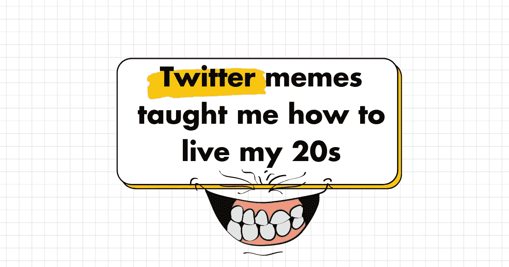
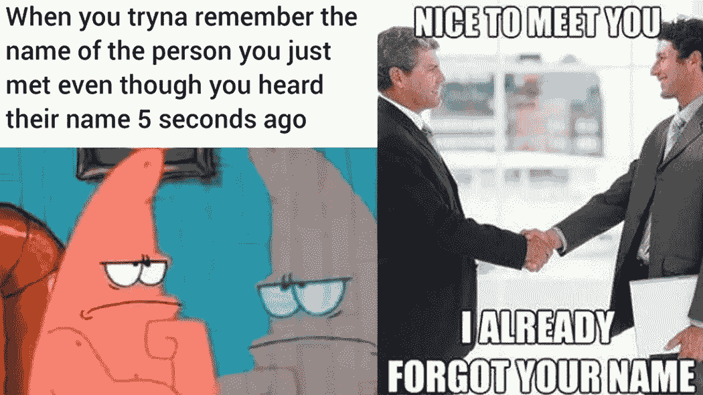
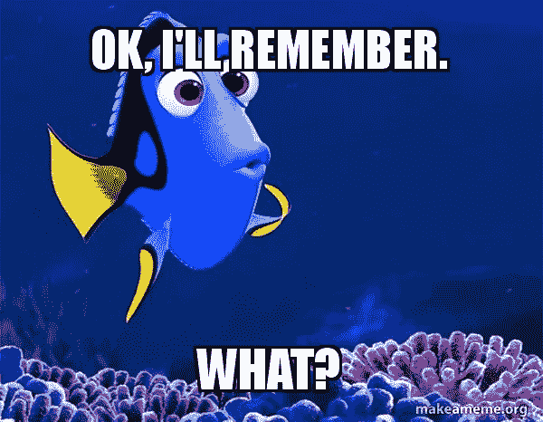
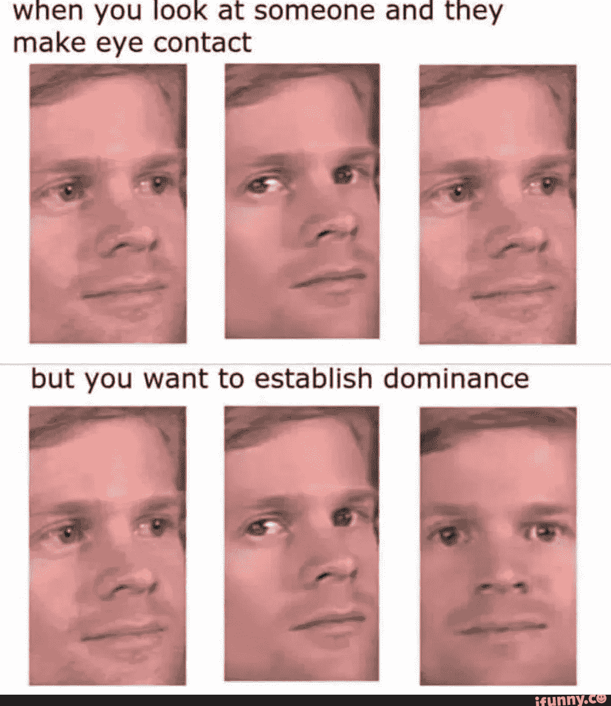

# 推特迷因教会了我如何度过 20 多岁

> 原文：<https://medium.com/geekculture/twitter-memes-taught-me-how-to-live-my-20s-89f1c14344bb?source=collection_archive---------13----------------------->

## 一直在推特上搜索，看看其他人有什么建议，这就是

首先，在你 20 多岁的时候，我认为对几乎所有事情说“是”是很重要的。

这极大地增加了你的幸运表面积——你会遇到很多新的有趣的人。

但是在这种情况下，你需要一本成功的剧本。

我父亲在我 17 岁时送我去参加了很多个人品牌研讨会、展示研讨会和谈判策略展示，为我做准备。谢谢爸爸:)

我学会了一些让自己看起来更迷人的方法:

# 对他们说别人的名字

当你和一个新认识的人交谈时，在交谈中自然地重复他们的名字。

**这里有两个好处:** ①你会记住他们的名字。
(2)每个人都爱听自己的名字。

你会立刻在他们的心目中脱颖而出。

# 问几个引人入胜的问题

在你的后口袋里有几个可信的问题是很好的。如果谈话陷入困境，抽出一个。

**我的最爱:**

(1)你最感兴趣的工作是什么？

(2)你最近读过的最喜欢的书是什么？

# 重复并添加

问完问题后，仔细听对方的回答。

当你有机会时，用你自己的话重复他们的回答，并加入你自己的观点或印象。

建立精神联系。它显示了存在感和独立思考。

# 进行情景眼神交流。

眼神交流很有趣。太少，你看起来不稳定。太多了，你看起来很吓人。

我喜欢情景性的眼神交流:当他们说话的时候要深沉，当你说话的时候要自然。

当你思考的时候，凝视是可以的，但是要用眼神交流来强调重点。

# 创造性跟进

从对话中找出有创意的跟进领域。然后跟进他们…

我过去常常和新认识的人谈论我最喜欢的书。然后我会给他们寄一份复印件，并附上一张手写的便条到他们的办公室。

我通过这种方式找到了很多导师。

这些只是我利用在 Twitter 上看到的迷因的力量将它们应用到生活中的几种方式。听起来很傻？相信我，这有用。

# 👇什么迷因教会了你如何生活？

> 👋**在[媒体](/@pooriaarab)—[LinkedIn](https://www.instagram.com/pooria.arab/)—[Twitter](https://twitter.com/pooria_arab)—[insta gram](https://www.instagram.com/pooria.arab/)—[抖音](https://www.tiktok.com/@pooria.arab)**
> 
> 更多关于 Web3，Crypto，NFTs，DeFi 等的好东西…
> 
> 在这里获得 NFT 发布的终极策略