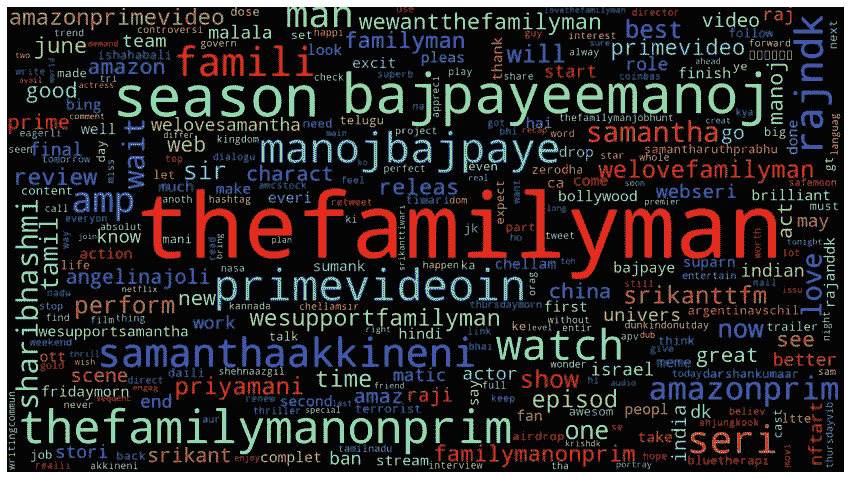
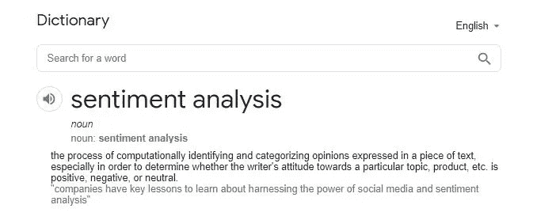
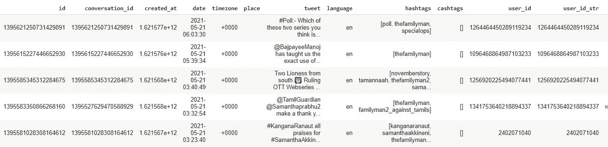
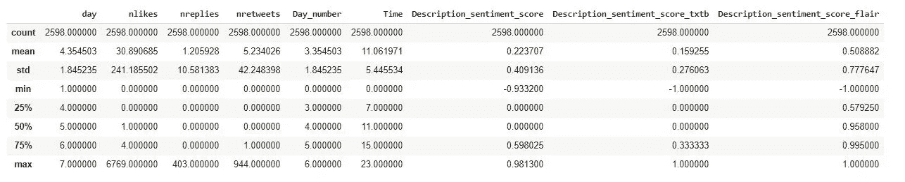
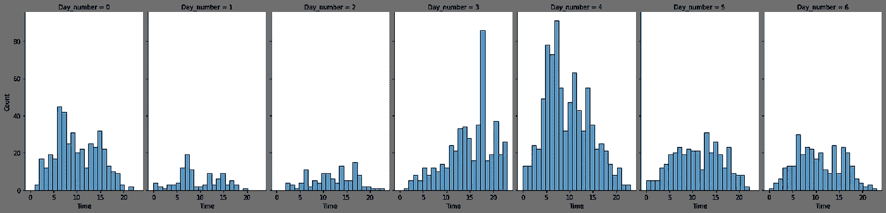
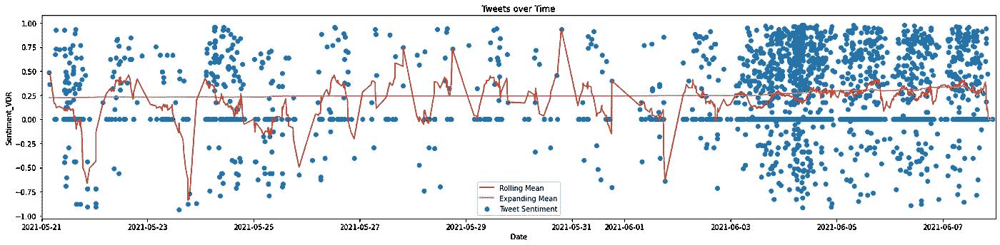
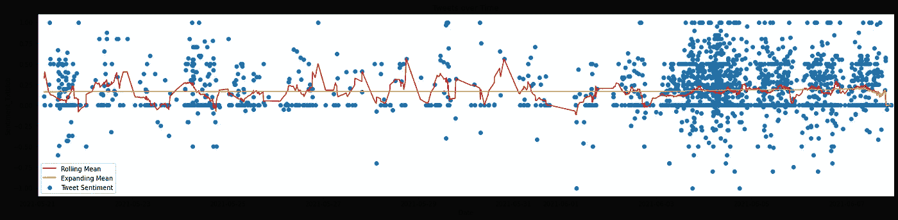
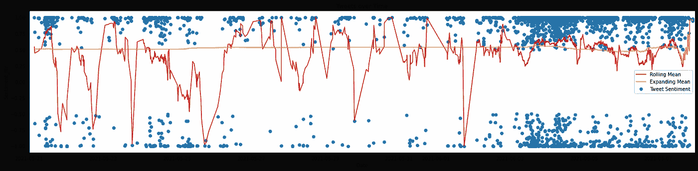
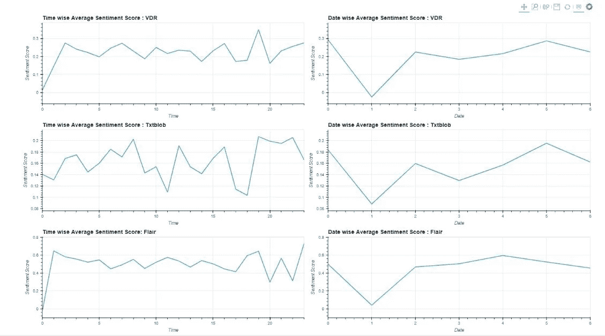
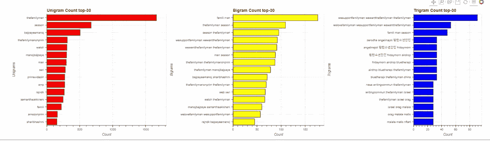

# 《居家男人》的推特情感分析

> 原文：<https://medium.com/geekculture/twitter-sentiment-analysis-of-the-family-man-4cb36469c7a7?source=collection_archive---------48----------------------->

## 自然语言处理和情感分析

## NLP 库之间的比较

Photo by [Firmbee.com](https://unsplash.com/@firmbee?utm_source=medium&utm_medium=referral) on [Unsplash](https://unsplash.com?utm_source=medium&utm_medium=referral)

[***【The Family Man】***](https://en.wikipedia.org/wiki/The_Family_Man_(Indian_TV_series)#:~:text=8%20External%20links-,Premise,Agency%20(NIA)%20of%20India.)是一部基于亚马逊 Prime Video 的印度间谍动作惊悚流媒体电视剧，由 Raj Nidimoru 和 Krishna D.K .创作、执导和制作，最近于 2021 年 5 月 21 日推出了预告片，随后第二季的所有剧集已于 2021 年 6 月 3 日发布。

Source : Author

# 什么是情感分析？

Source: Author

情感分析可以帮助我们解读大众的情绪和情感，并收集关于环境的深刻信息。

所以从技术上来说，它是确定自然语言中给定表达的情感价值的任务。它本质上是一个多类文本分类文本，其中给定的输入文本被分类为积极、中性或消极情绪。

在这篇文章中，通过使用 **twint** 库废弃 5 月 21 日至 6 月 8 日期间所有带有 ***"#thefamilyman"*** 的推文，进行了推文情感分析。

Source : Author

# 情感分析方法:

## 基于规则的情感分析:

这是计算文本情感的最基本的方法之一。该方法不使用任何机器学习来理解文本情感。 **Textblob** 和 **VADER** 是完成这些任务最常用的 NLP 包。

**TextBlob** 返回句子的**极性**和**主观性**。**极性**位于[-1，1]之间，-1 定义负面情绪，+1 定义正面情绪。**主观性**介于[0，1]之间。**主观性**量化文本中包含的个人观点和事实信息的数量。**较高的主观性**意味着文本包含**个人观点**而非**事实信息**。

**VADER** 会为你传递的任何文本返回一个 4 分的字典；**正、中、负、复合分数**，范围从-1 到 1。我们最感兴趣的是追踪推文整体情绪的复合分数。

## 基于嵌入的模型:

文本嵌入是自然语言处理中单词表示的一种形式。基于嵌入的 python 包使用这种形式的文本表示来预测文本情感。天赋是这类任务最常用的套装。

在 IMDB 数据集上训练预训练的情感分析模型。 **Flair** 返回一个包含情感**【值】**的字典，该情感被分类为**【正面】**或**【负面】**，相关联的**【置信度】**范围在 0.5 到 1 之间。

# 分析情绪:

Source : Author

*   我们有 2598 条推文，平均 30 个赞和 5 个转发。
*   查看情感评分，我们可以看到平均推文是正面的，根据 **VADER** 、 **Textblob** 和 **Flair** ，平均情感评分分别为 **0.22、**0.16 和 **0.55。**

每日和每小时的推特频率记录如下:

Source : Author

用*【滚动】**【扩展】*的意思标绘每条推文的分数，图的顺序是: **VADER、Textblob** 和 **Flair**

Source : Author (VADER Plot)

Source : Author (Textblob Plot)

Source : Author (Flair Plot)

*   **Textblob** 似乎是*最保守的*而**天赋**似乎是非常*激进的* w.r.t 分类器。这种 Flair 行为可能是因为，分类器最初是在 IMDB 电影评论数据上训练的，因此泛化可能是相同的限制。
*   VADER 的表现令人满意。
*   5 月 21 日的负面推文可能与预告片的发布有关。

还为可视化绘制了时间和日期方面的平均推文分数，

Source : Author

**N-gram** 分析也完成了， **bigram** 似乎比其他技术更好，

Source : Author

# 结论:

*所有类型的用户都使用社交媒体*，因此他们有所有可能的情绪状态，因此太多激进的算法可能会误导分析，在这方面 **VADER** 可能更优。

**Textblob** 可能对民意调查和*事实数据主题*的*分析有用，而 **Flair** 可能对*反馈审查系统*有用，其目标是批判性地识别情绪。*

# 参考资料:

1.  [https://towards data science . com/opposition-analysis-of-anthem-game-launch-in-python-16be 9 e 5083d 2](https://towardsdatascience.com/sentiment-analysis-of-anthem-game-launch-in-python-16be9e5083d2)
2.  [https://towards data science . com/my-absolute-go-to-for-perspective-analysis-text blob-3a 3c a11 d 524](https://towardsdatascience.com/my-absolute-go-to-for-sentiment-analysis-textblob-3ac3a11d524)
3.  [https://rileymjones . medium . com/sensation-analysis-with-the-flair-NLP-library-cfe 830 bfd 0 f 4](https://rileymjones.medium.com/sentiment-anaylsis-with-the-flair-nlp-library-cfe830bfd0f4)
4.  [https://towards data science . com/感伤-分析-使用-维德-a3415fef7664](https://towardsdatascience.com/sentimental-analysis-using-vader-a3415fef7664)
5.  [https://medium . com/@ pragya _ paudyal/scraping-tweet-using-twint-and-analyzing-with-NLP-932 e 01 ad 5587](/@pragya_paudyal/scraping-tweet-using-twint-and-analyzing-with-nlp-932e01ad5587)

*如果你觉得这篇文章有用，可以随时在 GitHub 上查看* [*【我的回购】*](https://github.com/pathakchiranjit/Twitter_Sentiment_Analysis) *。也可以在*[*LinkedIn*](http://www.linkedin.com/in/pathakchiranjit)*上找我。有兴趣了解工程领域的数据分析、数据科学和机器学习应用的更多信息吗？通过访问我的* [*中简介*](/@pathakc) *来探索我以前的文章。感谢阅读。*

*-奇兰吉特*