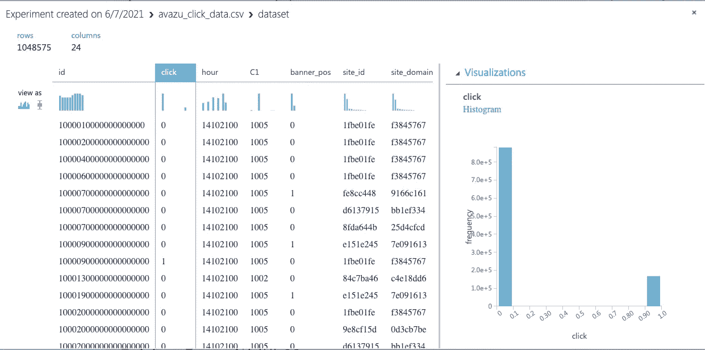
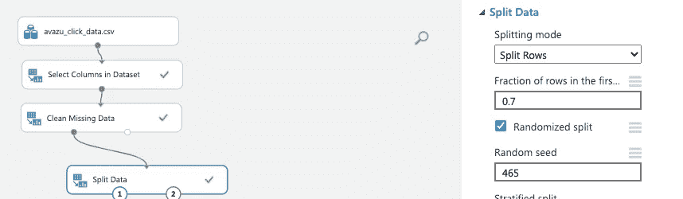
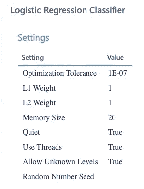
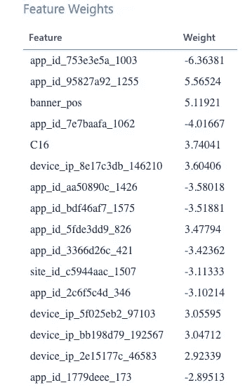
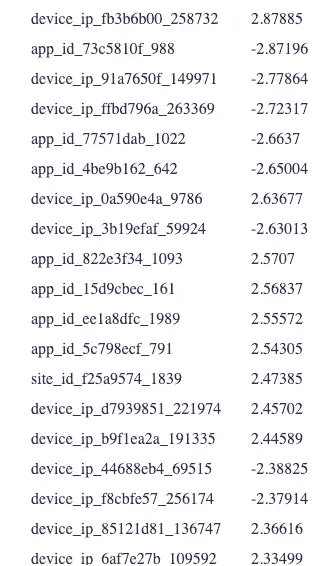
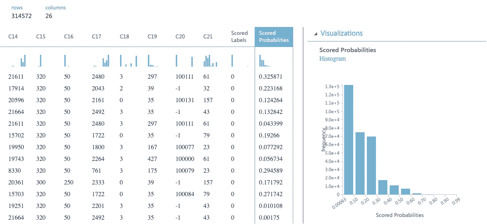
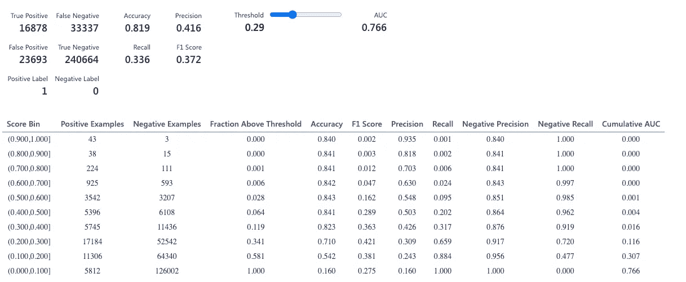
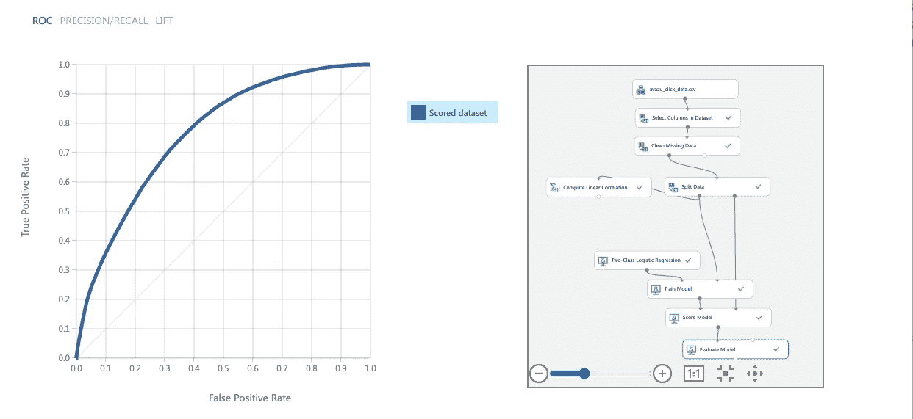

# 建立数字广告点击预测模型的两类逻辑回归

> 原文：<https://medium.com/geekculture/two-class-logistic-regression-to-build-click-prediction-model-for-digital-ads-e99cd79522e?source=collection_archive---------13----------------------->

在数字广告领域，点击率是评估广告效果的最重要的指标之一。这是绝对必要的，并在# RTB #赞助和#搜索生态系统中广泛使用。

我们希望预测在给定关于用户的特定信息的情况下，广告是否会被点击，为此，点击本质上是一个二元变量，并且只能有 0 或 1 作为值。我们将使用#Avazu 提供的数据集，可以从下面的链接下载。

[https://www.kaggle.com/c/avazu-ctr-prediction/data](https://www.kaggle.com/c/avazu-ctr-prediction/data)

好的，让我们从将数据集加载到令人敬畏的#AzureMLStudio 开始，并对其进行可视化。

EDA to understand the Data

**了解手头的数据和问题:**

正如我们所看到的，我们得到了一个有 24 列和超过 100 万行的数据集。让我们试着理解数据集中的变量。#Azure #MLStudio 在处理大型数据集和可视化数据集方面非常高效，我们可以检查数据集的基本形状、大小和分布。

第一列是 id，表示独特的印象，第二列是“点击”，值为 0 和 1，0 表示**不点击**，反之亦然。我们手头有一个二进制分类问题，有许多算法可以为我们做到这一点。首先，让我们选择**‘二级逻辑回归’**。

**逻辑回归**是分类问题最常用的算法之一。线性回归以连续数值的形式给出输出，而逻辑回归通过使用 **#sigmoid** 函数转换输出，并返回两个或更多不同类的概率，在这种情况下，只有两个类“Click”= 1 和“NoClick”= 0。

**Sigmoid 函数**:这一族函数在机器学习领域有着广泛的应用，也被称为**逻辑函数。**它具有有趣的性质，这使得它在分类问题中非常有用。它可以将任何实数值作为输入，并将其映射到 0 到 1 之间，并且具有“S”曲线形状。这方面有很多学术资源，更多可以在这里找到[。](https://en.wikipedia.org/wiki/Logistic_function)

Logistic Function where L=1 , k = 1, X0 = 0

**逻辑回归与线性回归:**

让我们试着通过考虑一个例子来理解它们之间的区别，假设我们想预测‘Virat Kohli’在下一场比赛中会得多少分。

*   **线性回归**可以帮助我们预测维拉特在下一场比赛中的准确得分，并且会有一个连续的数值。

 [## 下面是我如何使用 Azure ML studio 通过电子商务数据集构建回归模型

### 在下面的例子中，我使用一个电子商务数据集来建立一个回归模型。这里我们使用 Azure ML studio 堆栈…

medium.com](/analytics-vidhya/heres-how-i-used-azure-ml-studio-to-build-a-regression-model-using-an-e-commerce-dataset-c8ad1b2807ba) 

*   **逻辑回归**可以帮助我们预测 Virat 是否会达到一个世纪，并且只有两个可能的值，即 0 和 1。

线性回归输出是一个连续的数值，而逻辑回归输出是一个离散的数字(只有特定的值表示特定的类或类别)

既然我们已经熟悉了数据和将要使用的算法，让我们开始建模吧。

可视化数据集后，我们将执行一些步骤检查，如声明预测变量、检查缺失值以及在训练和测试中拆分数据集。

Setting Train size as 70 % and Test size as 30 %

接下来，我们从机器学习菜单中拖放“两类逻辑回归”,通过简单地执行我们工作流程中的所有步骤来训练我们的模型。可视化训练好的模型，我们得到以下输出。

Visualising trained model

正如我们可能注意到的，模型已经准备好了，我们需要做的就是对我们的模型进行评分和评估，以找出模型的性能。这可以通过从菜单中添加这些项目并简单地右键单击来完成，并将结果可视化如下。

Output : Scored probabilities and Scored Labels on the Test data

现在我们已经完成了评分，让我们检查模型的准确性。

Our objective is to minimize False Negatives and False Positives

现在，我们可以检查准确性、f1 得分、精确度和召回率等指标。

Visualizing AUC ROC & The Complete Workflow

我们可以移动阈值，在这种情况下，这是我们的模型超参数，我们可以改变阈值，以达到平衡，产生最少的假阳性和假阴性。阈值约为 0.29 时，我们得到的最佳模型的超精度约为 81.5 %。考虑到我们手头的不平衡数据集，这是相当好的。