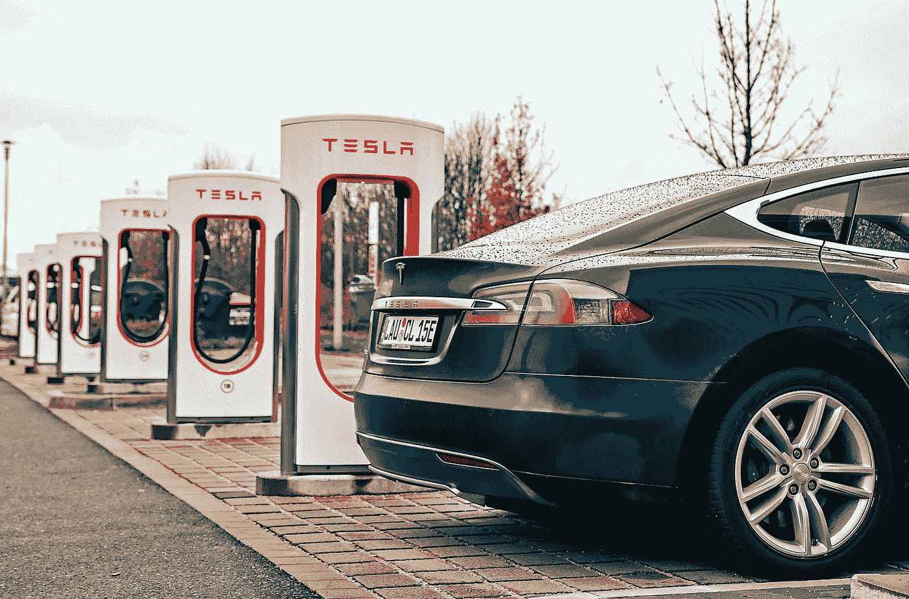

# 改变世界的两大趋势:电气化和数字化

> 原文：<https://medium.com/geekculture/two-megatrends-transforming-the-world-electrification-and-digitalization-75675075584c?source=collection_archive---------4----------------------->

## 电气化工程。数字化，没那么多。数字化必须向电气化学习才能成功。

Source: [Wikimedia Commons](https://commons.wikimedia.org/wiki/File:Model_S_charging_at_a_Tesla_station_cropped.jpg)

电气化是当今世界两大主导趋势之一。数字化是另一个。