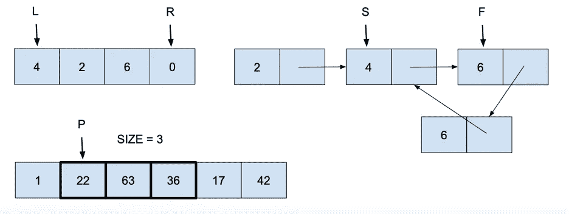

# 双指针与滑动窗口

> 原文：<https://medium.com/geekculture/two-pointer-vs-sliding-window-460133eb9228?source=collection_archive---------1----------------------->

## 双指针算法是处理成对数据、分离数据、查找序列中的范围(或子序列)甚至查找链表中的循环的优秀技术。

滑动窗口使用一个指针和一个窗口大小变量在序列中查找窗口。