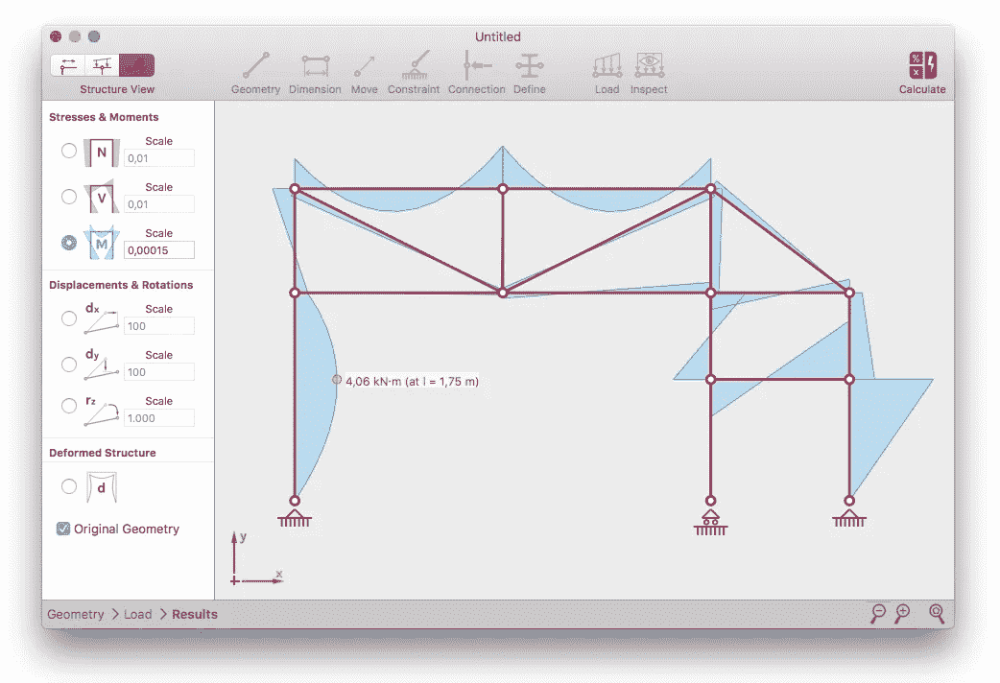
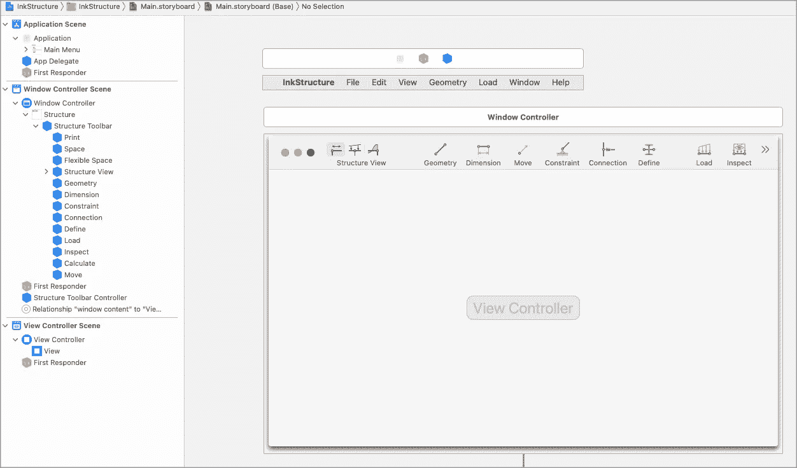
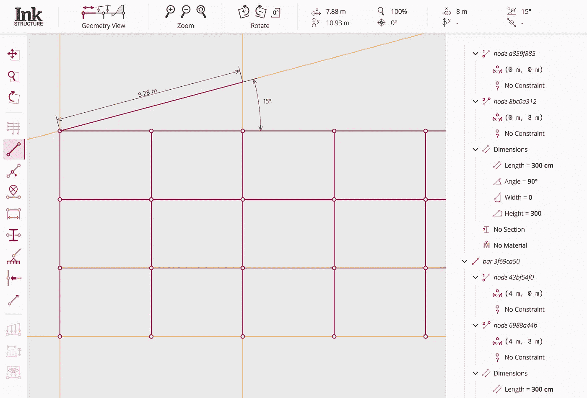
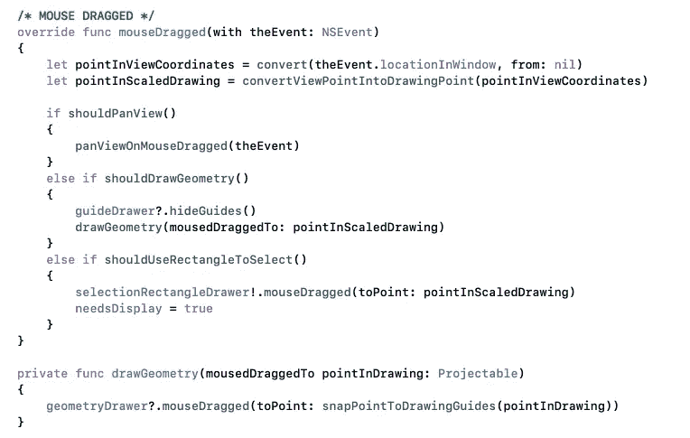
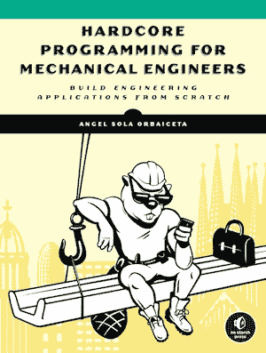

# 两次软件工程的惨痛教训

> 原文：<https://medium.com/geekculture/two-software-engineering-lessons-learnt-the-hard-way-8d6eec2fb047?source=collection_archive---------12----------------------->

有一天，我问自己“*在过去的几年里，我学到了什么好的软件工程课程？*”。经过思考后，我决定写下我的想法，以防对其他软件工程师有所帮助。

让我先告诉你一个小故事，告诉你我是如何吸取这些教训的。

几年前，我挑战自己构建一个面向工程和建筑学生的结构分析应用程序。我想成为一名软件工程师，同时向潜在的雇主证明我具备成为一名优秀软件专业人员的素质。结果是 [InkStructure](http://www.inkstructure.com) ，一个使用本地 [Cocoa 框架](https://developer.apple.com/library/archive/documentation/MacOSX/Conceptual/OSX_Technology_Overview/CocoaApplicationLayer/CocoaApplicationLayer.html)用 [Swift](https://swift.org/) 编写的本地 OSX 应用。当我发布它时，它受到了相对热烈的欢迎。

InkStructure v1 (Written in [Swift](https://swift.org/) using the [Cocoa framework](https://developer.apple.com/library/archive/documentation/MacOSX/Conceptual/OSX_Technology_Overview/CocoaApplicationLayer/CocoaApplicationLayer.html))

不用说，我对应用程序架构的设计有很多缺陷，这使得软件很难发展；当时我在构建大型应用程序方面有点经验不足。在最初发布后的几个月里，我添加的一些 bug 修复或新特性让我在几周前写的代码中挣扎。**通过反思那些设计“错误”**，阅读软件架构，与我现在和过去的公司中其他经验丰富的工程师交谈**，以及试验**更具可扩展性的解决方案，我学到了很多东西。

InkStructure main storyboard

由于这次回顾性练习和一些额外的经验，我目前正在重写整个应用程序，这是它今天的样子(尚未发布):

InkStructure v2 (Being currently written in [Typescript](https://www.typescriptlang.org/), [Angular](https://angular.io/) & [Electron](https://www.electronjs.org/))

这个版本的应用程序背后的代码更加模块化，易于理解和测试，并且更好地为用户服务。那么，在这段时间里发生了什么让我做出了在这个新版本中构建代码的更好的决定呢？我能想到一些，但是今天我想告诉你两个。

# 没有实践经验的“知识”只是片面的知识:一个人通过做来学习。自己犯错误并承担后果是你最好的老师。

我怎么强调都不为过。你可以阅读大量关于软件架构的书籍；他们会让你思考构建代码的方法，这可能不是你一个人想出来的，但这只是第一步，当然还不够。如果你想完全内化这些知识，那么**应用它们！**看看这些设计决策如何在真实软件中经受住时间的考验。

与了解不同的架构模式同样重要的是，知道什么时候使用它们，它们应该如何应用，在选择一种模式时要做出什么样的权衡，以及如何调整它们以适合您的情况。而这一点，**只能通过犯错并承担后果，或者通过做对并反思为什么这是一个好选择来学习。一旦你能够理解为什么一个特定的设计做得好或不好，你就获得了一个新的洞察力，这是仅仅通过阅读或参加讲座很难掌握的。**

好吧，所以你需要写很多代码，但是你现在的雇主没有那么多机会让你通过这种方式发展你的技能。也许他们认为你不够有经验，或者也许你是一家大公司的一部分，只是在公司系统中很小的一部分工作。你该怎么办？**不要等公司给你机会去做一个大项目；**自己创造那些机会**。一个好方法是在你的空闲时间做些兼职项目:**找到你想做的东西，做好它，最重要的是，向全世界发布它**。挑战自己尝试一开始听起来很复杂的项目，这需要你学习新的东西。**

现在，你可以继续阅读建筑书籍，但这一次要寻找你新学到的模式的实际应用。而且，如果你做了一些和你公司相关的东西，在内部展示！这可能是你的同事甚至客户感兴趣的事情。你也可以从其他更高级的工程师那里得到反馈和建议。

# **不能满足客户需求的优雅建筑解决方案就像一幅从未向任何人展示过的美丽画作。**

是的，你可以为了乐趣，为了它的乐趣，或者仅仅是为了学习一项新技术、语言或框架。但是要创建好的软件，可以归入“有用”类别的软件，它首先需要满足真实用户的需求(有人告诉我[亚马逊称之为“逆向工作”](https://innovation-amazon.com/wp-content/uploads/2020/10/Working-Backwards-Booklet-WWPS.pdf))。为了了解什么架构解决方案可行，什么不可行，您需要将它交给用户，修复困扰他们的错误，并添加他们需要的功能。你的代码能很好地适应这些变化吗？

一个不能让用户满意的软件几乎不需要向任何方向发展:如果没有人使用它，你打算对代码做什么改变？**好的架构以一种允许代码优雅进化的方式分发代码。**

当我开始开发我的应用程序时，我太专注于项目的技术部分:我所有的代码都有 80%的测试覆盖率，我到处硬塞设计模式，所有的代码都分布在松散耦合的模块中(不是真的，但我这么认为)…但我错过了这个非常重要的先决条件；**我只在软件完全完成并在架构上升华后才考虑我的用户的需求。大错特错！我发现如何满足用户对我的软件的需求，我需要做大的改变，打破应用程序看似不相关的部分；我的宏伟建筑正在崩塌。**

一个用户需要但我无法满足的例子是拥有新的工具，允许他们以更高级的方式修改几何图形，如移动结构节点或在结构元素上添加集中载荷。我为所选工具选择的处理鼠标事件的方式没有缩放；让我解释一下。

根据当前工具的不同，用户的鼠标事件有不同的含义:有时鼠标拖动应该被解释为用户绘制了一个新的结构栏，但其他时候，它可能是用户正在移动或缩放图形。我认为最好的想法(后来证明不太好)是检查所有三个视图(几何、负载和结果视图)实现的每个事件处理程序中的每个工具，并适当地处理事件。下面是“几何视图”代码的一小段摘录:

Mouse dragged event handler from the “geometry” view

这样，在应用程序中创建一个新工具迫使我接触所有三视图中的每个事件处理程序(鼠标移动、鼠标拖动、鼠标单击……)的代码(也就是三视图乘以四个不同的事件，总共十二个方法！).在应用程序中创建一个新工具平均花费了我一周的时间，而且我经常添加回归数据；不同工具的事件处理开始重叠，导致了一些复杂的情况。

**我承受了后果并从中吸取了教训**；在 InkStructure 的新版本中，每个工具都包含自己的事件处理程序，独立于其他工具，这使得添加新工具变得非常容易。更好的是，测试每个工具如何与绘图画布交互是小菜一碟。当这个版本是活的并且用户需要一个新的工具时，这不应该花费超过几个小时的工作，并且任何已经工作的东西很难被破坏。

一个必然的结果可能是对[精益创业](http://theleanstartup.com/)方法(源自丰田的精益制造)的赞美。**从使用应用程序满足客户需求所需的最小架构开始**。在向世界发布你的产品之前，你需要抑制住你对达到技术完美的渴望。然后，快速了解你的用户需要什么；什么对他们有用，什么没用。随着您的学习，您将开始认识到软件需要如何发展的模式，因此您将处于一个更好的位置来做出更有教育意义的架构决策。

[Hardcore Programming For Mechanical Engineers](https://www.hardcoreprogramming.dev/)

我写了一本书，已经开始预售了([看这里](https://nostarch.com/hardcore-programming-mechanical-engineers))，呜呜！在这本书里，我总结了使用 [InkStructure](https://www.inkstructure.com/) 应用程序的最重要的经验。这本书是为那些想从事**编写应用程序来解决机械/土木工程问题**的工程师准备的。如果你想了解更多，或者给我一些反馈，请不要犹豫，与我联系。