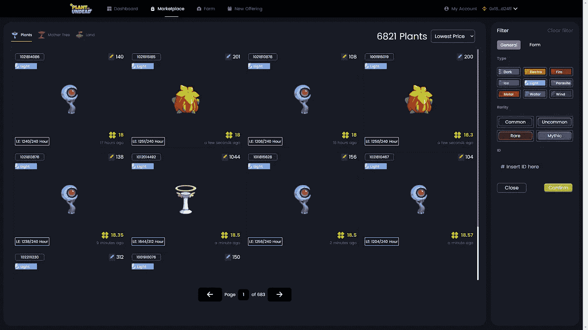

# 利用数据科学在游戏中获利的两种方式

> 原文：<https://medium.com/geekculture/two-ways-to-use-data-science-to-profit-in-play-to-earn-games-1f7b89fc73de?source=collection_archive---------16----------------------->

## 或者，你如何利用数据科学来最大化你在游戏中的利润

在本文中，我将展示如何使用数据科学来了解游戏市场中发生的事情，并从两个方面从中获利。更具体地说，我将展示如何使用从 PlantsVsUndead 智能合同收集的数据来了解逐项列出的游戏市场。


Photo by [Carl Raw](https://unsplash.com/@carltraw?utm_source=medium&utm_medium=referral) on [Unsplash](https://unsplash.com?utm_source=medium&utm_medium=referral)

# 动机

像 Axie Infinity，PlantsVsUndead 和，MIR4 这样的游戏是互联网的新热点。就像任何副业一样，玩家们现在都渴望学习如何玩这些游戏，并承诺从中获利。想法很简单:投资一些加密货币，购买一些物品或角色，每天玩它们。这些物品或角色通常会产生第二种游戏货币。生命药剂(LP)在 Axie Infinity 可以转化为 axs，光能(LE)在 PlantsVsUndead 可以转化为 pvu，玄铁在 MIR4 可以转化为 DRACO。

作为一名数据科学研究者，我最近对数据流很感兴趣。这是数据挖掘的一个领域，处理连续生成的数据。这带来了额外的挑战，例如快速计算、存储和从变化的数据中学习。所以我想“为什么不呢！?"，并参加了一个快速的兼职项目，以提高我的技能和测试我获得的知识。在我看来，从两个方面来看，玩挣钱游戏对人们来说可能是一种骗局:一是玩它，并尽可能获得最好的物品；另一种是根本不玩，只是用交易概念在网上翻东西，赚点快钱。

# 数据

从这类游戏中收集数据很容易。因为他们是基于区块链的，所有人要做的就是连接到链并读取块，或者连接到智能合同并读取流，或者从游戏市场中抓取。



A screenshot of the PlantsVsUndead Marketplace

一旦收集完毕，就必须将数据解析成可以处理成可用数据的格式。在加密数据上常见的挑战是，值通常存储为整数，并且必须进行相应的处理才能在知识发现过程中使用。数据科学过程的大部分时间都花在清理和处理数据上。这个过程通常是乏味的，我们现在就跳过它，因为我们对其中有趣的部分感兴趣！

# 知识发现

既然我们有了要处理的数据，我们必须在数据中建立要寻找的问题。在玩“先玩后赚”游戏的情况下，我们试图在最短的时间内最大化我们的利润。为什么？因为密码市场存在许多风险。例如，加密货币贬值的风险很高。因此，我们必须尽快获利了结！

但是怎样才能最快的实现利润最大化呢？好吧，看看你的方法:玩或翻转植物。让我们更详细地看看它们

# 游戏策略

在 PVU 的例子中，我们必须收获我们的植物，这将产生更多的能量。然后，LE 可以兑换成 PVU 硬币，PVU 可以兑换成其他加密货币，如币安硬币(BNB)、以太币(ETH)甚至 theter(USDT)，只有这样，我们才能将其兑换成法定货币，如美元。

对植物的快速分析表明，在不考虑货币贬值、奖金、不利事件(PvU 有一个天气系统，可以增强或减弱你的植物，此外还有可能损害你的作物的乌鸦)和通货膨胀的情况下，一般植物需要大约 300 个小时才能实现收支平衡。实际上，这意味着你承诺至少玩半个月游戏才能开始盈利。正如他们所说，“时间就是金钱”！


Photo by [Ben White](https://unsplash.com/@benwhitephotography?utm_source=medium&utm_medium=referral) on [Unsplash](https://unsplash.com?utm_source=medium&utm_medium=referral)

# 翻转策略

翻转物品的想法很简单！你必须以便宜的价格购买一件物品，然后以合理的价格或者更高的价格出售，而不是不停地玩游戏。为了解决这个问题，我首先查看了植物的可取性，这样我只购买经常出售的植物。这可以通过查看特定工厂类型的成功拍卖数量来完成。

现在我知道一种植物是可取的，我的第二步是找到所说的植物的市场价值。这里的难点是使用多变量分析来发现价格，因为简单的平均值计算是做不到的！我的方法是使用干净的数据，并对其运行多元回归。我喜欢让 LazyPredict [1]为我做这件事。它运行一堆回归变量，并为我提供所有这些变量的结果，然后我可以找到最好的一个并优化它！如果你还没有尝试过 LazyPredict，今天就做吧，它太棒了！我将在这里给出一个例子，这样您就可以看到它有多简单了！

```
from lazypredict.Supervised import LazyRegressor
from sklearn import datasets
from sklearn.utils import shuffle
import numpy as npboston = datasets.load_boston()
X, y = shuffle(boston.data, boston.target, random_state=13)
X = X.astype(np.float32)offset = int(X.shape[0] * 0.9)X_train, y_train = X[:offset], y[:offset]
X_test, y_test = X[offset:], y[offset:]reg = LazyRegressor(verbose=0, ignore_warnings=False, custom_metric=None)
models, predictions = reg.fit(X_train, X_test, y_train, y_test)print(models)
```

在浏览了这些模型之后，我发现最理想的一个是竞争数据科学家的方法 xgboost [2]，这并不奇怪。它对植物进行了公平的定价，没有过度配置。然后，我可以在新创建的拍卖中使用它。我将我的模型用于成功销售的植物，并用它来预测投放市场的植物的价格。每当一株植物的报价明显低于预期价值时，我就买下它，然后以平均价格(或者更低一点，这样我可以卖得更快)出售，就这样！

# 摘要

边玩边赚是副业领域的新宠。它允许玩家在赚钱同时享受乐趣。在这篇文章中，我向你介绍了两个基于数据科学的策略，让你像老板一样利用这种方式获得被动收入！不要错失良机，今天就开始将您的数据分析技能应用到游戏中吧！

# 参考

[1]https://github.com/shankarpandala/lazypredict

[2][https://xgboost . readthedocs . io/en/latest/python/python _ API . html](https://xgboost.readthedocs.io/en/latest/python/python_api.html)