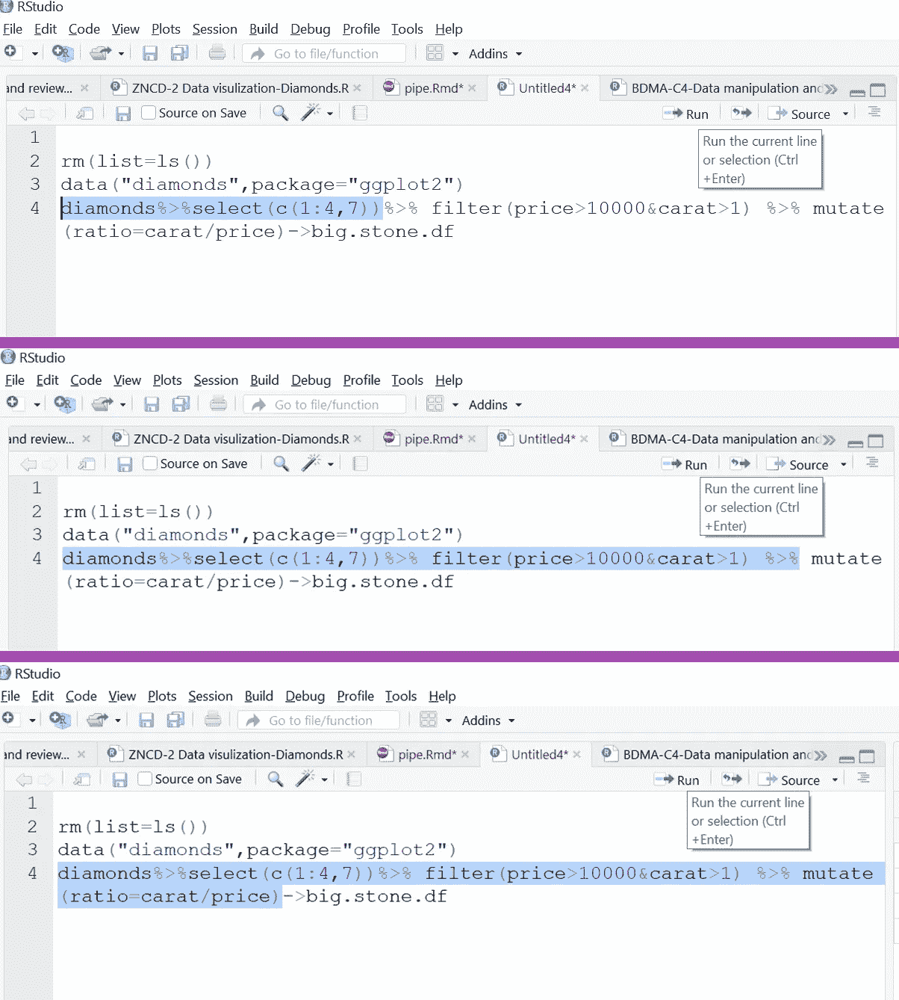
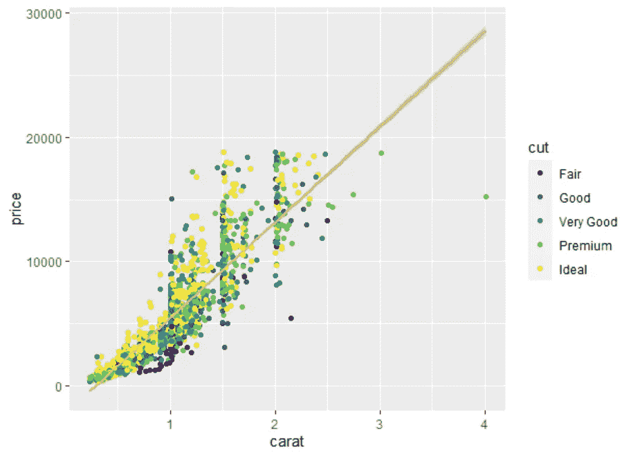

# 两种武器，立即缓冲你的 R 编码能力-第 1 部分

> 原文：<https://medium.com/geekculture/two-weapons-to-instantly-buff-your-r-coding-power-part-1-79446ddb8cd0?source=collection_archive---------17----------------------->


是的，没错。R 初学者可以通过掌握两件事来快速升级自己的 R 编程能力:管道操作(%>%)和自己编写函数，用于绘图、数据角力、回归结果提取等等。

假设你刚刚开始学习如何在工作中使用 R——就像我的一些 MBA 学生一样，他们第一次从我这里听说了 MSE，现在你很高兴在 R-Studio 中编写代码，例如，运行基于逻辑回归的分类。在这种情况下，是时候加速你的 R 编码技能了。我的意思是用更简单、更短、更清晰、更少错误、更易理解的代码来做同样的工作。除非你通过你写的代码行获得报酬，否则你应该认真考虑遵循这篇文章和下一篇文章告诉你要做的事情。它们将显著提高你的编码技术。

这篇文章是关于使用 pipe 的，这是由两个包 *dplyr* 和 *tidyr* 共同支持的一系列操作。像往常一样，我将重点关注一些最常见的操作场景。

什么是管道操作？从一个数据帧开始作为初始输入，管道操作使用上一个操作的结果作为下一个操作的输入，并继续下去，直到得到想要的结果(例如..修改的数据帧，绘图)。管道符号%>%像管道一样连接操作，使数据流顺畅，而不会创建临时输出。

## *数据框操作*

首先，我们用一个简单的例子来说明管道操作。使用钻石数据，选择 4c 和 price，保留价格> 10000，克拉大于 1 的钻石，计算价格/克拉的比值作为一个新的变量，创建一个新的 dataframe，命名为 big.stone.df 来存储这五个变量。如果不使用管道，您可能会编写这样的代码

```
data("diamonds",package="ggplot2")
df1=diamonds[,c("carat","cut","clarity","color","price")]
big.stone.df=df1[df1$price>10000&df1$carat>1,]
big.stone.df$ratio=big.stone.df$carat/big.stone.df$price
```

或者您可以使用 *names* 命令来获取列 id 并直接引用 id。

```
names(data)
df1=diamonds[,c(1:4,7)]
```

使用管道，它只是一条线。

```
diamonds%>%select(c(1:4,7))%>% filter(price>10000&carat>1) %>% mutate(ratio=carat/price)->big.stone.df
```

请注意，将操作结果分配给新数据帧的参数可以放在开头。我更喜欢=而不是->。同样的结果。

```
big.stone.df=diamonds%>% select(c(1:4,7)) %>% filter(price>10000&carat>1) %>% mutate(ratio=carat/price)
```

仅供参考，管道操作允许您轻松地调试代码，以查看“堵塞”在哪里。从头开始，您可以逐个管道地选择要执行代码的部分，如下所示。



FYII，注意示例中使用的那些函数，*选择*修剪列，*过滤*修剪行。*突变*添加列。这三个函数可能是管道操作中最常用的。

自己练。如果我想如下修剪数据帧:添加一个 ID 列，它只是数据帧中的行 ID，然后只保留 x，y，z(是的，diamonds 数据中的最后三列称为 x，y 和 z)，并保留 x > 5 或 y 的行< 6\. How to write the code?

## Data wrangling using pipe

The following example is to create pivot-table alike output using pipe. I used a pipe example in my first [中的文章](/geekculture/employing-r-to-serve-excel-spreadsheet-pivot-table-generation-multiple-worksheets-creation-and-6a01751dd767#8bcb-69b2d35433d2)关于挂钩 R 和 Excel，我收到了几个查询。以下是方法。假设我们想知道钻石数据中每种颜色的平均价格和平均克拉数。

```
diamonds %>% group_by(color) %>% summarize(mean.carat=mean(carat),mean.price=mean(price))
```

使用 *group_by* 应用“分组”功能，然后*汇总*计算功能。*表示*可以被你选择的其他统计函数代替(*中值*、*标清*)。

如果您想获得每个子组中的频率/计数，

```
diamonds %>% group_by(color) %>% count(color)
diamonds %>% group_by(color) %>% summarize(freq=n())
```

上面两行是等价的。

如果您想计算每个切割和颜色组合，有多少钻石，只需将切割添加到 *group_by* 参数中。请注意，任何未添加到 *group_by* 中的变量都将从输出中删除。

```
diamonds %>% group_by(color,cut) %>% summarize(freq=n())
```

这是一个“长形状”的数据；使用*展开*或 *pivot_wider* 功能，您可以将其转换为“宽形状”关于 long 和 wide 数据类型的详细解释和操作，请参见本文。

```
diamonds %>% group_by(color,cut) %>% summarize(freq=n()) %>% pivot_wider(names_from=cut,values_from=freq,values_fill=0)
```

上面的例子说明了管道操作的便利性:只需为新的操作添加另一个管道。结果可以通过在末尾添加 *- > dataframe.name* 保存到数据帧中。

## 焊接和配管

第三个例子是管道到地块。假设我们要为随机抽样的 3000 克拉创建一个价格和克拉的散点图，用不同的切工着色，并添加一条模拟回归线来拟合数据。

```
set.seed(450)
diamonds %>% sample_n(3000) %>% 
  ggplot()+
  geom_point(aes(x=carat,y=price,color=cut)) +  geom_smooth(aes(x=carat,y=price),color="sandybrown",method="lm",se=T)
```

我使用一个简单的 ggplot 来说明管道操作。处理后，数据被用作 *ggplot* ()中的输入。剩下的都是 ggplot 演练。您可以像处理普通 ggplot 编码一样，将其他绘图元素和美学样式添加到绘图中。



FYIII， *sample_n* 是在管道作业中创建随机样本的一种便捷方式。 *set.seed(450)* 是为了保证每次你都得到相同的随机样本，这样你就可以复制你的结果。

## Piping 出回归结果

最后一个例子是用管道输出回归结果。假设我想研究所选钻石的价格与 x，y，z 的线性关系，只需要系数估计和 p 值。

```
set.seed(450)
diamonds %>% sample_n(3000) %>% filter(carat>1|color=="E") %>% lm(price~x+y+z,data=.)
```

以上是我们最初尝试的代码。我们直接使用 *lm* 函数。注意， *lm* 函数中的*数据*自变量:*数据=。*

这个。就是替换输入。管道操作最适合接受输入作为第一个参数的函数。例如*选择(数据，列名)*，*过滤(数据，条件)*。对于其他数据参数不是第一个的函数，比如 *lm(formula，data)，我们用*。来代替管道输送的东西。您不能使用 *data= diamonds* ，因为传递给 lm 的不是原始的 diamond 数据。

我们可以通过在管道末尾添加 *summary* ()来获得更详细的结果。有些人可能会满意，但仍然不是我们想要的。

```
set.seed(450)
diamonds %>% sample_n(3000) %>% filter(carat>1|color=="E") %>% lm(price~x+y+z,data=.)%>% summary()
```

我们可以将摘要保存为一个对象 lm.sum，用它来玩。

```
set.seed(450)
diamonds %>% sample_n(3000) %>% filter(carat>1|color=="E") %>% lm(price~x+y+z,data=.)%>% summary()->lm.sumlm.sum#checkunlist(lm.sum$coefficients[,c(1,4)]) %>% as.data.frame() %>% setNames(c("Coefficient","p-value"))
```

如果您熟悉线性回归的汇总结果，您会知道系数估计值存储在列表的第 1 列，p 值存储在称为系数的第 4 列。一个简单的 *unlist* 函数将它们提取出来，并再次通过管道转换成 data.frame(如果你的目的是导出的话)。SetNames 帮助定制你选择的列名。

FYIV。我的大数据营销课程的学生在第一天学习了管道操作。他们能做到，你也能。

如果这篇文章让你觉得学到了什么，请继续升级到下一级: [**第二部分构建自己的 R 函数**](https://martinqiu.medium.com/two-weapons-to-instantly-buff-your-r-coding-power-part-2-de8e95b92dc2) **。**

*专门介绍贸易工具的系列文章。*