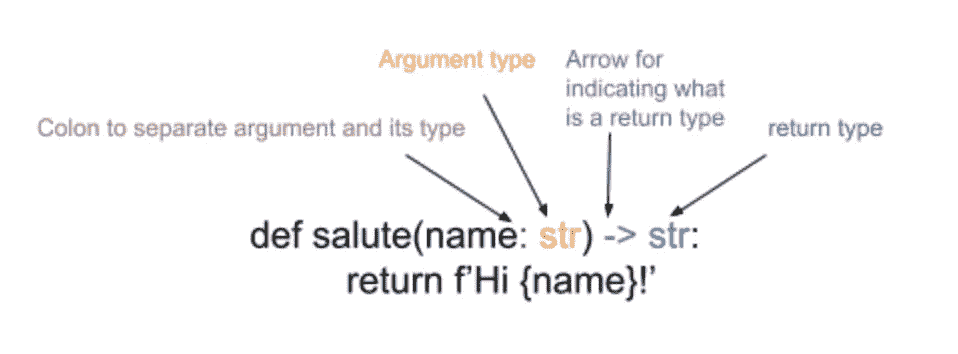

# Python 中的类型提示注释

> 原文：<https://medium.com/geekculture/type-hints-annotations-in-python-6777c328196c?source=collection_archive---------11----------------------->


Photo by [Amit Rai](https://unsplash.com/@amitrai10?utm_source=unsplash&utm_medium=referral&utm_content=creditCopyText) on [Unsplash](https://unsplash.com/s/photos/egrets-nest?utm_source=unsplash&utm_medium=referral&utm_content=creditCopyText)

我在 Python 中遇到过一些函数，这些函数具有传递给函数的参数的内联注释以及带注释的返回类型。它看起来与我在研究生院的正式方法课上学到的 Dafny 和 Lustre 语言非常相似。有点惊讶于自己的 Python 中存在这样的功能，也以为它应该被更多的使用！使代码更具可读性和可理解性，如果代码没有 docstring，还可以节省大量代码的时间。这个开始至少是一年前写的，所以把它从我的优先队列中去掉。🦾

因此，我们通过查看一些常见且有用的类型和示例来深入研究 python 中的类型提示注释。让我们来看看一些常见的注释:

`typing`模块支持类型提示。最常见的支持包括`Any`、`Union`、`Callable`、`TypeVar`。

下面是一个被注释的简单方法。



Method annotation

正如我们所看到的，我们在冒号后标注参数，返回类型由向前的箭头指示。

现在让我们检查类型别名:

type alias example

这里我们使用`Matrix`作为更复杂类型签名的别名，如示例`list[list[int]]`所示。

现在我们来看`NewType`型。

运行该文件时，输出是:

```
Natural Flowers: Calla Lily, Hibiscus
Hybrid Flowers: Stargazer, Hardy Hibiscus
```

我们使用`NewType`通过从原始类型`str`派生出子类来创建我们的定制类型`Flower`。我们能够对新类型进行字符串操作。我们能够进一步子类化`Flower`类型并创建类型`HybridFlower`。

让我们来看看这些新类型的实际应用方法:

运行该文件时，我们得到:

```
Calla lily
```

然而，我们不能在类中子类化`NewType`。例如:

```
class FlowerInventory(Flower):
    pass
```

给出`TypeError`。

现在，我们来看看`Callable`型。

在这里，`Callable`就是`get_next_10_items`的方法。我们看到`Callable`有一个`Callable[[arg1_type, arg2_type], return_type]`的语法。我们也可以像`Callable[[...], return_type]`一样用文字省略号代替调用签名。甚至返回类型可以是省略号。

现在让我们来看看`Generics`。由于保存在容器中的对象不能以通用的方式进行静态推理，`collections.abc`模块被扩展以支持容器中的元素类型。

看到第 7 行的函数签名，我们知道`bouquets`是`Flower`对象类型的集合，`address`是`Flower`对象类型和字符串的映射。泛型也可以通过使用称为`TypeVar`的可用工厂类型来参数化。

看，我们可以用任何类型的对象集合创建一个函数，并得到最后一项。

现在我们来看`Any`。静态类型检查器会将每种类型视为与`Any`兼容，将`Any`视为与每种类型兼容。

看，我们能够将变量`a`的原始类型`Any`改为字符串和列表。我们甚至可以用`a`的值来指定`int`的类型！如果没有提到返回类型，函数的返回类型是隐式的`Any`。

现在我们来看`Union`。`Union[X, Y]`相当于`X | Y`，表示`X`或`Y`。

看返回类型是`Rock`、`Paper`中的`Union`还是`Scissor`类型。

现在，我们来看看`Optional`型。`Optional[X]`就是`X | None`的意思。请注意，这与默认值不同。

看，当调用方法`own_pet`时，我们可以传递`Cat`实例或`None`对象！我们还通过使用`Optional`类型来处理返回类型！

文章到此为止！祝贺完成。

总之，Python 支持类型提示。

我希望这篇文章能让你对 Python 中的注释有更深入的了解，并可能在你的代码库中更频繁地使用它们？！

在我的下一篇文章中再见。🦔

**灵感:**

*   [打字模块](https://docs.python.org/3/library/typing.html)

你可以在 [Patreon](https://www.patreon.com/dkhambu) 上支持我！