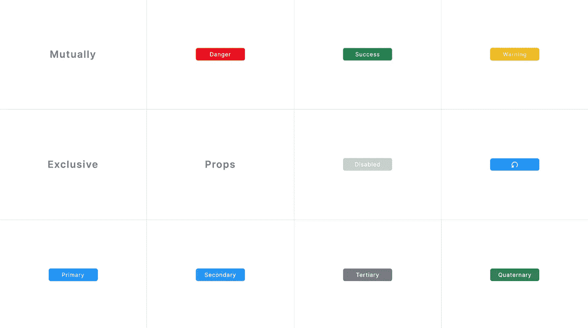
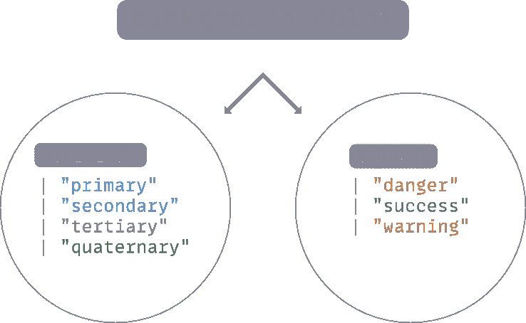
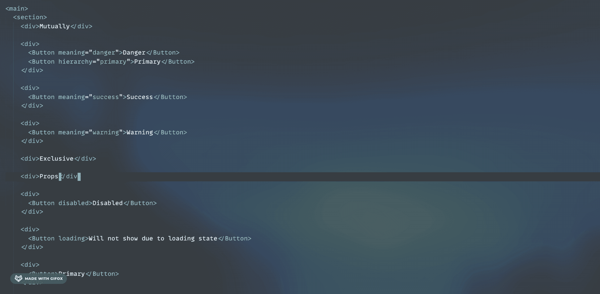
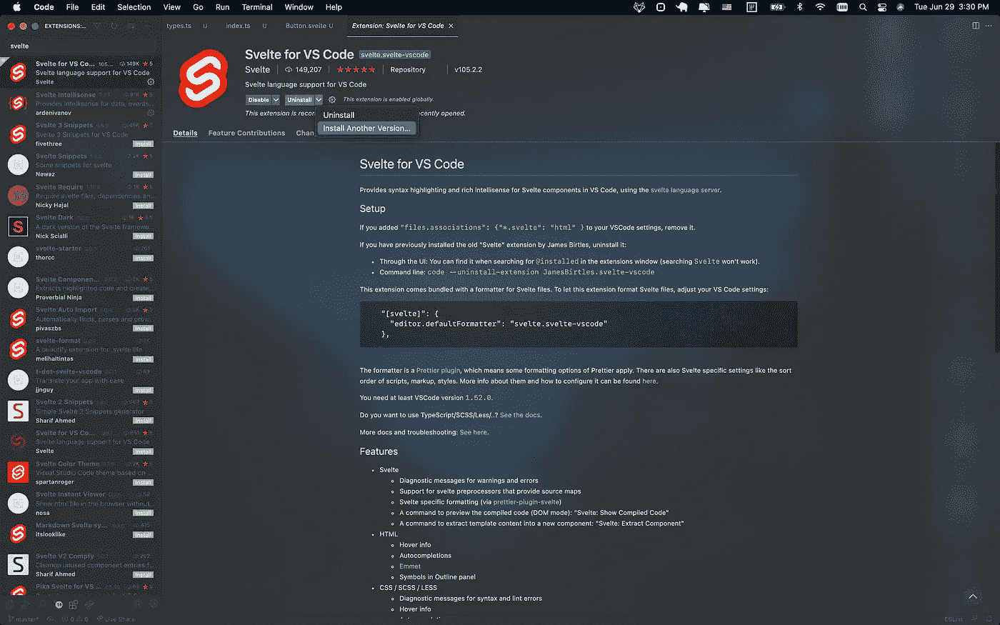

# 纤巧组件道具中的类型安全互斥

> 原文：<https://medium.com/geekculture/type-safe-mutual-exclusivity-in-svelte-component-props-3cc1cb871904?source=collection_archive---------16----------------------->

Photo by [Alice Yamamura](https://unsplash.com/@aakemiy?utm_source=medium&utm_medium=referral) on [Unsplash](https://unsplash.com?utm_source=medium&utm_medium=referral)

> *“黄色的树林里分出两条路……”*
> 
> *~罗伯特·弗罗斯特*

> *“…我采用了处理条件的代码路径。”*
> 
> *~大概不是罗伯特·弗罗斯特*

互斥是编程中极其常见的逻辑模式。请求可以成功，也可以失败。用户可以登录，也可以注销。

互斥性也不需要局限于两个对立的条件:用户可能有某个文档的*草稿*，该草稿在提交后*等待审查*；然后，当*正在审核*时，该文件可能会被审核人标记为*已申请*，直到该审核人标记该文件*已批准*或*已拒绝*。也许文件被批准了，但是还在等待同级或管理层的审核。也许文档的批准状态取决于提交者的附加操作。在维护多个评审者之间的这么多状态时，加上冲突管理[，交付软件的成本飙升](https://daverupert.com/2018/09/if-statements-should-cost-10000/)。

# 何时使用互斥道具

在前端框架的上下文中，区分这种互斥状态的最普遍的模式无疑是组件组合。

## 原子成分

但是当您深入到最基本的组件时，您开始不得不区分用于处理互斥情况的原子。

至于创建一个直观的组件 API，这不符合人体工程学。

必须区分`<DangerAlert />`、`<WarningAlert />`、`<SuccessAlert />`、`<InfoAlert />`等。在你的代码库中，比在`<Alert type="warning" />`中有一个接受`type`道具的警告稍微多一点认知负荷。

根据我的经验，一个组件的原子性和可重用性越高，用道具控制它的行为就越有意义。当组合一个具有大面积重叠功能的独立组件的工作量远远大于简单地公开替代属性时，这种模式也是一种解决方案。这样可以保持干燥，防止重复发明轮子。

# 我们正在建造的东西

The button’s presentational background color can be dictated by one of two design paradigms: branding hierarchy or semantic meaning.

我们将构建一个`<Button />`组件来处理上图中的所有情况，我们将使用互斥的道具来指定按钮遵循两种可能的`background-color`分配范例之一:品牌化/主题化`hierarchy`，或者语义化`meaning`。

大概，`"primary"`、`"secondary"`、`"tertiary"`和`"quaternary"`按钮的蓝色和深灰色是建立网站的公司或实体的品牌颜色，具有由设计师或设计系统定义的等级重要性，而绿色、黄色和红色按钮对用户来说具有语义意义，即按钮做了一些内在好的事情(我们设计系统的`"success"`颜色)，一些保证了`"warning"`的事情，以及一些保证了`"danger"`颜色的事情。

## 期望的 API

我们希望能够通过为期望的设计系统范例指定期望的文字值来使用我们的按钮组件。

我们想依靠默认的道具来指定最常用的设计范例的最常用的值，如果我们不指定的话。

最重要的是，当我们选择了一个设计范例时，我们希望另一个设计范例的类型安全*互斥*。如果两者都被指定，我们不希望开发人员必须找出哪一个胜出——编辑器应该简单地让他们知道只允许其中一个:

The Button should only accept a hierarchy prop OR a meaning prop— never both.

在撰写本文时，致力于[Svelte js](https://github.com/sveltejs)/[语言工具](https://github.com/sveltejs/language-tools) [的 svelet 团队在 9 天前发布了一个实验特性](https://github.com/sveltejs/language-tools/releases/tag/extensions-105.2.2)来使这种类型检查成为可能*，所以对下面的实现持保留态度:最终的类型 API 可能会有所改变！*

## 尽职调查

如果你正在积极使用 Svelte，你会知道 SvelteKit 正处于公开测试阶段，并且生态系统仍处于其羽翼未丰的阶段，但如果你想在开始之前对我们将要使用的语言功能做一些尽职调查，这里有你想看到的一切:

*   [俺(开！)GitHub 请求反馈问题](https://github.com/sveltejs/language-tools/issues/442)整合围绕为组件道具、事件和插槽预留接口的多个问题，超出了通过在`<script lang="ts">`中规范地键入`export let`语句所能实现的范围，导致了…
*   讨论如何公开这样一个 API 的 RFC
*   发出了一个[拉取请求](https://github.com/sveltejs/rfcs/pull/38)，导致对最初概述的 API 进行了更多的讨论和编辑
*   pull 请求被合并到版本 [extensions-105.2.2](https://github.com/sveltejs/language-tools/releases/tag/extensions-105.2.2) 的发布中，它引用了[这个 RFC](https://github.com/dummdidumm/rfcs/blob/ts-typedefs-within-svelte-components/text/ts-typing-props-slots-events.md) ，它概述了发布的实际用法——在那里您将找到[我们将使用的 API](https://github.com/dummdidumm/rfcs/blob/ts-typedefs-within-svelte-components/text/ts-typing-props-slots-events.md#typing-props)。

# 安装

这个例子假设您已经[设置了](https://kit.svelte.dev/)一个 TypeScript SvelteKit 环境。

你需要确保在你选择的编辑器中安装我上面提到的 sveltejs/language-tools[extensions-105 . 2 . 2](https://github.com/sveltejs/language-tools/releases/tag/extensions-105.2.2)release。在 VS 代码中，你需要安装 Svelte for VS 代码扩展。检查 v105.2.2 的最低版本。如果实验 API 被替换为其他版本，您可能需要安装确切的版本，直到本教程得到更新(在 VS 代码中，“卸载”按钮上的下拉(▾)箭头为您提供了“安装另一个版本”的选项

Ensure you have at least v105.2.2 installed

# 类型

我发现在一个独立于我的组件的文件中定义我的组件类型比直接在组件的`<script lang="ts">`标签中写更容易。在编写库时，我发现，这样更容易确保. d.ts 声明文件进入构建输出。新的`$$Props` API 将需要在组件本身中定义，因此我们将定义除此之外的所有内容:

**道具**

从上到下，我们得到越来越少的粒度。我们定义字符串文字，我们将接受它们作为各自的`HierarchyOptions`和`MeaningOptions`联合中的`hierarchy`或`meaning`的选项。这可以防止`"any ol' string”`被传给那些道具。

互斥踢脚位于`Hierarchy`和`Meaning`接口内。在这里，我们定义了将被组合/扩展到我们的`<Button />`将接受的所有其他道具中的对象类型。这里最大的收获是当`Hierarchy`接口被实现时，`meaning`必须`never`存在；当`Meaning`执行时，道具`hierarchy`必须`never`存在。

然后，非此即彼的概念被封装在`BackgroundColor`联合中，这表示我们的背景色对象可以是接受`hierarchy`属性而*拒绝*属性的`Hierarchy`对象，或者是接受`meaning`属性而*拒绝*属性的`Meaning`对象。

为了让所有这些工作，接受`never`类型的属性也必须是可选的(由`?`指定)。否则，我们将陷入两难境地，需要一个其值必须永远不存在的属性！你可能还想知道将`?`添加到`Hierarchy.hierarchy`中是否是一个错别字:不，不是的，它存在的原因是允许默认选择`{ hierarchy: 'primary' }`，这里没有指定任何设计范例——这是一种简化使用最普遍的背景颜色的按钮的使用的简写。

**调色板**

该文件中定义的调色板类型与本文的主要目标并不相关，所以如果您愿意，可以跳过这一部分。

我们可能想要一个在`HierarchyOptions`和`MeaningOptions`联合中列出的可能的、容易记住的背景颜色值列表的原因是，我们可能想要将那些“家喻户晓”的名称与更难记住的特定颜色值相关联。

一个`Palette`对象可能实际上存在于某个全局`Theme`对象上，多个组件可能会消耗同一个`Palette`对象来实现两个崇高的目标:在整个组件系统中统一颜色，以及实际颜色值的单一来源——在一个地方改变`"danger"`颜色，然后*爆炸！*它传播到所有组件。

但是我们指定了`ColorCombinations`,而不是单个值——为什么？它的长与短是可及性；定义预先研究的符合 WCAG 标准的对比，确保我们可以自信地使用我们的颜色，并以一种容易理解的方式用对比色呈现文本和其他信息。

通过使用 TypeScript *映射类型* ( `[Property in …]`)从*派生`Palette`的对象类型，我们可以向`HierarchyOptions`或`MeaningOptions`添加额外的选项，而不必更改`Palette`的类型注释。*

# 履行

既然我们的实现是用我们的类型作为一个脚手架计划出来的，让我们把它们放在一起。

让我们创建一个配置文件来存放我们的调色板。对于您创建的任何其他组件，您可以将该对象用作一种单一对象，以便在整个应用程序中实现统一的颜色值:

这里没有什么值得一提的，除了这个导出的对象实现了我们之前创建的映射的`Palette`类型。

接下来，让我们一起来看看我们的`<Button />`:

这里有很多，但大部分是 CSS 和 JS Doc。值得一提的是，我们得到的 TypeScript IntelliSense 错误(参见上面的 VS 代码 GIF)很难解析，因此我发现添加 JS Doc 注释来补充 TS IntelliSense 是值得的，以便说明这些属性是互斥的。

接下来要注意的是我们的类型和`palette`实例导入*在*我们的道具类型注释之前。我们想先导入的原因是，这样,`$$Props`定义就可以作为互斥的`BackgroundColor`和(`&`)其他属性的*交集*导出，否则这些属性可以正常定义。

`$$Props`是最前沿的语言习惯被发现得更早。[概述其用法的 RFC](https://github.com/dummdidumm/rfcs/blob/ts-typedefs-within-svelte-components/text/ts-typing-props-slots-events.md)使用了一个`interface`示例，但是在这里，我们需要一个`type`来创建我们已经创建的这个特殊对象类型和其他更常见的拼写道具之间的交集。

在这个定义中，我们将所有其他属性定义为可选的(`?`)，因为我们不希望父组件在不需要的时候指定它们，并且因为在下一个代码块中，我们将定义它们的默认值。

在定义了默认属性之后，我们有一段代码可能会觉得有点陌生:

最终，我们需要的是传递给组件的“家喻户晓”的颜色——可能是来自我们的`MeaningOptions`的`"danger"`，或者来自我们的`HierarchyOptions`的`"primary"`。我们利用一个立即调用的函数表达式(IIFE)来立即运行花括号中的代码，并将函数的返回值赋给变量`background`。这允许我们知道传递给组件的背景色的“家喻户晓的名字”,这样我们就可以用它来对照我们的`palette`实例来查找正确的颜色值。

在每次检查中，我们都使用`in`关键字来缩小道具的`BackgroundColor`部分是否看起来像`Hierarchy`或`Meaning`——这样做是安全的，因为虽然一个属性名称是可能的，但另一个可能会出现`never`。然后，我们使用`$$props`保留字(请放心，`$$props` *实际上是*[的习惯用法，有据可查的苗条的](https://svelte.dev/docs#Attributes_and_props))来访问实际值。如果我们已经写了没有`hierarchy`或`meaning` prop 的类似`<Button>Button Text</Button>`的东西，用尽了两个检查，我们分配默认的 props 值`"primary”`。

所有这些都集中在这里，在我们返回的`<button>`元素的`style`属性中:

如果按钮不是`disabled`，则根据传入的`hierarchy`或`meaning`属性，查找`palette`并分配实际的颜色值。

# 使用

我们的`<Button />`到此为止！一如既往，非常感谢您的编码。

现在组件完成了，世界是你的了，你可以随心所欲地使用它！

我们将使用一个代码片段来创建我们在代码演练之前展示的网格布局，从而结束本文: