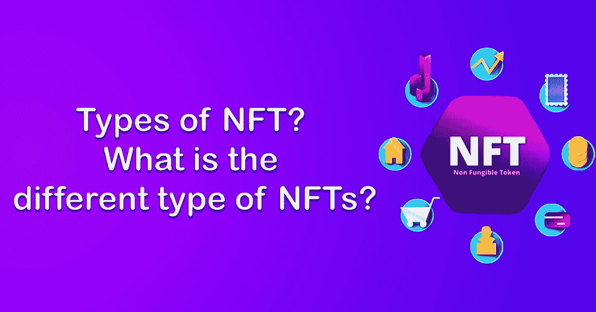
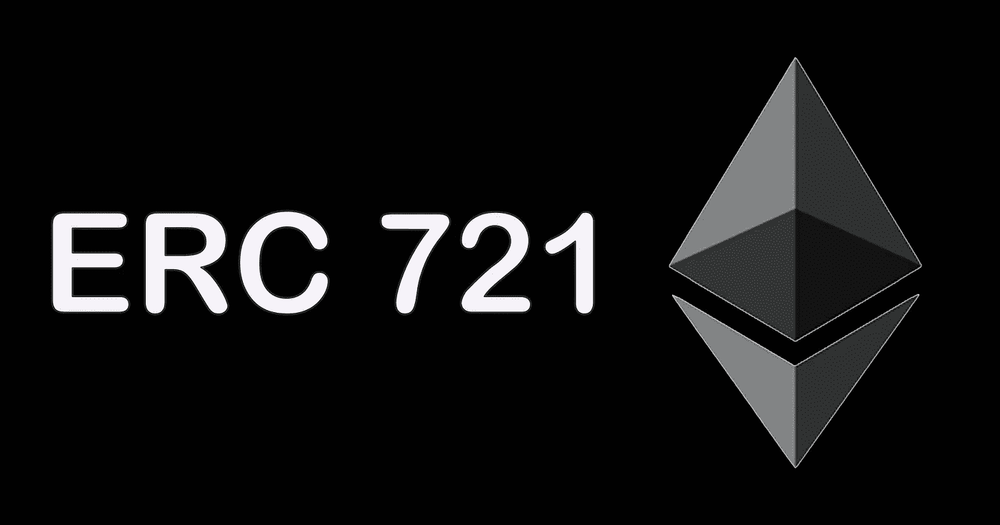
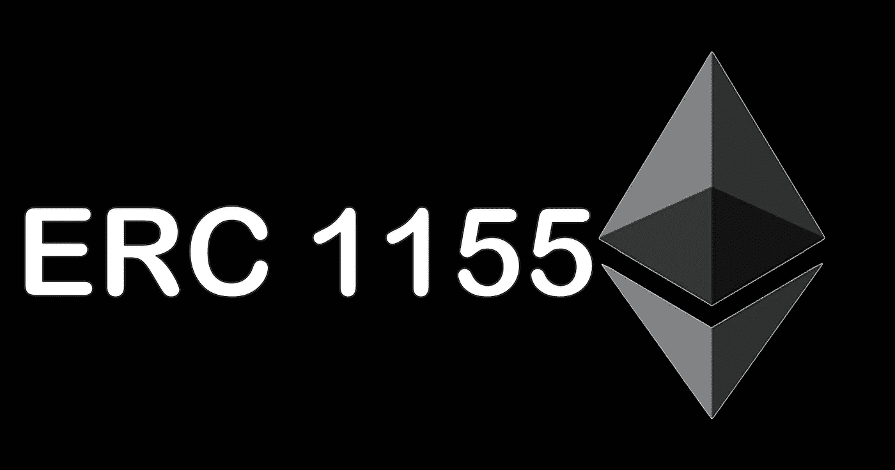
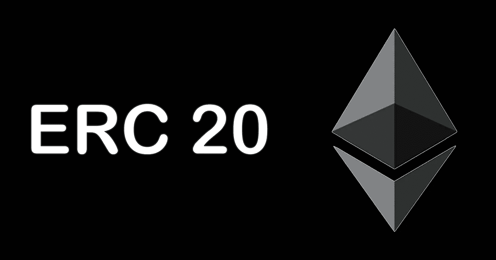
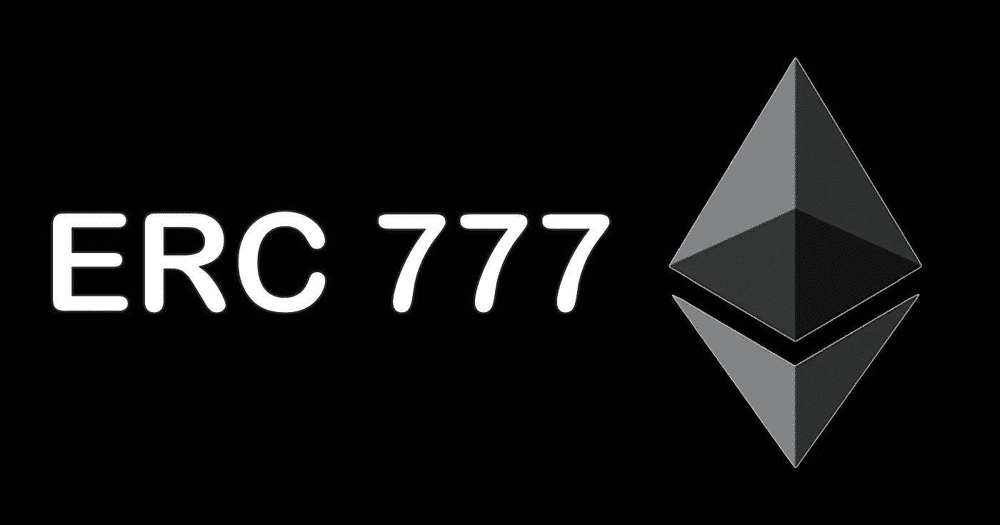
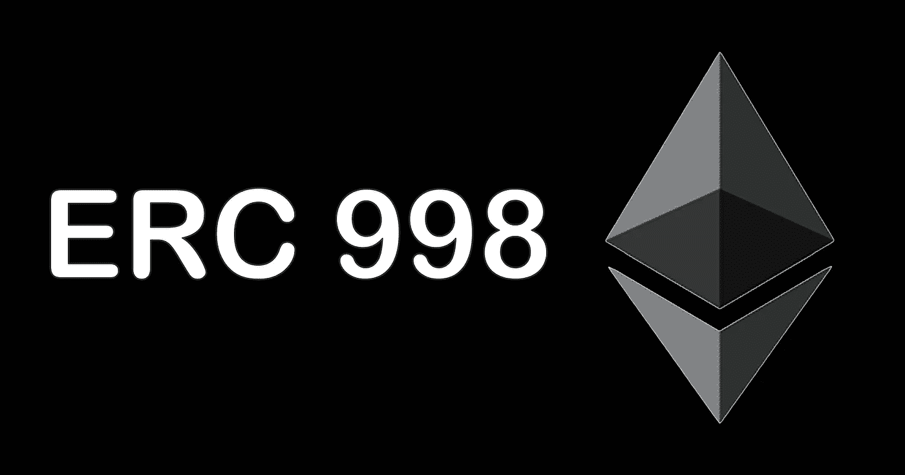

# NFT 的类型？有哪些不同类型的非功能性测试？

> 原文：<https://medium.com/geekculture/types-of-nft-what-are-the-different-type-of-nfts-5fbad127b67d?source=collection_archive---------8----------------------->

## 全球数字市场上一些流行的 NFT 标准

大家好，在这个 21 世纪，我们都见证了市场上不可替代的代币和数字资产的价值的不可估量的增长。这使得许多新的人把他们的钱投资到 NFT 来获取利润。也许这群人是在没有任何经验和知识的情况下从非正规金融服务中获利的。在起步阶段，他们可能会面临许多困难和困惑。他们需要了解数字生态系统的结构，以便交易他们的数字资产。别担心，在这篇博客中，我将解释统治当前数字市场的不同类型的非功能性数字技术。

**Different types of NFTs**

**一些不同类型/标准的非功能性测试**

1.  ERC 721
2.  ERC 1155
3.  ERC 20
4.  ERC 777
5.  ERC 998

**1。ERC 721**

ERC-721 的缩写是以太坊征求意见稿 721。ERC 721 这个术语是由威廉·恩特里肯、雅各布·埃文斯、纳斯塔西亚·萨克斯和迪特·雪莉在 2018 年 1 月提出的。ERC 721 是不可替代证券中最重要的标准之一，这一标准吸引了许多投资者。ERC-721 引入了不可替换令牌的新标准，这种标准与其他标准相比有其独特的价值。简而言之，ERC 721 令牌是唯一的，可以比来自同一智能合约的另一个标准令牌具有唯一的值。自 2017 年 9 月推出用户界面以来，这些令牌吸引了大量社区。ERC 721 令牌允许区块链开发者标记任意数据的所有权，极大地增加了以太坊/多边形区块链上令牌的设计结构。

**ERC 721**

**2。ERC 1155**

ERC1155 也被称为**多令牌标准。**顾名思义，这些令牌管理区块链合约的多种令牌类型。在 ERC 1155 中，每个部署的 NFT 代币合同可以包括不可替换代币的许多版本或组合副本，或者其他数字配置。所以 ERC 1155 的价值比 ERC 721 要小一点。这些代币可以实现与 ERC 721 和 ERC 20 相同的功能。许多版本可以铸造相同的 ERC 1155 代币。因此，与 ERC 721 相比，ERC 1155 的价值略有下降

**ERC 1155**

> 当你购买 NFT 艺术品时，你是在购买一个人的故事。他们经历了什么，他们是如何成长的——他们成为今天的他们的原因

**3。ERC 20**

ERC-20 缩写为以太坊征求意见稿 20。ERC 20 这个术语是由 Fabian Vogelsteller 在 2015 年提出的。它是一种令牌标准，为安全的嵌入式智能合约中的数字令牌执行 API 接口。ERC-20 提出了可替换令牌的标准值，简而言之，他们为每个令牌设置了标准属性，使其完全像另一个令牌的复制品。例如，一个 ERC-20 令牌将获得 ETH 的所有质量，这意味着一个令牌始终等于其他所有令牌。实现以下方法的智能合约被称为 ERC-20 令牌合约。

**ERC 20**

**4。ERC 777**

ERC 777 标准就像在解码与 ERC 20 的向后兼容性时交互令牌的新定义。ERC 777 的前进是为了确定与令牌的交互。这些标准试图利用 ERC 1820 的特权来追踪特定的智能契约和常规的**区块链地址**，以允许所部署的契约之间的兼容性。这些更新的标准有助于改进广泛使用的 ERC 20 令牌。

**ERC 777**

**5。ERC 998**

Erc 998 是区块链技术的未来。目前，ERC-998 标准在区块链技术中起着至关重要的作用，它以更好的方式合成了 NFT。ERC 998 作为 ERC-721 和 ERC 20 的更新版本，它允许您构成 ERC-721 数字资产的唯一令牌组。其中 ERC 998 在铸造时支持**零汽油费**数字资产。在交易的时候，这是一个超快的区块链交易，只需要几秒钟就可以完成交易。区块链所有权地址将完全转移给所有者。

**ERC 998**

**结论**

现在我们在博客的结尾，这里有不同类型的 NFTs 标准。每个投资者在从他们想要的市场购买或投资他们的 NFT 之前必须知道以下标准。希望这个博客能对大家有所帮助。如果你对我的博客有任何疑问。请在评论区提出你的问题，我会尽力解答。

> 人们今天不理解 NFTs、元宇宙和 crypto，就像他们在 1995 年不理解在线购物一样

谢谢你阅读我的博客。我将带着一个新的有趣的话题回来。拜拜！