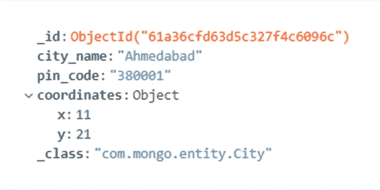
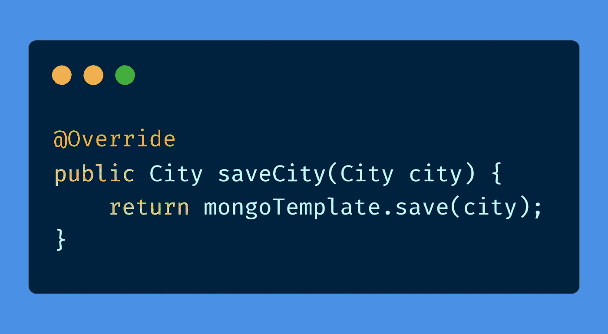
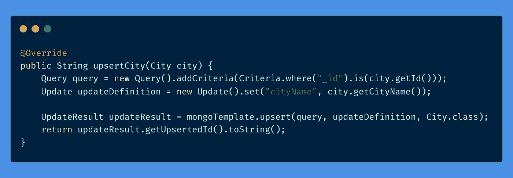
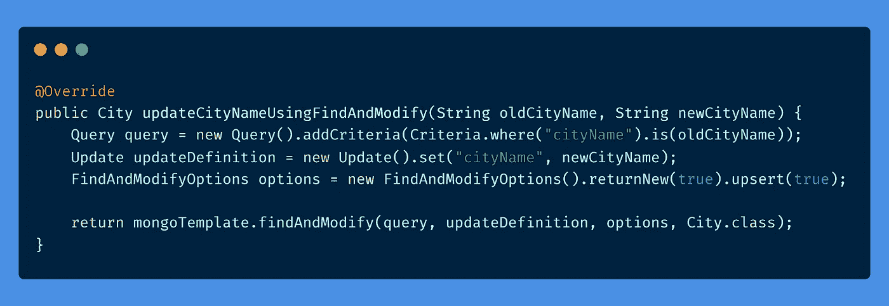
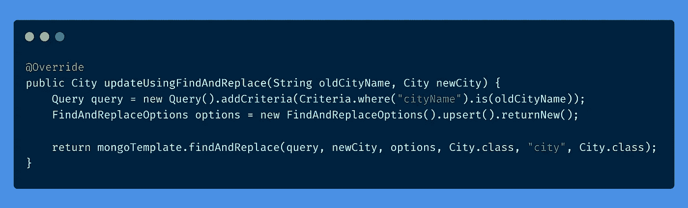
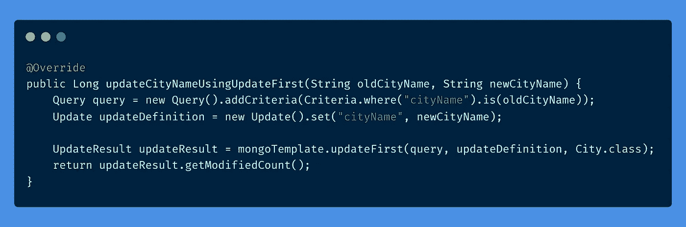
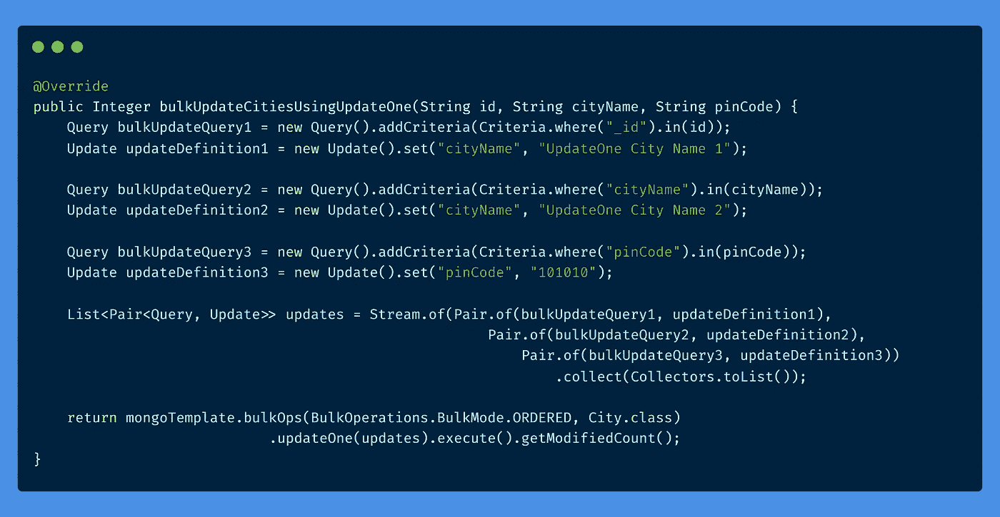
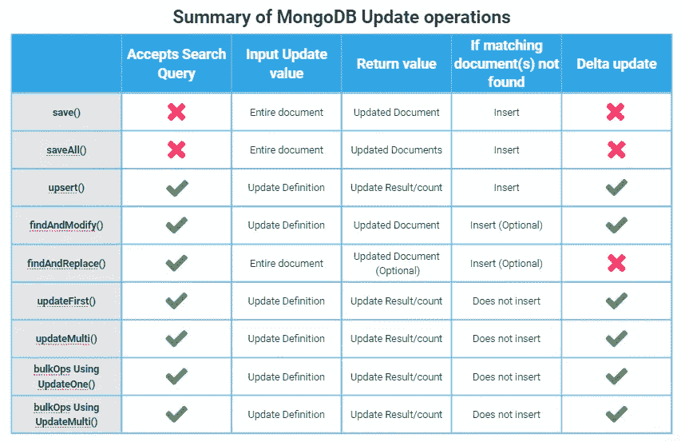

# MongoDB 中使用 Spring Boot 的更新操作的类型

> 原文：<https://medium.com/geekculture/types-of-update-operations-in-mongodb-using-spring-boot-11d5d4ce88cf?source=collection_archive---------1----------------------->

当我开始使用 MongoDB 和 Java 时，我经常面临从 MongoDB 提供的各种方法中选择正确的更新操作的困难。甚至在代码审查期间，我曾经从审查者那里得到建议使用比如说，***‘findAndModify()’***而不是***‘update multi()’***的评论。而这些经历成了我写这篇文章的理由。

这里我们将讨论 MongoDB 中不同类型的更新操作，以及它们之间的区别。

Image Source: FOSS Linux from Google search

我使用 Java-8 和 Spring-Boot 框架来实现用例，可以在这里找到@ [Github-MongoOperations](https://github.com/dhavalsimaria/mongo-operations) 。

我们将基于五个参数评估所有的“更新操作”:
1 .搜索标准
2。输入更新值(整个文档或更新定义)
3。返回值(整个文档或更新结果统计数据)
4。未找到匹配文档时的默认行为。
(插入/不插入/灵活)
5。增量更新

我们将使用一个简单的***【City】***文档对象与 Mongo 数据库进行交互。

**‘City’** document in Mongo database

现在我们已经有了背景，让我们进入我们的主题。

# **保存():**

***save()*** 方法不接受任何参数或标准来查找需要更新的文档。默认情况下，如果提供了文档对象，它会尝试使用 ***'_id'*** 来查找文档。

如果找到该文档，则 ***save()*** 方法更新该文档，否则创建一个新文档。

***【save()】***方法返回更新/新创建的文档对象。

使用 ***save()*** 方法的缺点是，即使我们只想更新 20 个字段中的 1 个或 2 个字段，我们也必须提供整个文档对象作为输入参数。含义 ***save()*** 方法不允许增量更新。

MongoTemplate **‘save’** method. MongoRepository **‘save’** method is also used in a similar manner.

# **saveAll():**

***【save all()***方法与 ***save()*** 方法完全相似，只是有两点不同。

不是一个 document 对象，它将类似 *List < City >* 的 document 对象集合作为输入参数，并返回类似 *List < City >* 的更新/插入的 document 对象集合。

# **upsert():**

***【upsert()***方法类似于***【save()***方法，如果找到，它更新文档，否则根据提供的数据创建一个新的文档。

但是有几个区别 b/w***upsert()***&***save()***的方法。
与 ***save()*** 方法不同， ***upsert()*** 接受除了 ***'_id'*** 以外的其他字段的条件来查找要更新的文档。

***upsert()*** 返回一个包含更新操作细节的确认对象，如' *upsertedId '，' matchedCount '，' modifiedCount'* 。

***upsert()*** 不接受整个文档对象，只接受包含所有字段都必须更新的详细信息的 UpdateDefinition。

这个功能有它自己的优点和缺点。

这里的优势是我们可以进行增量更新。这意味着如果一个对象包含 20 个字段，那么显式地更新任意 2、3 或 n 个字段都是可能的。我们不需要再次提供整个文档对象来保持我们的更改。

这里的缺点是，如果没有找到符合给定标准的文档，那么 ***upsert()*** 将创建一个只包含 UpdateDefinition 中提供的字段的对象。这可能会导致向数据库中添加不完整/损坏的数据。

MongoTemplate **Upsert** method

# **findAndModify():**

***findAndModify()***集合了 ***upsert()*** 和 ***save()*** 两种方法的优点。

像 ***upsert()*** 方法一样，***findAndModify()***方法也接受除了 ***'_id'*** 之外的其他字段的标准来查找要更新的文档。

我们在这里也可以做 delta 更新，像 ***upsert()*** 方法。

***findAndModify()***不接受整个文档对象，只接受包含所有字段都必须更新的详细信息的 UpdateDefinition

与 ***save()*** 方法一样，***findAndModify()***方法返回整个文档对象。此外，我们可以灵活地指定是希望旧的更新前的文档对象还是新的更新后的文档对象作为返回值。

通过向***findAndModify()****方法提供*‘upsert(true)’*选项，我们可以选择是否要插入新文档。*

**

*MongoTemplate **FindAndModify** method*

# ***findAndReplace():***

****findAndReplace()***允许我们使用对任何字段的查询来查找文档。
一旦找到该文档，它将使用我们在请求中提供的新文档替换该文档。*

*通过为***findAndReplace()****方法提供*‘upsert()’*选项，我们可以选择是否插入新文档。**

**我们还可以通过向***findAndReplace()****方法提供 *'returnNew()'* 选项来选择是否希望更新的文档作为返回值。***

**增量更新是不可能的，因为我们需要提供用于替换现有文档的整个文档。**

****

**MongoTemplate **FindAndReplace** method**

# ****updateFirst():****

*****【update first()***接受除 ***'_id'*** 以外的其他字段的条件来查找要更新的文档。**

**我们也可以在这里做增量更新，像 ***upsert()*** 方法。**

**与 ***upsert()*** 方法一样，***update first()***返回一个包含更新操作细节的确认对象，如 *'upsertedId '、' matchedCount '、' modifiedCount'* 。**

**但是，如果没有找到匹配的文档，它将不会基于 UpdateDefinition 中提供的字段在数据库中创建新文档。**

*****update first()***与其他增量更新操作的唯一区别在于，它将只更新所有符合更新标准的文档中的第一个文档。**

****

**MongoTemplate **UpdateFirst** method**

# ****updateMulti():****

*****update multi()***和***update first()***完全类似，除了一点。与***update first()***不同，它会更新所有符合更新条件的文档。**

****

**MongoTemplate **UpdateMulti** method**

# **使用 **UpdateOne()进行批量操作:****

*****使用 UpdateOne()*** 的 BulkOps 接受一个或多个用于单独查询的输入参数。我们还需要提供对应于每个搜索查询的 UpdateDefinitions。这意味着，我们将不得不提供搜索查询和更新定义的 ***【对】*** 来指示当特定的搜索查询满足时应该更新什么数据。

它还意味着所有的批量更新操作都是增量更新，与 ***save()*** 和***findAndReplace()***方法不同，它不接受整个文档作为输入。**

**单独满足每个查询的“第一个”文档将被更新。**

**如果没有找到匹配的文档，它将不会基于 UpdateDefinition 中提供的字段在数据库中创建新文档。**

**所有查询的更新是互斥的，即一个文档不必满足多个查询。**

**与***update first()***方法一样， ***BulkOps 使用 UpdateOne()*** 返回一个包含更新操作细节的确认对象，如 *'upsertedId '、' matchedCount '、' modifiedCount'* 。**

****

**MongoTemplate **BulkOps** using **UpdateOne** method**

# ****使用 UpdateMulti()的 BulkOps】****

*****BulkOps 使用 UpdateMulti()*** 与 ***BulkOps 使用 UpdateOne()*** 完全相似，除了一点。与使用 UpdateOne() 的 ***BulkOps 不同，它将更新与更新标准中的任何一个查询匹配的所有文档。*****

****

**MongoTemplate **BulkOps** using **UpdateMulti** method**

****

*****参考文献*** [弹簧数据 MongoDB —参考文献](https://docs.spring.io/spring-data/mongodb/docs/current/reference/html/#reference)**

**[春季博客—文字搜索](https://spring.io/blog/2014/07/17/text-search-your-documents-with-spring-data-mongodb)**

**[MongoDB BulkWrite 文档](https://docs.mongodb.com/manual/reference/method/db.collection.bulkWrite/#db.collection.bulkwrite--)**

**[Spring Docs — Mongo 批量操作](https://docs.spring.io/spring-data/mongodb/docs/current/api/org/springframework/data/mongodb/core/BulkOperations.html)**

****以上例子的完整代码可以在 [Github-MongoOperations](https://github.com/dhavalsimaria/mongo-operations) 中找到。****

****干杯！！****