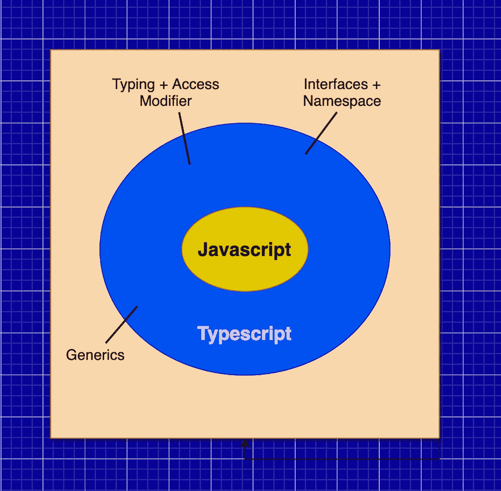

# 打字稿——优点和要避免的常见错误

> 原文：<https://medium.com/geekculture/typescript-advantages-common-mistakes-to-avoid-13ae5395dcc2?source=collection_archive---------1----------------------->

Typescript 是 Javascript 的超集，为代码提供了类型化的特性。近几年来，TypeScript 越来越受欢迎。它被列为 2020 年最有前途的五种语言之一。

许多开发人员经常混淆 Typescript 和 Javascript，但是与 Javascript 相比，Typescript 提供了更多的功能。它有助于克服 Javascript 出现的许多运行时错误。JavaScript 的一个问题是所有对象都有动态类型。动态类型的自由经常导致降低程序员工作效率的错误。另一方面，Typescript 允许在我们需要时进行静态类型化。

## *使用 typescript 的一些好处是:*

*   静态打字
*   TypeScript 编译成 JavaScript。因此，TS 可以在任何可以使用 JS 的地方使用:前端和后端
*   IDE 的动态类型、自动完成功能
*   由于 Typescript 是一种面向对象的语言，它使我们的代码更加一致、干净、简单和可重用。这反过来有助于实现正确的设计模式



Typescript — A Javascript that scales

除了静态类型分析，TypeScript 还向 JavaScript 添加了以下特性:

*   接口
*   无商标消费品
*   名称空间
*   零检验
*   访问修饰符

Typescript 中还有许多其他功能。其中一些是

1.  *可选链接*

当您试图访问嵌套数据时，数据嵌套越多，您的代码就越乏味。

在下面的例子中，要访问`address` ,你必须遍历`data.customer.address`,数据或客户可能是`undefined`,因此，习惯上检查遍历的每一层是否都是结合`&&`操作符或其他类似技巧定义的，如例子所示。

现在，您可以使用`.?`操作符来随意链接数据访问。这样，如果有一个尚未定义的父链，嵌套链将在链中的任何位置返回 undefined，而不是在运行时崩溃。

2.*无效合并*

`Nullish Coalescing (??)`操作符是`OR (||)`操作符的替代。如果左边是`null`或`undefined`，则返回右边的表达式。这和`||`有什么不同？`||`本质上是 JavaScript 中的布尔 OR 运算符，我们试图利用短路来返回第一个非 false 值。这可能会产生意想不到的后果，因为数字 0 或空字符串将被视为`false`，而这可能是一个有效的输入要求。让我们用一个例子来说明:

使用 Typescript 时，某些错误会经常出现。此外，还有一些关于声明类型的误解和错误。所以我尽我所能提取了错误观念的共同根源，并解释如下。

**1)跳过类型检查或过度使用** `**any**` **类型**

使用 TypeScript 的一个要点是在变量和函数中有类型。所以我们应该尽可能地使用它们。因此，我们不应该在大部分代码中使用`any`类型。

然而，在我们的应用程序中，有些地方我们真的不能确定什么值会存在。例如，当我们处理一些外部输入或调用后端 API 时。而这些都是`unknown` 型最契合的地方。我们应该用`unknown`代替`any`。`unknown`没有类型断言，几乎不能赋给任何东西。我们也不能访问`unknown`的任何属性，也不能调用/构造它们。

**2)使用功能类型**

尽管 TypeScript 允许使用`Function`类型，但这很少是个好主意，因为它只是`*any*`函数。使用`Function`，我们不仅丢失了输入参数类型，还丢失了结果类型。让我们考虑下面的例子；

```
const allowCb = (cb: Function) => {
  cb();
};
```

这给了我们一种用一种类型来处理所有场景的方法，我们可以用我们想要的任何东西来调用它。我们可以调用类型为`Function`的值，但是我们将处理一个非类型化的函数调用，因为返回类型将总是`any`。如果您觉得有必要使用这种解决方案，这可能是一个信号，表明您应该重构代码，以便能够提供更强类型的信息。

**3)乱搞类型推理**

在 Typescript 中，我们可以有隐式和显式类型。理想情况下，我们应该总是避免在可以推断的地方添加类型。冗余的类型注释使我们的代码变得混乱，这使得它更难阅读。这也让重构变得更加痛苦。考虑下面的例子；

```
const studentArr = [{
   "name": "Sagar",
   "gender": "Male"
}]const studentObj = studentArr[0];// with explicit **any**
const copiedStudentObj : any = {...studentObj};
copiedStudentObj.rank = 3;
studentArr[0] = copiedStudentObj;// With implicit type
const copiedStudentObjWithSpread = {...studentObj, rank: 3}
studentArr[0] = copiedStudentObjWithSpread;
```

在这种情况下，通过重写某个字段来析构对象确实足以让 TypeScript 精确地推断出`copiedStudentObjWithSpread`变量，并发现`copiedStudentObjWithSpread`与`studentObj.`是类型兼容的。有时移除`any`将允许类型推断完成所有工作。

**4)使用包装对象代替原语**

在 Javascript 中，我们有像`string`、`number`、&这样的原语类型，还有像`String`、`Number`这样的包装器类型。考虑下面的例子；

```
const primitiveFn = (name: string) => {
  console.log(name);
}const WrapperFn = (name: String) => {
  console.log(name);
};gprimitiveFn("sagar")
WrapperFn("sagar")
```

`String`和`string`不等价。Typescript 建议了一个合适的解决方案。我们应该总是避免那些大写类型(包装器对象)，因为它们只是一种特定于 Javascript 的方式，在原语上提供一些方法。我们通常不需要也不应该直接使用它们。

**5)不跳过冗余定义**

DRY(不重复自己)是最重要的编程哲学之一。Typescript 使我们能够通过对现有类型应用一些操作来从现有类型创建类型。考虑下面的例子；

```
interface Customer {
   id: number,
   name: string,
   address: {
      city: string,
      state: string
   }
}interface Address {
  city: string;
  state: string;
}interface BankCustomer {
   id: number,
   name: string,
   address: {
      city: string,
      state: string
   },
   branchName: string,
   accountNo: number
}
```

在这个场景中，我们可以看到`Customer`和`BankCustomer`是两个不同的接口。`BankCustomer`只是`Customer`的延伸。同理`Address`接口可以引用`Customer`接口的某个特定属性的类型。我们可以把上面的例子改写成；

```
interface Customer {
   id: number,
   name: string,
   address: Address
}interface Address {
  city: string;
  state: string;
}interface BankCustomer extends Customer {
   branchName: string,
   accountNo: number
}
```

我们应该尽可能地避免重复属性、值和类型，以使我们的代码更干净和可维护。如果需要，我们也可以使用联合类型、标记接口。

**6)不使用严格模式**

我们应该在编译器配置中始终使用严格的模式设置，以避免几乎所有上述错误。

我们应该做的一些编译器设置是启用下面的标志:

`—-strictNullChecks`、`—-noImplicitAny`、`—-noImplicitThis`

# 摘要

Typescript 是最有前途的语言之一，可用于前端和后端来创建大型复杂的企业应用程序。我希望本文能帮助您避免在 Typescript 开发中出现的常见错误。这个主题本身是巨大的，像这样的列表不能声称是完全详尽的，所以你应该继续探索。