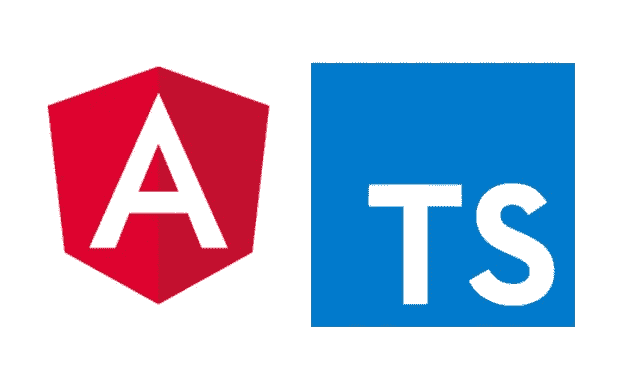

# 打字稿基础

> 原文：<https://medium.com/geekculture/typescript-basics-f172df91ddf5?source=collection_archive---------10----------------------->

## 帮助您开始使用 Angular 的 TypeScript 基础



Angular + Typescript

这篇文章可以在你跳入 Angular 这样的使用 TypeScript 但是时间不够的大型框架之前使用。我试图涵盖所有的基本概念，并用即使是 12 岁的孩子也能理解的例子来解释它们。

**注意:**在本文中，我将把 TypeScript 称为 TS。你可以使用 [**TS 操场**](https://www.typescriptlang.org/play) 来练习

**原始类型**:字符串、数字和布尔易于理解和定义。

```
let username: string = "User";let age: number = 25;let Isworking: boolean = true;
```

**TS**中的字符串数组可以定义为 string[]

```
let food: string[];food = ["Pizza", "Burger", "Fries"]; for(let item of food){console.log(item);}
```

[日志]:“披萨”

[日志]:“汉堡”

[日志]:“薯条”

**TS**中的对象可以定义一个合适的结构，这样任何人都不能进一步改变基本结构

```
let person : {name: string,age: number,hobbies: string}; person = {name: "User",age: 25,hobbies: "eating"}console.log(person.name);
```

[日志]:“用户”

但是如果有人试图改变物体的结构如下:

```
person = {isEmployee: false}
```

TS 将引发错误:类型“{ is employee:boolean；“}”不可赋给类型“{ name:string；年龄:号；爱好:弦乐；}'.

我们甚至可以将这两种复杂类型与一个包含一系列爱好的对象结合起来

```
let person : {name: string,age: number,hobbies: string[]}; person = {name: "User",age: 25,hobbies: ["Eating", "Sleeping", "Coding"]}
```

现在，如果我记录爱好，输出将如下所示:

```
console.log(person.hobbies)
```

[日志]: ["吃饭"，"睡觉"，"编码"]

此外，我们可以拥有对象数组:

```
let person : {name: string,age: number,}[]; person = [{name: "User1", age: 25},{name:"User2", "age": 26}] for(let per of person){console.log(per);}
```

[日志]: { "姓名":"用户 1 "，"年龄":25 }

[日志]: { "姓名":"用户 2 "，"年龄":26 }

## TS 中的类型推理

在 TS 中，当没有显式类型注释时，有几个地方使用类型推断来提供类型信息。

例如:

```
let data = "Username";data = 123;
```

这样做将会抛出一个错误，因为 TS 在第一次定义时试图将数据的类型推断为一个字符串，即使我们没有特别提到它。

这是一个很好的特性，我们应该大部分时间坚持使用 TS 推断的类型。

**TS 中的联合类型**

联合类型是由 ***两个或更多其他类型*** 组成的类型，代表可能是这些类型中*任何一个*的值。我们把这些类型的每一种都称为联盟的*成员*。

早些时候，当我们重新定义 data = 123 时，我们遇到了一个问题，因为 TS 类型推断已经将数据类型设置为字符串。

这可以通过使用以下联合类型来解决:

```
let data: string | number = "User";data = 123;console.log(data);
```

[日志]: 123

**类型别名**

我们一直通过将对象类型和联合类型直接写在类型注释中来使用它们。这很方便，但是经常希望不止一次地使用同一个类型，并且用一个名称来引用它。

而不是一次又一次地定义类似的类型，比如:

```
let person : {
name: string,
age: number,
};let people : {
name: string,
age: number,
}[];
```

一个*类型别名*就是——任何*类型*的一个*名称*。类型别名的语法是:

```
type Person = {
name:string,
age: number
}let person: Person;let people: Person[];
```

所以我们只在一个地方定义它，可以在其他任何地方重用，这样节省了我们很多时间。

**功能和类型**

函数是 JavaScript 中传递数据的主要方式。TypeScript 允许您指定函数的输入和输出值的类型。

例如:

```
function addData(x:number, y: number) {
   return x + y;
}let res = addData(1,2);
```

这里 x 和 y 参数我们指定为数字，但是返回类型被 ts 推断为数字。

将鼠标悬停在 addData 上时，它会显示:

*函数 addData(x:数字，y:数字):数字*

你可以观察到 ***: number*** 在*函数 addData(x: number，y: number)* 之后不是来自我们，是由 TS 推断出来的。

这里我想提到的另一件事是使用 **any** 作为类型:

```
function printData(val: any){
  console.log(val);
}printData("Hi There!");
```

这里推断的返回类型将是空的，因为这个函数不返回任何东西，无论提供给这个函数什么，我们都记录下来:因此我们使用了任何类型。

**TS 中的泛型**

根据[typescript.org](https://www.typescriptlang.org/docs/handbook/2/generics.html)的说法:软件工程的一个主要部分是构建组件，这些组件不仅要有定义良好且一致的 API，还要**可重用**。

能够处理今天的数据和明天的数据的组件将为您提供构建大型软件系统的最灵活的能力。

让我们尝试创建一个可重用的函数，它在数组末尾添加一个新的提供的值，并返回一个新的数组。

```
function AddValueToEnd(myArray: any[], value: any) {
 const newArray = [...myArray, value];
 return newArray;
}const res = AddValueToEnd([1,2,3], 5);
```

但是这里我的 res 也被推断为 **any** 类型，这并不是很有用，因为我们可以执行 res[0]。对字符串执行 split(“”)，但对数字执行 split 时会出现运行时错误。所以这里*仿制药*扮演了一个非常重要的角色。

通过使用泛型，我们可以将函数写成:

```
function AddElements<T>(myArray: T[], value: T) {const newArray = [...myArray, value];return newArray;
}
```

现在我们可以用数字来表示:

```
let res = AddElements<number>([1,2,3], 5);console.log(res);
```

[日志]: [1，2，3，5]

与字符串一起使用，如下所示:

```
let res = AddElements<string>(['Welcome', 'Hie There', 'Hello!'], 'Thanks for reading!');console.log(res);
```

[日志]: ["欢迎"，"你好"，"你好！"，“感谢阅读！”]

这里，我的 newArray 采用了 type: T[]，因此返回类型根据所提供的内容变成了 number[]或 string[]。

想知道更多关于为什么知道 TS 是好的，看看这个很酷的 [**文章**](https://serokell.io/blog/why-typescript)