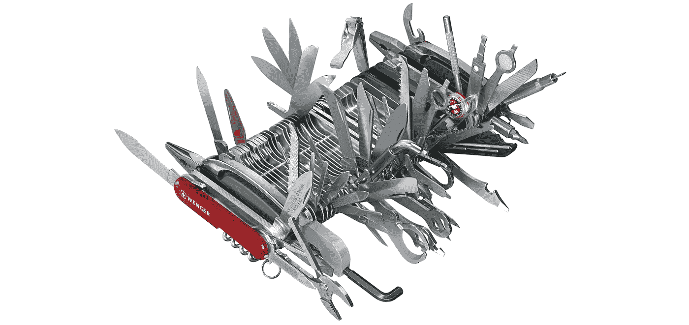

# TypeScript 内置类型。第三部分

> 原文：<https://medium.com/geekculture/typescript-builtin-types-part-iii-e2b75107c482?source=collection_archive---------11----------------------->

你好。TypeScript 内置类型三部曲的最后一集到了。但是首先让我解释一下这些文章是关于什么的，以及我为什么要写它们，迟做总比不做好。本系列的主要目的不仅仅是告诉您 TypeScript 特性以及如何使用它们。是关于了解黑暗面的力量！

开个玩笑，这是关于他们如何在引擎盖下工作的。这些知识为您提供了 TypeScript 语言的全貌，它是帮助您解决任何棘手任务的基础。当然，也要在面试中给你的潜在雇主留下深刻印象。如果你没有读过以前的文章，请先阅读，这是在进一步深入之前所必需的:

*   [TypeScript 内置类型。第一部分](/geekculture/typescript-bultin-types-part-i-b39d702bb536)
*   [TypeScript 内置类型。第二部分](/geekculture/typescript-builtin-types-part-ii-2059803be7f6)

好了，歌词说够了。今天第一种是`NonNullable<T>`。这个泛型类型从类型联合中移除了`null`和`undefined`类型，这是用条件类型实现的简单功能:

我说过，这种类型很简单。不能说很常用，但是可以很有帮助。例如，如果我们需要禁止对象中的可空属性，我们可以这样写:

在继续之前，我们需要复习一下关于`infer`关键字的知识。假设我们想从数组类型中提取条目类型

首先我们需要检查的是`T`数组，它可以用条件类型来执行:

如果`T`不是数组，`ArrayItem<T>`返回 never。那么我们需要引入一种新的类型`Item`:

但是我们在哪里可以定义`Item`类型呢？如果我们把它定义为泛型类型参数`ArrayItem<T, Item>`，那就没有任何意义了，因为我们不想把它传递给泛型，我们希望它作为结果接收。对于这种情况，TypeScript 为我们提供了`infer`关键字:

我们正在检查`T`是否扩展了`Item`的`Array`并返回`Item`，TypeScript 是否足够智能来确定`Item`的类型。重要说明:`infer`只能在条件类型表达式中使用

还记得 JavaScript 中的`call`和`apply`方法吗？它们之间有什么区别？

这两个函数方法允许我们在任何上下文中运行任何函数。对于`apply`方法，参数应该作为数组传递，对于`call`方法，参数应该一个接一个地传递。让我们看看它们在 TypeScript 中是如何工作的:

我们定义了一些函数类型，并尝试在上面运行`apply`和`call`。正如您所看到的，TypeScript 检查传递给我们函数的参数，并在传递不正确类型的参数时返回一个错误。

所以，TypeScript 可以确定函数参数的类型，你想得到函数类型的参数类型，你可以用`Parameters`来做:

首先`Parameters`检查`T`是否是表达式`T extends (...args: any) => any`的函数。之后是带有`infer`的条件类型。请注意`...args`被定义为 rest 参数，这意味着`args`是一个数组。这就是为什么`Parameters<T>`只返回数组类型，即使函数只接收一个参数。如果数组元素有不同的类型也没关系，就像这个例子`[number, string]`。

如果 TypeScript 能够检测函数的参数类型，也许它也能确定函数的结果类型？当然可以！

`ReturnType<T>`与`Parameters<T>`非常相似，它也使用`infer`但用于函数结果。您可能会注意到，如果`T`没有扩展`(...args: any) => R`，这个泛型将返回`any`。老实说，我不确定它为什么这样做，可能是为了支持没有定义的 JavaScript 函数。

同样的方法也适用于类构造函数。实际上，类构造是函数，为什么不呢。

`ConstructorParameters<T>`与`Parameters<T>`非常相似，唯一不同的是`new`关键字，`new (...args: any) => any`是类构造函数的定义。`ConstructorParameters<T>`的结果总是像`Parameters<T>`的结果一样是数组。不要忘记在类前添加`typeof`关键字，否则 TypeScript 会尝试将泛型应用于类，而不是其构造函数。

猜猜下一个类型是什么？显然，它检测类构造函数的返回类型。

`InstanceType<T>`很像`ReturnType<T>`和`ConstructorParameters<T>`。它执行与`typeof`相反的转换。用关键字`typeof`你可以将一个类表示为一个函数，用`InstanceType<T>`你可以将一个函数表示为它的类。你可能会问“我能用它做什么？我已经知道了代码中的所有类型”。在上面的例子中`InstanceType<typeof A>`只是`A`，这种过度工程的目的是什么？

`InstanceType<T>`对于操作类的函数很有用，例如依赖注入容器。

在这段代码中,`resolve`方法接收 class 作为参数，并创建/返回该类的现有实例。

以下是包含函数和类实用程序类型的提醒表:

很可能你在工作中不会用到这些类型。我对写这个话题持怀疑态度，因为它更多的是关于理论而不是实践。但是如果没有它，本系列文章将是片面的，正如我在本文开始时所说的，理解类型转换的 TypeScript 原则会给您提供关于这种语言的基础知识。

就是这样，TypeScript 内置类型系列的第三篇也是最后一篇文章。我希望这些文章能在您的 TypeScript 水域之旅中为您提供指导。欢迎在评论中提出任何问题！

下次见，servus！

*   [TypeScript 内置类型部分 I. (](/geekculture/typescript-bultin-types-part-i-b39d702bb536) `[Partial](/geekculture/typescript-bultin-types-part-i-b39d702bb536)` [，](/geekculture/typescript-bultin-types-part-i-b39d702bb536) `[Required](/geekculture/typescript-bultin-types-part-i-b39d702bb536)` [，](/geekculture/typescript-bultin-types-part-i-b39d702bb536) `[Readonly](/geekculture/typescript-bultin-types-part-i-b39d702bb536)` [，](/geekculture/typescript-bultin-types-part-i-b39d702bb536) `[Pick](/geekculture/typescript-bultin-types-part-i-b39d702bb536)` [)](/geekculture/typescript-bultin-types-part-i-b39d702bb536)
*   TypeScript 内置类型第二部分。( `[Record](/geekculture/typescript-builtin-types-part-ii-2059803be7f6)` [，](/geekculture/typescript-builtin-types-part-ii-2059803be7f6) `[Exclude](/geekculture/typescript-builtin-types-part-ii-2059803be7f6)` [，](/geekculture/typescript-builtin-types-part-ii-2059803be7f6) `[Extract](/geekculture/typescript-builtin-types-part-ii-2059803be7f6)` [，](/geekculture/typescript-builtin-types-part-ii-2059803be7f6) `[Omit](/geekculture/typescript-builtin-types-part-ii-2059803be7f6)` [)](/geekculture/typescript-builtin-types-part-ii-2059803be7f6)
*   [TypeScript 内置类型第三部分。(](https://luckylibora.medium.com/typescript-builtin-types-part-iii-e2b75107c482) `[NonNullable](https://luckylibora.medium.com/typescript-builtin-types-part-iii-e2b75107c482)` [，](https://luckylibora.medium.com/typescript-builtin-types-part-iii-e2b75107c482) `[Parameters](https://luckylibora.medium.com/typescript-builtin-types-part-iii-e2b75107c482)` [，](https://luckylibora.medium.com/typescript-builtin-types-part-iii-e2b75107c482) `[ReturnType](https://luckylibora.medium.com/typescript-builtin-types-part-iii-e2b75107c482)` [，](https://luckylibora.medium.com/typescript-builtin-types-part-iii-e2b75107c482) `[ConstructorParameters](https://luckylibora.medium.com/typescript-builtin-types-part-iii-e2b75107c482)` [，](https://luckylibora.medium.com/typescript-builtin-types-part-iii-e2b75107c482) `[InstanceType](https://luckylibora.medium.com/typescript-builtin-types-part-iii-e2b75107c482)` [)](https://luckylibora.medium.com/typescript-builtin-types-part-iii-e2b75107c482)