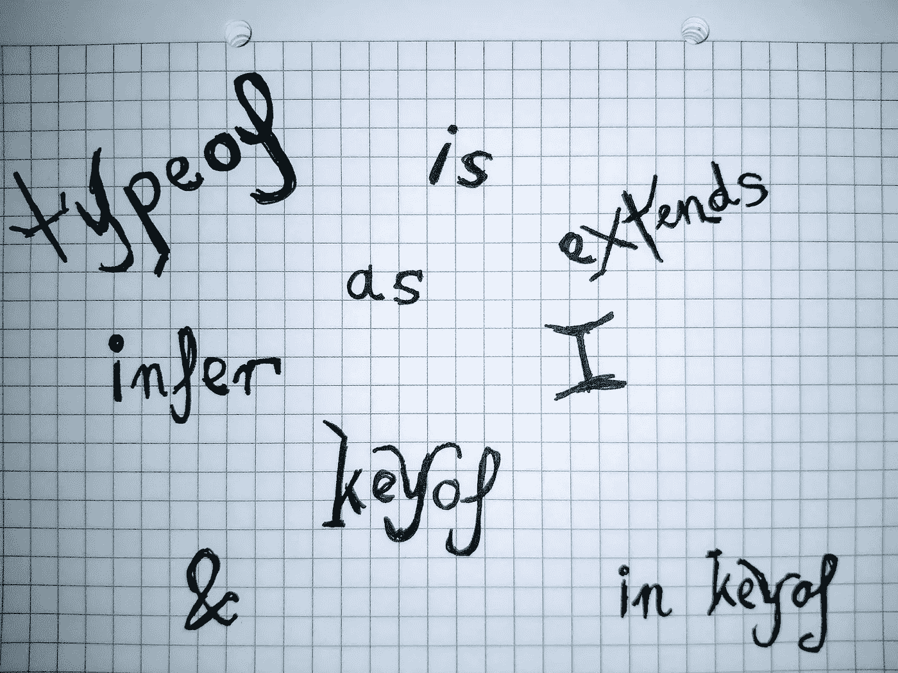

# TypeScript 编译时运算符

> 原文：<https://medium.com/geekculture/typescript-compile-time-operators-366ac7e49097?source=collection_archive---------0----------------------->

在我的上一篇文章中，我写了一些关于 TypeScript 中运行时操作符的选择。在这篇文章中，我将根据我作为软件开发人员的经验，讨论最相关的编译时操作符。这些操作符通过提供操作类型信息的语法层来丰富类型系统，并且它们不会留下任何运行时痕迹。

All the compile-time TS operators I could think of. Have I included all of them?

# 编译时运算符

## 运算符的类型

TypeScript 支持结构化类型，这允许软件开发人员在不指定确切的名义类型的情况下声明变量。一个变量(类型)可以实现多个名义类型，只作为属性名和它们的结构类型，递归应用，这是实现匹配算法的事情。该语言使开发人员能够使用名为 *typeof* 的编译类型操作符来访问元素背后的结构类型。

前面写的操作符与其运行时同名的操作符有完全不同的含义。因为我发现获取静态结构的类型太过平庸，不值得一写，所以我将使用一个不同的例子来展示操作符的能力——但是，我建议读者尝试一下，以理解它的局限性。可以说，获取函数的返回类型弥补了`typeof`操作符最流行的用法之一，如下所示:

通过使用带有 *ReturnType* 类型的`typeof`运算符实现的类型推断不支持泛型参数，如下例所示:

## is 运算符

由于 JavaScript 将变量视为动态类型，因此 TypeScript 委托开发人员确保他们声明的类型具有现实基础。未知输入类型和内部代码库类型之间的桥梁有两种形式:

*   运行时—由 RTTI(运行时类型信息)API 提供，
*   编译时—由类型保护提供。

基于从`typeof`、`instanceof`、`in`或其他运行时操作符接收到的布尔结果，TypeScript 可以推断出所讨论的任何变量的正确类型。这种机制适用于基本类型和*原型*类。对于普通的旧 JavaScript/TypeScript 对象，类型为`type`或`interface`(例如，微服务之间发送的结构)，编译器需要开发人员的明确操作。

如下面的代码片段所示，通过将`possibleUser`声明为`any`或`unknown`，对其属性的访问将会丢失。为了检查变量是否实现了类型`User`，我定义了一个名为`isUser`的类型保护函数——这个函数返回一个布尔值，该值作为唯一的参数回答了这个问题。

二元运算符`is`将变量名和所需的类型绑定在一起。实际上，它取代了或者说*而不是*，增强了类型保护函数的布尔返回类型。如果类型守卫返回 *true* ，操作符作为明确的方式告诉编译器该值符合声明的类型。

上面声明的代码片段提供了一种为简单的双属性结构构建类型保护的方法。首先，JavaScript 运行时评估未知类型的变量的行为是否像对象一样。其次，`typeof`操作符的本质迫使开发人员执行可空性检查。最后，运行时验证在上述对象上定义的各个属性的类型。

如果这个算法对读者来说显得复杂、平凡或者容易出错，我只能分享这种感觉。当处理未知的输入数据时，我建议从 TypeScript 可用的大量序列化库中进行选择。最后，我希望这些库的专门作者能够比任何开发团队更好地解决这个问题(因为后者需要专注于手头的其他任务)。

## 扩展运算符

TypeScript 在两种不同的上下文中使用了*扩展*运算符:

*   约束参数化类型的泛型类型(静态)，
*   为条件类型提供类型相等检查(静态)。

标准库中定义的`Record<K,V>`类型对它的第一个泛型类型参数 K(如*键*中)施加了一个约束，就像`extends keyof any`一样。只有`string`、`number`和`symbol`类型满足这样的要求，确保记录不包含不可访问的关键字。

为了演示第二个上下文的使用，我构建了一个名为`Letters`的字符串类型，它包括 ASCII 标准的前 5 个拉丁字符。为了创建一个删除元音的类型，我编写了第二个类型`Consonants<T>`，它使用嵌套的条件语句来执行任务，如下面的代码片段所示:

一些开发人员可能会指出,`extends`操作符有第三种用法，适用于一个类继承另一个类的情况。我不一定不同意这样的观察，但是，我认为在这个上下文中的`extends`标记是一个关键字，而不是一个操作符。如果它充当操作符，它将具有双重性，对运行时和编译时都有影响。

## 推断运算符

如果软件开发人员需要从不同的语言结构中提取类型，TypeScript 通过提供一元的`infer`操作符来介入。从参数化类型中提取单个泛型类型，例如`ReadonlyArray`，构成了操作符的最基本用法:

检查所述类型是否符合所选择的类型定义了用于提取的*操作方式*。如果检查成功，TypeScript 可以推断出由`infer`操作符的单个参数所指出的相应的泛型类型。否则，使用`never`类型提取失败。请注意，所描述的操作只发生在编译阶段。

下面的代码片段解释了如何同时提取两种类型:

从 TS 4.1 开始，标准库中有 6 种自解释类型利用了`infer`操作符:

*   `ThisParameterType`，
*   `OmitThisParameter`，
*   `Parameters`，
*   `ConstructorParameters`，
*   `ReturnType`，
*   `InstanceType`。

## as 运算符

根据我的经验，试图将一种类型的变量转换成另一种类型很容易弥补使用静态类型语言构建软件的前 10 个时间瓶颈。在穷尽了所有可用的类型操作之后，开发人员可能会选择重新定义相关变量的类型。`as`操作符提供了这样的功能，但也有一些合理的例外，如下面的代码片段所示:

TypeScript 对不合逻辑的强制转换不太宽容，但允许在将有问题的变量先强制转换为`unknown`类型后发生这种情况。类型系统也支持向下转换。尽管根据定义，`never`类型的变量没有可赋值的值，但该语言支持这种类型的细化。

如果某些结构不完全符合期望的类型，那么使用关键字`declare`可以作为`as`操作符的最后选择。依赖虚构的变量/常量声明，而不是耐心等待它们的定义，这是 TypeScript 开发中许多测试驱动的技术之一。

# 摘要

考虑到类型脚本语言的语法规则的观点，所呈现的编译类型操作符允许:

*   基于*静态*值创建类型(`typeof`操作符)，
*   *动态*类型-相等检查(`is`操作符)，
*   *静态*类型相等检查(`extends`操作符)，
*   *静态*型抽取(即`infer`运算符)，
*   *静态*类型重分配(`as`操作符)。

我发现有一点很重要，即使没有这些操作符，TypeScript 也能正常工作，但会牺牲一些类型安全保证(例如，不能存在合适的序列化库)和元编程能力。