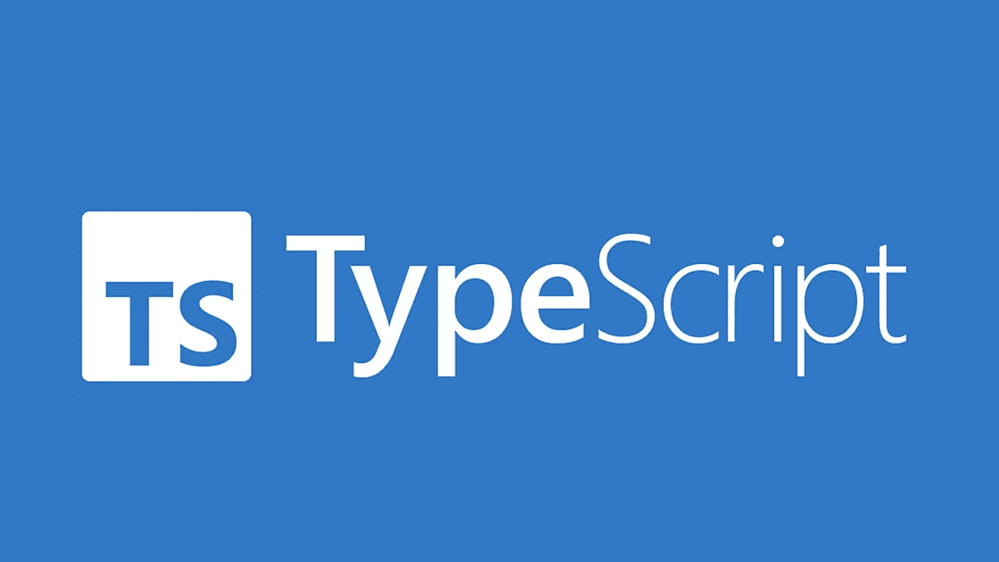
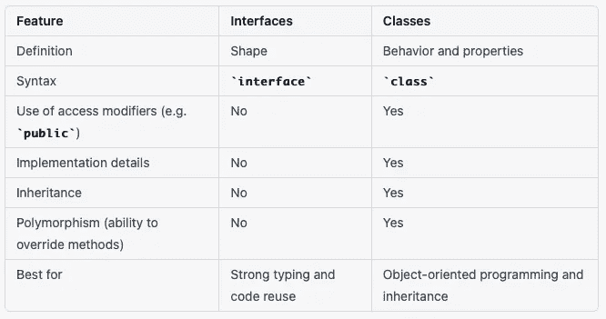

# TypeScript 接口与类:何时使用它们

> 原文：<https://medium.com/geekculture/typescript-interfaces-vs-classes-when-to-use-each-one-29955e2dfbd8?source=collection_archive---------3----------------------->



# 介绍

如果您是一名 TypeScript 开发人员，您可能在某个时候使用过这两种语言结构。但是你有没有停下来想一想它们之间的区别，以及什么时候使用每一个？

这就是我们在这篇文章中要探讨的。我们将定义 TypeScript 接口和类，解释它们的用途和主要区别，并就何时在代码中使用它们提供一些指导。

但首先，让我们先简要概述一下 TypeScript 中的接口和类。

TypeScript 接口是指定对象形状的一种方式。它们允许您定义一组对象应该具有的属性和方法，而无需指定这些属性和方法是如何实现的。接口是强类型和代码重用的强大工具，因为它们使您能够定义代码的其他部分可以依赖的契约。

下面是 TypeScript 中一个简单接口的示例:

```
interface Person {
  name: string;
  age: number;
  greet(): string;
}
```

在这个接口中，我们定义了一个具有三个属性的`Person`对象:`name`、`age`和`greet`。`name`和`age`属性分别属于`string`和`number`类型，而`greet`方法返回一个`string`。

另一方面，TypeScript 类是定义对象的行为和属性的一种方式。它们允许您定义对象具有的属性和方法的实现，以及定义对象的构造函数和其他类级功能。类是面向对象编程(OOP)的基石，使您能够定义可重用的、模块化的、可扩展和可继承的代码单元。

下面是 TypeScript 中一个简单类的例子:

```
class Person {
  name: string;
  age: number;

  constructor(name: string, age: number) {
    this.name = name;
    this.age = age;
  }

  greet(): string {
    return `Hello, my name is ${this.name} and I am ${this.age} years old.`;
  }
}
```

在这个类中，我们定义了一个`Person`对象，其属性和方法与上面的接口示例相同。然而，在这种情况下，我们还定义了一个构造函数，它接受`name`和`age`作为参数，并将它们分配给对象的`name`和`age`属性。我们还提供了`greet`方法的实现，该方法返回一个包含人名和年龄的字符串。

因此，如您所见，TypeScript 接口和类之间的主要区别在于，接口定义对象的形状，而类定义对象的行为和属性。但是还有其他的区别，我们将在下面的章节中详细介绍。

现在我们已经对 TypeScript 中的接口和类有了基本的了解，让我们更深入地研究每种语言结构，看看它们是如何比较的。

# 第 1 节:理解 TypeScript 接口

在这一节中，我们将进一步了解 TypeScript 接口，以及如何使用它们来定义对象的形状。

正如我们在简介中看到的，TypeScript 接口是一种指定对象应该具有的属性和方法的方式，而不提供它们的实现。接口本质上是一个蓝图或契约，代码的其他部分可以依赖它。

下面是在 TypeScript 中定义接口的语法:

```
interface InterfaceName {
  property1: Type1;
  property2: Type2;
  ...
  method1(arg1: Type1, arg2: Type2, ...): ReturnType;
  method2(arg1: Type1, arg2: Type2, ...): ReturnType;
  ...
}
```

如您所见，接口由一组属性和方法组成，每个属性和方法都有名称和类型。属性是保存数据的变量，方法是执行某些操作的函数。

要实现接口，您可以创建一个类或一个对象文本，它具有与接口相同的属性和方法。下面是一个如何创建实现我们在简介中看到的`Person`接口的类的例子:

```
class Person implements Person {
  name: string;
  age: number;

  constructor(name: string, age: number) {
    this.name = name;
    this.age = age;
  }

  greet(): string {
    return `Hello, my name is ${this.name} and I am ${this.age} years old.`;
  }
}
```

在这个例子中，我们定义了一个与`Person`接口具有相同属性和方法的`Person`类。注意，我们使用`implements`关键字来指定类实现接口。这告诉 TypeScript 该类应该具有接口中定义的所有属性和方法，并且应该符合相同的形状。

但是接口并不局限于类。您也可以将它们用于对象文字，如下所示:

```
const person: Person = {
  name: 'John Doe',
  age: 30,
  greet() {
    return `Hello, my name is ${this.name} and I am ${this.age} years old.`;
  }
};
```

如您所见，我们创建了一个对象文字，它具有与`Person`接口相同的属性和方法。然后我们使用`const`关键字声明一个名为`person`的常量变量，并使用`: Person`类型注释指定该变量具有由`Person`接口定义的形状。

使用接口的一个主要好处是它们允许你为你的对象实施一个特定的结构。这在大型代码库中尤其有用，因为您希望确保代码的不同部分使用相同的数据类型和结构。

例如，假设您有一个项目开发团队，您希望确保每个人都使用相同的用户数据模型。您可以定义一个`User`接口，指定用户对象应该具有的属性和方法，然后您可以在代码中使用该接口作为类型提示。这样，团队中的所有开发人员将确切地知道他们可以在用户对象中找到什么属性和方法，并且他们可以避免由于使用错误的数据类型而导致的错误和错误。

使用接口的另一个好处是它们允许你更容易地重用代码。假设您有多个类，它们有一些共同的属性和方法，但是它们也有一些独特的特性。您可以定义一个包含通用属性和方法的接口，然后可以将该接口用作您的类的基础。这样，您可以避免重复代码，并且可以确保您的类具有一致的接口。

总之，TypeScript 接口是定义对象形状、实施强类型和促进代码重用的强大工具。在下一节中，我们将看看 TypeScript 类以及它们与接口的比较。

# 第 2 节:了解 TypeScript 类

TypeScript 类是一种以更结构化和可重用的方式定义对象的行为和属性的方法。它们允许您在代码中使用面向对象编程(OOP)概念，如继承、多态和封装。

下面是如何在 TypeScript 中定义类的示例:

```
class Person {
  firstName: string;
  lastName: string;
  age: number;

  constructor(firstName: string, lastName: string, age: number) {
    this.firstName = firstName;
    this.lastName = lastName;
    this.age = age;
  }

  getFullName(): string {
    return `${this.firstName} ${this.lastName}`;
  }
}
```

在这个例子中，我们定义了一个具有三个属性的`Person`类:`firstName`、`lastName`和`age`。我们还定义了一个构造函数，它在创建新的`Person`对象时初始化属性。最后，我们定义了一个`getFullName()`方法，它返回这个人的全名。

要使用`Person`类，我们可以像这样创建一个新对象:

```
const person = new Person('John', 'Doe', 30);
console.log(person.getFullName()); // Outputs "John Doe"
```

如您所见，我们使用了`new`操作符来创建一个新的`Person`对象，并传入了`firstName`、`lastName`和`age`属性的值。然后我们调用`getFullName()`方法来获取这个人的全名。

使用类的主要好处之一是它们允许您使用继承，这是一种基于现有类创建新类的方法。如果您有一个包含通用行为和属性的基类，并且希望创建一个添加一些附加功能的派生类，这将非常有用。

例如，假设您有一个定义车辆基本行为的`Vehicle`类，比如加速、制动和转向。然后，您可以创建一个从`Vehicle`类继承而来的`Car`类，并添加一些特定的特性，比如门的数量或变速器的类型。

```
class Vehicle {
  // Common behavior and properties
}

class Car extends Vehicle {
  // Specific features
}
```

在这个例子中，`Car`类继承了`Vehicle`类的所有行为和属性，它还可以定义一些特定于汽车的附加特性。

总之，TypeScript 类是实现面向对象编程概念和创建可重用代码的强大工具。在下一节中，我们将比较 TypeScript 接口和类，并讨论何时使用它们。

# 第 3 节:接口和类的比较

在 TypeScript 中定义对象的结构或行为时，您有两个主要选择:接口和类。虽然乍看起来它们可能很相似，但实际上在决定在代码中使用哪一个之前，您应该知道这两者之间的许多关键差异。

接口和类的主要区别之一是它们的语法。接口是使用`interface`关键字定义的，后跟接口名称和一组包含接口属性和方法的花括号。下面是一个例子，说明如何为代表一个人的对象定义一个简单的接口:

```
interface Person {
  name: string;
  age: number;
  getFullName(): string;
}
```

另一方面，类是使用`class`关键字定义的，后跟类名和一组包含类的属性、方法和构造函数的花括号。下面是一个例子，说明如何定义一个实现上面的`Person`接口的类:

```
class Person implements Person {
  constructor(public name: string, public age: number) {}
  getFullName(): string {
    return this.name + " " + this.age;
  }
}
```

接口和类的另一个关键区别是它们的用途。接口主要用于定义对象的形状，这意味着它们指定对象应该具有什么属性和方法，但是它们不提供这些属性和方法的任何实际实现。另一方面，类用于定义对象的行为和属性，它们可以包括接口和对象方法的实现。

那么什么时候应该使用接口，什么时候应该在 TypeScript 代码中使用类呢？通常，当您想要指定对象的形状时，使用接口是一个好主意，但是您不需要为对象的方法提供任何实现。当您希望定义一组公共的属性和方法供代码中的多个类共享时，这可能会很有用。

另一方面，当需要为对象的属性和方法提供接口和实现时，应该使用类。当您想要定义一个可以实例化并用作独立实体的对象，而不仅仅是用作其他对象的蓝图时，这一点尤其有用。



现在你有了它 TypeScript 接口和类的比较，以及关于何时在代码中使用它们的一些指导。如您所见，它们是两种强大的语言构造，可以帮助您在 TypeScript 项目中构建健壮的、可维护的代码。

**不要错过我即将推出的内容和技术指南:**

[](/@nicchong/subscribe) [## 每当 Nic Chong 发布时收到电子邮件。

### 每当 Nic Chong 发布时收到电子邮件。通过注册，您将创建一个中型帐户，如果您还没有…

medium.com](/@nicchong/subscribe) 

如果你有什么问题，我在这里帮忙，在评论区等你:)