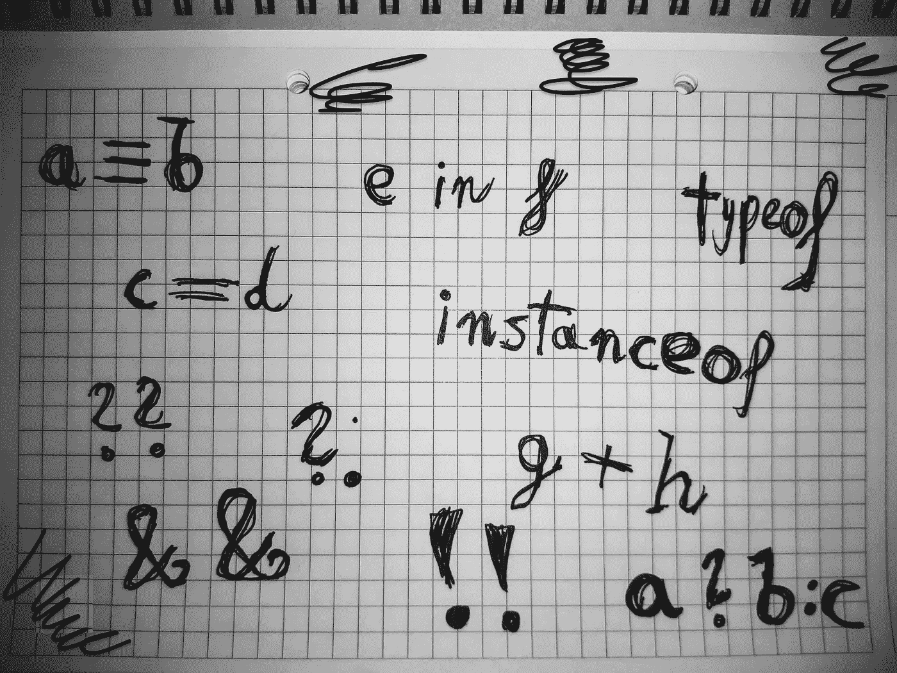

# TypeScript 运行时运算符

> 原文：<https://medium.com/geekculture/typescript-runtime-operators-b19550e806ba?source=collection_archive---------4----------------------->

随着 TypeScript 用静态类型增强了 JavaScript 的动态类型系统，某些语言元素变得更加复杂。被改变的基本构造之一是*操作符*，这大概是每一种高级编程语言的核心特性。由于类型信息的可用性，它们中的一些得到了扩充，其中一些实际上被废弃了，一整套新的操作符出现了。

我想向读者介绍生产级类型脚本项目中使用的最重要的操作符的精选列表。在本文中，我将重点关注利用类型系统并将运行时跟踪留在编译后的 JavaScript 代码中的操作符(无论如何)。



Before writing a single line of code — write your concepts down!

# 运行时跟踪的运算符

## 等式运算符

JavaScript 有两个相等操作符，`==`和`===`。两者之间的关键区别在于:如果问题中的操作数属于不同的类型，前者会执行所有必要的类型转换，而后者*则希望两种类型都匹配。虽然*松散的相等性*检查在纯 JavaScript 环境中可能有意义，但 TypeScript 提供了足够的类型信息，让开发人员选择进行*严格的相等性*检查。*

没有理由对属于 TypeScript 中根本不同类型的值(如数字和字符串)进行严格的比较。如果有人坚持这样做，他们将会收到编译器的回应:

```
TS2367: This condition will always return 'false' since the types 'number' and 'string' have no overlap.
```

有趣的是，TypeScript 编译器对底层代码片段的两个操作符(在 TS 4.1.3 上测试)抛出了上述错误*两次*。

A snippet that shows differences between strict and loose equality.

尽管代码片段本身包含正确的 JavaScript 代码，但 TypeScript 让开发人员遵循更严格的标准。由于使用`==`而不是`===`是一个人可能犯的代价最大的错误之一，我发现这个限制对于打字团队来说是一个很好的决定。我个人认为，松散的等式操作符在 TypeScript 项目中并不是真正必要的。

## in 运算符

这个操作符在 JavaScript 的`for (... in ....) {}`上下文之外可能会被忽略，因为我发现这是一种相当不受欢迎的检查对象中是否存在属性的方法(作为一个练习，我建议读者考虑执行上述纯 JavaScript 检入的所有可能方法)。TypeScript 将操作符中*的原始功能扩展到[窄类型](https://www.typescriptlang.org/docs/handbook/advanced-types.html#using-the-in-operator)，如下例所示。*

A snippet that shows type narrowing with the in operator.

这种变化允许开发人员决定他们是希望依赖前面提到的操作符的隐式行为，还是使用显式类型保护来根据测试的类型分支代码。我发现这个解决方案更简洁，因为它不需要编写和导入类型保护，而这也可能会被错误地实现。

## 运算符的类型和实例

因为在 JavaScript 运行时验证变量的精确类型相当重要，所以我更喜欢既不使用`typeof`也不使用`instanceof`来实现这个目的。当我需要验证输入时，我会将这种琐碎的任务外包给第三方库，比如`io-ts`，因为他们的代码肯定有更高的测试覆盖率，并且大多数可以想象的边缘情况都可能已经得到处理。将这样的工作放在别人的肩上实际上减少了在代码中显式使用 RTTI(运行时类型信息)的需要。

然而，在某些情况下，软件开发人员必须鼓起勇气去探索未知领域——例如，处理异常。我建议在处理自定义异常类时使用`instanceof`，因为在`catch`块中声明的异常对象总是被 TypeScript 编译器类型化为`any`。使用`any`类型的原因是，与流行的观点相反，在 JavaScript 中几乎任何东西都可以抛出，这一事实肯定要反映在类型系统中。

值得一提的是，所描述的操作符`typeof`和`instanceof`都能够缩小类型，如下面的代码片段所示。

A snippet showing type narrowing with the instanceof operator.

## 零融合算子

我在之前写过[处理 JavaScript 和 TypeScript 中的可空性并不简单，需要了解底层类型系统的本质。由于`null`和`undefined`是 *falsy* 值，因此可以使用`||`运算符为可空变量提供回退值。然而，这两个值并不是 JavaScript 中仅有的 *falsy* 值，用该运算符消除可空性可能会引入难以发现的错误。](https://gregoryppabian.medium.com/nullability-in-typescript-60be8c5a6d87)

对上述问题唯一合理的解决方案是提供一个新的算子，它只在可空的左手表达式上短路— *零化合并算子*。由于 JavaScript 将其添加为 ES2020 标准的一部分，TypeScript 在版本 3.7 中开始支持它。运算符对于提供默认值和缩小类型都变得非常有价值，就像下面的示例中的杠杆一样:

Arguably, the most basic example of nullish coalescence.

如果`a`不可为空，`b`将等于`a`，否则，它将等于`0`，其中`a`被类型系统规则缩小为`null`。

使用 nullish 合并运算符时，TSC 发出编译后代码的方式取决于所选的目标。以 ES2020 为目标应该不会带来任何变化，但是，唉，确保与以前的 ES 版本兼容会导致更明显的运行时痕迹。

## 可选的链接运算符

除了 nullish 合并操作符，ES2020 标准还增加了可选的链接操作符*和 TypeScript。它允许开发人员访问链接的可空值，并在可调用该值的适用场景中执行它。有问题的操作符可通过双字符标记`?.`来识别，如下例所示:*

A snippet demonstrating optional chaining.

如果`a`是`null`，那么`product`就变成了`undefined`，因为这是存在空性时来自可选链接操作符的返回类型。否则，用来自`a.variable`的数字对函数`multiple_by_two`求值(这完全有效，因为`a`在那里不可为空),并将`product`设置为前述函数的返回值。

# 摘要

如图所示，TypeScript 作为 JavaScript 的忠实超集，将现有操作符集成到其类型系统中，并利用提供的类型信息来改善开发体验。显而易见的是，某些运算符本质上是不推荐使用的，因为它们的集体功能被静态类型系统的功能所取代。一些操作符可以在分支过程中利用类型信息来缩小类型，从而允许开发人员编写更简单的代码。

最后，我邀请读者在 JavaScript 和 TypeScript 中自己学习更多关于操作符的知识，注意后者提供的增强。