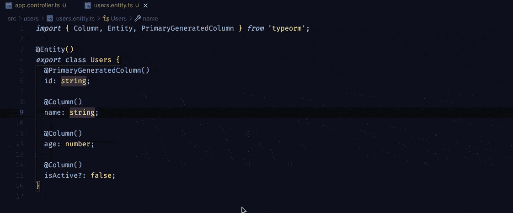

# Typescript —类型化系统的增强功能

> 原文：<https://medium.com/geekculture/typescript-supercharged-features-of-a-typed-system-b5efafbb0346?source=collection_archive---------70----------------------->

我最近一直在写打字稿。当我从事个人项目或与团队合作时，我会使用它。起初，我只是被我必须写这么多代码的事实压得喘不过气来，这并没有真正激励我去捡起它。但这并没有真正阻止我不去尝试。我已经阅读了太多引人注目的博客，它们证明了为什么 Typescript 是必须尝试的，以及它如何帮助构建可伸缩的 web 应用程序，以至于我忍不住要亲自尝试一下。

我想要一个能帮助我开始的资源。我浏览了一下 [React 打字稿备忘单](https://react-typescript-cheatsheet.netlify.app/)，它帮助我立刻了解了本质。我还使用了 [educative.io](https://www.educative.io/) 的一门课程，它帮助我理解了积木和零件。一旦我到了那里，我几乎立刻就知道，即使我写了更多的代码，也可以说我使我的代码库非常可预测和可维护。

所以在这里，我试图解释一下帮助我几乎立即采用 Typescript 的特性。我很确定类型化系统有很多好处，但是我只想提几个我最喜欢的。

## 1.代码导航

我们有一个**用户服务**文件，它导入了一个**用户**类。很多时候，你可能不太记得或者不确定用户对象的形状，或者你的一个队友想要检查你的代码。

Code Navigation

在这种情况下，您几乎可以立即在文件之间切换(或在文件之间导航)。Typescript 可以帮助您方便地在代码库中的文件之间导航。您也可以利用下面的快捷方式轻松地在文件之间导航。

*   转到定义 **(F12)** —转到符号定义的源代码。
*   查看定义 **(Option 或 Alt + F12)** —调出显示符号定义的查看窗口。
*   转到引用 **(Shift + F12)** —显示一个符号的所有引用。
*   转到实现 **(Cmd 或 Win + F12)** —转到接口或抽象方法的实现。

## 2.代码可预测性

使用代码可预测性，TypeScript 确保变量/函数类型不会改变，并且它将只接受最初定义的类型。如果一个变量被显式指定了类型字符串，那么它只能保存类型字符串的值。所有这些使得代码库变得如此可预测，以至于你现在不必担心由于类型和赋值的不匹配而导致的崩溃。

Code Predictability

在上面的 gif 中，我们注意到我们有一个名为 **createUser** 的方法，它接受一个参数来创建一个用户。现在，关于它将接受什么参数，肯定有一个问题。我们试图插入一个数字，但我们立即抛出一个歪歪扭扭的通知我们类型不匹配。

要了解该方法接受的类型的更多信息，我们可以导航到服务文件。正如我们所看到的，方法 **createUser** 接受一个字符串类型的参数。现在，当我们在未来创建更多的用户时，我们对参数非常确定。

## 3.代码重构

我们有一个名为 **Users** 的类，我们导出了这个类，我们在代码库中的很多文件中都使用了它。这里要注意的是，我们希望将 **Users** 类改为称为 **User** (为了更好的命名约定而重命名)，这是有意义的，因为 **User** 类表示特定用户的形状。让我们试着重命名这个类，看看我们会遇到什么。

Code Refactoring

从 gif 上可以看出，控制器文件变成了红色。不仅仅是控制器文件，所有导入 **Users** 类的文件都会抛出错误，因为这个类已经不存在了。

这就是使用 Typescript 进行代码重构有多方便。我们现在只需要在导入的每个文件中重命名该类，而不是试图找出您可能在哪里使用了该类。同样，使用 Typescript，如果您更改文件的路径，该文件的相对导入将会更新，而您甚至不必更新，如果您对同一个文件有许多导入，这可能会令人生畏。

## 4.低错误代码

在微软发表的一篇论文中，有人指出 TypeScript 可以帮助 GitHub 上的公共项目防止 15%的公共错误。在检查常见错误的过程中，这个数字对于节省时间来说是非常重要的。它有助于缓解你试图找出常见的错误，而你的注意力完全被转移的情况，这并不真正理想。

Less-error code

Typescript 有助于在编译时检查类型，这意味着您将立即被抛出一个可能会破坏代码的错误。它有助于防止将有错误的代码发布到产品中，同时有助于相对更快、更有效地修复错误。

## 5.更好的智能感知

IntelliSense 帮助开发人员在编写代码时更加高效。它提供了一些特性，比如代码完成、参数信息和快速信息，这实际上是一种暗示你下一步该做什么的方式。

Code IntelliSense

在上面的 gif 中，我们将**道具**的类型指定为 **addNumbers** 。我们已经定义了 **addNumbers** 的类型。既然我们已经定义了属性的类型，现在我们可以让 IntelliSense 用正确的值和方法来帮助我们完成代码。

智能感知可以做得更多。它可以帮助我们自动导入、智能重命名变量、在更改文件的相对路径时修复导入，以及删除未使用的变量/方法。

## 包裹

我强烈建议您尝试使用 TypeScript 来获得第一手体验，并尝试它所支持的所有功能，就像我们前面讨论的那样。这将非常有助于提高你写代码的效率，并使你的代码库具有可维护性和可扩展性。如果您正在寻找一个起点，我强烈推荐您访问[Typescript-Getting started](https://www.typescriptlang.org/docs/)guide 开始。