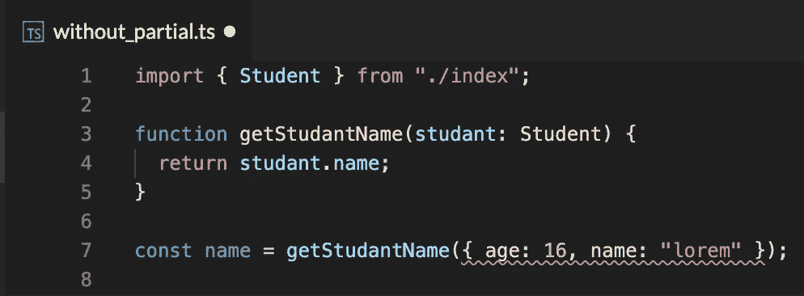
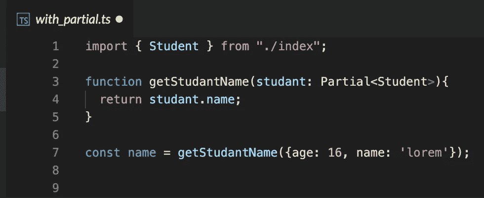
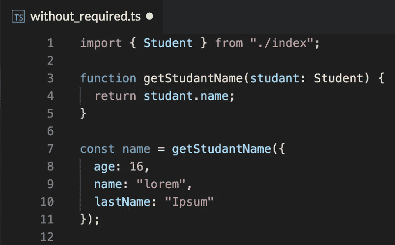
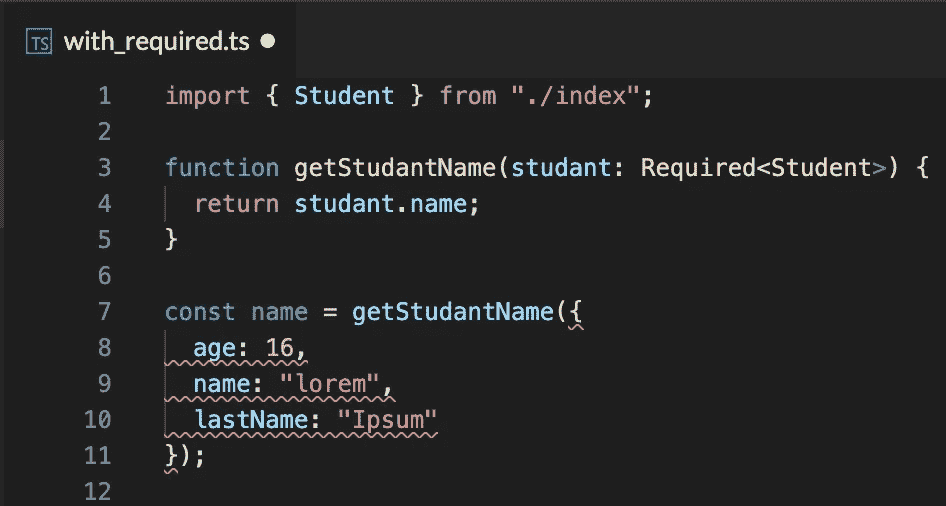
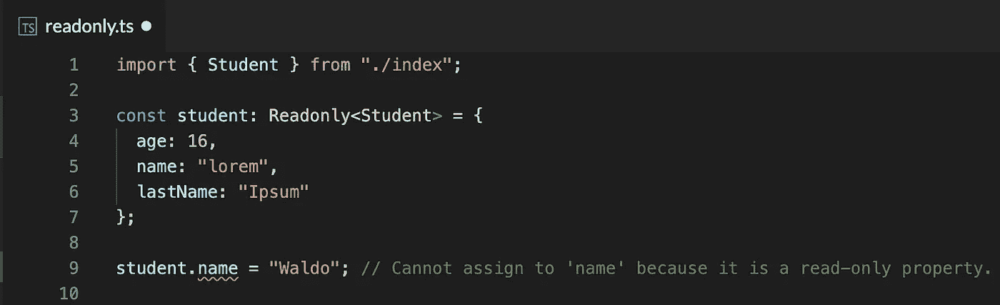
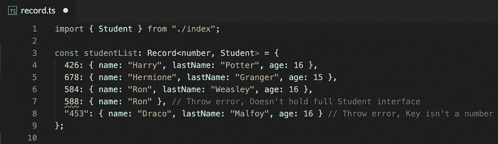

# TypeScript 实用工具类型—更多类型===更少代码，第一部分

> 原文：<https://medium.com/geekculture/typescript-utility-types-less-code-more-types-part-i-4861ecb16d40?source=collection_archive---------10----------------------->

## 在接下来的几篇文章中，我们将逐一查看所有的 TypeScript 实用工具类型，讨论它们是什么，我们为什么需要它们，并查看一些代码示例以了解用法。

在我们深入研究之前，让我们简短地讨论一下什么是实用程序类型。
就像我们熟悉的任何其他类型(字符串、数字、布尔等)一样，TypeScript 为我们提供了一组实用类型，可以促进常见的类型转换。因此，TypeScript 给了我们一套我们能够并且应该遵循的标准，而不是重写它们并有不同的实现。

为了便于理解，所有示例都将基于相同的学生界面和对象:

Base example for Student Interface and Object

# `**Partial<T>**`

使 T 类型的所有属性都可选。

Without Partial<T>

当使用严格类型 *Student* ，**时，编译器检查所有的接口属性是否存在。**在这种情况下，姓氏和年龄丢失，我们得到一个错误。

Partial<T>

当用*部分<T>包装类型*学生*时，您只允许**传递部分属性**。在这种情况下，*姓氏*和*年龄*会丢失，但它们是可选的，因此不会出现错误。*

**什么时候应该用？**
在你没有掌握整个接口结构的情况下，或者你只想传递部分数据。
更多关于[公文](https://www.typescriptlang.org/docs/handbook/utility-types.html#partialtype)中的部分< T >。

# `**Required<T>**`

使类型 T 的所有属性成为必需的。这是偏<t>的反义词。</t>

Without Required<T>

当使用严格类型 Student 时，我们允许传递不带可选参数的对象。在这种情况下，*等级*是可选的，我们不强制通过。

With Required<T>

当使用严格类型*required<T>T*，**时，我们强制接口要求所有的属性，即使这样在接口本身中被标记为可选的**。界面中可选的属性'*等级*'现在是强制的。

你应该什么时候使用它？
如果您想要验证所有接口属性都存在，甚至是那些标记为可选的属性。
关于[正式文件](https://www.typescriptlang.org/docs/handbook/utility-types.html#requiredtype)中所需< T >的更多信息。

# **只读<T>**

将 T 类型的所有属性设为只读，这意味着它们的值不能被覆盖。

Readonly<T>

当使用严格类型 *Readonly < T >* 时，我们让对象成为不可变的，并且**不允许覆盖它的属性。**

**什么时候该用？**
当我们想确定没有人在修改对象值时，修改必须应用到它的副本上。
关于[官方文档中的只读< T >的更多信息。](https://www.typescriptlang.org/docs/handbook/utility-types.html#readonlytype)

# `**Record<J, T>**`

创建键值映射。

Recort<J, T>

当使用*记录< J，T >* 时，我们强制一个**对象，它的键是 J 类型，它的值是 T 类型**。不属于已定义类型的键和值将抛出错误。

**什么时候该用？这是一种非常有用的保存数据对象的方法，其中键是 ID，值是给定的接口。
关于[公文](https://www.typescriptlang.org/docs/handbook/utility-types.html#recordkeystype)中记录< J，T >的更多信息。**

在 TypeScript 中内置这么多类型的转换是多么棒啊，而这仅仅是个开始！我们已经介绍了 4 种实用程序类型，但还有更多的内容。
这篇文章中的所有例子都可以在[这个 StackBlitz 演示](https://stackblitz.com/edit/typescript-utility?file=without_required.ts)中找到。在继续学习更多的实用程序类型之前，我建议检查一下它们，并亲自动手操作这些类型，以便您完全理解它们的每一个用途。

准备好了吗？在下一篇文章中，我们将介绍 4 种更多的实用程序类型。