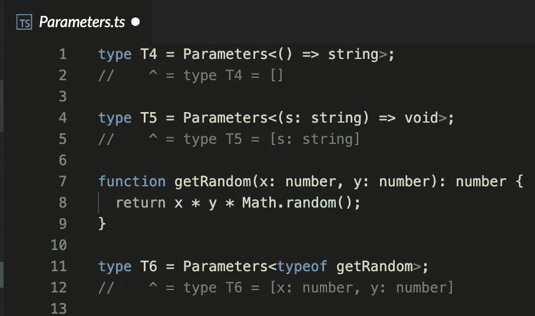
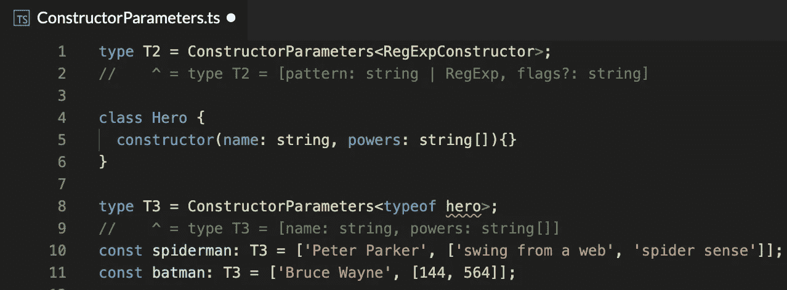
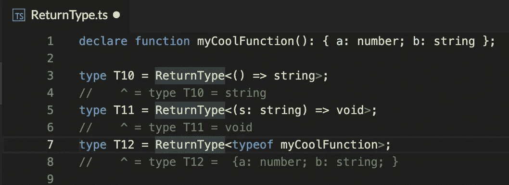

# TypeScript 实用工具类型—更少的代码===更多的类型，第三部分

> 原文：<https://medium.com/geekculture/typescript-utility-types-less-code-more-types-part-iii-afed1cb25385?source=collection_archive---------15----------------------->

## 本系列文章已经进行了一半，在第一部分和第二部分中，我们介绍了一些有用的实用程序类型，这次也不例外。事不宜迟，我们开始吧。

# `NonNullable<T>`

通过从 t 中排除 null 和 undefined 来构造类型。

`NonNullable<T>`

这个很简单，从它的名字就很容易理解。
当使用非空值**时，我们在新类型中省略了所有可空值，即空值和未定义值。** 从下面的例子中，我们可以看到 T3 是*字符串* | *数字*，因为*未定义的*被*非空< T >* 实用程序省略，而 T4 是类型*字符串[]* ，因为空和未定义也被*非空< T >* 实用程序类型省略。

**什么时候应该用？**
当你想保护自己免受可空类型的影响并验证给定参数的完整性时，这是一个非常有用的类型。
更多关于[公文](https://www.typescriptlang.org/docs/handbook/utility-types.html#nonnullabletype)中*非空<T>T*。

# `Parameters<T>`

从函数类型 t 的参数中使用的类型构造元组类型。

Parameters<T>

当使用*参数< T >* ，**时，我们将一个函数的类型作为 T 传递，并获取一个由它的参数构造的类型。**
听起来可能有点奇怪，但让我们一个一个来解决。
*T4* 得到一个没有任何参数的函数，因此它的类型是一个空数组。
*T5* 获取一个只有一个字符串参数的函数，只不过它的类型是一个只有一个字符串的数组。
*T6* 获取 *getRandom* 函数的类型。该函数需要两个数字作为它的参数，x 和 y，因此 *T6* 类型是一个由两个数字组成的数组。

**应该什么时候用？** 当你有一个函数，你想把它的所有参数描述成一个单一的类型。这样可以更容易地准确描述函数参数，并将它们安排在 T 类型的单个对象中。
更多关于*参数<T>的信息，请参见[官方文档](https://www.typescriptlang.org/docs/handbook/utility-types.html#parameterstype)。*

# `ConstructorParameters<T>`

从构造函数类型的类型构造元组或数组类型。

`ConstructorParameters<T>`

*构造器参数< T >* 是一种从函数的构造器创建类型的简单方法。类似于*parameters<T>*对函数参数*，* ***构造器参数<T>******从构造器参数**创建一个类型，使得在初始化函数*之前准备数据变得容易。* 比如， *T2* 类型是*【pattern:string | RegExp，flags？:string]* 因为这是 *RegExpConstructor 的签名。T3 为我们创建的自定义类做同样的事情。职业英雄期望得到一个字符串形式的名字和字符串[]形式的能力。注意，spiderman 遵循这个接口，但是 matman 传递的是数字[]而不是字符串[]，因此被标记为错误。**

*你应该什么时候使用它？
当你想从一个函数构造器中创建一个类型以便更容易跟踪、维护和执行时。
更多关于[正式文件](https://www.typescriptlang.org/docs/handbook/utility-types.html#constructorparameterstype)中*构造参数<T>的信息。**

# *`ReturnType<T>`*

*构造由函数类型的返回类型组成的类型。*

**

*`ReturnType<T>`*

**ReturnType < T >* 正如它的名字一样，当我们将一个函数作为 T 传递时，**该类型将是 T 的返回类型，** *T10* 是一个字符串，因为给定回调函数的结果是一个字符串。
*T11* 因完全相同的原因作废。
*T12* 获取一个函数声明，将返回类型指定为 *{a: number，b: number}* ，heance，*ReturnType<type of my coolfunction>*将此签名转换为类型。*

*你应该什么时候使用它？
当你有一个函数返回一个对象，你想从它创建一个类型。
更多关于*ReturnType<T>在[官方文档中。](https://www.typescriptlang.org/docs/handbook/utility-types.html#returntypetype)**

*在本文中，我们介绍了一些鲜为人知的实用程序类型。也许他们不熟悉，也许他们很难理解。甚至在准备写这篇文章之前，我也没有完全理解它们，但是可以肯定的是，我们可以看到使用它们的好处。可以省去许多样板文件，并且减少了为每个功能维护专用接口的需要。*

*一如既往，所有示例都可以在[这个 StackBlitz 演示](https://stackblitz.com/edit/typescript-utility?file=without_required.ts)中找到。*

*感谢阅读！当你准备好继续时，继续阅读我的[下一篇也是最后一篇文章](https://gili842.medium.com/typescript-utility-types-less-code-more-types-part-iv-f52108cc3ce9)，它总结了实用程序类型。*