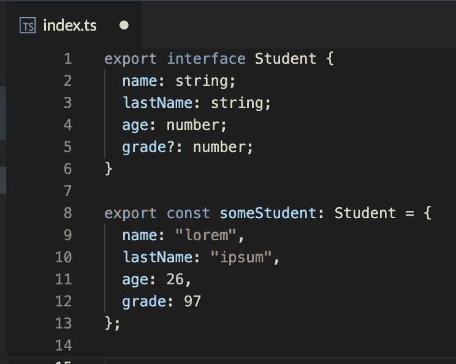
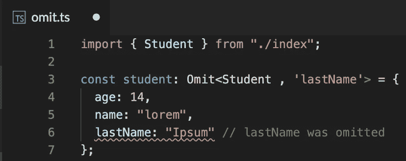
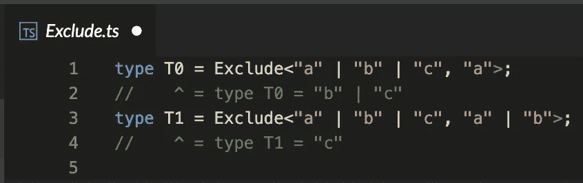
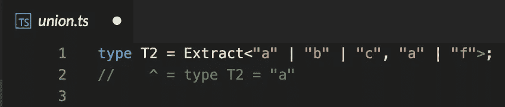

# TypeScript 实用工具类型—更多类型===更少代码，第二部分

> 原文：<https://medium.com/geekculture/typescript-utility-types-more-types-less-code-part-ii-bfdfa4f99376?source=collection_archive---------21----------------------->

## 在上一篇文章中，我们解释了什么是实用程序类型，并给出了部分<t>、必需<t>、只读<t>和记录<j>的例子。我们将讨论 4 个更有用的实用程序。你和我一样激动吗？太好了！我们开始吧。</j></t></t></t>

正如在我们的[上一篇文章](https://gili842.medium.com/typescript-utility-types-less-code-more-types-part-i-4861ecb16d40)中一样，所有的例子都将基于相同的学生界面。

# **挑< T，按键>**

通过从类型 t 中挑选一些键来构造一个新的类型。

Pick<T, Keys>

当使用 Pick 时，我们传递一个接口作为第一个参数，以及一组我们想从给定的接口中‘挑选’并使用的键。
在本例中，我们正在传递学生正在从中挑选的 2 个键， *name* 和 *lastName* 。**只有特别提到的键才是新类型**的一部分。。请注意，我们没有选择关键字“年龄”,因此尽管它是 Student 的一部分，但它没有被选择，我们会得到一个关于它的错误。

**什么时候应该用？**
对于这种情况，你使用的是一个通用接口，它有很多属性，这些属性可能与所有对象都不相关。
更多关于*的记载[公文](https://www.typescriptlang.org/docs/handbook/utility-types.html#picktype-keys)中< J、T>T*。

# `Omit<T, Keys>`

通过省略 T 型中的一些键来构建一个新类型。这是与 *Pick < T，Keys>相反的实用程序。*

Omit<T, Keys>

就像在 *Pick* 实用程序类型中一样，我们传递 2 个参数。第一个是我们想要执行省略的接口，第二个是一组键。这里的区别是，我们不是传递我们想保留的键(pick) **，而是传递我们不想使用的键** **(省略)并构造一个没有它们的新类型。在这个例子中，我们从 Student 中省略了“lastName ”,因此它不是接口的一部分，当我们试图使用它时会得到一个错误。**

你应该什么时候使用它？
对于这种情况，你使用的是一个通用接口，它有很多属性，这些属性可能与所有对象都不相关。
更多关于*省略[公文中的< T、按键>](https://www.typescriptlang.org/docs/handbook/utility-types.html#omittype-keys)* 。

# `Exclude<T, J>`

通过排除所有被赋值为 j。

Exclude<T, J>

这可能听起来有点奇怪的描述，但它基本上是一种形式的[维恩图](https://en.wikipedia.org/wiki/Venn_diagram)。
当使用 *Exclude < T，J >* **时，我们可以通过几个联合，新的类型将由唯一的**(从维恩图中排除)联合构成。如果我们想用词来描述这个例子，我们可以说 T0 是“b”|“c”，因为只有它们出现一次。第一个类型和最后一个类型中的“a”相互抵消，将它们排除在最终类型之外。

**应该在什么时候使用？** 当你在处理几个相似的类型，并且想把它们转换成一个具有所有独特属性的单一类型时。
更多关于*排除[公文](https://www.typescriptlang.org/docs/handbook/utility-types.html#excludetype-excludedunion)中的< T，J>。*

# `Extract<T, J>`

通过提取所有被指定为 j 的联合类型来构造一个新类型。

Extract<T, J>

类似于前面的 *Exclude < T，J>的例子，TypeScript 提供了其相反的实用工具 *Extract < T，J>。
当使用*提取< T，J >* **时，我们可以传递几个联合，新的类型将由出现在至少两个联合中的类型构成**(从文氏图中提取)。在示例中，我们可以看到，出现不止一次的唯一联合只有‘a’(作为第一个和第三个联合)。**

你应该什么时候使用它？当你处理几个类型并且想把它们转换成一个有公共基础的单一类型时。
更多关于*排除[公文](https://www.typescriptlang.org/docs/handbook/utility-types.html#extracttype-union)中的< T，J>。*

在本文中，我们看到了如何使用 *pick < T、Keys*和*省略< T、Keys >转换为具有特定属性的新类型，以及如何在使用 Exclude < T、J >和 Extract < T、J >时从联合中获得一个*唯一*或通用类型。*

我们已经讨论了 8 种公用事业类型，并且已经完成了一半。和以前一样，所有示例都可以在[这个 StackBlitz 演示](https://stackblitz.com/edit/typescript-utility?file=without_required.ts)中找到。我建议仔细阅读这些例子，并对它们进行一些试验，看看你是否完全理解了它们。

感谢阅读！在我的[下一篇文章](/geekculture/typescript-utility-types-less-code-more-types-part-iii-afed1cb25385)中再见，我们将讨论另外 4 种实用程序类型。