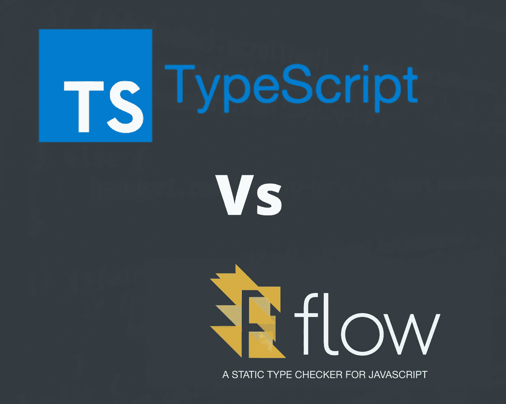

# 类型脚本与流。您应该在项目中使用哪种静态类型检查器？

> 原文：<https://medium.com/geekculture/typescript-vs-flow-b4eb3778cf6b?source=collection_archive---------4----------------------->

最近，我开始着手一个新的 JavaScript 项目，在浏览代码时，我发现对 JavaScript 文件进行了类型检查，这让我很困惑… JavaScript 没有内置的类型检查功能..这个项目是如何不抛出错误的？…很多问题浮现在我的脑海中，所以我需要做进一步的研究…这就是我对…的评论