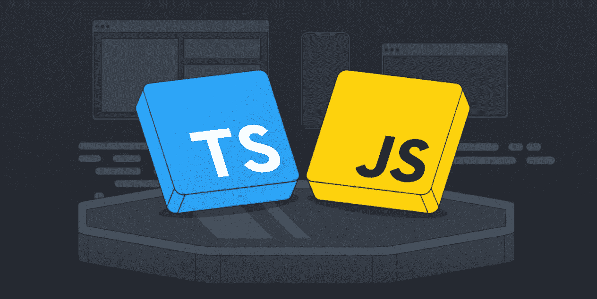
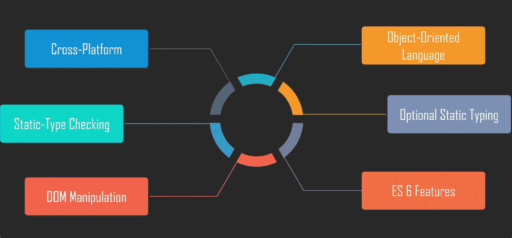
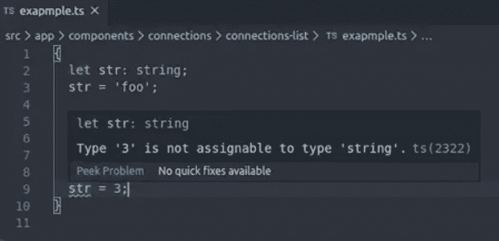
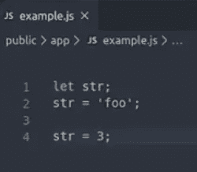
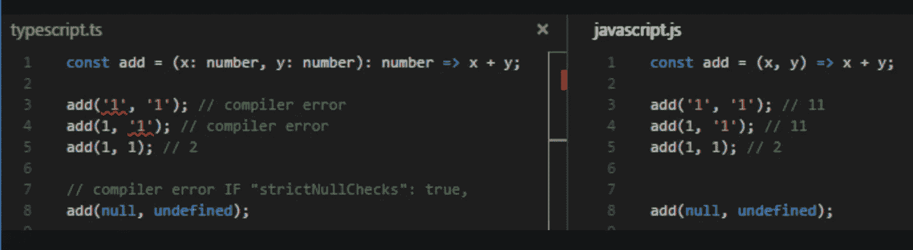
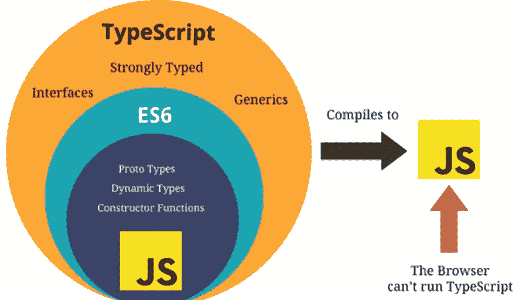
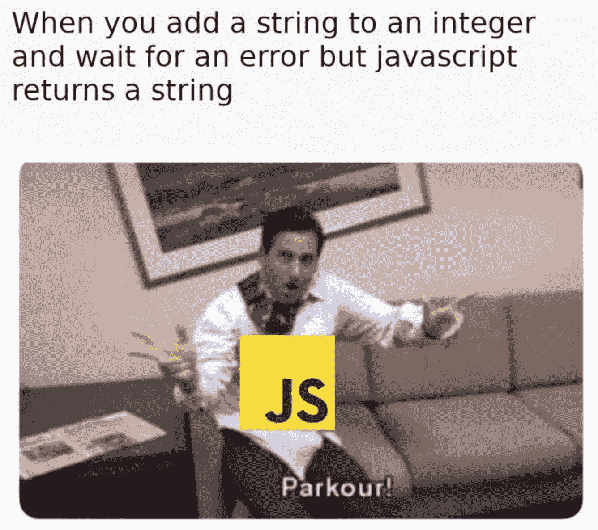
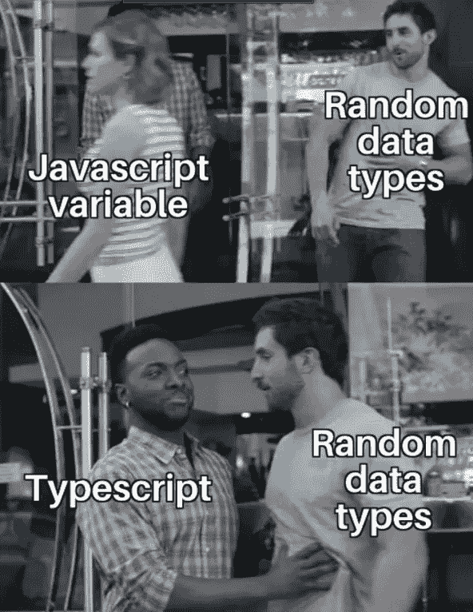
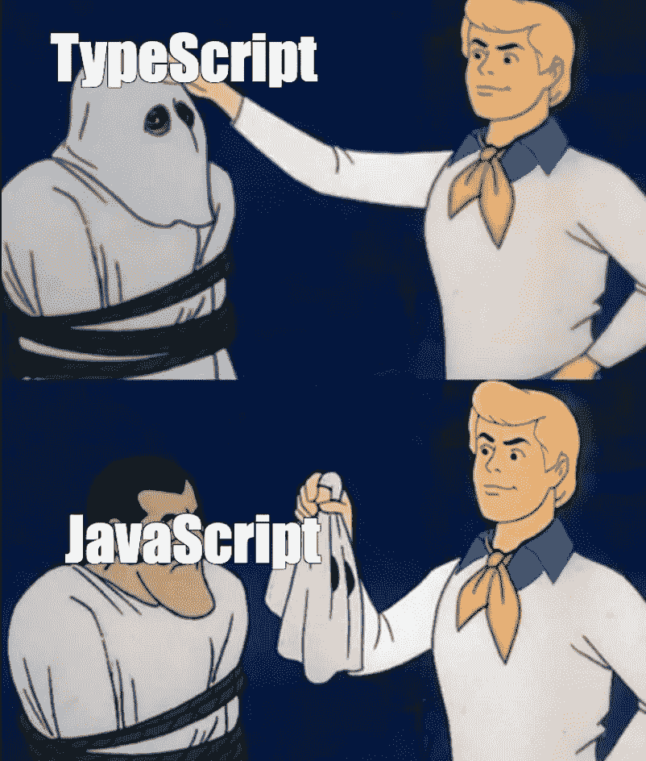
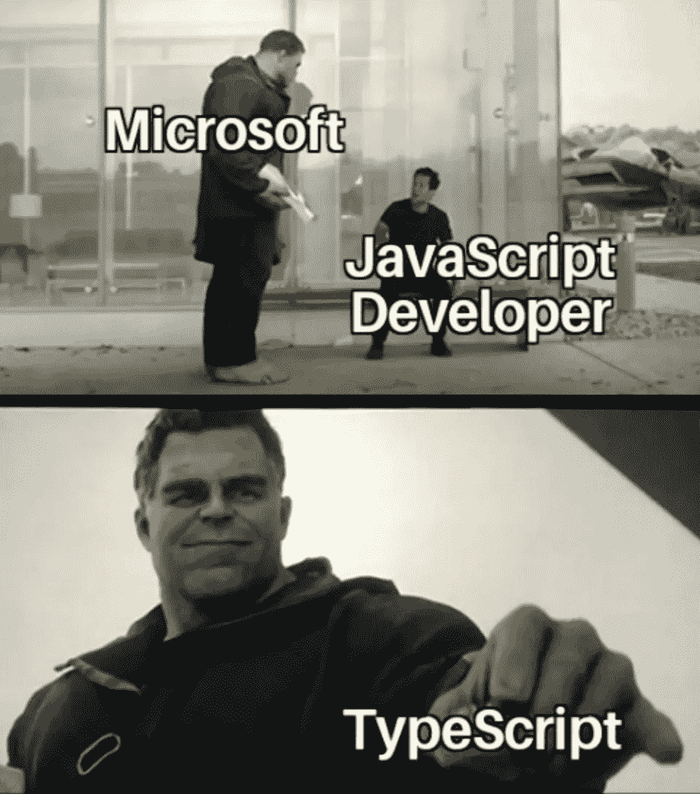

# TypeScript 与 JavaScript

> 原文：<https://medium.com/geekculture/typescript-vs-javascript-e5af7ab5a331?source=collection_archive---------5----------------------->

我们已经有了 JavaScript，为什么还要开发 TypeScript？TypeScript 的优点是什么，是否应该完全取代 JavaScript？如果你很想知道答案，不要再看了！本文还将包括一个阐明关键点的例子、对它们的差异的回顾、扩展学习的额外资源以及一些相关的模因。让我们开始吧！

# 我们已经有了 JavaScript，为什么还要开发 TypeScript？

尽管 JavaScript 最初是作为客户端编程语言开发的，但开发人员意识到它也可以用作服务器端编程语言。随着 JavaScript 的不断发展，它变得越来越复杂，无法充分发挥其作为服务器端技术在企业层面取得成功的潜力。因此，开发了 TypeScript 来填补这一空白。TypeScript 是 JS 的超集，开发它是为了克服大型项目的代码复杂性。本质上，所有的 JavaScript 代码在 TypeScript 中也是有效的，并且是 JavaScript，但是具有额外的特性。

TypeScript Features

# **TypeScript 有什么优势？**

让我们回顾一下 TypeScript 的附加特性，这些特性填补了空白并回答了开发人员在使用 JavaScript 时面临的许多问题。

## 可选静态类型

JavaScript 是一种动态类型语言，这意味着软件直到运行时才会将类型差异视为错误。这通常会导致许多错误和挫折。但是，TypeScript 提供了可选的静态类型。一旦声明了静态类型，变量就不会改变它的类型，只能接受某些值。编译器警告开发人员任何与类型相关的错误(语法或语义)，这导致早期的错误检测。

## 早期缺陷检测

让我们详细说明为什么这是一个显著的优势。编译器在开发时检查我们的代码、警告和错误，减少了运行时出现错误和意外行为的机会。在编译时检查类型正确性也有助于自信地快速重构代码。总的来说，这个特性有助于避免开发人员不得不在 JavaScript 中手工梳理的意外错误。

## 提高可读性

由于 JavaScript 提供的可读性插件很少，所以有很多错误需要手动检测，这有时需要一段时间。另一方面，TypeScript 静态读取和接口增加了代码优化。接口可用于定义类型(字符串、布尔值、数字……)以及在类中实现它，从而产生更多信息的基本代码。为变量声明定义的类型和清晰的类别不仅提高了可读性，而且提高了代码的整体稳定性。

## 代码优化

虽然 JavaScript 缺少几个重要的特性，但 TypeScript 被认为具有更好的代码组织和对象安排的编程过程。除了提高代码质量，TypeScript 还能够通过以下功能提高开发速度:

*   **类型注释** —自动检查每个静态类型的值
*   **泛型**——让您编写方法的通用形式
*   **API 文档** — VS 代码导航允许开发者自动查看参数类型，跟踪变量。
*   **Intellisense** —微软开发了一种代码导航工具，提供自动代码完成功能。将鼠标悬停在方法名称上，可以看到属性和参数。虽然执行远非完美，但这仍然是一个有效的优势

Notice how JS is dynamically typed, while TS is statically typed — comparing and restricting the reassignment of the declared type

# JS 和 TS 的关键区别是什么？

## ***JavaScript***

*   由 Brendan Eich(网景公司)设计，于 1995 年发布
*   一种帮助创建动态网页内容的轻量级脚本语言，受所有浏览器支持
*   动态类型—弱类型(静态类型没有选项)
*   最适合小型项目
*   可以直接在浏览器中使用
*   JS 库默认工作

## 以打字打的文件

*   由微软设计并于 2012 年发布
*   为克服大型项目的代码复杂性而开发的 JavaScript 超集(OOP 语言)
*   强类型—支持静态和动态类型
*   最适合大型 web 应用程序
*   转换成浏览器可理解的 JavaScript 代码( [Transpiler](https://scotch.io/tutorials/javascript-transpilers-what-they-are-why-we-need-them) )
*   因为它是一个超集，所以所有的 JavaScript 库和其他 JavaScript 代码都可以工作，不需要任何修改

# 应该用 TypeScript 代替 JavaScript 吗？

有了所有这些额外的奇特特性，难道我们不应该完全抛弃 JavaScript，只在我们的项目中使用 TypeScript 吗？简短的回答是否定的。TypeScript 不是 JavaScript 的替代品，也不适合所有类型的项目。JavaScript 仍然是最受欢迎的客户端脚本语言。由于 JavaScript 直接在浏览器上运行，所以运行、刷新和调试小代码块更容易。当灵活性是一个优先考虑的因素时，JavaScript 是一个很好的选择，因为它允许您创建功能而不拘泥于相同的规则。但是，如果您正在处理一个大型代码库，并且希望在优先考虑速度的同时实现单一标准，那么 TypeScript 是您的最佳选择。随着代码的增长和变得越来越复杂，出错的可能性就越来越大，最好在编译时就能发现。

# 结论

我们已经知道，TypeScript 是为 trans 编译成 JS 的大型应用程序开发的，JS 也遵循支持其特性(如类、接口、名称空间和继承)的 OOP 语言结构。总体而言，TypeScript 易于维护，非常适合代码组织，并提高了项目生产率。这填补了空白，解决了开发人员在使用 JavaScript 时面临的许多问题。我们还回顾了为什么在处理小型 web 项目时 JavaScript 仍然是首选，而在处理复杂项目时 TypeScript 是理想的选择。虽然不是每个开发人员都需要了解 TypeScript，但是有一些经验是值得的。

## 其他资源:

*   [开始使用 TypeScript](https://blog.teamtreehouse.com/getting-started-typescript)
*   [打字稿语法&语言基础](https://www.educative.io/blog/top-50-typescript-interview-questions#syntax)
*   [打字稿](https://www.scriptol.com/programming/typescript.php):过渡语言到未来的 JavaScript
*   [类型脚本 vs JavaScript](https://hackr.io/blog/typescript-vs-javascript)
*   类型脚本[接口](https://www.tutorialsteacher.com/typescript)

## 今天督促自己学习新东西做得很好！👏👏👏

## JS/TS 迷因如约而至:)

