# 使用 TensorFlow 从头开始实现 U-NET

> 原文：<https://medium.com/geekculture/u-net-implementation-from-scratch-using-tensorflow-b4342266e406?source=collection_archive---------0----------------------->

## *底层概念和循序渐进的 Python 代码解释*

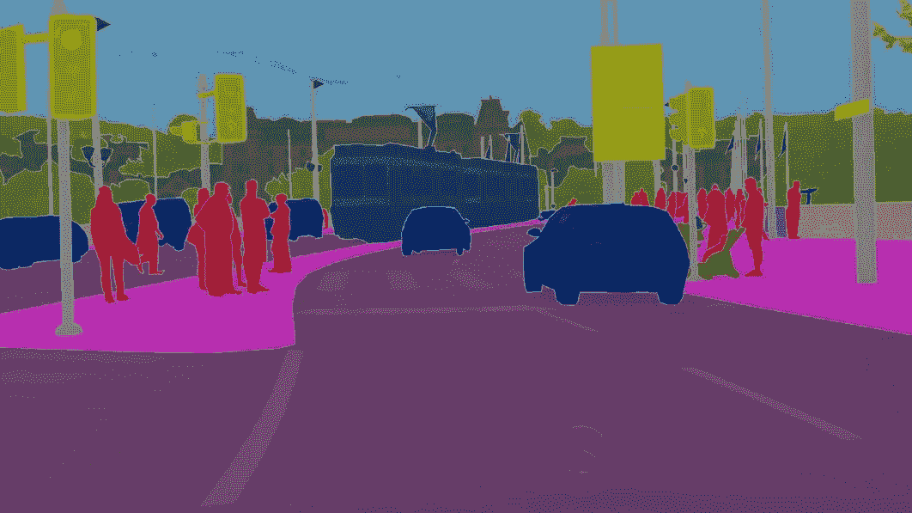

*Fig-1: Here’s* how a self-driving car sees the world with U-Net! ([source](https://analyticsindiamag.com/))

# 介绍

拉里·罗伯茨在他的博士论文(cir。1960)讨论了提取 3D 几何信息的可能性，并被认为为围绕计算机视觉的研究奠定了基础。从那以后，研究人员取得了巨大的进步，特别是在过去十年里，计算机视觉成为了面部识别、医学成像、自动驾驶汽车等现实世界人工智能应用的前沿。

在这篇博客中，我的目的是深入研究一个叫做 U-Net 的巨大的计算机视觉模型。该博客提供了关于 U-Net 架构中使用的操作的见解，如卷积、最大池化、转置卷积、跳过连接，还解释了如何使用 TensorFlow 从头实现这些概念。

在这篇博客结束的时候，你应该已经创建了下面的架构(图 2)来将图像像素分类成片段(如图 1)。

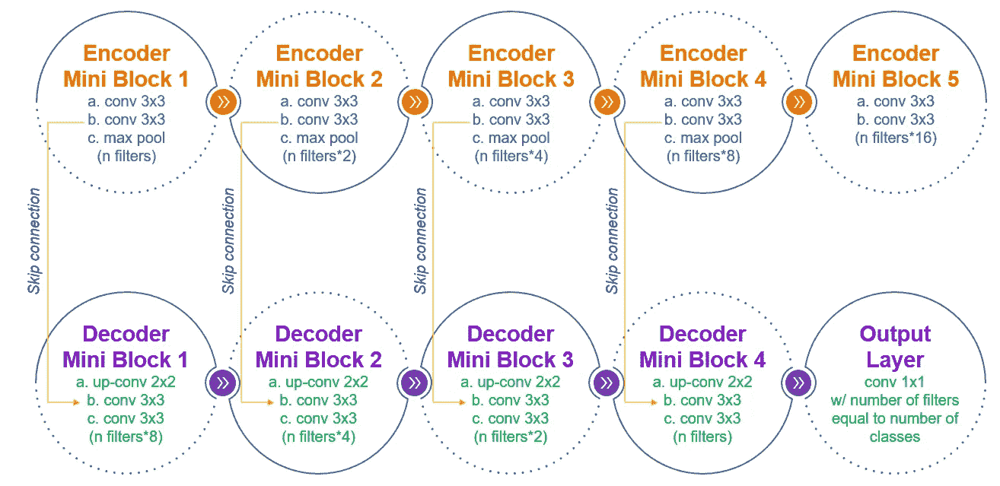

Fig-2: The flow of U-Net architecture implemented in this blog

# 博客的内容

1.  U-Net 概述
2.  了解 U-Net 中使用的关键操作
3.  处理数据
4.  定义 U-Net 架构
5.  训练模型
6.  评估模型
7.  预测！

# 1.U-Net 概述

U-Net 架构由 Olaf Ronneberger、Philipp Fischer 和 Thomas Brox 于 2015 年推出，用于肿瘤检测，但此后发现它在多个行业都很有用。作为一个图像分割工具，该模型旨在将每个像素分类为一个输出类，创建一个类似图 1 的输出。

许多神经网络以前曾试图执行“图像分割”，但 U-Net 击败了它的前辈，计算成本更低，并使信息损失最小化。让我们进一步深入了解 U-Net 是如何做到这一点的。


Fig-3: U-Net Architecture — Guess why is it called a ‘U’ Net?

# 2.了解 U-Net 中使用的关键操作

在我们创建一个 U-Net 之前，让我们了解一下在这个架构中使用的关键操作(图 3 的右下角)

# 2.1 卷积(Conv)

如果我们只使用完全连接的层来创建高分辨率图像的网络，模型将变得极其计算昂贵。因此，被称为“卷积”的数学运算是计算机视觉故事中的白衣骑士。卷积保留所有输入像素的影响，但保持它们只是松散连接，以降低计算成本。
要执行卷积运算，对整个输入图像矩阵重复以下步骤:

*   **步骤 1:** 取一个比输入图像矩阵 I 小的滤波矩阵 K，与重叠的元素进行逐元素相乘，然后相加，在输出矩阵中创建一个单值。
*   **步骤 2:** 根据定义的步幅将过滤器移动到右边的列，并重复步骤 1。
    *示例:如果我们从第 1 列开始操作，并且 stride 是 3，那么我们将移动到第 4 列并重复步骤 1。*

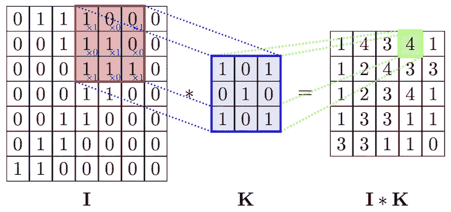

Fig-4: Example of Convolution Operation ([source](https://www.researchgate.net/figure/An-example-of-convolution-operation-in-2D-2_fig3_324165524))

卷积运算的量纲变化:
**输入矩阵** : A x B x C 其中高度为 A；宽度是 B，通道/深度是 C(例如 RGB 图像将有 3 个通道)
**滤波器矩阵** : D x E x C x G 其中滤波器的高度是 D；宽度是 E，C 是通道数/深度(与输入图像相同)，G 是应用的过滤器数
**输出矩阵** : H x W x G 其中高度和宽度可以使用下面的公式计算，G 是应用于输入的过滤器数

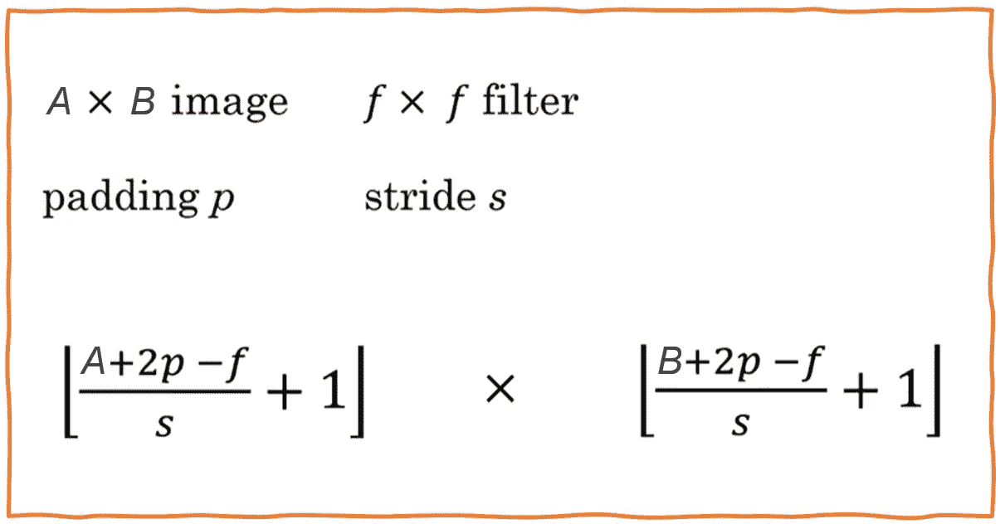

Fig-5: Formula for computing height and width of output matrix from Conv. Operation

> 滤波器矩阵的元素充当“权重”参数，并且在训练模型期间被优化。请参考[这篇文章](https://towardsdatascience.com/conv-nets-for-dummies-a-bottom-up-approach-c1b754fb14d6)了解更多关于 Conv 操作和通讯的信息

# 2.2 转置卷积(上 conv)

为了给图像中的每个像素分配一个类别，图像分割需要将缩小的图像(由于卷积)放大到更接近原始图像的大小。这可以使用完全连接的层来完成，但是它在计算上变得非常昂贵。为了解决这个问题，U-Net 使用转置卷积运算，通过使用比输入更大的滤波器来增加输入图像的维度。

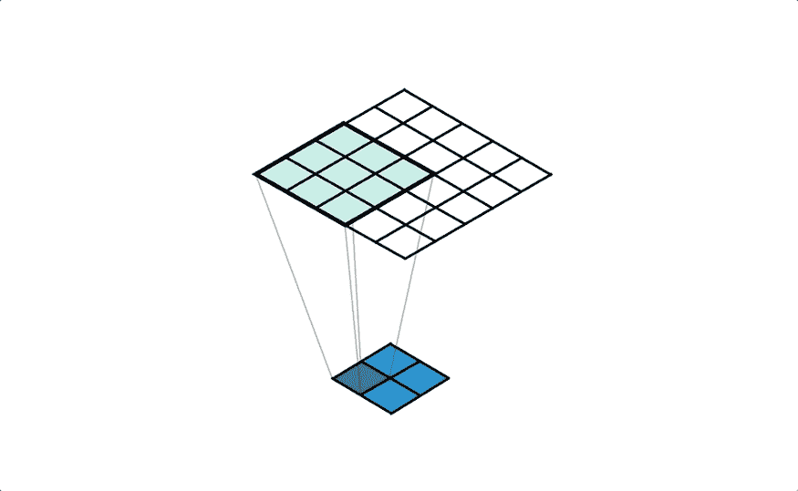

Fig-6: A Conv2DTranspose with 3x3 filter and stride of 2x2 applied to a 2x2 input to give a 5x5 output ([source](/apache-mxnet/transposed-convolutions-explained-with-ms-excel-52d13030c7e8))

> 请参考本文[了解转置卷积的更多信息](/apache-mxnet/transposed-convolutions-explained-with-ms-excel-52d13030c7e8)

# 2.3 联营(最大联营)

池的用途与卷积相同，即减少参数数量并提高计算速度。该层也无意中允许一点正规化。通常在池中执行两个操作——平均或最大。在这两种方法中，我们基于滤波器大小“f”、步长“s”创建输入子集，然后将这些函数(最大值或平均值)应用于输入矩阵。


Fig-7: Example of max-pool with a stride of (2,2)

> 与卷积不同，在汇集操作中不生成权重参数

# 2.4 跳过连接(复制和裁剪)

U-Net 中的跳过连接从早期层(图 3 的 LHS 层)复制图像矩阵，并将其用作后期层(RHS 层)的一部分。这使得模型能够保留来自更丰富矩阵的信息，并防止信息丢失。许多流行的计算机视觉架构使用跳过连接来使输出更加丰富。

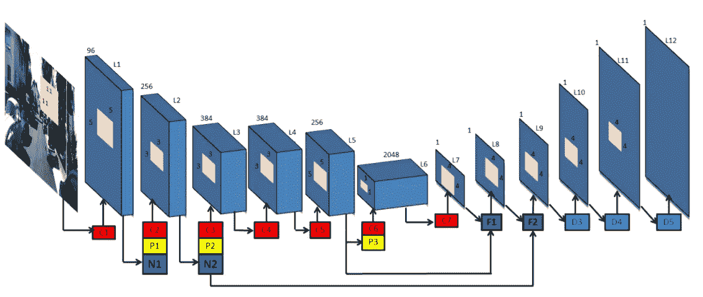

Fig-8: Example of skip connections sharing image information from initial layers to later layers([source](https://arxiv.org/pdf/1603.04992.pdf))

# 3.处理数据

既然我们已经掌握了一些基本概念，让我们开始实现这个模型，并使用牛津-IIIT Pet 数据集获得一些实践知识。该数据集中的文件大小不一，我们将使用 resize、shape 将它们全部转换为一致的所需大小。我们还将通过将像素值除以 256 来归一化图像矩阵。请注意,‘mask’矩阵中的值代表类，因此，我们不会对它们进行规范化。

```
**for** file **in** img:
    index = img.index(file)
    path = os.path.join(path1, file)
    single_img = Image.open(path).convert('RGB')
    single_img = single_img.resize((i_h,i_w))
    single_img = np.reshape(single_img,(i_h,i_w,i_c)) 
    single_img = single_img/256.
    X[index] = single_img

    single_mask_ind = mask[index]
    path = os.path.join(path2, single_mask_ind)
    single_mask = Image.open(path)
    single_mask = single_mask.resize((m_h, m_w))
    single_mask = np.reshape(single_mask,(m_h,m_w,m_c)) 
    single_mask = single_mask - 1 
    y[index] = single_mask
```


Fig-9: The output has 3 classes — background, pet, outline

恭喜你！我们的图像文件夹已经被转换为 X *(dims: #图像，img 高度，img 宽度，img 通道)*和 y *(dims: #蒙版，蒙版高度，蒙版宽度，蒙版通道)。我们现在可以继续设计 U-Net 的架构了！*

> X 中的图像数量应该等于 y 中的掩模数量，数据集的其他维度可以不同。

# 4.定义 U-Net 架构

在编写 U-Net 架构时，我把它分成了两个部分——编码器和解码器。它们可以进一步被分成一系列重复的编码器微块和解码器微块。

> 要设计一个 U-Net，我们必须设计可重复使用的迷你模块，并简单地将它们串在一起。

# 4.1 编码器

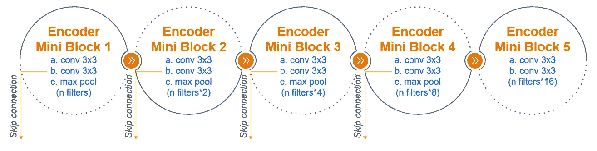

Fig-10: The first 4 blocks are typically called ‘contraction’ section and the last one is called ‘bottleneck’

我们将开发一个编码器迷你块的功能，这将允许我们动态地创建所有的编码器层。如果我们看一下上面的图表，每个微型块中有两个 conv 3x3 操作和一个最大池操作(后者在“瓶颈”块中不存在)。

下面的函数允许我们实现相同的操作选项，如批量标准化、删除，以使模型更加健壮。我们使用“初始化”和 ReLU 来获得最佳结果。在我们应用 max pool 之前，我们正在保存跳过连接的信息，稍后我们将在解码器中使用该信息。

```
**def** EncoderMiniBlock(inputs, n_filters=32, dropout_prob=0.3, max_pooling=**True**):
    conv = Conv2D(n_filters, 
                  3, * # filter size*
                  activation='relu',
                  padding='same',
                  kernel_initializer='HeNormal')(inputs)
    conv = Conv2D(n_filters, 
                  3,  *# filter size*
                  activation='relu',
                  padding='same',
                  kernel_initializer='HeNormal')(conv)

    conv = BatchNormalization()(conv, training=**False**) **if** dropout_prob > 0:     
        conv = tf.keras.layers.Dropout(dropout_prob)(conv)
    **if** max_pooling:
        next_layer = tf.keras.layers.MaxPooling2D(pool_size = (2,2))(conv)    
    **else**:
        next_layer = convskip_connection = conv    
    **return** next_layer, skip_connection
```

> 为了完成编码器，我们将堆叠这些小块，在每个后续块中滤波器的数量加倍(如图 10 所示)

# 4.2 解码器

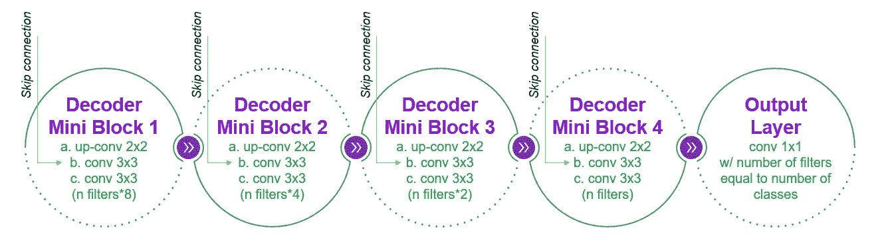

Fig-11: The decoder is typically known as the ‘expansion’ section

解码器首先使用转置卷积增加图像尺寸，然后将结果与来自跳过连接的信息(存储在编码器代码块中)合并。再进行两次卷积运算，我们的微型模块就准备好了。请注意，我们在卷积中使用“相同”填充，以确保我们的图像大小不会减少。

```
**def** DecoderMiniBlock(prev_layer_input, skip_layer_input, n_filters=32):
    up = Conv2DTranspose(
                 n_filters,
                 (3,3),
                 strides=(2,2),
                 padding='same')(prev_layer_input) merge = concatenate([up, skip_layer_input], axis=3) conv = Conv2D(n_filters, 
                 3,  
                 activation='relu',
                 padding='same',
                 kernel_initializer='HeNormal')(merge)
    conv = Conv2D(n_filters,
                 3, 
                 activation='relu',
                 padding='same',
                 kernel_initializer='HeNormal')(conv)
    **return** conv
```

在堆叠 4 个小块之后，我们将使用 conv 1x1 操作来补足编译后的解码器，该操作将小块输出转换为期望的尺寸。

> 输出图层中使用的过滤器数量将等于输出类的数量。因此，我们的输出将具有以下维度:H * W * #类

# 5.训练模型

在编译了上一节中显示的所有小块之后，我们现在需要为模型决定一个优化器、损失函数和准确性度量。然后我们可以使用 model.fit()进行训练。下面，我使用了 Adam optimizer 和稀疏分类交叉熵。

> 如果输出标签是一次性编码的，请使用分类交叉熵而不是稀疏分类交叉熵

```
unet.compile(optimizer=tf.keras.optimizers.Adam(),            loss=tf.keras.losses.SparseCategoricalCrossentropy(from_logits=**True**), metrics=['accuracy'])results = unet.fit(X_train, y_train, batch_size=32, epochs=20, validation_data=(X_valid, y_valid))
```

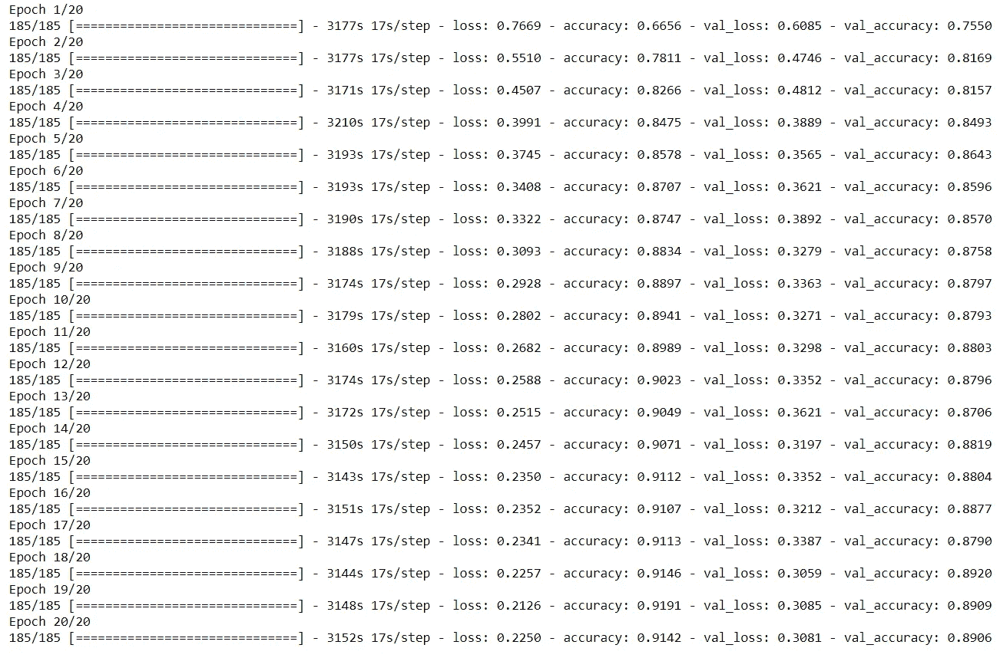

Fig-12: Sample output of model.fit()

# 6.评估模型

*   首先，我们将检查我们的模型是否以正确的速率学习**。我们可以通过绘制每个时期的“损失函数”来做到这一点。如果学习率太大，“训练损失”会振荡，否则，我们会看到持续减少的损失。**
*   其次，我们将寻找**高偏差或欠拟合**，即，如果训练和验证精度都非常低。这意味着模型还没有训练好，需要调整。解决高偏差的一些选择是——更大的网络、更多的训练迭代或增加更多的功能。更好的优化算法和更好的权重初始化也可能有所帮助。
*   最后，我们将检查**高方差或过拟合**，即训练精度高但验证精度低。这意味着该模型与训练数据非常接近，并且不够通用，不足以预测新的数据值。为了解决这个问题，我们可以使用**正则化**，这将缩小权重的影响或向我们的训练集添加更多的例子。

> 评估后，调整模型以获得符合上述标准的最佳结果

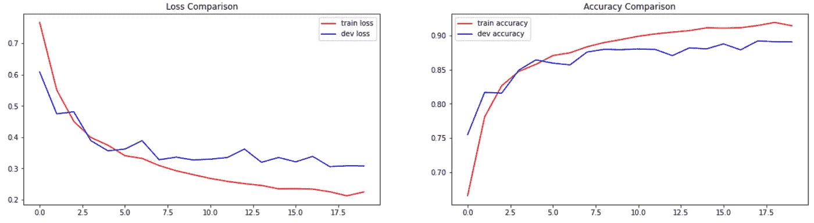

Fig-13: (a) The train loss is consistently decreasing (b) The validation accuracy is not significantly different from the train accuracy

# 7.预测！

既然我们已经检查了 are model 在数字中的表现，我们还可以使用 model.predict()来可视化它的预测。不要忘记确保输入的维度与训练模型的输入维度相匹配。此外，要可视化预测的遮罩，请调整其轴以匹配输出尺寸。

```
**def** VisualizeResults(index):
    img = X_valid[index]
    img = img[np.newaxis, ...]
    **pred_y = unet.predict(img)**
    pred_mask = tf.argmax(pred_y[0], axis=-1)
    pred_mask = pred_mask[..., tf.newaxis]
    fig, arr = plt.subplots(1, 3, figsize=(15, 15))
    arr[0].imshow(X_valid[index])
    arr[0].set_title('Processed Image')
    arr[1].imshow(y_valid[index,:,:,0])
    arr[1].set_title('Actual Masked Image ')
    arr[2].imshow(pred_mask[:,:,0])
    arr[2].set_title('Predicted Masked Image ')
```

下图比较了实际遮罩与 U-Net 模型的预测遮罩。尝试使用我们创建的模型来预测您选择的图像的轮廓和背景！

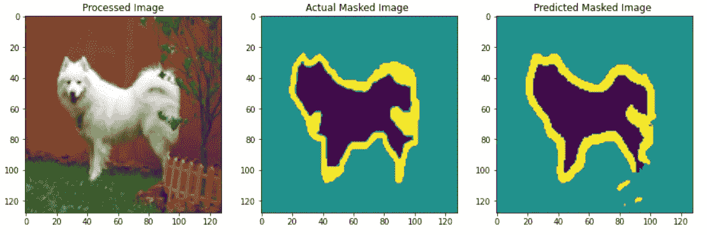

Fig-14: Comparison of actual mask vs predicted mask from U-Net model

# 结论

在转置卷积和跳跃连接的帮助下，U-Net 已经超越了它的前辈，并被证明是多个行业中有用的计算机视觉工具。我希望这篇博客是一个很好的起点，让你尝试为自己的应用程序制作一个 U-Net 模型。我也强烈推荐阅读最初发表的论文 [U-Net:生物医学图像分割的卷积网络](https://arxiv.org/abs/1505.04597)。本博客中引用的代码存储在 [GitHub](https://github.com/VidushiBhatia/U-Net-Implementation/blob/main/U_Net_for_Image_Segmentation_From_Scratch_Using_TensorFlow_v4.ipynb) 上，我很乐意回答任何问题。

> **Pro 提示**:通过跟踪每一步的输入和输出数据维度，可以解决很多错误。编码快乐！