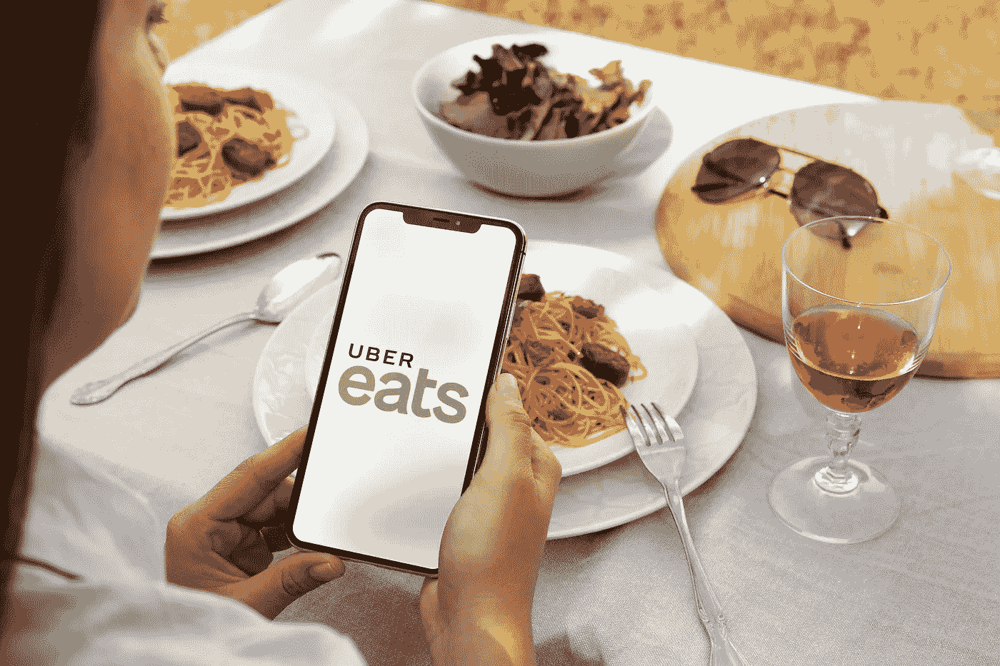
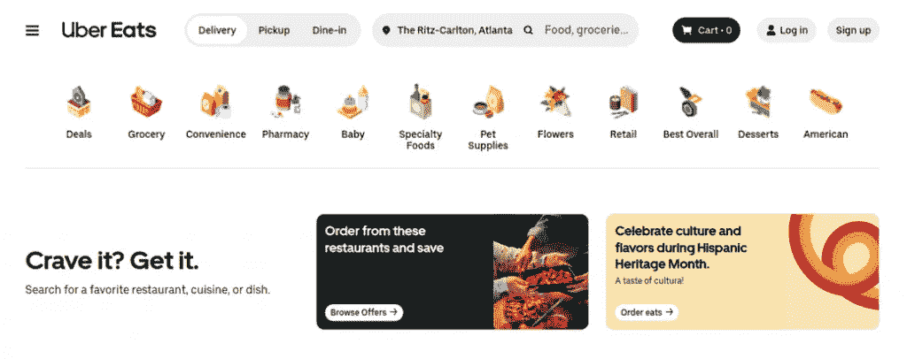
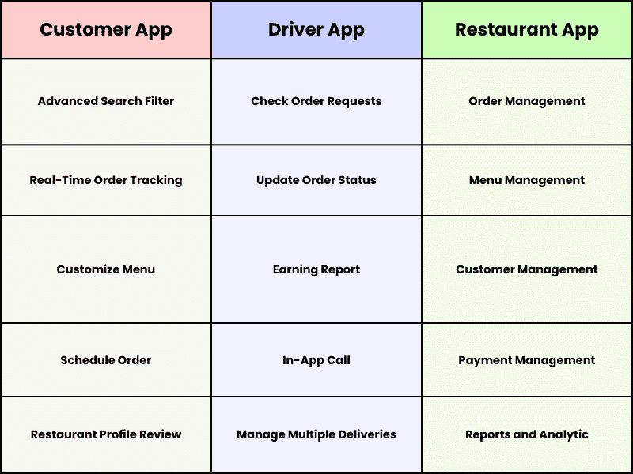
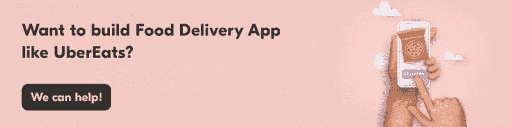

# UberEats 克隆应用开发——餐厅设置的优势

> 原文：<https://medium.com/geekculture/ubereats-clone-app-development-benefits-for-restaurant-setups-5b27f18d6ffe?source=collection_archive---------16----------------------->

UberEats App

A 你是第一次在竞争激烈的送餐市场建立基地，并希望让他们的传统送餐服务建立竞争优势的人吗？利用应用程序的优势是一个好主意。

由于在线食品交付应用的出现，该行业已经见证了巨大的利润，并观察到自己有一个极其有利可图的未来。

如果你访问应用市场；你会遇到许多简化送餐流程的解决方案。在这些解决方案中，市场上的一个流行名称是 UberEats。我们将在文章中讨论这款应用的本质，并强调它是在 UberEats 克隆应用之后创建的。然后，我们将让你了解为什么大多数餐馆都在利用 UberEats 克隆应用程序开发优势来帮助他们的餐馆从竞争中脱颖而出。

# 关于 UberEats

Image Source: ubereats.com

***投放年份****—****2014***

UberEats 克隆应用程序在 45 个国家的 6000 个城市提供服务，具有一些最佳功能和额外的便利性。

想了解这些功能？给你。下面来看看吧。

# UberEats 功能

了解为解决方案的突出性质提供视角的特征；让我们来看看描述这款应用受欢迎程度的统计数据。

UberEats Features

# 描述 UberEats 受欢迎程度的统计数据

数字是你需要关注的一个重要方面，它可以启发你了解解决方案的受欢迎程度。当我们讨论 UberEats 时，让我们浏览一下统计数据，让你对它的整体性质有一个大致的了解。

1.  目前，它拥有超过 8100 万用户
2.  在 45 个国家的超过 [6000 个城市提供](https://www.businessofapps.com/data/uber-eats-statistics/)
3.  拥有 [90 万家餐饮合作伙伴](https://www.businessofapps.com/data/uber-eats-statistics/)
4.  这些数字和上面讨论的功能足以让你明白为什么你需要开发一个像 UberEats 和拥抱在线[食品配送应用程序开发](/@anniewalker362)这样的食品应用程序。

以下是您在旅途中需要遵循的步骤。

这将使食品订购应用程序的开发变得令人愉快，并帮助您成功获得利润回报。

# 如何开发像 UberEats 这样的美食 App？

当你开始开发像 UberEats 这样的食品应用程序时，要像专业人士一样进行食品订购应用程序开发，你必须将一些技巧放在手边。

检查下面的线得到关于他们的教育。

## #1:一个想法就是一切——得到一个想法

有一个想法是企业走向成功的第一步。这就是为什么有一个想法是至关重要的主要原因！

了解你的竞争对手，并设想你将如何开发一款不同于他们的应用。除了了解客户的观点之外，这还包括制定正确的战略，以了解如何开展业务。

## #2:使用强大的技术

你的在线送餐应用程序的最终目标是简化顾客将食物送到家门口的方式。因此，建议在前端和后端分别使用最好的技术。

这将确保和保证最大限度的客户保持参与您的解决方案，并停止任何事故的发生。

## #3:评估收入模式并检查它们的价值

当您参与食品订购应用程序开发以开发像 UberEats 这样的食品应用程序时，评估收入模型并检查它们对您的食品交付设置的价值是一个好主意。有三种模式是企业通常给予的偏好，即上市，佣金和订阅。与您的业务同步检查它们的价值，以获得最大收益。

除了上面强调的步骤之外；建议您联系海外专门的 UberEats 克隆应用开发合作伙伴。从不同的门户网站对公司进行研究。接下来评估他们的投资组合和专业知识。

完成所有这些步骤后，接下来您应该与企业建立连接。这将使您能够轻松检查他们的协作技能，并评估他们是否能够无缝地执行在线食品交付应用程序开发。

既然你已经学会了如何像专业人士一样开发像 UberEats 这样的美食应用，那么成本因素就是你需要关注的。

下面是执行订餐应用程序开发的预计成本，请参见下文。下面同样有一瞥。

# 开发像 UberEats 这样的美食应用程序的估计成本

当你准备好进入在线食品交付应用程序开发的[旅程，开发像 UberEats](https://www.fooddeliveryclone.com/blog/food-delivery-clone-app-development-steps/) 这样的食品应用程序时，除了关注步骤之外，关注成本因素也很重要。这是因为作为一家初创公司，如果不专注于这一领域，最终可能会被证明是致命的；退一步说。

那么，成本到底是多少？

1.  在印度，每小时的费用在 10 到 80 美元之间
2.  在欧洲，每小时的费用在 30 美元到 150 美元之间
3.  在美国，你每小时要花 50 到 250 美元

注意-成本不是恒定的。根据应用程序的复杂性、设计和启动食品交付应用程序的平台，预算会自动增加。因此，专注于保持应用程序尽可能简单，并拥抱跨平台应用程序开发。这会让你的财务状况以最好的方式保持在控制范围内。

# 总结

# 有哪些关键要点？

阅读这篇详尽的文章；你可以理解，UberEats 已经在送餐行业崭露头角。它不仅简化了送餐的方式，还在很大程度上提高了餐馆的知名度。这些极其重要的因素促成了 UberEats 克隆应用的诞生，这是一款针对餐厅设置的现成解决方案。由于该解决方案预装了易于更新和定制的功能，因此引导和利用 UberEats clone 应用程序开发优势是正确的方向。

# 结束语

UberEats 今年的收入为 83 亿美元。这得益于该应用为顾客提供的快餐，除了帮助他们联系附近的餐馆。这些因素在 UberEats 克隆应用程序开发中至关重要，这无疑是食品配送设置的塞翁失马，因为它可以定制，易于修改和更新；和随时准备推出，从而承诺食品初创公司的援助，让他们的知名度在短时间内提高。因此，总的来说，这是食品配送机构的福音。

因此，如果你还没有为你的餐厅设置应用程序的优势，现在是时候了。开发一个像 UberEats 这样的食品应用程序，让你的送餐服务具有竞争优势。与在这方面有经验的值得信赖的海外公司合作。这将有助于您通过提供的无缝食品配送服务从竞争对手中脱颖而出。这最终会让你正确地利用利润，同时获得可观的投资回报。