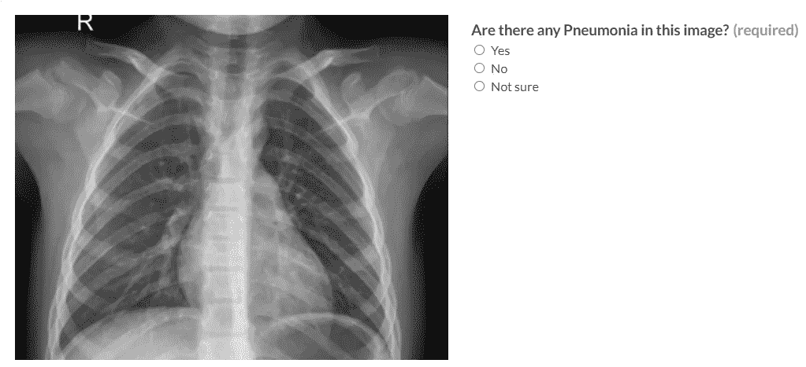
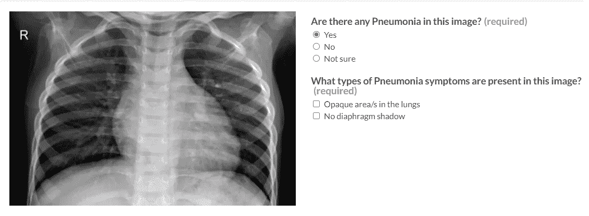
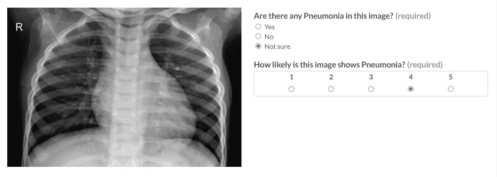

# Udacity AI 产品经理计划回顾(第一部分)

> 原文：<https://medium.com/geekculture/udacity-ai-product-manager-program-review-part-1-a85f24ff082b?source=collection_archive---------12----------------------->

## 以项目为中心的审查方法

Photo by [Austin Distel](https://unsplash.com/@austindistel?utm_source=medium&utm_medium=referral) on [Unsplash](https://unsplash.com?utm_source=medium&utm_medium=referral)

## 概观

这是关于由 Udacity 提供的[人工智能产品经理计划回顾的三部分系列的第一集。](https://www.udacity.com/course/ai-product-manager-nanodegree--nd088)

我已经被 2020 年 12 月*的[贝塔斯曼技术奖学金](https://www.udacity.com/bertelsmann-tech-scholarships)项目第一期和 2021 年 3 月*的第二期录取了。第二阶段期间，我完成了 Udacity 的 [AI 产品经理纳米学位，最近**毕业**。](https://www.udacity.com/course/ai-product-manager-nanodegree--nd088)**

**纳米学位由四章和三个项目任务组成。我认为在线课程最关键的部分是项目作业。因此，我不打算谈论讲座的细节。相反，我会尝试一种不同的方法，通过项目作业来做检查。**

**我将在**不同的剧集**中发布每个项目。因此，读者可以在第一部分读到第一个项目，在第二部分读到第二个项目，在第三部分读到最后一个项目。**

**对于每个项目，我将尝试回答以下问题:**

*   **这个项目是关于什么的？**
*   **项目的结果是什么？**
*   **完成项目的资源和工具是什么？**
*   ***有什么解决办法？***
*   ***项目实施过程中面临哪些问题？***
*   **如何解决那些问题？**
*   **如何改进项目？**
*   **这个项目有哪些参考资料？**

**事不宜迟，让我们开始第一个项目；**

## **项目 1-创建医学图像注释作业**

**Nanodegree 的第一个项目是为给定的数据集和业务目标设计一个**数据标记作业**。**

**商业目标是为儿童制作一种区分健康和肺炎胸部 x 光图像的 AI 产品。**

**作为**人工智能产品经理**，我们的任务是为这个产品建立一个带标签的数据集。稍后，ML 工程师可以使用这个数据集来创建一个**分类产品**，它可以被医生用作**诊断支持**。**

****结果****

**这个项目的目标是学习创建一个高质量的数据集。数据质量是一个成功的机器学习项目的**关键要素**。我们需要确保数据足够大、完整、标记正确，并且与我们的用例相匹配，以成功完成我们的项目。**

**我们将对这个 [Kaggle 胸部 x 光数据集](https://www.kaggle.com/paultimothymooney/chest-xray-pneumonia)进行修改，去掉大部分标签。为了完成这个项目，我们需要提交一个包含设计细节和质量保证策略的 **pdf 文件**形式的项目建议书，以及一个包含说明、示例和一些样本测试问题的 **HTML 文件**。我们将使用[阿彭的平台](https://client.appen.com/sessions/new)进行数据标注工作，并创建 HTML 文件作为项目需求。[阿彭](https://appen.com/about-us/)是一个为**人工智能系统**收集和标注数据的平台。**

****数据标注平台****

**要注释一个没有标签的图像数据源，我们可以使用像[阿彭](https://appen.com/)这样的数据注释平台。注释平台与人类注释者一起工作，他们可以根据需要标记数据。要做到这一点，我们必须向人类注释者解释做什么以及如何为所有用例做。此外，我们必须针对不确定性进行设计，并为注释者提供处理不清楚图像的方法。最后，我们需要准备一些**测试问题**(注释者不知道)，来衡量工作的质量和注释者的表现。**

****设计****

**我们的设计如下。由于我们试图区分健康和肺炎图像，我们需要**两个标签**(是或否)。另外，我们想给注释者一个方法来处理不清楚的图像(不确定)。因此，作为**的第一步**，我们需要一个有如下三种选择的图像。**

****

**Step-1 — *Image by Author***

**我们想知道注释者在图像中看到了什么症状。因此，如果注释者选择 yes，我们将症状作为**第二步**询问。**

****

**Step-2 — *Image by Author***

**最后，我们想知道注释者对肺炎可能性的看法，如果他们不确定图像是第三步。**

****

**Step-3 — *Image by Author***

****阿彭的站台****

**要使用[阿彭的平台](https://client.appen.com/sessions/new)，我们必须首先**创建一个账户**作为客户端。登录后，我们将被引导至*职位创建页面*，在这里我们可以找到几个针对特定用例的**职位模板**。我们将使用 ***图像分类*模板**作为我们的用例，因为我们想要标记完整的图像。为此，我们必须首先单击*图像分类*模板，在加载模板后，我们需要单击屏幕右上方的*使用此模板*按钮。**

****数据选项卡****

**在工作页面上首先要做的是上传数据，我们可以使用 ***数据选项卡*** 来完成这个任务。如前所述，我们将使用包含 117 张图像的 [Kaggle 胸部 x 光数据集](https://www.kaggle.com/paultimothymooney/chest-xray-pneumonia)的子集。其中 16 幅图像被标记，并将用作示例或测试问题，而 101 幅图像未被标记，将用于注释工作。**

****设计选项卡****

**下一步是通过点击 ***设计选项卡*** 来设计作业。*设计页签*由 ***标题*** 、 ***CML 代码*** 和 ***指令*** 部分组成。我们需要给我们的工作起一个相关的标题，以便注释者能够理解要做什么。**肺炎鉴定**是*职称*的不错选择。**

****自定义标记语言****

*****CML*** (自定义标记语言)是阿彭特有的基于 HTML 的语言。它用于定义元素(比如单选按钮)，注释器使用这些元素来**与我们数据集中的图像进行**交互。**

**The CML Code of the Project-1**

****指令****

**如前所述，我们需要向注释者提供详细的说明，以便他们可以根据需要标记图像。因此，HTML 代码的 ***指令部分*** 必须由叙述工作的 ***概述*** 部分、描述要按顺序完成的步骤的 ***步骤*** 部分、解释细节的 ***规则和提示*** 部分以及阐明所有用例的工作的 ***示例*** 部分组成。**

****质量标签****

**定型后，我们需要切换到 ***质量页签*** 。在这个选项卡中，我们将为注释者准备一些**测试问题**。这些问题将用于跟踪注释者的表现。Udacity 建议至少准备 5 %的数据集作为测试问题，阿彭建议我们使用 8 个。由于我们有 16 个标记的数据，我们可以轻松地准备 8 个测试问题。这里需要注意的一点是，我们必须为每个标签准备数量均衡的试题。否则，注释者在注释时可能会倾向于使用频率最高的标签。**

**在准备试题时，我们必须提供**答案**和**解释**，这样如果注释者错过了问题并且回答错误，她就可以知道原因。注释者必须理解为什么他们是错的，以提高他们的性能。**

****保存 HTML 文件****

**做完试题，平台就搞定了。我们可以使用屏幕右上角的眼睛图标预览我们的作业。我们可以通过右键单击页面并选择另存为来保存 HTML 文件。我们需要设置另存为类型为**网页，HTML Only** 。请注意，我们**不会启动**数据标签工作！现在是时候处理这个提议了。**

****提案****

**该提案由三个部分和七个问题组成，其中一些问题已经在上面回答过了。我不会涉及该提案的所有细节；相反，我将侧重于一些关键方面。**

**在我们的标签工作中，我们使用了三个标签。即' ***'有肺炎'*** ，' ***健康*** (无肺炎)，'和' ***不确定'*** 然而，我们的模型需要两个标签。 ***【已肺炎】******健康我们需要找到一种方法来减少标签，以便我们的模型可以使用它们。如果 ***不确定*** 的答案很少，那么就没有问题。我们可以进行人工检查。但是如果它们是频繁的，特别是在特定的图像上，我们需要一种方法来决定标签。为此，我们可以使用**标度**的平均值。我们为此向 ***不确定*** 的答案提供了肺炎的可能性量表。*****

*我们可以使用[阿彭的平台](https://client.appen.com/sessions/new)工具在作业期间监控注释器，并采取必要的行动。例如，有时，相应数量的注释者可能会错过特定的测试问题。这可能是因为试题**刁钻**或者说明和例子**不清楚**造成的。在这种情况下，我们可能要修改说明和示例。我们甚至可以用测试题作为例题，因为它很棘手。*

*我们还应关注**贡献者的反馈**，并在需要时做出必要的更改。为此，我们可以使用[阿彭的平台监控工具](https://vimeo.com/440060571)。*

*我们还必须考虑我们工作的局限性和改进。*

*为此，我们必须考虑**偏差**的任何来源以及如何处理它。由于我们的数据集很小，我们可能会有**采样偏差**。此外，我们可能会有**测量偏差**，因为图像的大小略有不同，并且是在略微不同的曝光时间下拍摄的。因此，获取更多的数据并对新数据使用相同的成像程序可能会减少这些偏差。*

*此外，我们必须决定如何获取新数据，以及从长远来看如何处理这些数据。对于我们的用例，使用不断用新数据训练的**动态模型**是合理的，因为它会因为新的成像技术和新的症状或疾病(例如，Covid 19)而演变。*

*完成提案并创建 pdf 文件后，我们可以提交我们的项目进行**审查**。*

***故障排除***

*我认为这个纳米学位的课程是 2018 年设计的，甚至可能是 2017 年。结果，有些信息，尤其是关于[阿彭的平台](https://client.appen.com/sessions/new)，是**过时的**。因此，学生可能难以理解界面。此外，由于 CML 是针对[阿彭](https://success.appen.com/hc/en-us/articles/202817989-CML-Custom-Markup-Language-Overview)的，所以可能不容易找到关于它的教程。我建议 Udacity 的导师帮助平台和[阿彭的帮助页面](https://success.appen.com/hc/en-us)以防遇到麻烦。*

***结论***

*收集干净的数据是 ML 工作流程的基本步骤之一。在[人工智能产品经理计划](https://www.udacity.com/course/ai-product-manager-nanodegree--nd088)的第一个项目中，我们学习了如何创建一个标签工作，这是一个成功的 ML 项目的关键。*

*我们从一个商业目标开始。然后我们收集了数据集。由于数据集是无标签的，我们决定使用标签，并使用阿彭的平台来标注数据集。我们首先把数据集下载到阿彭的平台上来做这件事。后来，我们进行了设计，包括说明、示例、测试问题和未标记的数据集。*

*在进行设计时，我们注重可理解性和质量。我们也考虑了数据的可能偏差和寿命计划。*

*您还可以在我的 [GitHub 库](https://github.com/ErkanHatipoglu/AI-Product-Manager-Nanodegree-Program)中找到完整的项目实现。*

*现在是时候进入下一个项目了。请继续关注第二部分。*

***参考文献***

*   *[乌达城](https://www.udacity.com/)*
*   *贝塔斯曼公司&KGaA*
*   *[AI 产品经理计划](https://www.udacity.com/course/ai-product-manager-nanodegree--nd088)*
*   *[贝塔斯曼技术奖学金](https://www.udacity.com/bertelsmann-tech-scholarships)*
*   *[卡格尔](https://www.kaggle.com/)*
*   *[Kaggle 胸部 x 光数据集](https://www.kaggle.com/paultimothymooney/chest-xray-pneumonia)*
*   *[阿彭](https://appen.com/about-us/)*