# Udacity AI 产品经理计划回顾(第二部分)

> 原文：<https://medium.com/geekculture/udacity-ai-product-manager-program-review-part-ii-b9fb55d0314e?source=collection_archive---------8----------------------->

## 以项目为中心的审查方法

Photo by [Grovemade](https://unsplash.com/@grovemade?utm_source=medium&utm_medium=referral) on [Unsplash](https://unsplash.com?utm_source=medium&utm_medium=referral)

## 概观

T 本文是关于 Udacity 提供的 [AI 产品经理项目评审的**三部曲系列**的第二集。对第 1 部分感兴趣的读者可以点击下面的链接。](https://www.udacity.com/course/ai-product-manager-nanodegree--nd088)

 [## Udacity AI 产品经理计划回顾(第一部分)

### 以项目为中心的审查方法

medium.com](/geekculture/udacity-ai-product-manager-program-review-part-1-a85f24ff082b) 

正如在本系列的第一部分的[中所述，我将回顾项目任务，并在**不同的章节**中发布每个项目。因此，读者可以在第一部分](/geekculture/udacity-ai-product-manager-program-review-part-1-a85f24ff082b)中读到第一个项目，在第二部分中读到第二个项目，在第三部分中读到最后一个项目。

对于每个项目，我将尝试回答以下问题:

*   *什么是项目？*
*   项目的结果是什么？
*   *完成项目的资源和工具有哪些？*
*   *有什么解决办法？*
*   *项目实施过程中面临哪些问题？*
*   那些问题如何解决？
*   如何改进这个项目？
*   这个项目有哪些参考资料？

所以我们开始第二个项目。

## 项目 2——用 Google AutoML 建立一个模型

T 他的项目是[项目 1](/geekculture/udacity-ai-product-manager-program-review-part-1-a85f24ff082b) 的续篇，在该项目中，我们为区分健康和肺炎胸部 x 光图像的标记工作创建了指令。

在典型的[机器学习(ML)工作流程](https://cloud.google.com/ai-platform/images/ml-workflow.svg)中，数据收集和准备之后的后续步骤是建模步骤。虽然这个 Nanodegree 提出了一个略有不同的 ml 工作流程，以 ***业务目标*** 开始，以 ***主动学习和调优*** 结束，但在这个阶段并没有什么不同。我们需要训练和评估我们的模型。

**目标**

因此，在纳米度的第二个项目中，我们将建立四个不同的分类模型，以区分健康和肺炎胸部 x 光图像。这个作业中不会有编码。相反，我们将使用 [Google AutoML](https://cloud.google.com/automl/) 。AutoML 代表[自动机器学习](https://en.wikipedia.org/wiki/Automated_machine_learning)。它是一个工具，用于自动化 ML 工作流，并从给定数据集的一组给定模型算法中找到我们可以部署的性能最佳的模型。通过使用 [Google AutoML](https://cloud.google.com/automl/) ，我们可以在云中构建和部署我们的模型。

我们的项目旨在使用[谷歌的 AutoML 视觉平台](https://console.cloud.google.com/vision)构建四个模型，并了解数据特征如何影响模型性能。我们不会部署我们的模型，但是我们最终会提交一份 AutoML 建模报告以供审查。

我们将使用 [Kaggle 胸部 x 射线数据集](https://www.kaggle.com/paultimothymooney/chest-xray-pneumonia)，与之前的项目一样。我们将选择数据集的四个**不同子集**，并使用这些子集中的每一个建立四个 **ML 模型**。我们不会像在[之前的项目](/geekculture/udacity-ai-product-manager-program-review-part-1-a85f24ff082b)中那样使用[阿彭的平台](https://client.appen.com/sessions/new)来标记它们，而是使用数据集中给出的原始标签。

**谷歌汽车**

要使用[谷歌的 AutoML 视觉平台](https://console.cloud.google.com/vision)，我们将进入[谷歌 AutoML](https://cloud.google.com/automl/) ，点击 ***尝试 AUTOML*** 按钮，选择 ***AutoML 视觉*** 。登录帐户后，我们可以用任何标题创建我们的项目。请注意，谷歌可能会根据您的帐户状态向您收取该项目的费用。但是如果你注册了，你会得到 300 美元的免费信用点数。

**数据**

我们将使用 [Kaggle 胸部 x 光数据集](https://www.kaggle.com/paultimothymooney/chest-xray-pneumonia)的四个子集，我建议在建模之前准备好这些子集**，以确保我们的模型使用类似的数据集。**

**创建一个二进制分类器，利用胸部 x 光检测肺炎**

第一子集将包含 200 个胸部 x 射线图像，100 个来自'*'类，100 个来自'*'*类。***

***除了一件事之外，我不会深入讨论训练过程的细节。如果需要，我们可以很容易地从 Google 和 Udacity 项目页面找到帮助。相反，我会把重点放在我们将提交审查的结果和建模报告上。***

***我想讨论一下训练过程中的训练/测试拆分概念，这在 ML 中非常重要。***

***我们可以将 ML 中的模型创建过程分成三个连续的步骤，即训练、超参数调整和评估步骤。我们需要每个阶段的数据来进行下一步。但是，每个阶段使用的数据应该不同，我们必须在开始时将这些数据集相互隔离。否则，我们最终将得到一个表现不佳的模式，这是我们不想要的。因此，在创建模型之前，首先要做的是将数据集分成三部分。这些是训练中使用的训练集、超参数调整中使用的验证集以及评估中使用的测试集。***

***因此，在训练之前，我们将数据集分成 80%、10%和 10%的部分，如下图所示。**用于训练的更多数据**总是意味着**更好的模型性能**。所以我们会分配尽可能多的数据进行训练(80%)。***

***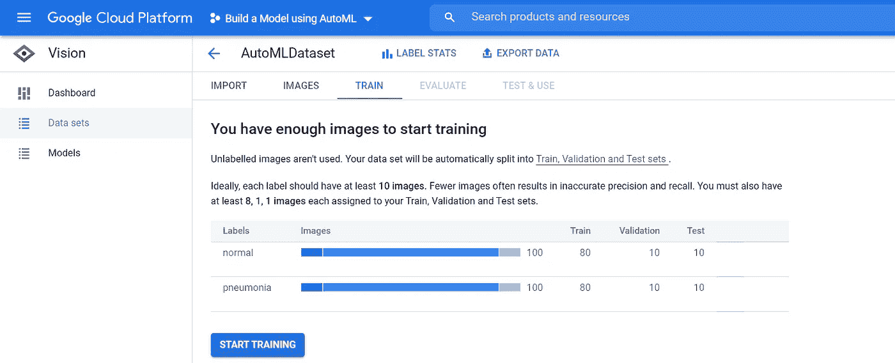***

***Train/Test Split for Dataset-1 — Image by Author***

***在我们完成训练后，我们可以通过查看 ***混淆矩阵*** 来评估我们的模型。***

**混淆矩阵是一个网格，显示所有预测的“标签”相对于所有实际的“标签”在我们的例子中，我们在下面的混淆矩阵中有四个单元格。**

**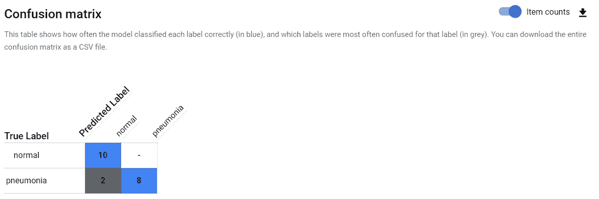**

**Confusion Matrix for Dataset-1 — Image by Author**

**混淆矩阵中每个单元的解释如下。**

*   *****真阳性*** (第 1 行第 1 列， **TP** 简而言之):TP 是被表现最好的模型预测为阳性的阳性标签数。**
*   *****假阴性*** (第 1 行第 2 列， **FN** 简而言之):FN 是被表现最好的模型预测为阴性的阳性标签数。**
*   *****假阳性*** (第 2 行第 1 列， **FP** 简而言之):FP 是被表现最好的模型预测为阳性的阴性标签的数量。**
*   *****真阴性*** (第 2 行第 2 列， **TN** 简而言之):TN 是被表现最好的模型预测为阴性的阴性标签数。**

**如前所述，我们的测试集有 10 幅'*'*和 10 幅' ***【肺炎】*** ' 图像。 ***混淆矩阵*** 告诉我们，我们的模型已经预测出 10 个中的 10 个正常的**类图像为 ***正常的*** 类图像和 8 个中的 10 个肺炎*类图像为 *************

***在机器学习中，我们使用各种度量来评估我们的模型。最流行的度量之一是模型准确性。***

******模型准确性*** 衡量所有类别的准确预测占预测总数的百分比。用数学术语来说:***

****

**然而，依赖准确性可能会产生误导，尤其是对于不平衡的数据集。在本项目中，我们将不会使用' ***精确度*** '尽管如此，我们还是会计算两次，看看它是如何误导我们的。第一个模型的精度如下。**

**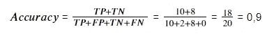**

**为了评估我们的模型，我们将使用从混淆矩阵计算出的两个度量:精确度和召回*。***

***这些度量标准衡量模型，以了解它在单个类别和跨类别中的表现。***

******模型精度*** 测量正确识别的类实例占该类预测总数的百分比。用数学术语来说:***

**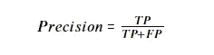**

*****模型召回*** 衡量一个类别的正确识别实例占该类别所有可能样本的百分比。用数学术语来说:**

****

**因此，对于用 dataset-1 训练的模型-1,“正常”类的 ***精度和*** 如下。**

**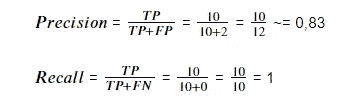**

****创建一个不平衡的二元分类器****

**第二子集将包含 400 个胸部 x 光图像，100 个来自'*'*类，300 个来自' ***肺炎*** ' 类。****

**我们首先将数据集分成 80%、10%和 10%的部分。**

**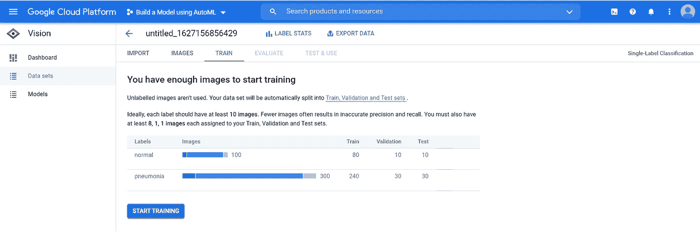**

**Train/Test Split for Dataset-2 — Image by Author**

**培训结束后，我们将使用混淆矩阵评估我们的模型。**

****

**Confusion Matrix for Dataset-2 — Image by Author**

**我们的测试集有 10 张' ***【正常】*** ' 和 30 张' ***肺炎*** ' 图像。 ***混淆矩阵*** 告诉我们，我们的模型已经预测出 10 个中的 6 个'*'*类图像为' ***正常*** ' *和 30 个中的 30 个 ***肺炎*** ' 类图像为*’****

*让我们计算“正常”类的精度和召回率。*

*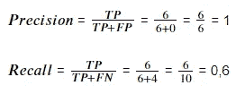*

*对于' ***普通*** '类， ***精度*** 从 0，83 增加到 1， ***召回*** 从 1 减少到 0，6。*

*模型 2 主要预测不平衡的阶级。换句话说，模型 2 倾向于将输入推广到多数类(肺炎)。因此， ***召回*** 减少为少数阶级。*

*如果我们计算这个模型的精确度，我们就能明白为什么精确度对于不平衡的数据集不是一个好的选择。精度计算如下。*

*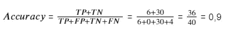*

*正如我们很容易看到的，虽然这个模型的精度与干净/平衡的情况相同，但这个模型的性能比它差得多。因此，正如我之前所说，对不平衡的数据集使用准确性会误导我们。*

***用脏数据创建二进制分类器***

*对于第三个数据集，我们将从第一个数据集中使用的 100 个“正常”和 100 个“肺炎”图像的原始数据集开始。然后我们将每个类中的 30 个标签反过来，错误分类 30%的数据。*

*同样，我们首先将数据集分成 80%、10%和 10%的部分。*

*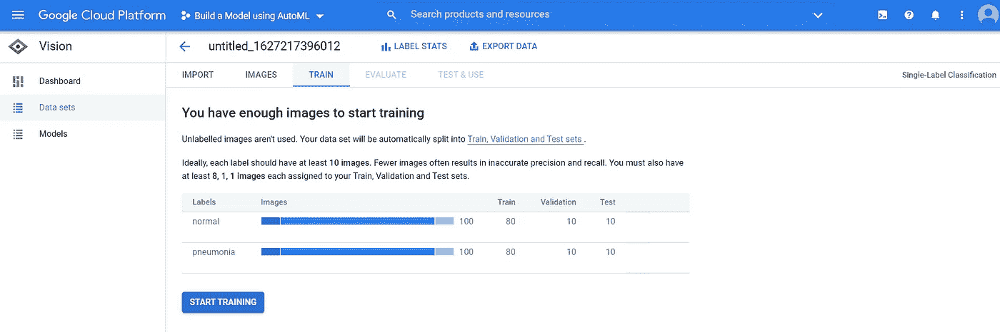*

*Train/Test Split for Dataset-3 — Image by Author*

*培训结束后，我们将使用混淆矩阵评估我们的模型。*

*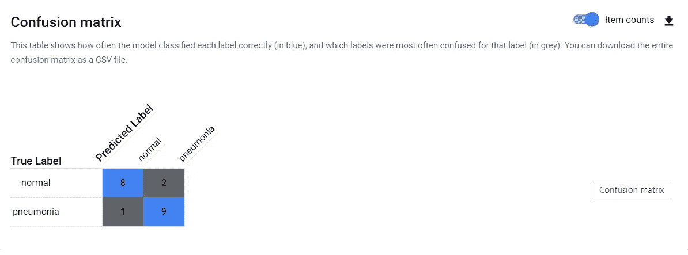*

*Confusion Matrix for Dataset-3 — Image by Author*

*我们的测试集有 10 个' ***【正常】*** ' 和 10 个' ***肺炎*** ' 图像。上面显示的 ***混淆矩阵*** 告诉我们，我们的模型已经预测出 10 个中的 8 个'*'*类图像为' ***正常*** '和 9 个中的 10 个' ***肺炎*** ' 类图像为'**【T41]*****

**让我们计算“正常”类的精度和召回率。**

**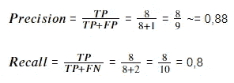**

**对于' ***普通*** '类， ***精度*** 从 0.83 增加到 0.88， ***召回*** 从 1 减少到 0.8。**

**我们很容易看出，总误差(3)大于*清洁/平衡*外壳误差(2)。**

**此外，测试数据集中可能有一些脏数据，这使得模型不可靠，这意味着实际性能可能比评估差得多。**

**用“正常”、“细菌性肺炎”和“病毒性肺炎”创建一个三级模型**

**如果我们详细研究 [Kaggle 胸部 x 光数据集](https://www.kaggle.com/paultimothymooney/chest-xray-pneumonia)，我们会发现病毒或细菌会导致肺炎。我们可以通过查看数据集中的图像名称来查看这一点。如果图像名称包含“病毒”，则为病毒性肺炎，如果图像名称包含“细菌”，则为细菌性肺炎。**

**对于最终模型，我们将创建一个三类数据集，其中 100 个图像来自'*'*'类，100 个图像来自'**细菌性肺炎**'类，100 个图像来自'**病毒性肺炎**'类。****

***我们首先将数据集分成 80%、10%和 10%的部分。***

***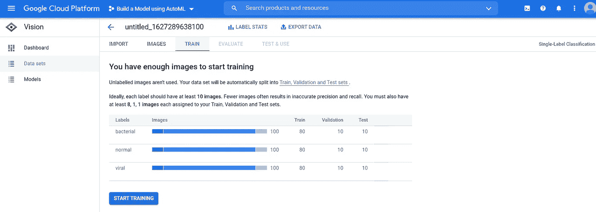***

***Train/Test Split for Dataset-4 — Image by Author***

***培训结束后，我们将使用混淆矩阵评估我们的模型。***

***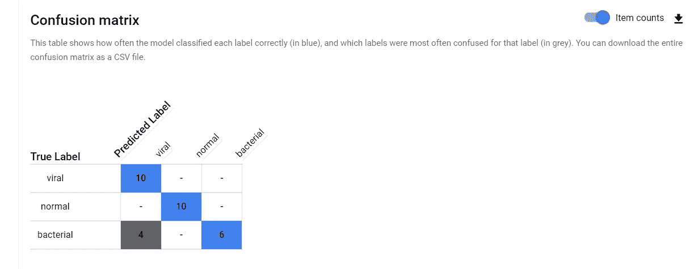***

***Confusion Matrix for Dataset-4 — Image by Author***

***这次我们在我们的测试集中有十个' ***正常*** ，'十个'**病毒性肺炎**，'和十个'**细菌性肺炎**类图像。 ***混淆矩阵*** 告诉我们，我们的模型已经预测出 10 分之 10 的'**病毒性肺炎** ' 类图像为' ***病毒性肺炎*** ，' 10 分之 10 ' ***正常*** '类图像为' ***正常*** ，”’***

**我们可以计算“正常”、“病毒性肺炎”和“细菌性肺炎”类别的精确度和召回率。**

**对于'*'*类正常:****

***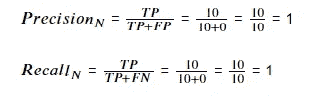***

***对于' ***'病毒性肺炎*** ' 类:***

**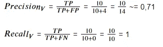**

**而对于'**细菌性*肺炎*** '类:**

**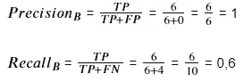**

**似乎该模型混淆了细菌性肺炎和病毒性肺炎。解决这种困惑的一个方法是向训练中添加更多的数据。因此，让我们为每个类添加 20 个图像，以创建一个新的平衡数据集，并重新训练我们的模型。**

**我们有来自'*'*类的 120 个图像，来自'**细菌性肺炎'**类的 120 个图像，以及来自'**病毒性肺炎**'类的 120 个图像。新的混淆矩阵如下。****

***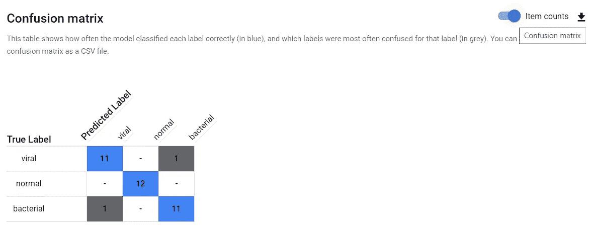***

***Confusion Matrix for Dataset-4 b — Image by Author***

***我们现在有了更好的结果。让我们最后一次计算精度和回忆。***

***对于'*'***'类*** :****

**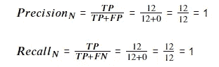**

**对于'*'*类病毒性肺炎:****

***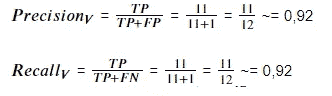***

***而对于'**细菌性*肺炎*** '类:***

**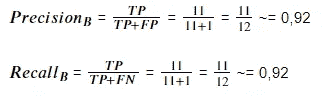**

**我们可以看到，当' ***病毒性肺炎*** '类的精度分数和'**细菌性*肺炎*** '类的召回分数显著增加**时，' ***病毒性肺炎'*** 类的召回分数和'**细菌性*肺炎*** 类的精度分数略微减少**。这种现象表明性能更好。******

******作为最后一个阶段，我们将引入一个新的指标来衡量这种性能提升，即 F1 分数。我们可以用精度和召回率计算 F1 得分，F1 得分是[精度和召回率](https://en.wikipedia.org/wiki/F-score)的[调和平均值](https://en.wikipedia.org/wiki/Harmonic_mean)。用数学术语来说:******

******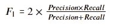******

******我们现在将计算两个数据集的每个类的 F1 分数。******

******对于'**正常**'等级:******

******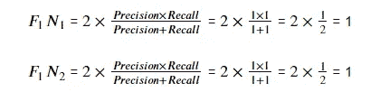******

******对于' ***'病毒性肺炎*** ' 类:******

******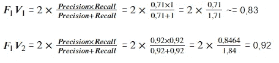******

******而对于'**细菌性*肺炎*** '类:******

******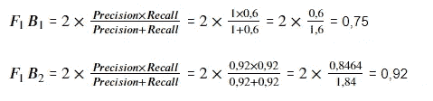******

*********病毒性和细菌性肺炎类别的 F1 分数均有所提高，表明*** 性能有所提高。******

********故障排除********

******这个项目最具挑战性的部分是创建一个 AutoML Vision 帐户，因为谷歌不会很快接受借记卡，尝试不同的卡通常可以解决这个问题。******

******上传数据集时会出现另一个问题。有时谷歌在抱怨图片重复的同时并没有上传所有的图片。手动添加新图像可以解决这个问题。******

******最后，有时不平衡模型会给出意想不到的好结果。也许 Google AutoML 是想把不平衡的数据集过滤成平衡的数据集。使用新的数据集或重新训练模型将解决这个问题。******

********结论********

******在这个项目中，我们已经了解了数据属性如何影响模型性能。我们已经看到，脏的和不平衡的数据会显著降低模型性能。******

******此外，我们已经看到，使用准确性可能会误导我们。相反，精确度、召回率或 F1 分数可能会给出更好的结果。******

******我们还学习了如何使用混淆矩阵计算精确度、召回率和 F1 分数。******

******最后一点，你们中的一些人可能会注意到，虽然我在本文开始时承诺讨论项目可能的改进，但我没有提到任何改进，因为我将在下一集中讨论这些改进。敬请期待最后一集。如果你喜欢这个主题或者对它感兴趣，请参考[我的 GitHub 库](https://github.com/ErkanHatipoglu/AI-Product-Manager-Nanodegree-Program)或者下面我的 Udacity AI 产品经理计划的第一集。******

****** [## Udacity AI 产品经理计划回顾(第一部分)

### 以项目为中心的审查方法

medium.com](/geekculture/udacity-ai-product-manager-program-review-part-1-a85f24ff082b) 

感谢您的阅读！

**参考文献**

*   [Udacity](https://www.udacity.com/)
*   [贝塔斯曼公司&KGaA](https://www.bertelsmann.com/#st-1)
*   [AI 产品经理计划](https://www.udacity.com/course/ai-product-manager-nanodegree--nd088)
*   [贝塔斯曼技术奖学金](https://www.udacity.com/bertelsmann-tech-scholarships)
*   [机器学习工作流程](https://cloud.google.com/ai-platform/docs/ml-solutions-overview)
*   [谷歌汽车](https://cloud.google.com/automl/)
*   [自动化机器学习](https://en.wikipedia.org/wiki/Automated_machine_learning)
*   [谷歌的 AutoML 视觉平台](https://console.cloud.google.com/vision)
*   [卡格尔](https://www.kaggle.com/)
*   [Kaggle 胸部 x 光数据集](https://www.kaggle.com/paultimothymooney/chest-xray-pneumonia)
*   [阿彭的站台](https://client.appen.com/sessions/new)
*   [调和平均](https://en.wikipedia.org/wiki/Harmonic_mean)
*   [F 分数](https://en.wikipedia.org/wiki/F-score)******