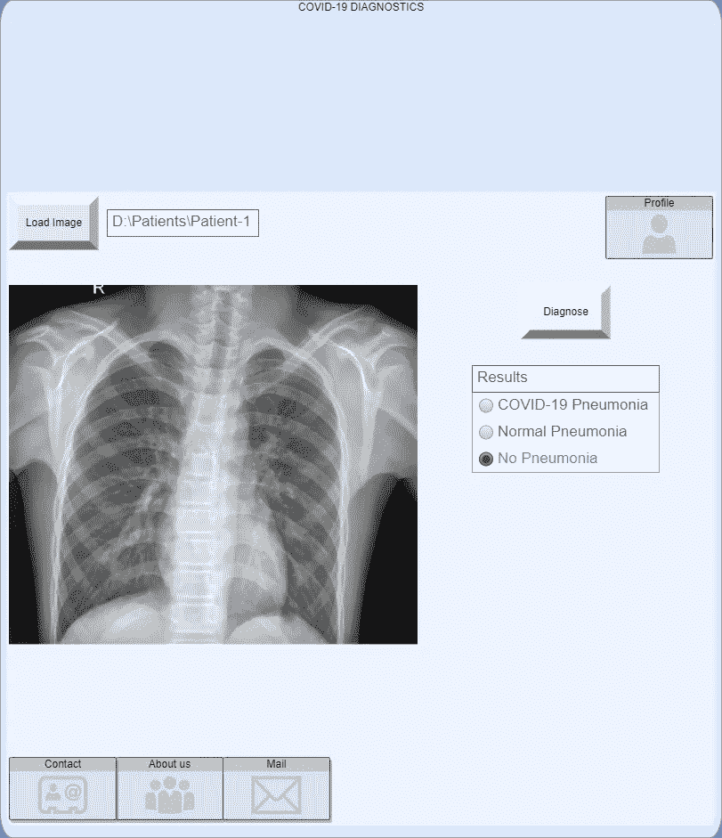

# Udacity AI 产品经理计划回顾(第三部分)

> 原文：<https://medium.com/geekculture/udacity-ai-product-manager-program-review-part-iii-6da01dc2bb8c?source=collection_archive---------11----------------------->

## 以项目为中心的审查方法

Photo by [CDC](https://unsplash.com/@cdc?utm_source=medium&utm_medium=referral) on [Unsplash](https://unsplash.com?utm_source=medium&utm_medium=referral)

## 概观

T 本文是关于 Udacity 提供的 [AI 产品经理项目评审的**三部曲系列**的最后一集。对第一部分和第二部分感兴趣的读者可以点击下面的链接。](https://www.udacity.com/course/ai-product-manager-nanodegree--nd088)

 [## Udacity AI 产品经理计划回顾(第一部分)

### 以项目为中心的审查方法

medium.com](/geekculture/udacity-ai-product-manager-program-review-part-1-a85f24ff082b)  [## Udacity AI 产品经理计划回顾(第二部分)

### 以项目为中心的审查方法

medium.com](/geekculture/udacity-ai-product-manager-program-review-part-ii-b9fb55d0314e) 

正如本系列的第一部分所述，我已经回顾了项目任务，并在**不同的章节**中发布了每个任务。因此，读者可以在第一部分中阅读第一个项目，在第二部分中阅读第二个项目，在第三部分中阅读最后一个项目。

Udacity 让学生为他们选择的人工智能产品开发商业提案，作为压顶项目。

我选择了一个关于新冠肺炎肺炎检测的项目，因为我在以前的任务中已经做了一些关于肺炎检测的项目，并且可以在最终的项目中使用所获得的经验。

所以让我们开始最后的项目。

# 项目 3—创建人工智能产品商业提案

OO我们的商业计划书将包括产品开发的一些基本要素。这些是:

*   *业务目标，*
*   *成功指标，*
*   *数据，*
*   *型号，*
*   *最低存活产品(MVP)*
*   MVP 部署后。

我们将逐一处理每个项目，并一起完成提案。

## 商业目标

> 我们将从业务目标开始。我们需要定义我们试图解决的行业问题，并证明使用 ML/AI 来解决这项任务是合理的。

作为最后一个项目，我们将提出一个区分健康、肺炎和新冠肺炎肺炎胸部 x 光图像的人工智能产品。

众所周知，新冠肺炎快速检测和 PCR 检测的[假阴性(FN)](https://en.wikipedia.org/wiki/False_positives_and_false_negatives) 比率非常高。另一方面，[【假阳性】](https://en.wikipedia.org/wiki/False_positives_and_false_negatives)的比率对他们来说太小了。因此，医生依靠其他工具，如已知症状或胸部 x 光图像来检测新冠肺炎。然而，医生没有办法确定一张肺炎图像是普通肺炎还是新冠肺炎肺炎。

在胸部 x 光图像中有肺炎迹象且检测结果为阴性的患者可以假定他们患有新冠肺炎而接受治疗。或者治疗可能被延迟到进行另一次测试。但是，这种方法有风险。普通的肺炎患者可能会接受僵硬的药物治疗，或者新冠肺炎患者可能会浪费宝贵的时间而不接受治疗。

因此，该产品将使用人工智能来:

*   区分新冠肺炎肺炎和普通肺炎，
*   加快诊断和治疗，
*   在正确的时间进行正确的治疗，
*   充当医生的诊断助手
*   增加病人的快乐，
*   提高医生的可信度。

> 接下来要做的是，通过考虑业务成功的驱动因素，如对收入、市场份额和客户满意度的影响，提供创建该产品的理由。

新冠肺炎疗法非常僵硬，有严重的副作用。区分普通肺炎和新冠肺炎肺炎可能会改变药物使用，非新冠肺炎肺炎患者可能会得到较轻的治疗，避免不必要的副作用。

此外，还可以节省由阴性结果导致的多次测试所浪费的时间。这种浪费的时间可能会对病人造成不可逆的损害。

因此，该产品将加快新冠肺炎诊断的速度，提高患者的满意度，同时也有助于提高医生的可信度。

> 最后，我们需要解释我们将使用的 ML/AI 任务以及我们将实现的业务成果。

我们的 ML 模型将是一个多类分类器，从胸部 x 射线图像中区分非肺炎、正常肺炎和新冠肺炎肺炎。

用户满意度和决策过程将作为结果进行监测。

## 成功指标

> 本节将选择衡量标准来确定我们产品的成功，并指定我们将如何建立基准。

S 由于我们将监控用户满意度和决策过程作为结果，我们需要应用相关的成功指标。我们将利用以下指标:

客户满意度

客户调查将在使用产品之前和之后完成，之前进行的客户调查将作为基线。

决策过程

该产品诊断的标准肺炎病例数将是一个成功指标。这个数量是必不可少的，因为它直接表明产品的成功，少量暗示不适用的最终产品。疫情之前从客户处收集的平均肺炎病例将用作基线。

使用和不使用该产品计算的诊断时间的差异将是另一个成功指标。数据将从客户处收集，基线将为零。

## 数据

> 我们必须计划如何以及在哪里以什么样的成本获取数据。我们还必须考虑可能的[个人身份信息(PII)](https://www.csoonline.com/article/3215864/how-to-protect-personally-identifiable-information-pii-under-gdpr.html) 或[数据敏感性](https://www.upguard.com/blog/sensitive-data)问题。

F 对于最初的产品，数据将从开源资源中收集，包括我们在这个纳米度的[第一](/geekculture/udacity-ai-product-manager-program-review-part-1-a85f24ff082b)和[第二](/geekculture/udacity-ai-product-manager-program-review-part-1-a85f24ff082b)项目中使用的数据集。下面你可以找到一些开源数据集的链接:

*   [科恩，J. P .，莫里森，P. &道，l .影像资料集(2020)](https://github.com/ieee8023/covid-chestxray-dataset)
*   [RSNA 肺炎检测挑战赛— Kaggle](https://www.kaggle.com/c/rsna-pneumonia-detection-challenge)
*   [胸部 x 光图像(肺炎)— Kaggle](https://www.kaggle.com/paultimothymooney/chest-xray-pneumonia)
*   [新冠肺炎成像数据集](https://www.eibir.org/covid-19-imaging-datasets/)

收集这种开源数据没有财务成本；然而，清理、准备和组合所有数据到一个平衡的数据集将需要劳动。

由于初始产品的数据集是开源的，因此不存在 PII 或数据敏感性问题。

随着病毒的每一次变异，图像可能会改变形式。因此，向我们的模型提供从客户那里收集的新数据至关重要。将小批量收集这些数据，并重新训练模型。在管理这些批次时，我们需要考虑数据集的平衡，每个类的样本数量必须大致相等。

由于我们将通过客户端使用来自患者的健康数据，我们可能会面临 PII 问题。我们需要获得必要的许可。

从客户那里收集数据不会产生财务成本，因为他们会被告知这些数据将用于更新产品。和以前一样，我们将需要清理、准备和组合所有数据到一个平衡的数据集中。

> 我们必须估计数据中的任何偏差，考虑其大小和来源，并提出可能的改进。

我们有几个数据来源。数据的总大小如下所示:

*   *新冠肺炎肺炎:* **3595**
*   *普通肺炎:* **13430**
*   *无肺炎:* **22013**

合并后的数据集似乎不平衡，从而引入了偏差。因此，我们需要应用技术来处理这种不平衡的数据。

由于[多源可变性](https://ieeexplore.ieee.org/document/9374968)，可能会引入另一个偏差。在后期阶段依靠从客户那里收集的数据可能会减少这种偏差。

也可能有[性别偏见](https://www.pnas.org/content/117/23/12592)可能会因为多样性而减少。

也可能存在来自人类注释和生成上述数据集的注释偏差。如果需要解决注释偏差，我们可能会重新注释一些数据。

> 接下来，我们需要定义和解释我们将使用的标签。

由于我们的目标是区分新冠肺炎肺炎和普通肺炎，并且可能有健康病例，我们将有如下所述的三种标签。

标签将是 ***【新冠肺炎肺炎】******【正常肺炎】*** 和 ***【无肺炎】*** 分别指示患者患有新冠肺炎，患有肺炎但不 COVID 19，并且既没有肺炎也没有新冠肺炎。

规则性肺炎也可分为病毒性和细菌性肺炎，如[项目 2](/geekculture/udacity-ai-product-manager-program-review-part-ii-b9fb55d0314e) 所示。同样，细菌性和病毒性肺炎也可以分为亚类(实际上，新冠肺炎肺炎本身就是病毒性肺炎)。然而，我们的目标不需要那么复杂，一个标准的肺炎标签就足够了。

## 模型

> 我们必须解释如何创建模型。由内部团队还是外包？

我们将使用内部团队构建模型，因为我们已经有一个能够完成该项目的 ML 团队。我们也有足够的时间预算。

模型的训练和存储将使用云来完成，可能是在 [MS Azure](https://azure.microsoft.com) 上，因为我们的团队有使用 Azure ML 的经验。使用云将降低计算成本并满足存储需求。

部署也将在 [MS Azure](https://azure.microsoft.com) 上进行。我们还将使用应用洞察。Application Insights 是一种特殊的 Azure 服务，它提供了关于应用程序的关键事实，是一种检测异常和可视化性能的便捷工具。

该产品将通过 HTTP API 使用部署的服务。

> 我们必须解释我们将用于衡量模型成功的模型性能指标，并指定性能级别。

由于我们希望减少 [FP](https://developers.google.com/machine-learning/crash-course/classification/true-false-positive-negative#:~:text=A%20true%20positive%20is%20an,incorrectly%20predicts%20the%20positive%20class.) 并增加 [TP](https://developers.google.com/machine-learning/crash-course/classification/true-false-positive-negative#:~:text=A%20true%20positive%20is%20an,incorrectly%20predicts%20the%20positive%20class.) ，因此将使用 recall 监控输出。

已知新冠肺炎快速检测的[假阳性率在 45.1%到 55.4 %之间。如果我们的目标是至少召回 54.9 %，我们将击败新冠肺炎快速测试。](https://www.healthline.com/health/how-accurate-are-rapid-covid-tests#how-accurate-is-it)

另一方面，我们知道[我们可以通过使用 ML 获得 88.62%的灵敏度](https://www.ncbi.nlm.nih.gov/pmc/articles/PMC7436068/)。但是考虑到我们可能不想要最好的部署模型，选择一个稍微小一点的召回值(比如 85%)会更合理，也更容易实现。

## 最小可行产品(MVP)

> 我们需要包括一些产品草图，如果可能的话，并解释用例。

下面你可以找到产品的草图。记住，提交给 Udacity 不需要添加专业图纸。然而，我相信，在现实生活中，这些草图应该比我下面的草图设计得更专业。然而，大多数 Udacity 的学生都不是平面设计师，因此，Udacity 并不期望提交专业的图纸。

该产品将主要为医院的医生和/或 x 光技术人员开发。然而，由于这将是一个基于网络的产品，病人也可以使用它。

在拍摄患者的胸部 x 光图像后，x 光技师可以使用该产品并将结果发送给相关医生。医生也可以直接使用该产品。可以根据相关诊所的规则和内部结构来确定程序。

另一方面，如果患者手头有 x 射线图像，他们也可以使用该应用程序。然而，他们每天只能预测一次，而我们的固定客户(诊所)每天可以预测无数次。

> 我们还必须在提案中包含一个[上市计划](https://blog.hubspot.com/sales/gtm-strategy)。

在发布之前，我们需要制定一个上市计划。发布后，我们需要完成这个计划。

我们需要完成[走向市场计划](/neemz-growth/go-to-market-g-2-m-plan-9dd9bd08b9ec)的四个组成部分。这些是:

**产品策略**

*我们需要将我们的产品与竞争对手区分开来:*我们的产品加快了新冠肺炎诊断过程，并帮助医生做出更好的治疗。现在没有使用人工智能的诊断过程。

**定价和促销(P & P)策略**

*发布时的促销:*由于我们对该产品的商业目标不是创造收入，而是让客户满意，因此用户可以将它作为 WEB 应用程序免费使用。

**渠道策略**

*如何销售、教育和支持客户:*我们会将产品分发给现有客户(诊所)。我们的客户将能够使用网络界面获得会员资格。教育和支持将主要通过网络进行。

**营销传播(Mar-Comms)战略**

*我们需要与客户和员工产生认知:* 我们可能会为此找到一个价值主张和定位陈述。

## MVP 部署后

> 在提案的最后阶段，我们需要在部署后进行规划。我们必须考虑产品的改进，真实世界数据和训练数据之间的差异，适应新数据，以及使用 A/B 测试。

我们预计(由于突变)图像数据会随着时间而改变，我们的模型质量会下降。为了克服这个问题，当模型的性能下降到一定水平以下时，我们需要不时地刷新模型。主动学习和 A/B 测试概念可以帮助我们解决这个问题并改进我们的模型。

我们可以通过主动学习来不断学习和改进我们的产品。要做到这一点，我们可以使用一个人在回路中的系统，在这个系统中，人们对从客户那里收集到的新数据进行注释(最好是一小部分)。

我们也可以对新型号进行 A/B 测试。我们可以制作一个挑战者模型(使用来自客户的最新数据)，并将该模型发送给 20%的客户。由于我们正在制作一个 WEB 应用程序，我们可以根据地区或国家选择客户，以达到 20-80 的比例。

> 最后，我们必须确定如何监控或减轻模型中不必要的偏差？

对于初始模型，我们将从外部数据集获取数据。但是在部署之后，当从客户那里收集新数据时，我们需要与他们就什么是胸部 x 光图像达成一致，以防止额外的数据成为偏见的来源。

此外，我们需要与所有客户合作，了解他们使用我们产品的程序，以确保新数据中没有其他偏见来源。

在用最新数据训练新模型的同时，我们还必须确保它足够多样化。我们需要恰当地使用所有客户(诊所)的数据。

更重要的是，我们的团队和注释者也应该足够多样化。我们需要与人力资源部紧密合作来实现这一目标。

## 结论

在 Nanodegree 的最后一个项目中，我们为自己选择的人工智能产品创建了一份商业计划书。为了完成任务，我们已经集中在人工智能产品开发的一些关键方面:*商业目标，成功度量，数据，模型，MVP，和 MVP 后部署。*

由于这是[人工智能产品经理计划——uda city](https://www.udacity.com/course/ai-product-manager-nanodegree--nd088)项目评审的最后一集，我想谈谈这个计划本身。这个项目并不具有挑战性，任何具有适当英语水平的专注学生都可以在不到两个月的时间内快速完成该项目。该计划特别适合没有多少人工智能经验的产品经理和希望完全了解人工智能产品生命周期的学生。

如果你喜欢这个主题或者对它感兴趣，请参考[我的 GitHub 知识库](https://github.com/ErkanHatipoglu/AI-Product-Manager-Nanodegree-Program)或者下面我的 Udacity AI 产品经理计划的其他剧集。

 [## Udacity AI 产品经理计划回顾(第一部分)

### 以项目为中心的审查方法

medium.com](/geekculture/udacity-ai-product-manager-program-review-part-1-a85f24ff082b)  [## Udacity AI 产品经理计划回顾(第二部分)

### 以项目为中心的审查方法

medium.com](/geekculture/udacity-ai-product-manager-program-review-part-ii-b9fb55d0314e) 

感谢您的阅读。